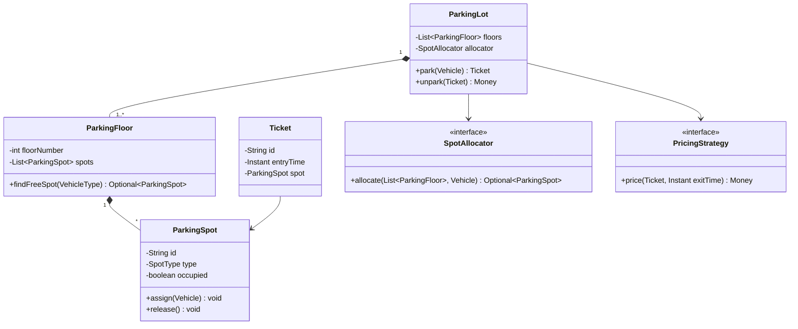
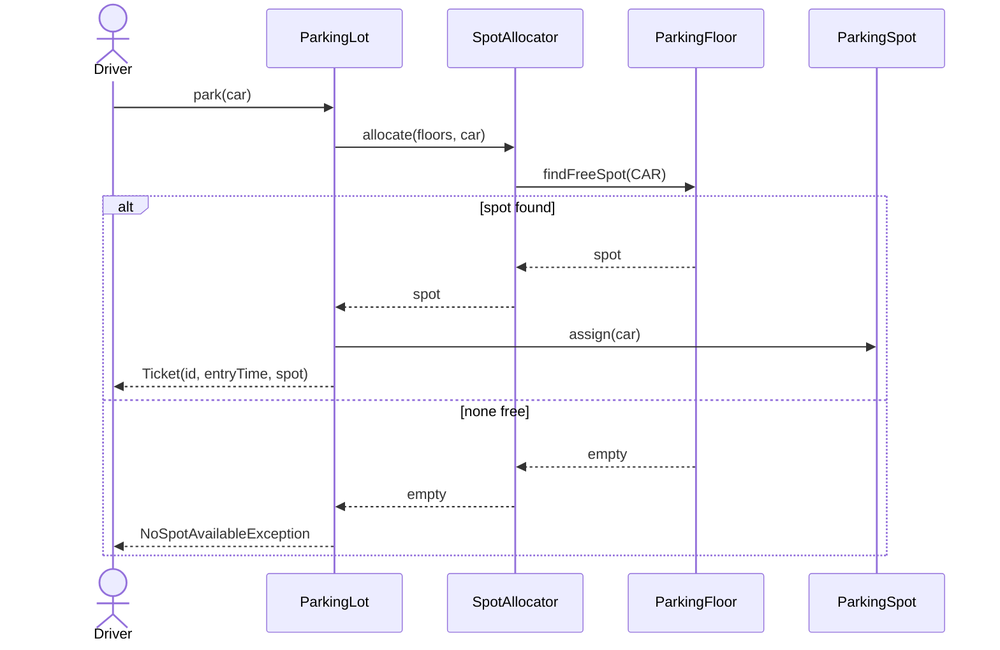

# 01 — How to Approach an LLD Problem

> A repeatable 7-step method, a 45-minute timebox, and the mistakes that sink otherwise-strong candidates.

An LLD round is a **modelling conversation**. The interviewer is checking three things:

1. Can you turn an ambiguous prompt into a bounded problem?
2. Can you assign responsibilities to objects so that likely changes stay local?
3. Can you explain and defend those choices, including what you rejected?

Writing lots of code is not on that list.

---

## The 7 steps

```text
1. Clarify requirements and scope
2. Identify entities (nouns) and value objects
3. Identify relationships and cardinality
4. Draw the class diagram with responsibilities
5. Define the public APIs (the verbs)
6. Walk one core flow as a sequence
7. Edge cases, concurrency, complexity, extensions
```

---

### Step 1 — Clarify requirements and scope (5 min)

Never start with classes. Start by shrinking the problem until it fits in the time you have.

Ask, and **write the answers down where the interviewer can see them**:

- **Scale of the model.** Parking lot: one lot or many? Multiple floors? Elevator: one car or a bank of cars?
- **Actors.** Who uses this? Customer, admin, operator, system-scheduler?
- **Core use cases.** Force a ranked list: "park a vehicle, unpark and pay" *before* "monthly reports".
- **Explicit non-goals.** Payments gateway integration, persistence, auth, UI, networking. Say them out loud: "I'll assume payment is a `PaymentProcessor` interface and not implement gateways."
- **Constraints that change the model.** Concurrency ("two users book the same seat"), size ("1000 spots" vs "1M"), pricing rules, real-time notification.

Produce a short written contract:

```text
IN SCOPE : park(vehicle) → ticket ; unpark(ticket) → fee ; spot allocation by vehicle type ; hourly pricing
OUT      : payments gateway, persistence, auth, multi-lot, reporting
ASSUME   : single lot, multiple floors, one entry/exit gate (extensible), single JVM
```

That block is worth points on its own, and it protects you later: when you skip something, you can point at it.

**Rule of thumb:** ask 3–5 sharp questions, not 15. Then state your assumptions and move. Endless questioning reads as stalling.

---

### Step 2 — Identify entities (10 min, shared with step 3)

Pull the nouns out of the requirements, then filter them.

For each candidate noun, ask:

- Does it have **identity** that persists over time? → **Entity** (`Vehicle`, `Ticket`, `ParkingSpot`, `User`, `Booking`).
- Is it defined purely by its **values** and safely shareable/immutable? → **Value object** (`Money`, `Duration`, `SeatNumber`, `Coordinate`).
- Is it a **fixed set of named alternatives**? → **Enum** (`VehicleType`, `GameStatus`, `LogLevel`, `SeatStatus`).
- Does it only *do* things and hold no meaningful state? → **Service / strategy**, not an entity (`PricingStrategy`, `SpotAllocator`, `WinChecker`).

Two habits that separate good candidates:

- **Prefer enums over strings and booleans.** `status = "BOOKED"` and `isBooked`/`isPaid` flag pairs both produce illegal states. `SeatStatus { AVAILABLE, HELD, BOOKED }` cannot be in two states at once.
- **Don't create a class per noun.** "Colour", "Name", "Description" are usually fields.

---

### Step 3 — Relationships and cardinality (part of the 10 min)

For every pair of entities that interact, state the relationship *and the number*:

| Relationship | Meaning | Example |
|--------------|---------|---------|
| **Composition** | Child cannot exist without the parent; parent controls lifecycle | `ParkingFloor` ◆── `ParkingSpot`, `Board` ◆── `Cell` |
| **Aggregation** | Whole references parts that live independently | `ParkingLot` ◇── `Vehicle` (vehicles exist without the lot) |
| **Association** | Plain "knows about", usually with a direction | `Ticket` ──> `ParkingSpot` |
| **Inheritance** | True "is-a", substitutable everywhere | `Car`/`Bike` extends `Vehicle` — but see LSP in [SOLID](./02-SOLID-For-LLD.md) |
| **Realization** | Implements a contract | `SeasonalPricing` implements `PricingStrategy` |

Write cardinalities: `ParkingLot 1 ── 1..* ParkingFloor`, `Floor 1 ── * Spot`, `Ticket 1 ── 1 Spot`, `Show 1 ── * Booking`.

Cardinality is where hidden requirements surface. "One ticket per spot" immediately raises: what stops two tickets pointing at one spot? That question is the concurrency discussion, arriving early and for free.

---

### Step 4 — Class diagram with responsibilities (15 min)

Now draw. Notation details are in [UML and Diagrams](./04-UML-And-Diagrams.md).

For each class write: **fields → key methods → one-line responsibility**. If the responsibility sentence needs "and", you probably have two classes.



While drawing, keep asking: *what is likely to change?* Pricing rules change; spot-picking policy changes; vehicle types are added. Each of those became an interface above. Things that will not change (a floor holds spots) stay concrete. That single question is most of what "good design taste" means in this round.

---

### Step 5 — Define the public APIs (5 min)

Give the entry-point class real method signatures — return types included. This is where a vague design becomes checkable.

```java
public interface ParkingLotService {
    Ticket park(Vehicle vehicle);                  // throws NoSpotAvailableException
    Money unpark(String ticketId, Instant exitAt); // throws UnknownTicketException
    int availableSpots(SpotType type);
}
```

Decide and *say*:

- **Return vs throw.** `Optional<ParkingSpot>` for "maybe nothing" is normal flow; `NoSpotAvailableException` for a caller-visible failure. Don't return `null`.
- **Who owns validation?** Bounds and emptiness checks belong on `Board.addPiece`, not scattered in `Game`.
- **Idempotency.** Is `unpark` on an already-exited ticket an error or a no-op? State it.

---

### Step 6 — Walk one core flow (5 min)

One sequence diagram of the **happy path plus one failure branch** proves your objects actually collaborate.



If you cannot draw this without inventing a new class on the spot, your class diagram is incomplete — fix it now, out loud. Interviewers reward that correction; it's exactly what design review looks like.

---

### Step 7 — Edge cases, concurrency, complexity, extensions (5 min)

Do not wait to be asked. Volunteer:

- **Edge cases.** Lot full; ticket lost; vehicle exits without paying; exit time before entry time; duplicate move on an occupied cell; zero-duration stay; clock skew.
- **Concurrency.** Two threads allocating the last spot. Say the fix concretely: synchronize the *allocation*, not the whole lot; or use an atomic compare-and-set on spot status; or a per-floor lock to reduce contention. Details in [Complexity and Tradeoffs](./06-Complexity-And-Tradeoffs.md).
- **Complexity.** "`findFreeSpot` is O(spots) with a list scan; a per-type free-spot queue per floor makes it O(1) with a small memory cost."
- **Extensions.** Name two and show the seam that absorbs each: "EV charging spots → new `SpotType` + allocator rule, no change to `ParkingLot`"; "surge pricing → new `PricingStrategy` implementation."

Close with one honest limitation: "I kept everything single-JVM in-memory; a real lot needs the spot table in a database with the reservation done in one transaction."

---

## The 45-minute timebox

| Minutes | Phase | Output on the board | If you're behind |
|---------|-------|---------------------|------------------|
| 0–5 | Clarify + scope | In-scope / out-of-scope / assumptions block | Stop asking, state assumptions, move |
| 5–15 | Entities + relationships | Noun list, enums, cardinalities | Cut features to the top 2 use cases |
| 15–30 | Class diagram | Classes with fields, key methods, interfaces at change points | Drop optional patterns; concrete classes are fine |
| 30–35 | APIs | Signatures on the main service | Write signatures only for the top use case |
| 35–40 | Core flow | One sequence diagram, happy + one failure | Narrate the flow verbally instead of drawing |
| 40–45 | Edge cases + extensions | Bullet list, complexity notes, 2 extensions | Skip nothing here — this is high value per minute |

**Checkpoints.** At minute 15 you should be drawing classes. At minute 30 the diagram should be readable by someone who just walked in. If you are still discussing requirements at minute 15, you have already lost the round.

**If asked to write code**, write *one* class fully — usually the one with the interesting logic (`Board.hasWinner`, `RateLimiter.allow`, `LRUCache.get`) — and leave the rest as signatures. Never start typing at minute 5.

---

## Common mistakes

**Process mistakes**

1. **Jumping to classes in the first minute.** You will model the wrong problem, confidently.
2. **Interrogating instead of deciding.** After ~5 questions, unresolved ambiguity becomes a stated assumption.
3. **Silent drawing.** Long silences are unscorable. Narrate: "I'm making pricing an interface because rules change per lot."
4. **Building the whole thing.** 6 use cases half-modelled scores worse than 2 use cases modelled well.

**Modelling mistakes**

5. **God class.** `ParkingLot` that allocates, prices, prints receipts and manages gates. Split by *reason to change*.
6. **Anemic model.** Classes with only getters and setters while a `Manager` does all the work — that's a procedural program in class costume. Behaviour belongs with the data it uses.
7. **Booleans instead of state.** `isBooked`, `isPaid`, `isCancelled` allows nonsense combinations. Use an enum or the State pattern.
8. **Strings as identity/type.** `"CAR"`, `"INFO"` — use enums; typos become compile errors.
9. **Inheritance for code reuse.** `class Admin extends User` because you wanted the fields. Prefer composition; keep inheritance for genuine substitutability.
10. **Static everywhere / eager Singleton.** Global mutable state that cannot be tested or swapped. If you use Singleton, justify it and mention injection as the alternative.
11. **Missing enums for lifecycle.** No `BookingStatus` means status logic scattered across methods.
12. **Exposing mutable internals.** Returning the live `List<ParkingSpot>` lets callers corrupt your invariants; return a copy or an unmodifiable view.

**Communication mistakes**

13. **Pattern soup.** Naming five patterns to sound senior. See [Patterns Cheat Sheet](./03-Patterns-Cheat-Sheet.md) — every pattern must name the change it absorbs.
14. **Not stating complexity.** Say it unprompted, even when it's "O(1) amortised".
15. **Ignoring concurrency in a booking/inventory problem.** Seat and spot allocation *always* has a race. Raise it before they do.
16. **Defensiveness.** When challenged, restate the tradeoff and offer the alternative. "Fair — a queue per spot type makes allocation O(1); I chose the scan for clarity, and the interface lets me swap it."
17. **No closing summary.** Spend the last 60 seconds recapping: core classes, the two seams for change, what you left out.

---

## Quick self-test

You can claim this method if you can answer, for any problem:

- What are the two or three use cases you are modelling, and what did you exclude?
- Which classes exist, and what is each one's single reason to change?
- Where are the interfaces, and what change does each one absorb?
- What happens when two users act on the same resource simultaneously?
- What is the complexity of the hottest operation, and how would you improve it?

---

[⬅ Foundations index](./README.md) · [Next: SOLID for LLD ➡](./02-SOLID-For-LLD.md)
