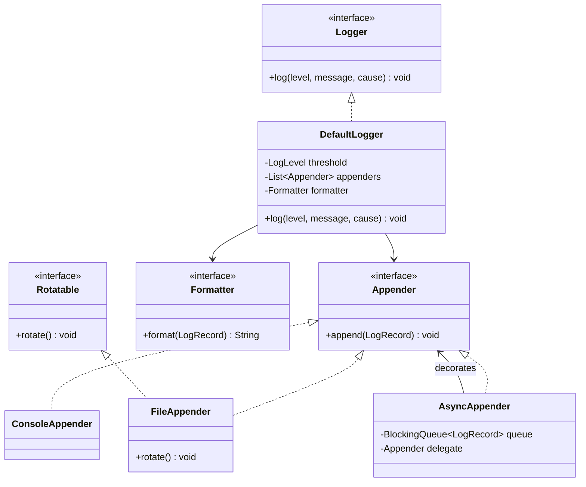

# 02 — SOLID for LLD

> SOLID is not five slogans to recite. In an LLD round it is a **diagnostic tool**: each principle names a specific way a class diagram goes wrong, and the fix is a specific edit.
> Every example below is bad-vs-good Java from three problems you will actually be asked: **Parking Lot**, **Tic Tac Toe**, **Logger**.

| Principle | The smell it detects | The usual fix |
|-----------|----------------------|---------------|
| **S**RP | One class changes for several unrelated reasons | Split by reason to change |
| **O**CP | Adding a variant means editing an `if/switch` chain | Extract an interface + polymorphism (Strategy / Factory) |
| **L**SP | A subclass throws, no-ops, or weakens a promise | Fix the hierarchy — usually replace inheritance with composition or interfaces |
| **I**SP | Implementers are forced to stub out methods | Split the interface into role interfaces |
| **D**IP | High-level policy imports a concrete low-level class | Depend on an abstraction; inject the implementation |

---

## S — Single Responsibility Principle

> A class should have one reason to change.

"Reason to change" means a **stakeholder or policy**, not a line count. Pricing changes because finance changes the rate card. Allocation changes because operations wants nearest-to-entrance parking. Those are different people, so they are different classes.

### ❌ Bad — Parking Lot god class

```java
public class ParkingLot {
    private final List<ParkingSpot> spots;
    private final Map<String, Ticket> activeTickets = new HashMap<>();

    public Ticket park(Vehicle vehicle) {
        for (ParkingSpot spot : spots) {                 // reason to change #1: allocation policy
            if (!spot.isOccupied() && spot.fits(vehicle)) {
                spot.assign(vehicle);
                Ticket t = new Ticket(UUID.randomUUID().toString(), vehicle, spot, Instant.now());
                activeTickets.put(t.getId(), t);
                return t;
            }
        }
        throw new IllegalStateException("full");
    }

    public double unpark(String ticketId) {
        Ticket t = activeTickets.remove(ticketId);
        long hours = Duration.between(t.getEntryTime(), Instant.now()).toHours();

        double fee;                                       // reason to change #2: pricing policy
        if (t.getVehicle().getType() == VehicleType.BIKE)      fee = hours * 10;
        else if (t.getVehicle().getType() == VehicleType.CAR)  fee = hours * 20;
        else                                                   fee = hours * 40;
        if (hours > 24) fee *= 0.9;

        System.out.println("RECEIPT  ticket=" + ticketId + " fee=" + fee);  // reason #3: output format
        t.getSpot().release();
        return fee;
    }
}
```

Three unrelated policies live in one file. A pricing tweak forces you to retest allocation, and none of it is unit-testable without a real lot.

### ✅ Good — split by reason to change

```java
public interface SpotAllocator {
    Optional<ParkingSpot> allocate(List<ParkingFloor> floors, Vehicle vehicle);
}

public interface PricingStrategy {
    Money price(Ticket ticket, Instant exitTime);
}

public interface ReceiptPrinter {
    void print(Ticket ticket, Money fee);
}

public class ParkingLot {                       // responsibility: orchestrate park / unpark
    private final List<ParkingFloor> floors;
    private final SpotAllocator allocator;
    private final PricingStrategy pricing;
    private final ReceiptPrinter printer;
    private final Map<String, Ticket> activeTickets = new ConcurrentHashMap<>();

    public ParkingLot(List<ParkingFloor> floors, SpotAllocator allocator,
                      PricingStrategy pricing, ReceiptPrinter printer) {
        this.floors = floors; this.allocator = allocator;
        this.pricing = pricing; this.printer = printer;
    }

    public Ticket park(Vehicle vehicle) {
        ParkingSpot spot = allocator.allocate(floors, vehicle)
                .orElseThrow(() -> new NoSpotAvailableException(vehicle.getType()));
        spot.assign(vehicle);
        Ticket ticket = Ticket.issue(vehicle, spot, Instant.now());
        activeTickets.put(ticket.getId(), ticket);
        return ticket;
    }

    public Money unpark(String ticketId, Instant exitTime) {
        Ticket ticket = Optional.ofNullable(activeTickets.remove(ticketId))
                .orElseThrow(() -> new UnknownTicketException(ticketId));
        Money fee = pricing.price(ticket, exitTime);
        ticket.getSpot().release();
        printer.print(ticket, fee);
        return fee;
    }
}
```

Now `NearestToEntranceAllocator`, `WeekendPricing` and `JsonReceiptPrinter` are independent, testable units, and `ParkingLot` only changes when the *park/unpark workflow* itself changes.

**Interview line:** "I split allocation, pricing and receipts out of `ParkingLot` because each changes for a different reason — ops, finance, and the UI respectively."

---

## O — Open/Closed Principle

> Open for extension, closed for modification.

The tell is a `switch` or `if/else` chain on a type or enum that you must **edit** every time a variant is added.

### ❌ Bad — pricing switch (Parking Lot)

```java
public class FeeCalculator {
    public double calculate(VehicleType type, long hours) {
        switch (type) {
            case BIKE:  return hours * 10;
            case CAR:   return hours * 20;
            case TRUCK: return hours * 40;
            // add EV → edit this file; add valet pricing → edit again; risk breaking BIKE
            default: throw new IllegalArgumentException(type.name());
        }
    }
}
```

### ✅ Good — strategy chosen by type

```java
public interface PricingStrategy {
    Money price(Ticket ticket, Instant exitTime);
}

public class HourlyPricing implements PricingStrategy {
    private final Money ratePerHour;
    public HourlyPricing(Money ratePerHour) { this.ratePerHour = ratePerHour; }

    @Override public Money price(Ticket ticket, Instant exitTime) {
        long hours = Math.max(1, ceilHours(ticket.getEntryTime(), exitTime));  // part hour billed as full
        return ratePerHour.times(hours);
    }
}

public class FlatThenHourlyPricing implements PricingStrategy { /* first 2h flat, then hourly */ }

public class PricingRegistry {                  // the only place that knows the mapping
    private final Map<VehicleType, PricingStrategy> byType;
    public PricingRegistry(Map<VehicleType, PricingStrategy> byType) { this.byType = byType; }
    public PricingStrategy forVehicle(VehicleType type) {
        return byType.getOrDefault(type, DEFAULT);
    }
}
```

Adding EV pricing = one new class + one map entry. Existing pricing classes are untouched, so their tests still mean something.

**Honest caveat, worth saying out loud:** OCP is not free. A `switch` over a *closed, stable* set (`GameStatus`, `Direction`) is clearer than four tiny classes. Apply OCP where variation is expected — pricing, allocation, notification channels — not everywhere. In Java, `sealed` interfaces plus exhaustive `switch` are a legitimate middle ground when the set really is closed.

---

## L — Liskov Substitution Principle

> A subtype must be usable anywhere its supertype is, without the caller learning about it.

Violations look like: overrides that `throw UnsupportedOperationException`, overrides that do nothing, or subclasses that need stricter inputs than the parent promised.

### ❌ Bad — Tic Tac Toe player hierarchy

```java
public class Player {
    protected String name;
    protected PlayingPiece piece;

    public Move nextMove(Board board) {
        return readMoveFromConsole();          // assumes a human is sitting there
    }
}

public class BotPlayer extends Player {
    @Override public Move nextMove(Board board) {
        return minimax(board, piece);          // fine
    }
}

public class RemotePlayer extends Player {
    @Override public Move nextMove(Board board) {
        throw new UnsupportedOperationException("moves arrive over the socket");  // ❌ breaks callers
    }
}
```

`Game` cannot call `nextMove` on a `Player` without knowing the concrete subtype. That is exactly what LSP forbids.

### ✅ Good — separate identity from move-production

```java
public final class Player {                    // identity only, no inheritance needed
    private final String name;
    private final PlayingPiece piece;
    private final MoveSource moveSource;

    public Player(String name, PlayingPiece piece, MoveSource moveSource) { /* ... */ }

    public Move nextMove(Board board) { return moveSource.next(board, piece); }
}

public interface MoveSource {                  // every implementation truly honours the contract
    Move next(Board board, PlayingPiece piece);
}

public class ConsoleMoveSource implements MoveSource { /* blocking read */ }
public class MinimaxMoveSource implements MoveSource { /* search */ }
public class QueuedMoveSource implements MoveSource {  // remote moves pushed in, then handed out
    private final BlockingQueue<Move> inbox;
    @Override public Move next(Board board, PlayingPiece piece) { return inbox.take(); }
}
```

Composition removed the hierarchy, and every `MoveSource` can genuinely produce a move.

The other classic LSP trap is the **`Square extends Rectangle`** shape: `setWidth` on a square must also change the height, silently breaking any caller that assumed independent dimensions. In LLD prompts it shows up as `class BikeSpot extends ParkingSpot` where `assign()` rejects cars — if the parent promised "assign any fitting vehicle", the child must not narrow that. Model spot size as **data** (`SpotType`) with a `fits(vehicle)` check instead of as subclasses.

---

## I — Interface Segregation Principle

> No client should be forced to depend on methods it does not use.

### ❌ Bad — one fat logging interface

```java
public interface Logger {
    void info(String msg);
    void debug(String msg);
    void error(String msg, Throwable t);
    void setLevel(LogLevel level);
    void addAppender(Appender appender);
    void rotateFiles();          // meaningless for a console logger
    void flushToDisk();          // meaningless for a console logger
    void configureFromFile(Path p);
}

public class ConsoleLogger implements Logger {
    @Override public void rotateFiles() { /* nothing to do */ }              // ❌ stub
    @Override public void flushToDisk() { throw new UnsupportedOperationException(); }  // ❌
    // ...
}
```

Application code that just wants `info(...)` now transitively depends on file rotation and configuration.

### ✅ Good — role interfaces

```java
public interface Logger {                      // what 99% of callers need
    void log(LogLevel level, String message, Throwable cause);

    default void info(String message)  { log(LogLevel.INFO,  message, null); }
    default void debug(String message) { log(LogLevel.DEBUG, message, null); }
    default void error(String message, Throwable cause) { log(LogLevel.ERROR, message, cause); }
}

public interface Appender {                    // where a record goes
    void append(LogRecord record);
}

public interface Rotatable {                   // only FileAppender implements this
    void rotate();
}

public interface LoggerConfigurer {            // admin-facing, separate client
    void setLevel(LogLevel level);
    void addAppender(Appender appender);
}
```

```java
public class ConsoleAppender implements Appender { /* just writes to stdout */ }

public class FileAppender implements Appender, Rotatable, Closeable {
    @Override public void append(LogRecord record) { /* buffered write */ }
    @Override public void rotate() { /* size-based roll */ }
    @Override public void close() { /* flush + close */ }
}
```

Business code depends on `Logger`. Only the file appender knows about rotation. Nobody writes an empty method to satisfy the compiler.

**Watch for the ISP-vs-cohesion tradeoff:** splitting an interface into three interfaces with one method each, all implemented by the same class every time, adds ceremony without adding flexibility. Split when clients genuinely differ.

---

## D — Dependency Inversion Principle

> High-level modules should not depend on low-level modules. Both should depend on abstractions.

DIP is what makes your design testable, and it's the principle interviewers probe with "how would you unit-test this?"

### ❌ Bad — policy welded to implementation

```java
public class OrderService {
    private final FileLogger logger = new FileLogger("/var/log/app.log");  // ❌ constructs a concrete dep
    private final SmtpEmailClient email = new SmtpEmailClient("smtp.corp.com", 25);

    public void placeOrder(Order order) {
        logger.info("placing " + order.getId());
        // ...
        email.send(order.getCustomerEmail(), "Order confirmed");
    }
}
```

You cannot unit-test `placeOrder` without a writable file path and an SMTP server. Swapping to async logging means editing business code.

### ✅ Good — depend on abstractions, inject implementations

```java
public class OrderService {
    private final Logger logger;
    private final Notifier notifier;

    public OrderService(Logger logger, Notifier notifier) {   // constructor injection
        this.logger = logger;
        this.notifier = notifier;
    }

    public void placeOrder(Order order) {
        logger.info("placing " + order.getId());
        // ...
        notifier.notify(order.getCustomer(), Message.orderConfirmed(order));
    }
}
```

```java
// in tests
Logger spyLogger = new InMemoryLogger();
Notifier fake = new RecordingNotifier();
new OrderService(spyLogger, fake).placeOrder(order);
assertThat(fake.sent()).hasSize(1);
```

Note the direction: `Logger` and `Notifier` are owned by the **high-level** module and implemented by the low-level ones. That inversion of ownership — not merely "use interfaces" — is the actual principle.

**Singleton interaction, since Logger is the classic case:** `Logger.getInstance()` sprinkled through the codebase is a hidden dependency and a DIP violation, even though it is an interface call. Prefer one composition root that builds the logger and passes it down. If the interviewer insists on a global logger, acknowledge the tradeoff: convenient, but untestable in isolation and awkward to reconfigure per module.

---

## Putting it together on one problem

Logger, designed with all five:



| Principle | Where it shows |
|-----------|----------------|
| SRP | Level filtering (`DefaultLogger`), rendering (`Formatter`), destination (`Appender`) are separate |
| OCP | New destination = new `Appender`; no existing class edited |
| LSP | Every `Appender` really appends; `AsyncAppender` honours the contract and just defers |
| ISP | `Rotatable` is only on the appender that can rotate |
| DIP | `DefaultLogger` depends on `Appender`/`Formatter` interfaces, wired at construction |

---

## Using SOLID in the room without sounding like a textbook

- Don't announce "I'll now apply the Open/Closed Principle." Say **what changes and why the design absorbs it**: "Pricing rules change per city, so it's an interface — a new city is a new class, not an edit."
- Use the principle names as **justifications when challenged**, not as narration.
- Be ready to say where you *chose not to* apply one: "I left `GameStatus` as a switch — the set of statuses is closed, so polymorphism would cost clarity for no flexibility."
- If you can't name the change a class absorbs, you have added indirection, not design.

---

[⬅ How to Approach LLD](./01-How-To-Approach-LLD.md) · [Foundations index](./README.md) · [Next: Patterns Cheat Sheet ➡](./03-Patterns-Cheat-Sheet.md)
