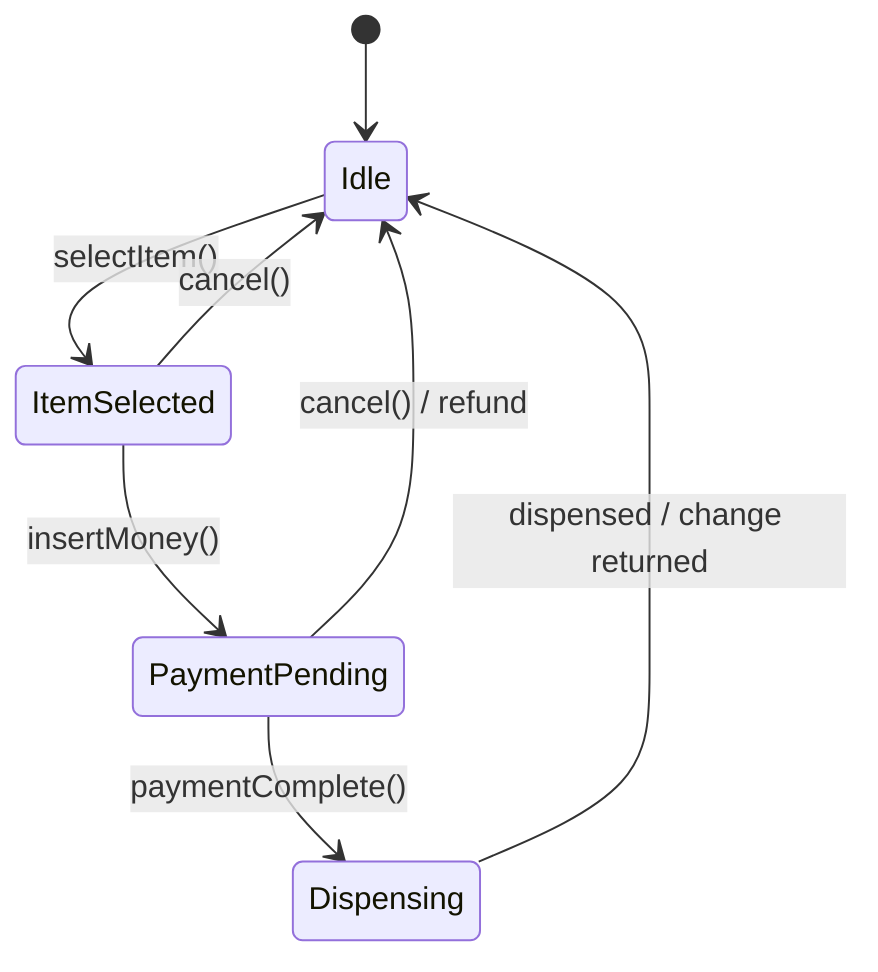
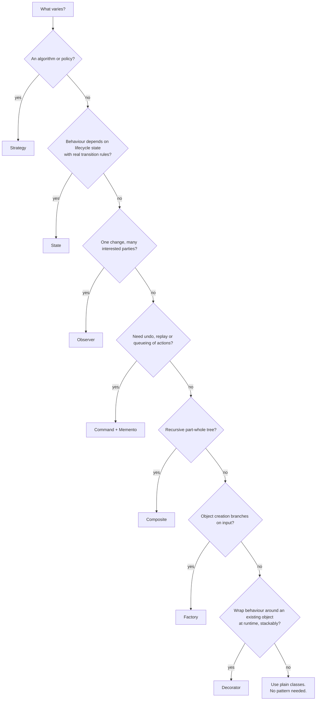

# 03 — Patterns Cheat Sheet for LLD

> GoF patterns mapped to the problems interviewers actually ask, with an explicit **"when NOT to use"** for each.
> Deep dives live in the sibling [`Design-Patterns/`](../../Design-Patterns/) micro-lab. This file is about *selection*, not implementation.

**The selection rule, and the only sentence you must internalise:**

> A pattern is justified when you can name (a) the change it absorbs and (b) what breaks without it.
> If you cannot, you added indirection, not design.

---

## Fast lookup: problem → likely patterns

| Problem | Patterns that genuinely earn their keep | Deliberately absent |
|---------|-----------------------------------------|---------------------|
| Parking Lot | Strategy (pricing, allocation), Factory (spot/vehicle creation), Singleton (lot instance — with caveats) | Observer, Decorator |
| Tic Tac Toe / Snake & Ladder | Strategy (move source, dice), Factory (board/game mode) | State, Command |
| Chess | Strategy (per-piece movement), Factory (piece creation), Memento or Command (undo) | Observer |
| Vending Machine / ATM | **State** (the whole point), Strategy (payment), Chain of Responsibility (ATM cash denominations) | Decorator |
| Elevator system | State (car state), Strategy (scheduling), Observer (displays) | Composite |
| Movie / Cab booking | Strategy (pricing, matching), State (booking lifecycle), Observer (notifications) | Visitor |
| Logging framework | Chain of Responsibility (level handlers) *or* level filter + Appenders, Decorator (async/buffered), Singleton (careful), Observer | Builder for records is often overkill |
| LRU cache | Strategy (eviction policy), Template Method or Decorator (write-through / stats) | State |
| Rate limiter | Strategy (token bucket vs sliding window), Factory (per-key limiter) | Observer |
| File system | **Composite** (the whole point), Visitor (search/size traversal), Iterator | State |
| Text editor undo | **Command** + **Memento** | Strategy |
| Notification service | Strategy or Factory (channel), Observer (subscribers), Decorator (retry/throttle) | Composite |
| Splitwise | Strategy (equal / exact / percent split), Observer (balance updates) | State |

---

## Creational

### Factory Method / Simple Factory
**Use when:** object creation depends on a runtime input, and you want callers free of `new ConcreteX()`.
`ParkingSpotFactory.create(SpotType)`, `PieceFactory.create(PieceType)`, `NotificationFactory.forChannel(Channel)`.
**Don't use when:** there is exactly one implementation and no branching — `new Ticket(...)` is fine. A "factory" wrapping a single constructor is noise.
**Interview line:** "Creation branches on `VehicleType`, so I isolated the branching in a factory; adding EV touches one file."

### Abstract Factory
**Use when:** you must create **families** of related objects that have to match — UI theme widgets, a full "game kit" (board + pieces + rules) per variant.
**Don't use when:** you only have one product type. In most LLD problems, Abstract Factory is over-engineering; plain Factory covers it.

### Builder
**Use when:** an object has many optional fields or must be validated before it exists — `Pizza`, `HttpRequest`, `RateLimiterConfig`, complex `Booking`. Great answer to "how do you avoid a 9-argument constructor / telescoping constructors?"
**Don't use when:** ≤4 fields, all required. In modern Java, records plus a static factory (`Ticket.issue(...)`) usually beat a builder.

### Prototype
**Use when:** copying an existing configured object is cheaper or safer than rebuilding it — cloning a board for AI look-ahead, duplicating a template document.
**Don't use when:** construction is cheap. And if you use it, address deep vs shallow copy explicitly — that's the actual test.

### Singleton
**Use when:** genuinely one instance must exist for correctness (an in-memory `ParkingLot` registry, a `Config` holder) *and* you can defend the global access.
**Don't use when:** you just want convenient access. Singletons hide dependencies, break unit tests, and become a concurrency bottleneck.
**Say this if you use it:** "I'd make it a singleton for the sketch, using an enum or a static holder for thread safety, but in real code I'd create one instance at the composition root and inject it — that keeps it testable."

---

## Structural

### Adapter
**Use when:** you must fit an existing incompatible API behind your interface — a third-party payment SDK behind your `PaymentProcessor`, a legacy `LegacySmsClient` behind `Notifier`.
**Don't use when:** you control both sides. Just change the interface.

### Decorator
**Use when:** you want to add behaviour **per instance, stackable, at runtime** — `AsyncAppender(BufferedAppender(FileAppender))`, retrying notifier, cache with statistics, parking add-ons.
**Don't use when:** the combination is fixed and known — a subclass or a plain field is simpler. Deep decorator stacks are painful to debug; mention that you'd cap the depth.

### Composite
**Use when:** clients should treat a leaf and a container **uniformly** through a recursive tree — file system (`File`/`Directory` as `FileSystemNode`), org chart, menu, UI widget tree.
**Don't use when:** the structure is flat, or clients must constantly distinguish leaf from node anyway (`if (node instanceof Directory)` everywhere means Composite isn't buying you anything).

### Facade
**Use when:** a subsystem has many moving parts and you want one narrow entry point — `BookingFacade` over inventory + payment + notification.
**Don't use when:** the "subsystem" is two classes. And a Facade that grows methods forever is just a god class with a nicer name.

### Proxy
**Use when:** you need to control access to an object without changing it — lazy loading, access control, rate-limit checks, caching proxy in front of an expensive service.
**Don't use when:** you can put the behaviour in the object itself. Note the difference from Decorator in interviews: **Decorator adds behaviour, Proxy controls access** — structurally similar, different intent.

### Bridge
**Use when:** two dimensions vary independently and you would otherwise get a class explosion — `Notification` (alert/reminder) × `Channel` (SMS/email/push), shapes × renderers.
**Don't use when:** only one dimension varies. Bridge is one of the most over-claimed patterns; Strategy usually covers it.

### Flyweight
**Use when:** you have huge numbers of objects sharing intrinsic state — chess piece rendering data, characters in an editor, map tiles.
**Don't use when:** object counts are in the thousands. It's a memory optimisation; do not volunteer it as a design choice at LLD scale unless memory was stated as a constraint.

---

## Behavioural

### Strategy
The **highest-value pattern in LLD interviews.** Use whenever an algorithm or policy varies: pricing, spot allocation, seat selection, cab matching, eviction policy, dice behaviour, move generation, split rules.
**Don't use when:** there is exactly one algorithm and no plausible second one. `PricingStrategy` with a single `HourlyPricing` and no other rule on the horizon is speculative.

### State
**Use when:** an object's behaviour changes with its state *and* transitions have real rules — vending machine (`Idle → ItemSelected → PaymentPending → Dispensing`), ATM, elevator car, booking lifecycle.
The tell: a method full of `if (status == X) ... else if (status == Y) ...` repeated across several methods.
**Don't use when:** the status is just a label with no branching behaviour. Then an enum field is correct and a State class hierarchy is ceremony.

### Observer
**Use when:** one change must notify an unknown, changing set of listeners — booking confirmed → email + SMS + analytics; elevator arrival → floor displays; stock price → subscribers.
**Don't use when:** there is exactly one listener known at compile time (just call it), or when you need ordering, retries and delivery guarantees — say "in production this becomes a message queue; in-process observers give none of those guarantees."
**Always mention:** listener exceptions must not break the publisher, and holding listener references leaks memory if you never unsubscribe.

### Command
**Use when:** you need to represent an action as an object — undo/redo, queuing, scheduling, macro/replay, transaction logs. Text editor and remote-control problems are the classics.
**Don't use when:** you just want to call a method. A `Command` per method with no undo, queue or log is pure overhead.

### Chain of Responsibility
**Use when:** a request should pass through an ordered set of handlers, any of which may handle or pass on — ATM dispensing by denomination, logging by level, request middleware, approval workflows.
**Don't use when:** exactly one handler is valid and known — a map lookup is clearer than a chain walk. Also flag the failure mode: if nobody handles the request, what happens? Have an answer.

### Template Method
**Use when:** several algorithms share a skeleton and differ in a couple of steps — report generation, `AbstractGame.play()` with `initialize()/makeMove()/checkWinner()` hooks, data pipeline stages.
**Don't use when:** the variation is bigger than the skeleton, or you'd need to override many hooks. Then use Strategy — composition beats inheritance for varying behaviour, and it doesn't lock a subclass to one variation axis.

### Iterator
**Use when:** you expose traversal over a custom structure without leaking internals — board cells, file tree walk, paginated results.
**Don't use when:** a `List` and the for-each loop already do the job. Java collections give you this for free; implementing `Iterator` for an `ArrayList` field is filler.

### Mediator
**Use when:** many objects would otherwise talk to each other pairwise — chat rooms, air traffic control, UI dialogs, elevator bank coordination.
**Don't use when:** you have 2–3 collaborators. And beware: the mediator itself becomes a god class if you push everything into it. Say that tradeoff out loud.

### Memento
**Use when:** you must snapshot and restore state without exposing internals — editor undo, game save, board rollback. Typically paired with Command.
**Don't use when:** state is large and snapshots are frequent — mention the memory cost and the alternative of storing *inverse operations* (undo commands) instead of full snapshots. That comparison is often the real question.

### Visitor
**Use when:** you have a stable object structure and want to keep adding new operations over it — AST processing, file-tree size/search/export, tax rules over document types.
**Don't use when:** the type hierarchy changes often (every new type forces edits to every visitor) — it's the exact inverse tradeoff of Strategy. Visitor is rarely needed in a 45-minute round; only reach for it if you're already traversing a tree with several distinct operations.

### Interpreter
Almost never appropriate in an LLD interview unless the prompt *is* a parser or rule engine. Skip it.

---

## Decision helper

The bottom node is a legitimate destination. Most classes in a good design are just classes.

---

## Anti-pattern: pattern soup

**Pattern soup** is stacking patterns to signal seniority. It is the most common way strong candidates lose points, because it looks like knowledge and reads as poor judgment.

### What it looks like

> "I'll make `ParkingLot` a Singleton, get spots from an Abstract Factory, wrap each spot in a Decorator for features, use a Facade over the whole lot, a Builder for `Ticket`, an Observer for gate displays, a Visitor for reports, and a Mediator between floors."

For a problem whose core is: find a free spot, issue a ticket, compute a fee.

### Why it fails

- **Indirection without benefit.** Six hops to answer "is this spot free?" The reader can no longer see the domain.
- **Untestable and undebuggable.** Deep decorator/proxy stacks make stack traces unreadable.
- **It signals cargo-culting.** Interviewers ask "why?" for each pattern, and soup collapses on the second or third question.
- **It burns your clock.** Every pattern is minutes not spent on edge cases and concurrency, which are worth more.

### The four questions to ask before adding any pattern

1. **What specific change does this absorb?** Name it concretely ("a new pricing rule per city"), not abstractly ("future flexibility").
2. **Is that change actually likely here?** Speculative flexibility is a cost paid today for a benefit that may never arrive (YAGNI).
3. **What is the simplest thing that works?** Often an enum, a map, a strategy interface, or plain polymorphism.
4. **Can I explain it in one sentence a reviewer would accept?**

### Healthy budget

For a typical 45-minute LLD problem, **1–3 patterns** is right. Tic Tac Toe needs Strategy for move sources and arguably a factory — that's it. Vending Machine needs State and Strategy. If you're naming five, you're probably in soup.

### The senior move

Say what you rejected:

> "I considered Observer for score updates, but there's a single consumer here, so a direct call is clearer. If we later add displays and analytics, `Board` already emits move events in one place, so that's the seam where Observer would go in."

That one sentence demonstrates pattern knowledge *and* restraint. It scores higher than actually implementing the Observer.

---

## Fast recall table

| Pattern | One-line trigger |
|---------|------------------|
| Strategy | "This algorithm has variants" |
| State | "Behaviour changes with lifecycle stage" |
| Observer | "Several parties care when this changes" |
| Command | "Actions must be stored, queued or undone" |
| Chain of Responsibility | "Try handlers in order until one handles it" |
| Composite | "Treat one and many the same" |
| Decorator | "Add layered behaviour at runtime" |
| Proxy | "Control access to an object" |
| Adapter | "Fit a foreign API to my interface" |
| Facade | "Give one door into a subsystem" |
| Factory | "Creation branches on input" |
| Builder | "Many optional fields, validate before construction" |
| Singleton | "Exactly one instance — and I can defend the global" |
| Template Method | "Same skeleton, different steps" |
| Memento | "Snapshot and restore without exposing internals" |
| Visitor | "Stable types, ever-growing operations" |
| Mediator | "Stop N objects from talking pairwise" |
| Flyweight | "Millions of objects sharing intrinsic state" |
| Iterator | "Traverse without exposing internals" |
| Bridge | "Two dimensions varying independently" |
| Prototype | "Copy a configured object" |

---

[⬅ SOLID for LLD](./02-SOLID-For-LLD.md) · [Foundations index](./README.md) · [Next: UML and Diagrams ➡](./04-UML-And-Diagrams.md)
