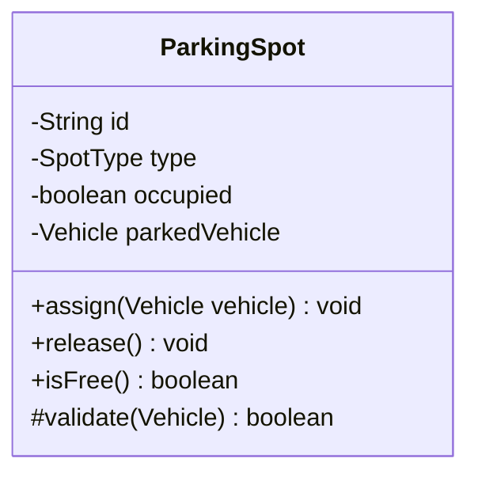
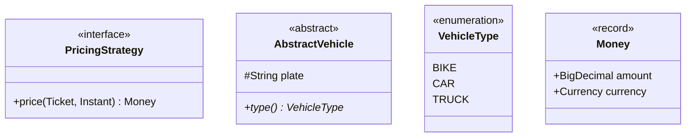
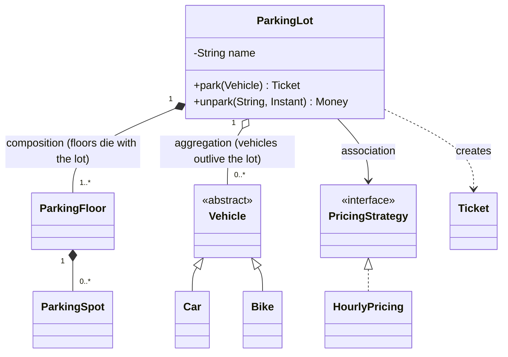
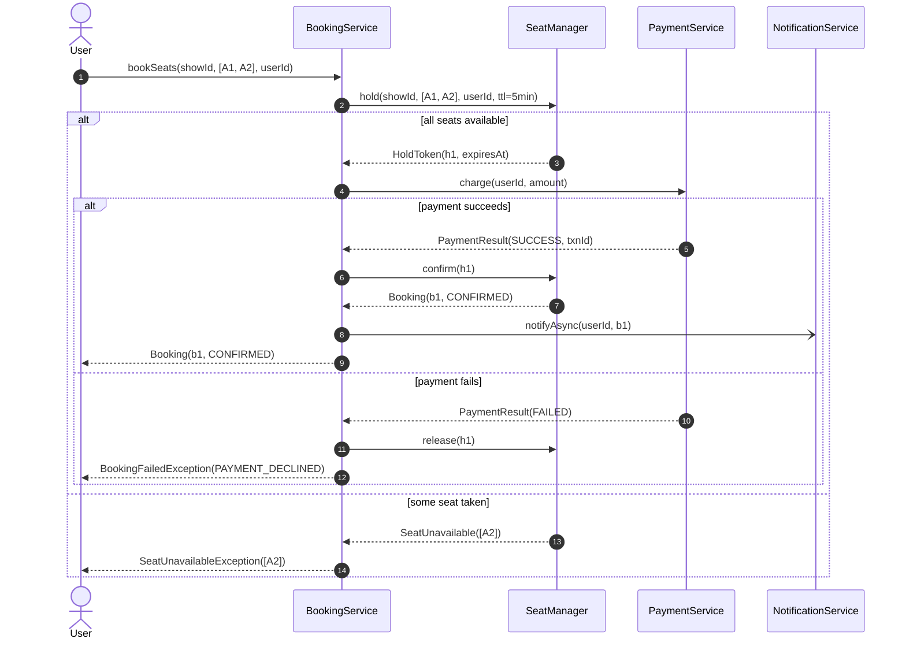
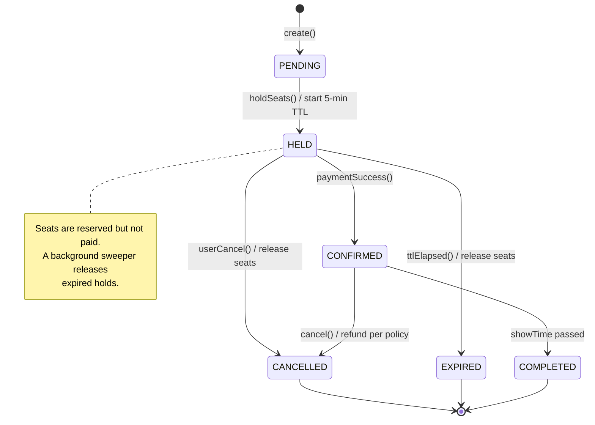
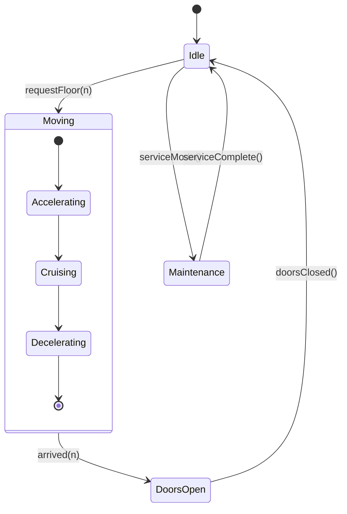

# 04 — UML and Diagrams for LLD Interviews

> Interviewers do not grade UML compliance. They grade whether your diagram **communicates responsibilities, relationships and flow** fast.
> Learn the 20% of notation that carries 100% of the meaning, then use it consistently.

Three diagrams cover essentially every LLD round:

| Diagram | Answers | Time to draw | When to use |
|---------|---------|--------------|-------------|
| **Class diagram** | What are the objects and how do they relate? | 10–15 min | Always |
| **Sequence diagram** | How do objects collaborate for one use case? | 3–5 min | Almost always, for the core flow |
| **State diagram** | What are the legal transitions of one entity? | 3–4 min | Vending machine, ATM, elevator, booking, order lifecycle |

Activity, component, and deployment diagrams are for HLD or documentation. Do not spend interview minutes on them.

---

## 1. Class diagram

### Class box anatomy



- Three compartments: **name**, **fields**, **methods**.
- Visibility: `+` public, `-` private, `#` protected, `~` package-private.
- Write types. `+assign(Vehicle vehicle) void` says far more than `+assign()`.
- <ins>Underline</ins> marks static members in strict UML; on a whiteboard, just write `static`.

**What to include under time pressure:** identity fields, collections that define structure, and the 2–4 methods that carry the domain logic. Skip getters, setters, `toString`, and constructors unless a constructor is a design decision (mandatory dependencies, validation).

### Stereotypes



`<<interface>>`, `<<abstract>>`, `<<enumeration>>` are the three you need. Abstract methods get a trailing `*` in Mermaid (`+type() VehicleType*`); static members get a trailing `$`.

### Relationships — the notation that carries meaning

| Meaning | UML | Mermaid | Read as |
|---------|-----|---------|---------|
| Inheritance | hollow triangle, solid line | `Parent <|-- Child` | Child **is-a** Parent |
| Realization | hollow triangle, dashed line | `Interface <|.. Impl` | Impl **implements** Interface |
| Composition | filled diamond | `Whole *-- Part` | Part **cannot exist** without Whole |
| Aggregation | hollow diamond | `Whole o-- Part` | Whole **has** Part; Part lives independently |
| Association | plain arrow | `A --> B` | A **knows about** B |
| Dependency | dashed arrow | `A ..> B` | A **uses** B transiently (parameter, local var) |



**The composition-vs-aggregation call gets asked.** A concrete test: if deleting the whole should delete the part, it's composition. Deleting a lot deletes its floors and spots (composition); it does not delete the cars (aggregation). If you're unsure in the room, say "I'll model it as composition because the floor has no meaning outside the lot" — the reasoning matters more than the diamond.

### Multiplicity

Always label the numbers. Put them near each end:

```
ParkingLot "1" *-- "1..*" ParkingFloor
Show      "1" o-- "0..*" Booking
User      "1" --> "0..1" ActiveSession
Student   "*" -- "*"     Course
```

Common values: `1`, `0..1`, `1..*`, `0..*` (or `*`), `2` (a Tic Tac Toe game has exactly 2 players).

Many-to-many is a prompt: does the relationship carry its own data? `Student *—* Course` with a grade and enrolment date means you need an `Enrollment` class. Spotting that unasked is a strong signal.

### Whiteboard version

On a physical or virtual whiteboard you will not draw perfect UML. This is acceptable and expected:

```text
┌─────────────────────┐        ┌──────────────────┐
│ ParkingLot          │◆──1..*─│ ParkingFloor     │
│ - floors            │        │ - number         │
│ + park(v): Ticket   │        │ + findFree(type) │
│ + unpark(id): Money │        └────────┬─────────┘
└──────────┬──────────┘                 ◆ 0..*
           │ uses                ┌──────┴───────┐
           ▼                     │ ParkingSpot  │
   «interface»                   │ - type       │
   PricingStrategy               │ - occupied   │
   + price(ticket, exit)         │ + assign(v)  │
                                 └──────────────┘
```

Rules that keep it readable: put the entry-point class top-left, keep arrows flowing one direction, use a `«interface»` tag, and leave whitespace so you can add classes later.

---

## 2. Sequence diagram

Shows **one** use case as messages over time. Draw the happy path plus one important failure branch — not every branch.



**Notation that matters:**

| Element | Mermaid | Meaning |
|---------|---------|---------|
| Synchronous call | `A->>B: method(args)` | Solid arrow, filled head |
| Return | `B-->>A: result` | Dashed arrow |
| Async / fire-and-forget | `A-)B: event` | Open arrow — use for notifications, event publishing |
| Self-call | `A->>A: validate()` | Internal step worth showing |
| Conditional | `alt` / `else` / `end` | Branching |
| Optional | `opt` / `end` | Happens only sometimes |
| Repetition | `loop` / `end` | While/for |
| Concurrency | `par` / `and` / `end` | Parallel branches |
| Note | `Note over A,B: text` | Locks, TTLs, assumptions |

**Interview habits:**

- Participants must be **objects from your class diagram**. If a new participant appears, your class diagram is missing a class — fix it out loud.
- Show **real method names with arguments and return types**. `bookSeats(showId, seats, userId)` beats "book".
- Mark where locking, transactions or TTLs live with a `Note` — it's the cheapest way to show concurrency awareness:

```mermaid
sequenceDiagram
    participant BS as BookingService
    participant DB as SeatRepository
    Note over BS,DB: single transaction; optimistic lock on seat.version
    BS->>DB: updateIfVersion(seatId, expectedVersion, HELD)
    alt 1 row updated
        DB-->>BS: success
    else 0 rows updated
        DB-->>BS: conflict → retry or fail fast
    end
```

- **One diagram per round is usually enough.** Choose the flow with the most interesting collaboration (booking, dispatch, allocation) — not `getUser`.

---

## 3. State diagram

Use when an entity has a lifecycle with rules about what may follow what. This is the diagram that instantly proves you understand a vending machine, ATM, elevator, order or booking.



**Notation:**

- `[*] -->` start, `--> [*]` terminal.
- Label transitions `event [guard] / action`: `insertCoin() [amount >= price] / dispense`.
- Composite states for nesting:



**How this drives code.** A state diagram maps directly to either an enum with a transition table, or the State pattern:

```java
public enum BookingStatus {
    PENDING(EnumSet.of(HELD, CANCELLED)),
    HELD(EnumSet.of(CONFIRMED, EXPIRED, CANCELLED)),
    CONFIRMED(EnumSet.of(CANCELLED, COMPLETED)),
    CANCELLED(EnumSet.noneOf(BookingStatus.class)),
    EXPIRED(EnumSet.noneOf(BookingStatus.class)),
    COMPLETED(EnumSet.noneOf(BookingStatus.class));

    private final Set<BookingStatus> allowedNext;
    BookingStatus(Set<BookingStatus> allowedNext) { this.allowedNext = allowedNext; }

    public boolean canTransitionTo(BookingStatus next) { return allowedNext.contains(next); }
}
```

Saying "illegal transitions are rejected in one place" is a strong close to a state discussion. Choose the enum table when transitions are simple and behaviour barely differs; choose the State pattern when each state has genuinely different behaviour across several methods.

---

## What interviewers are actually looking for

**They reward:**

- A class diagram where they can find the entry point and follow relationships without asking.
- Interfaces drawn at the points where change is expected.
- Multiplicities, because that's where hidden requirements hide.
- A sequence diagram whose participants match the class diagram exactly.
- Notes marking locks, transactions, TTLs and async boundaries.
- Diagrams you **update mid-conversation** when they poke a hole. Erasing and redrawing is a positive signal, not a failure.

**They penalise:**

- A wall of classes with no methods — that's a data model, not a design.
- Getters and setters filling the method compartment while the real logic is missing.
- Arrows with no labels or direction, so nobody can tell who calls whom.
- Diagrams drawn in silence.
- Perfectionism: spending 8 minutes making boxes align while the clock runs.
- Sequence participants that were never introduced.

---

## Mermaid quick reference

````markdown
```mermaid
classDiagram
    class Foo {
        <<interface>>
        -int bar
        +baz(String) void
        +abstractOp()*
        +staticOp()$
    }
    A <|-- B      %% inheritance
    C <|.. D      %% implements
    E *-- F       %% composition
    G o-- H       %% aggregation
    I --> J       %% association
    K ..> L       %% dependency
    A "1" --> "0..*" B : label
```
````

Gotchas that break rendering:

- Generics use tildes, not angle brackets: `List~ParkingSpot~`, `Map~String, Ticket~`.
- `%%` starts a comment.
- Long labels with special characters should be quoted: `A --> B : "holds (max 5)"`.
- In `stateDiagram-v2`, state names cannot contain spaces — use `DoorsOpen` or `state "Doors Open" as DoorsOpen`.

---

## Practice drill

Take any solved problem in this repo and, in **12 minutes total**, produce: a class diagram with multiplicities, a sequence diagram of the core flow, and (if the entity has a lifecycle) a state diagram. Then check every sequence participant appears in the class diagram, every interface exists because something varies, and every multiplicity is written down. That's the diagram package a strong candidate produces.

---

[⬅ Patterns Cheat Sheet](./03-Patterns-Cheat-Sheet.md) · [Foundations index](./README.md) · [Next: Interview Checklist ➡](./05-Interview-Checklist.md)
