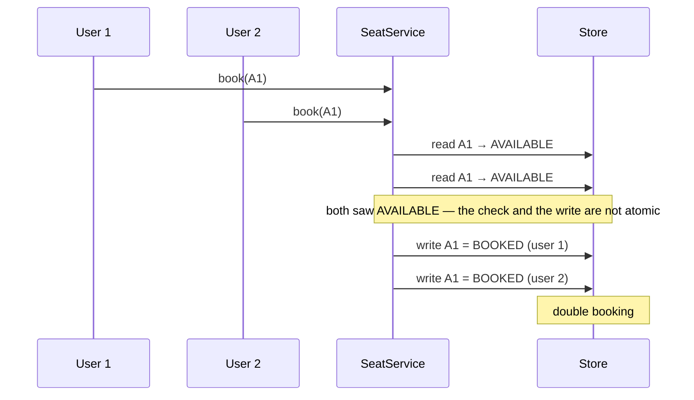
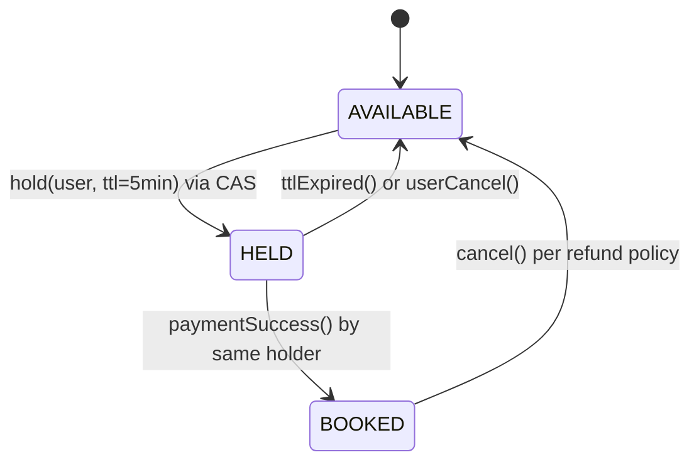

# 06 — Complexity and Tradeoffs

> LLD rounds are not algorithm rounds, but complexity is still scored — as **judgment**. The candidate who says "this is O(n) per move; a counter array makes it O(1) at the cost of `4n` ints, which isn't worth it for n=3" outranks the one who says nothing.
> This file gives you ready **talk tracks** for the four analyses that come up most, plus the consistency-vs-availability discussion at LLD scale.

**How to state complexity in the room:**

1. Name the operation and its input size precisely (`n = seats in a show`, not "n").
2. Give time **and** space.
3. Give the improvement and its cost.
4. Say whether the improvement is worth it *at the stated scale*. That last sentence is where the points are.

---

## 1. Win check (Tic Tac Toe, Connect-4, Gomoku)

### The three approaches

**A. Full board scan — O(n²) time, O(1) extra space**

After each move, check every row, column and both diagonals of the n×n board.

Simple and obviously correct. For n = 3 it's 9 cell reads. Perfectly acceptable, and the right default for an interview sketch.

**B. Incremental check from the placed cell — O(n) time, O(1) extra space**

Only the row, column and (if the cell is on them) the diagonals of the last move can have changed.

```java
public boolean isWinningMove(PieceType[][] grid, int r, int c, PieceType p) {
    int n = grid.length;

    boolean row = true, col = true;
    for (int i = 0; i < n; i++) {
        if (grid[r][i] != p) row = false;
        if (grid[i][c] != p) col = false;
    }
    if (row || col) return true;

    if (r == c) {                                   // main diagonal
        boolean diag = true;
        for (int i = 0; i < n && diag; i++) if (grid[i][i] != p) diag = false;
        if (diag) return true;
    }
    if (r + c == n - 1) {                           // anti-diagonal
        boolean anti = true;
        for (int i = 0; i < n && anti; i++) if (grid[i][n - 1 - i] != p) anti = false;
        if (anti) return true;
    }
    return false;
}
```

**C. Counter arrays — O(1) time, O(n) extra space**

Keep a signed count per row, per column, and for each diagonal. Player 1 adds +1, player 2 adds −1. A count reaching ±n is a win.

```java
class WinTracker {
    private final int n;
    private final int[] rows, cols;
    private int diag, anti;

    WinTracker(int n) { this.n = n; this.rows = new int[n]; this.cols = new int[n]; }

    /** @return true if this move wins. O(1). */
    boolean record(int r, int c, int playerDelta) {          // +1 for X, -1 for O
        rows[r] += playerDelta;
        cols[c] += playerDelta;
        if (r == c)          diag += playerDelta;
        if (r + c == n - 1)  anti += playerDelta;

        int target = n * playerDelta;
        return rows[r] == target || cols[c] == target || diag == target || anti == target;
    }
}
```

Space is `2n + 2` ints. This is the standard answer to LeetCode-style "design Tic Tac Toe" and it generalises to any board size.

### Summary and talk track

| Approach | Time per move | Extra space | Use when |
|----------|---------------|-------------|----------|
| Full scan | O(n²) | O(1) | n small (3–5), clarity matters most |
| Incremental | O(n) | O(1) | Default for a general n×n board |
| Counters | O(1) | O(n) | Large boards, many games, or you're asked to optimise |

> "For a 3×3 board I'd do the incremental check from the last move — O(n) per move, no extra state, and it's easy to verify. If we generalised to a large n×n board or ran millions of simulations for an AI, I'd keep signed counters per row, column and diagonal, which makes the check O(1) for `2n+2` ints of state. The counter version is more code and more state to keep in sync with undo, so at n=3 I'd start with the simple one."

**The extension trap:** counters work for "n in a row on an n×n board". For **Connect-4 / Gomoku** — *k* in a row on a bigger board — counters don't apply; you scan outward from the placed cell in 4 directions for up to k cells each way, which is O(k) per move. Knowing why the trick stops working is a better signal than knowing the trick.

---

## 2. Cache (LRU, LFU)

### LRU — HashMap + doubly linked list

```java
class LRUCache<K, V> {
    private final int capacity;
    private final Map<K, Node<K, V>> map;      // key → node, O(1) lookup
    private final Node<K, V> head, tail;       // sentinels; head.next = most recent

    V get(K key) {          // O(1): map lookup + unlink + insert at head
        Node<K, V> node = map.get(key);
        if (node == null) return null;
        moveToFront(node);
        return node.value;
    }

    void put(K key, V value) {   // O(1): insert at head; evict tail.prev if over capacity
        // ...
    }
}
```

| Operation | Time | Why |
|-----------|------|-----|
| `get` | O(1) | Hash lookup, then constant pointer surgery |
| `put` | O(1) | Insert at head; evict from tail if full |
| Space | O(capacity) | Entry + node overhead: 2 pointers per entry, ~48–64 bytes of JVM overhead beyond key/value |

**Why not a `LinkedList`?** Removing an arbitrary element from `java.util.LinkedList` is O(n) because you must find the node. The map must store the **node itself**, which is why you hand-roll the list. Say this — it's the actual insight the question tests.

**Why not `TreeMap` by timestamp?** O(log n) instead of O(1), plus you must delete the old timestamp entry on every access.

**Java shortcut, worth mentioning:** `LinkedHashMap` with `accessOrder=true` and an overridden `removeEldestEntry` gives you LRU in ~6 lines. Say you know it, then hand-roll it anyway because that's what's being assessed.

### LFU — O(1) is possible but costlier

Naive LFU with a min-heap on frequency is O(log n) per operation. The O(1) design keeps a `Map<K, Entry>`, a `Map<frequency, DoublyLinkedList<Entry>>`, and a `minFrequency` pointer; on access you move the entry from bucket *f* to bucket *f+1* and advance `minFrequency` when the old bucket empties.

> "LFU can be O(1) too, with frequency buckets and a min-frequency pointer, but it's roughly twice the code and it suffers from cache pollution — an item that was hot yesterday keeps a high count forever unless you add aging. LRU is usually the better default; LFU wins when access frequency is stable and skewed."

### Tradeoffs to raise unprompted

| Concern | Options | What to say |
|---------|---------|-------------|
| **Thread safety** | `synchronized` on every method; `ReentrantLock`; striped/segmented locks; copy-on-read | "A single lock makes it correct but serialises all access. Sharding into 16 segments by `key.hashCode()` cuts contention roughly 16× and keeps LRU approximate per segment — that's what real caches do. `ConcurrentHashMap` alone isn't enough because the recency list needs its own mutual exclusion." |
| **TTL / expiry** | Lazy on read; background sweeper; expiry queue | "Lazy expiry is O(1) and simple but leaks memory for keys never read again; a sweeper costs a thread but bounds memory." |
| **Hit ratio vs memory** | Bigger capacity | "Hit ratio has diminishing returns; I'd measure rather than guess a capacity." |
| **Stale data** | Write-through / write-back / invalidate-on-write | "Write-through keeps the cache consistent at the cost of write latency; write-back is faster but loses data on crash." |
| **Cold start / thundering herd** | Per-key lock or single-flight on miss | "On a miss, N concurrent requests would all hit the backing store; I'd hold a per-key in-flight future so only one load happens." |

---

## 3. Rate limiter

Four standard algorithms. Know the accuracy/memory tradeoff between them — that comparison *is* the question.

| Algorithm | Time | Space per key | Accuracy | Burst behaviour |
|-----------|------|---------------|----------|-----------------|
| **Fixed window counter** | O(1) | O(1) — a count + window start | Poor at boundaries | Allows up to **2× the limit** across a window edge |
| **Sliding window log** | O(1) amortised | O(limit) — one timestamp per allowed request | Exact | No burst above the limit |
| **Sliding window counter** | O(1) | O(1) — two counters | Approximate (good in practice) | Smooths the boundary problem |
| **Token bucket** | O(1) | O(1) — tokens + last refill time | Exact over the long run | **Allows a burst up to bucket capacity**, then throttles to the refill rate |
| **Leaky bucket (queue)** | O(1) | O(queue size) | Exact | No burst — output rate is perfectly smooth |

### The fixed-window boundary problem (state this; it's the classic follow-up)

Limit 100/minute. A client sends 100 requests at 11:00:59 and 100 more at 11:01:00. Both windows are satisfied, but 200 requests landed within one second. That's the reason sliding window and token bucket exist.

### Token bucket with lazy refill — the usual best answer

```java
class TokenBucket {
    private final long capacity;          // max burst
    private final double refillPerNano;   // sustained rate
    private double tokens;
    private long lastRefillNanos;

    synchronized boolean tryConsume(int permits) {   // O(1) time, O(1) space
        refill();
        if (tokens >= permits) { tokens -= permits; return true; }
        return false;
    }

    private void refill() {                          // lazy: no background thread needed
        long now = System.nanoTime();
        tokens = Math.min(capacity, tokens + (now - lastRefillNanos) * refillPerNano);
        lastRefillNanos = now;
    }
}
```

**Lazy refill is the key trick to name:** you don't need a timer thread per key; you compute the tokens accrued since the last call. That's what keeps it O(1) in both time and space.

### Sliding window log

```java
class SlidingWindowLog {
    private final Deque<Long> timestamps = new ArrayDeque<>();
    private final int limit; private final long windowMillis;

    synchronized boolean allow(long now) {
        while (!timestamps.isEmpty() && timestamps.peekFirst() <= now - windowMillis) {
            timestamps.pollFirst();                  // amortised O(1): each timestamp is evicted once
        }
        if (timestamps.size() < limit) { timestamps.addLast(now); return true; }
        return false;
    }
}
```

Exact, but memory is O(limit) **per key** — 1M users × 1000 requests/min × 8 bytes ≈ 8 GB. That number is the reason to prefer token bucket at scale, and quoting it lands well.

### Per-key concerns to raise

- **Memory growth across keys.** `Map<userId, Limiter>` grows unbounded. Fix: an LRU/TTL eviction of idle limiters — which is a nice callback to the cache discussion.
- **Lock granularity.** One lock per key (`ConcurrentHashMap.computeIfAbsent` + per-bucket `synchronized`) rather than a global lock.
- **Clock source.** Use `System.nanoTime()` for elapsed time, never `currentTimeMillis()` — the wall clock can jump backwards on NTP correction and hand out free tokens.
- **Distributed scope.** "In-process limiters mean N servers allow N × limit. The real fix is a shared store — Redis with an atomic Lua script — at the cost of a network hop per request. That's an HLD conversation; at LLD I'd keep the algorithm behind a `RateLimiter` interface so the backing store can change."

---

## 4. Booking conflict detection

Two distinct flavours. Identify which one you have before choosing a structure.

### Flavour A — discrete resources (movie seats, parking spots)

Conflict is just "is this seat taken?".

| Approach | Check | Space |
|----------|-------|-------|
| `Set<SeatId>` of booked seats, or `Map<SeatId, SeatStatus>` | O(1) per seat, O(k) for k requested seats | O(seats per show) |
| Bitset per show | O(1), extremely compact | 1 bit per seat |

For a 300-seat show, a bitset is 38 bytes. Say it — it shows you sized the problem instead of reaching for a tree.

### Flavour B — time intervals (meeting rooms, cab drivers, hotel rooms, calendars)

Two intervals `[s1, e1)` and `[s2, e2)` **overlap** exactly when:

```java
static boolean overlaps(long s1, long e1, long s2, long e2) {
    return s1 < e2 && s2 < e1;     // half-open intervals: back-to-back bookings do NOT conflict
}
```

Getting the half-open convention right (a 10:00–11:00 booking does not conflict with 11:00–12:00) is a small detail interviewers specifically look for.

| Approach | Conflict check | Insert | Space | When |
|----------|----------------|--------|-------|------|
| Linear scan of a room's bookings | O(n) | O(1) | O(n) | n small (a room has tens of bookings per day) — **fine, say so** |
| Sorted list + binary search | O(log n) find, O(n) insert (array shift) | O(n) | O(n) | Read-heavy |
| **`TreeMap<startTime, Booking>`** | O(log n) via `floorEntry` / `ceilingEntry` | O(log n) | O(n) | **The default good answer** |
| Interval tree / segment tree | O(log n) | O(log n) | O(n) | Many overlapping intervals per resource, or "find all conflicts" |
| Time-slot bucketing (e.g. 15-min slots) | O(slots requested) | O(1) | O(total slots) | Fixed-granularity scheduling |

**TreeMap approach — the one to write on the board:**

```java
class RoomSchedule {
    private final NavigableMap<Long, Booking> byStart = new TreeMap<>();

    /** O(log n): only the booking starting just before, and the one just after, can overlap. */
    boolean isFree(long start, long end) {
        Map.Entry<Long, Booking> before = byStart.floorEntry(start);
        if (before != null && before.getValue().end() > start) return false;

        Map.Entry<Long, Booking> after = byStart.ceilingEntry(start);
        return after == null || after.getKey() >= end;
    }

    void book(long start, long end, Booking b) {          // caller holds the room's lock
        if (!isFree(start, end)) throw new ConflictException(start, end);
        byStart.put(start, b);
    }
}
```

Because stored intervals are non-overlapping by invariant, checking the immediate predecessor and successor is sufficient. Explaining *why two lookups suffice* is worth more than the code.

> "Per room, a day has maybe 20 bookings, so a linear scan is genuinely fine and I'd ship it. I'm using a `TreeMap` keyed by start time because it stays O(log n) if a resource gets thousands of intervals, and the check is just the floor and ceiling entries — the invariant that stored intervals never overlap is what makes two lookups enough."

**Partition first.** Whatever structure you choose, key it by resource: `Map<RoomId, RoomSchedule>`. You never scan other rooms' bookings, and it gives you natural per-resource locking. Mention both benefits.

---

## 5. Consistency vs availability at LLD level

At LLD scale this is not CAP theorem talk. It is a concrete question: **two users click "book seat A1" at the same millisecond. What happens?**

The unacceptable answer is silence. The acceptable answers all involve making check-and-set atomic.

### The race, drawn



### Option 1 — Pessimistic locking (lock first, then act)

```java
// in-process
synchronized (seatLockFor(showId, seatId)) {
    if (seat.status() != AVAILABLE) throw new SeatUnavailableException(seatId);
    seat.setStatus(HELD);
}

// database
// SELECT * FROM seats WHERE id = ? FOR UPDATE
```

- **Wins:** no wasted work, no retry logic, conflicts are impossible.
- **Costs:** throughput drops under contention; risk of **deadlock** when locking multiple seats — so **always acquire seat locks in a canonical order** (sorted by seat id). Say that; it's the detail that separates people who've done this from people who've read about it.
- **Use when:** conflicts are frequent (last few seats of a hot show, flash sale).

### Option 2 — Optimistic locking (act, then verify) — the standard seat-booking answer

Every seat carries a `version`. You read it, and your write only succeeds if the version hasn't changed.

```java
public final class Seat {
    private final String id;
    private volatile SeatStatus status;
    private volatile long version;      // bumped on every state change
}
```

```java
// Repository-level compare-and-set
int updated = jdbc.update(
    "UPDATE seats SET status = ?, holder_id = ?, version = version + 1 " +
    "WHERE id = ? AND version = ? AND status = 'AVAILABLE'",
    HELD.name(), userId, seatId, expectedVersion);

if (updated == 0) {
    throw new SeatUnavailableException(seatId);   // someone else won the race
}
```

The in-memory equivalent is a CAS loop:

```java
class SeatSlot {
    private final AtomicReference<SeatState> ref;

    boolean tryHold(String userId, Instant now) {
        for (;;) {
            SeatState cur = ref.get();
            if (!cur.isHoldable(now)) return false;               // booked, or held and unexpired
            SeatState next = cur.heldBy(userId, now.plus(HOLD_TTL));
            if (ref.compareAndSet(cur, next)) return true;        // atomic check-and-set
            // lost the race → re-read and re-evaluate
        }
    }
}
```

- **Wins:** no locks held across the user's think-time; excellent throughput when conflicts are rare; scales across processes when the CAS lives in the database.
- **Costs:** the loser does wasted work and must be told cleanly; needs a retry policy (usually **don't** retry seat booking — retrying silently books a *different* seat the user didn't choose, so fail fast and re-render availability).
- **Use when:** conflicts are rare, which is the normal case — this is why real ticketing systems use it.

### Option 3 — Hold with TTL (what production booking systems actually do)

Booking is a multi-step user flow (pick seats → pay → confirm). You cannot hold a database lock across a payment.



Points to make:

- The **hold** is short and taken with an atomic compare-and-set — that's the contended step.
- **Payment happens outside any lock**, so slow payments don't block other users.
- **Confirm re-verifies** the holder identity and that the hold hasn't expired: `WHERE id = ? AND holder_id = ? AND status = 'HELD' AND expires_at > now()`.
- Expiry is enforced **both** lazily on read and by a sweeper, so a crashed client can't reserve a seat forever.
- Add an **idempotency key** on confirm so a double-clicked or retried request creates one booking, not two.

### Multi-seat atomicity

"Book A1, A2, A3 together" must be all-or-nothing.

- **Single transaction** with all three rows, seats locked in sorted order to avoid deadlock; or
- **Hold each, roll back on any failure** — release the holds you already took. Simpler, and the TTL is your safety net if the process dies mid-way.

### The availability side of the tradeoff

| Choice | Consistency | Availability / throughput | Say this |
|--------|-------------|---------------------------|----------|
| Pessimistic lock | Strongest | Lowest under contention | "Correct by construction, but a slow holder blocks everyone" |
| Optimistic CAS | Strong (no double-book) | High when conflicts are rare | "Losers fail fast and re-read; that's the right UX for seat selection" |
| Hold + TTL | Strong at confirm | High — no lock across payment | "Standard for booking flows; TTL bounds the damage from abandoned carts" |
| Eventually consistent / overbook + reconcile | Weakest | Highest | "Airlines actually do this deliberately; unacceptable for assigned seats" |

> **The complete answer, in three sentences:** "Seat booking must never double-book, so the check and the write have to be one atomic step. I'd do a hold with a five-minute TTL taken via a version-based compare-and-set, keep payment outside the lock, and re-verify the holder and expiry on confirm with an idempotency key. If contention were extreme — the last two seats of a sold-out show — I'd switch that specific path to a pessimistic row lock, since retry storms cost more than a short block there."

### Where the display can be stale, and where it can't

A useful nuance: **reads can be inconsistent, writes cannot.** Showing a seat map that is a few seconds stale is fine and lets you cache it aggressively; you simply must revalidate at hold time. Saying this shows you know consistency is a per-operation decision, not a global setting.

---

## Numbers worth memorising

| Operation | Complexity |
|-----------|------------|
| `HashMap` get/put | O(1) average, O(log n) worst case in Java 8+ (treeified bins) |
| `TreeMap` get/put/floor/ceiling | O(log n) |
| `ArrayDeque` add/poll at either end | O(1) amortised |
| `PriorityQueue` offer/poll | O(log n); `peek` O(1) |
| `ArrayList` get | O(1); `add` O(1) amortised; `remove(index)` O(n) |
| `LinkedList` remove given the node | O(1) — but finding the node is O(n) |
| Binary search on a sorted array | O(log n) |
| Sorting | O(n log n) |
| Doubly-linked-list unlink/insert with the node in hand | O(1) |

---

## Sentences that consistently score

- "That's O(n) per call, where n is bookings for **this** room, so realistically tens — I'd keep the simple scan and swap in a `TreeMap` behind the same interface if profiling says otherwise."
- "This is O(1) time but O(limit) space **per key**, so with a million keys it's about 8 GB — that's why I'd choose token bucket instead."
- "The check and the write have to be atomic, otherwise two threads both see AVAILABLE."
- "I'd shard the lock by key rather than synchronize the whole cache; one lock serialises everything."
- "I'm accepting a stale read on the seat map, but never on the hold — consistency is a per-operation decision here."
- "That optimisation costs more code and more state to keep in sync; at this scale it isn't worth it, but here's the seam where I'd add it."

---

[⬅ Interview Checklist](./05-Interview-Checklist.md) · [Foundations index](./README.md) · [Back to LLD index](../README.md)
