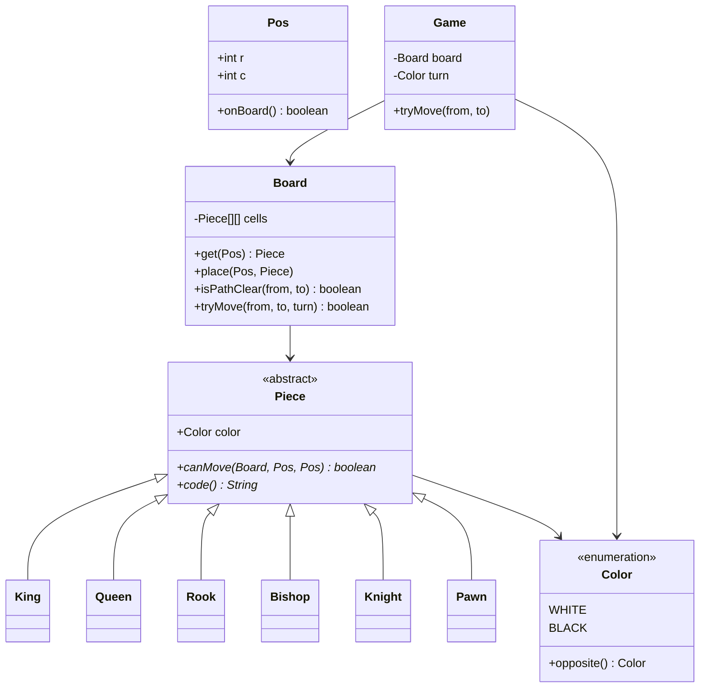
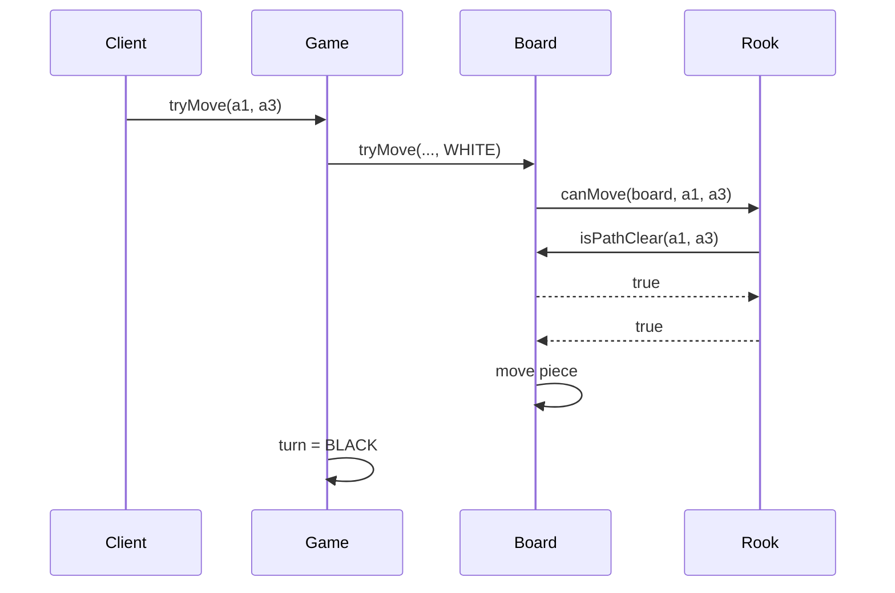

# Chess (Simplified) — Low-Level Design

A complete Low-Level Design for **piece movement validation** on an 8√ó8 board. This is not a chess engine (no AI, limited special moves). The interview prize is **polymorphism** (or Strategy) for `canMove`, plus **path clearing** for sliding pieces.

> **Core insight:** `Game` only knows turns. `Board` stores pieces and path geometry. Each `Piece` subclass answers “can I move from→to on this board?” — open for new pieces without editing the board.

---

## üìå Problem Statement

Design a simplified chess model that:

1. Places pieces on an 8√ó8 board (WHITE / BLACK)
2. Validates legal basic moves for K, Q, R, B, N, P
3. Ensures sliding pieces have a clear path
4. Forbids capturing your own pieces
5. Alternates turns
6. Explicitly excludes castling, en passant, and full checkmate search (optional light check mention)

---

## ‚úÖ Requirements

### Functional

1. `Piece` hierarchy with `canMove(Board, from, to)`.
2. `Board.tryMove` checks turn color, occupancy, `canMove`, then mutates.
3. Path clear for Rook/Bishop/Queen along the ray (exclusive of destination).
4. Knight jumps; King one square; Pawn forward/capture rules with double-step from start row.
5. Print board for demos.

### Non-Functional

* Illegal moves return false + reason (don't throw for normal illegal attempts in sketch).
* Coordinates documented (`Pos(r,c)`, row 0 at black side in the sketch).

### Out of Scope

* Castling, en passant, promotion variants, threefold repetition, clocks, FIDE edge cases, AI search.

---

## 🧠 Core Design Idea

```text
Game.tryMove(from,to)
  ‚Üí Board.tryMove(from,to,turn)
       ‚Üí piece = board[from]
       ‚Üí reject if wrong color / own capture
       ‚Üí reject if !piece.canMove(board,from,to)
       ‚Üí move cells; Game flips turn
```

### Move rules table (implement exactly)

| Piece | Geometry | Path |
|-------|----------|------|
| Rook | same row or col | must be clear |
| Bishop | ‖Δr‖=‖Δc‖ | must be clear |
| Queen | rook ‚à™ bishop | must be clear |
| Knight | (Δr,Δc) ∈ {(2,1),(1,2)} | jumps |
| King | max(‖Δr‖,‖Δc‖)=1 | n/a |
| Pawn | forward 1 (empty); forward 2 from start if both empty; diagonal 1 only if enemy | n/a |

### Inheritance vs Strategy

| Approach | Pros |
|----------|------|
| Subclass per piece (this sketch) | Natural; rules colocated |
| `MoveStrategy` injected | Hot-swap rules; more indirection |

Both are valid — pick one and defend it.

---

## 🏗️ Class Diagram



---

## 📦 Responsibilities

### `Board.isPathClear`
Step from `from` toward `to` by `sign(Δ)` until destination; every intermediate cell must be empty. Destination occupancy is handled by capture rules, not path clear.

### `Pawn`
Direction depends on color. In this sketch white moves toward decreasing row (start row 6), black increasing (start row 1). Document your orientation on the board.

### `Game`
Turn ownership only — no piece math.

---

## 🔄 Sequence — legal rook move



---

## ⚠️ Optional: check validation (talk track)

Pseudo-move algorithm:

```text
1. Save captured piece
2. Apply move
3. Find own king square
4. If any enemy piece canMove to king square ‚Üí illegal
5. Revert move
```

Not required in `Main.java`; mentioning it scores points.

---

## üß© Patterns & Principles

| Pattern / Principle | Where |
|---------------------|-------|
| **Polymorphism / Template** | `Piece.canMove` |
| **SRP** | Path clear on Board |
| **OCP** | New fairy piece subclass |

---

## ⚠️ Edge Cases

| Case | Handling |
|------|----------|
| Move off board | Reject |
| Move empty square | Reject |
| Capture own piece | Reject |
| Blocked sliding path | Reject |
| Pawn forward onto occupied | Reject |
| Pawn diagonal onto empty | Reject |
| Wrong turn | Reject |

---

## üîå Extensibility

| Feature | Approach |
|---------|----------|
| Castling | Special-case in King + Board rook flags |
| Promotion | After pawn hits last rank, replace piece |
| FEN load/save | Serializer for Board |
| Engine | Separate search module; reuse `canMove` |

---

## üßµ Complexity

* `canMove` for sliding pieces: O(1) geometry + O(7) path checks on 8√ó8.
* Full legal-move generation: ~O(pieces √ó moves) small constant.

---

## üí° Interview Talking Points

1. Draw piece hierarchy before board API.  
2. Path clear vs destination occupied.  
3. Inheritance vs Strategy for moves.  
4. Explicit out-of-scope list (castling…).  
5. How you'd add check without rewriting pieces.  
6. Coordinate orientation clarity.  

---

## 📁 Files

| File | Purpose |
|------|---------|
| `details.md` | This LLD |
| `Main.java` | Legal/illegal move demos |

---

## ?? Deep dive ó invariants checklist

Before you leave the whiteboard, confirm you can answer yes to each:

1. Where does the **single source of truth** for the core rule live? (overlap, state transition, win check, vote keyÖ)
2. What happens on the **failure path** immediately after a partial side effect? (debit without dispense, stock without order, lock without pay)
3. Which dependencies are **interfaces** so tests can fake them?
4. What is explicitly **out of scope**, spoken aloud?
5. What is the **first extension** you would add and which class changes?

---

## ??? Sample interviewer Q&A

**Q: Why not one god class?**  
A: Because the change axes differ ó pricing/matching/state/inventory rarely change together. Splitting along those axes keeps diffs small and interviews clearer.

**Q: Where would you put persistence?**  
A: Outside the domain facade. Repository interfaces for aggregates (Trip, Reservation, Order). Domain methods stay pure of SQL.

**Q: How do you test this?**  
A: Deterministic inputs (fixed dice, manual clock, in-memory bank). Table-driven cases for the core rule (overlap truth table, state transitions, vote math).

**Q: What breaks at scale?**  
A: The naive loops (scan all drivers, all reservations, all tweets). Index by geo-hash, by day, by followee timeline. That is the HLD bridge ó say it, don't implement it in LLD unless asked.

**Q: Concurrency?**  
A: Name the shared mutable resource (spot, seat, driver.available, stock, cassette). Propose lock grain or DB constraint / CAS. Idempotency keys for payments and bank withdraws.

---

## ?? Revision card (memorize)

| Prompt yourself | Answer shape |
|-----------------|--------------|
| Entities? | 5ñ8 nouns |
| Core rule? | One formula / state diagram |
| Patterns? | 1ñ3 max, justified |
| Failure? | One sequenced unhappy path |
| Extend? | One OCP example |

---

## 📚 Extended teaching notes — Chess

This section exists so the write-up matches the depth of Parking Lot / Hotel / Splitwise in this bible: more failure modes, more whiteboard scripts, and more “what I would say next.”

### Whiteboard script (8–10 minutes)

1. **Clarify scope (1 min).** Restate functional bullets and say three out-of-scope items aloud.
2. **Entities (1 min).** List 6–8 nouns; mark which are value objects vs entities.
3. **Core rule (2 min).** Write the single formula or state diagram that makes the design correct.
4. **Class diagram (2 min).** Boxes + relationships only for classes you will defend.
5. **API walk (2 min).** One happy sequence; one failure sequence.
6. **Close (1–2 min).** Concurrency, complexity, one extension.

### Failure-mode catalog

| # | Failure | Detection | Mitigation |
|---|---------|-----------|------------|
| 1 | Partial side effect | Two-phase / plan-then-commit | Compensating action |
| 2 | Double submit | Idempotency key | Deduplicate |
| 3 | Lost update | Version / CAS | Retry |
| 4 | Stale read | TTL / re-read | Accept or refresh |
| 5 | Resource exhaustion | Explicit null/empty | Backpressure / reject |
| 6 | Illegal transition | State guard | Throw / message |
| 7 | Validation gap | Boundary checks | Reject early |
| 8 | Clock skew | Inject clock | Monotonic / server time |

### Testing matrix

| Layer | What to test | Example |
|-------|--------------|---------|
| Unit | Core rule | Overlap truth table / state table / vote math |
| Unit | Strategy swap | Alternate matching or pricing |
| Integration | Facade flow | Happy path through service |
| Adversarial | Illegal calls | Double complete, bad PIN, sold out |
| Property | Invariants | Spot free XOR occupied; balances sum to zero |

### Complexity cheat sheet

| Operation family | Typical LLD cost | Scale upgrade |
|------------------|------------------|---------------|
| Linear scan resources | O(n) | Index / partition |
| Interval conflict | O(m) per resource | Interval tree |
| Graph gather | O(F·T) | Push inbox / cache |
| Tick simulation | O(e) elevators | Event queue |

### Concurrency talking track (memorize)

Shared mutable resource ‚Üí name it ‚Üí pick grain of lock (object vs row vs partition) ‚Üí prefer CAS/check-and-set when races are expected ‚Üí mention DB unique constraints for multi-node ‚Üí idempotency for network retries.

### Extension prompts interviewers love

* “Add X without rewriting the orchestrator” → OCP / Strategy / new state.
* “Two users click at once” → concurrency paragraph.
* “How do you test?” → deterministic seams (dice, clock, bank).
* “What did you leave out?” → out-of-scope list, not apology.

### Mapping back to `Main.java`

When you revise, open `Main.java` beside this doc and tick:

- [ ] Every public API in the diagram appears in code
- [ ] Every demo print maps to a requirement bullet
- [ ] At least one failure path is executed
- [ ] Magic numbers are named constants when they encode policy

### Glossary for this module

| Term | Meaning in Chess |
|------|------------------|
| Facade | Entry service that preserves invariants |
| Strategy | Swappable policy object |
| Invariant | Fact that must always hold after a successful call |
| Soft cancel | Status flip instead of row delete |
| Plan-then-commit | Validate/plan fully before mutating durable state |

### Mini mock questions (answer in one breath each)

1. What is the single most important invariant?
2. Where does that invariant live in code?
3. What is the first class you would add for the next feature?
4. What breaks first at 100√ó traffic?
5. How do you make the demo deterministic?

If you can answer those five without scrolling, you own this design.

### Related modules in this bible

Cross-read for transfer learning: Hotel Booking (intervals), Cab Booking (matching), Vending/ATM (state), LRU/Rate Limiter (infra math), Splitwise (policy tables). Steal structures, not prose.

### Final revision ritual

Cover the class diagram ‚Üí redraw from memory ‚Üí compare ‚Üí run `javac Main.java && java Main` ‚Üí explain one failure log line as if to an interviewer.

