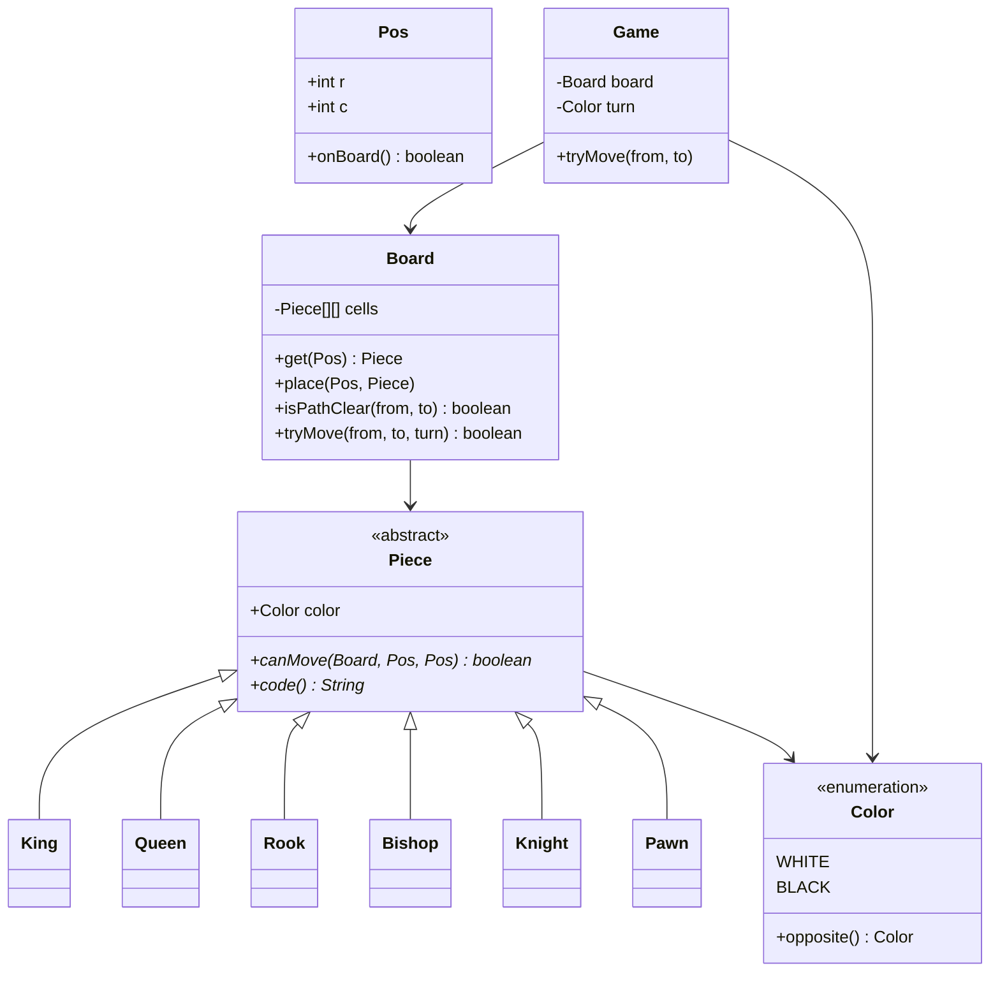
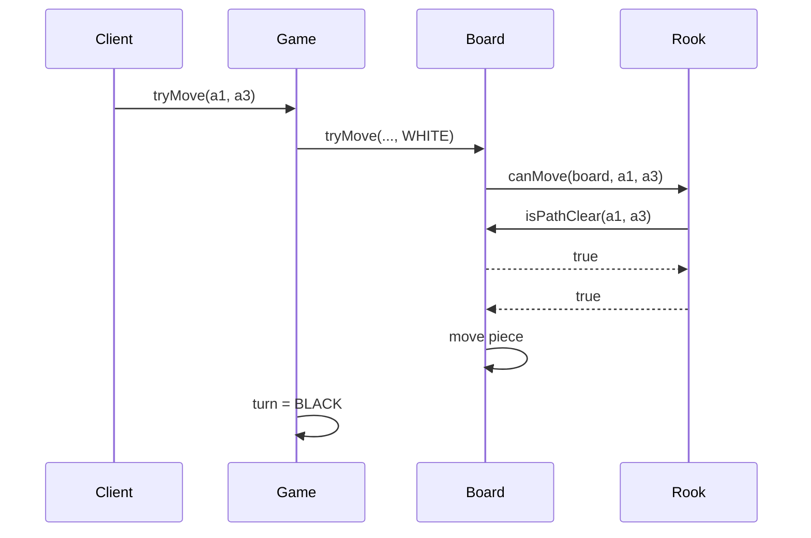

# Chess (Simplified) — Low-Level Design

A complete Low-Level Design for **piece movement validation** on an 8×8 board. This is not a chess engine (no AI, limited special moves). The interview prize is **polymorphism** (or Strategy) for `canMove`, plus **path clearing** for sliding pieces.

> **Core insight:** `Game` only knows turns. `Board` stores pieces and path geometry. Each `Piece` subclass answers “can I move from→to on this board → ” — open for new pieces without editing the board.

---

## 📌 Problem Statement

Design a simplified chess model that:

1. Places pieces on an 8×8 board (WHITE / BLACK)
2. Validates legal basic moves for K, Q, R, B, N, P
3. Ensures sliding pieces have a clear path
4. Forbids capturing your own pieces
5. Alternates turns
6. Explicitly excludes castling, en passant, and full checkmate search (optional light check mention)

---

## ✅ Requirements

### Functional

1. `Piece` hierarchy with `canMove(Board, from, to)`.
2. `Board.tryMove` checks turn color, occupancy, `canMove`, then mutates.
3. Path clear for Rook/Bishop/Queen along the ray (exclusive of destination).
4. Knight jumps; King one square; Pawn forward/capture rules with double-step from start row.
5. Print board for demos.

### Non-Functional

* Illegal moves return false + reason (don't throw for normal illegal attempts in sketch).
* Coordinates documented (`Pos(r,c)`, row 0 at black side in the sketch).

### Out of Scope

* Castling, en passant, promotion variants, threefold repetition, clocks, FIDE edge cases, AI search.

---

## 🧠 Core Design Idea

```text
Game.tryMove(from,to)
  → Board.tryMove(from,to,turn)
       → piece = board[from]
       → reject if wrong color / own capture
       → reject if !piece.canMove(board,from,to)
       → move cells; Game flips turn
```

### Move rules table (implement exactly)

| Piece | Geometry | Path |
|-------|----------|------|
| Rook | same row or col | must be clear |
| Bishop | ‖Δr‖=‖Δc‖ | must be clear |
| Queen | rook ∪ bishop | must be clear |
| Knight | (Δr,Δc) ∈ {(2,1),(1,2)} | jumps |
| King | max(‖Δr‖,‖Δc‖)=1 | n/a |
| Pawn | forward 1 (empty); forward 2 from start if both empty; diagonal 1 only if enemy | n/a |

### Inheritance vs Strategy

| Approach | Pros |
|----------|------|
| Subclass per piece (this sketch) | Natural; rules colocated |
| `MoveStrategy` injected | Hot-swap rules; more indirection |

Both are valid — pick one and defend it.

---

## 🏗️ Class Diagram



---

## 📦 Responsibilities

### `Board.isPathClear`
Step from `from` toward `to` by `sign(Δ)` until destination; every intermediate cell must be empty. Destination occupancy is handled by capture rules, not path clear.

### `Pawn`
Direction depends on color. In this sketch white moves toward decreasing row (start row 6), black increasing (start row 1). Document your orientation on the board.

### `Game`
Turn ownership only — no piece math.

---

## 🔄 Sequence — legal rook move



---

## ⚠️ Optional: check validation (talk track)

Pseudo-move algorithm:

```text
1. Save captured piece
2. Apply move
3. Find own king square
4. If any enemy piece canMove to king square → illegal
5. Revert move
```

Not required in `Main.java`; mentioning it scores points.

---

## 🧩 Patterns & Principles

| Pattern / Principle | Where |
|---------------------|-------|
| **Polymorphism / Template** | `Piece.canMove` |
| **SRP** | Path clear on Board |
| **OCP** | New fairy piece subclass |

---

## ⚠️ Edge Cases

| Case | Handling |
|------|----------|
| Move off board | Reject |
| Move empty square | Reject |
| Capture own piece | Reject |
| Blocked sliding path | Reject |
| Pawn forward onto occupied | Reject |
| Pawn diagonal onto empty | Reject |
| Wrong turn | Reject |

---

## 🔌 Extensibility

| Feature | Approach |
|---------|----------|
| Castling | Special-case in King + Board rook flags |
| Promotion | After pawn hits last rank, replace piece |
| FEN load/save | Serializer for Board |
| Engine | Separate search module; reuse `canMove` |

---

## 🧵 Complexity

* `canMove` for sliding pieces: O(1) geometry + O(7) path checks on 8×8.
* Full legal-move generation: ~O(pieces × moves) small constant.

---

## 💡 Interview Talking Points

1. Draw piece hierarchy before board API.  
2. Path clear vs destination occupied.  
3. Inheritance vs Strategy for moves.  
4. Explicit out-of-scope list (castling…).  
5. How you'd add check without rewriting pieces.  
6. Coordinate orientation clarity.  

---

## 📁 Files

| File | Purpose |
|------|---------|
| `details.md` | This LLD |
| `Main.java` | Legal/illegal move demos |
