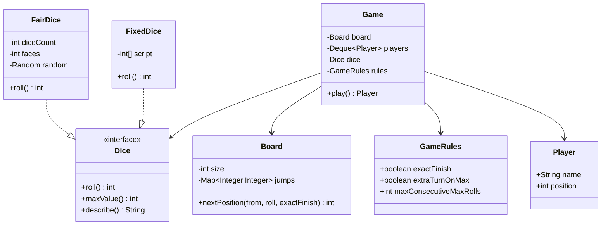
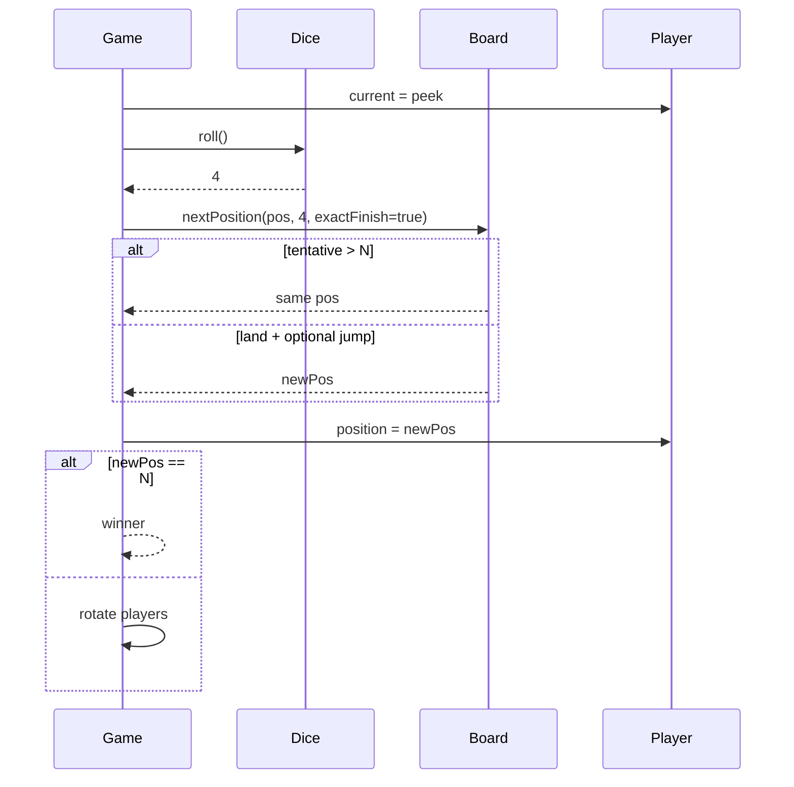

# Snake & Ladder — Low-Level Design

A complete Low-Level Design for the classic board game: dice Strategy, snake/ladder teleports, exact-finish winning, and configurable house rules (extra turn on max roll). Matches the runnable sketch in `Main.java`.

> **Core insight:** the board is a pure function `nextPosition(from, roll) → to`. Snakes and ladders are one `Map<Integer,Integer>`. The game loop only rotates players and asks the dice — nothing else.

---

## 📌 Problem Statement

Design an object-oriented Snake & Ladder engine where multiple players take turns rolling dice on a board of cells `1..N`, slide down snakes, climb ladders, and the first to reach **exactly** `N` wins.

---

## ✅ Requirements

### Functional

1. Board cells numbered `1..N` (classic `N = 100`). Players start at `0` (off-board).
2. Snakes: head → tail with `head > tail`. Ladders: start → end with `start < end`.
3. Store both in one jump map: `from → to`.
4. On a roll, tentative = `position + roll`:
   - If **exact finish** is ON and tentative `> N`, **stay put**.
   - Else land on tentative, then apply at most **one** jump if the cell is a key in the map.
5. `Dice` is a Strategy (`FairDice`, fixed/loaded dice for tests).
6. Optional house rule: rolling `maxValue` grants an extra turn; three max rolls in a row forfeits (configurable).
7. First player at exactly `N` wins; print a readable turn log.

### Non-Functional

* Board validates snake/ladder configuration at construction (no out-of-range, no snake-ladder cell conflict if you choose that invariant).
* Game must be testable with a deterministic `Dice`.
* Safety cap on turns to avoid infinite games in demos.

### Out of Scope

* GUI, online multiplayer networking, animation, betting.

---

## 🧠 Core Design Idea

| Concern | Owner |
|---------|-------|
| How numbers are produced | `Dice` Strategy |
| Where jumps go | `Board` (+ jump map) |
| Who plays | `Player` + turn `Deque` |
| House rules | `GameRules` |
| Orchestration | `Game` |

### Movement algorithm (exact finish ON)

```text
function nextPosition(pos, roll, N, jumps, exactFinish):
    tentative = pos + roll
    if exactFinish and tentative > N:
        return pos
    land = min(tentative, N)   // if exactFinish OFF, clamp
    return jumps.getOrDefault(land, land)
```

### One-jump vs chain policy

| Policy | Behavior | This design |
|--------|----------|-------------|
| **One jump** | Land on 14 → snake to 7; stop even if 7 is a ladder | ✅ default |
| **Chain** | Keep jumping until stable | optional extension |

Misconfigured boards can create cycles under chaining — another reason one-jump is safer for interviews unless asked.

---

## 🏗️ Class Diagram



---

## 📦 Class Responsibilities

### `Dice` / `FairDice` / `FixedDice`
Strategy seam. `FixedDice` is how you unit-test “player wins in 3 moves” without flaky random.

### `Board`
Owns `size` and jump map. Validates:
* All keys/values in `1..N`
* Snake heads > tails, ladder starts < ends
* Optionally: a cell is not both a snake head and ladder start

### `Player`
Name + mutable position.

### `GameRules`
Bundles boolean/int knobs so `Game` doesn't grow a telescoping constructor.

### `Game`
* Peek front player → roll → maybe extra turns → move → check win → rotate deque
* Turn safety counter

---

## 🔄 Sequence — one turn



---

## 🧮 Worked example

```text
N=20, snake 14→7, ladder 3→11
Player at 10, rolls 4 → tentative 14 → snake → 7
Player at 17, rolls 5 → tentative 22 > 20 → stay 17 (exact finish)
Player at 17, rolls 3 → 20 → WIN
```

---

## 🧩 Patterns & Principles

| Pattern / Principle | Where |
|---------------------|-------|
| **Strategy** | `Dice` |
| **SRP** | Board = geometry; Game = turns |
| **OCP** | New dice without touching Game |
| Queue for turns | Easy N-player |

---

## ⚠️ Edge Cases

| Case | Handling |
|------|----------|
| Roll would pass `N` | Stay (exact finish) |
| Land on snake head | Jump once to tail |
| Two players same cell | Allowed |
| Dice always 6 | Extra-turn rule may loop — use consecutive max cap |
| Empty jump map | Fine — pure race |
| Jump to `N` | Immediate win after move |

---

## 🔌 Extensibility

| Feature | Approach |
|---------|----------|
| Team play | Groups of players |
| Power-ups | Cells with effects beyond jumps |
| Undo last move | Memento of positions |
| Tournament | Multiple `Game` instances |

---

## 🧵 Complexity & Concurrency

* Per turn: O(1) with hash jumps.
* Single-threaded game loop; no shared mutable board across threads in this LLD.
* Randomness: inject `Random` seed for demos.

---

## 💡 Interview Talking Points

1. Exact finish vs “bounce back” variants — declare yours.  
2. Dice Strategy for testability.  
3. One map for snakes and ladders.  
4. One-jump vs chain and cycle risk.  
5. Extra-turn house rule and anti-infinite cap.  
6. Start at 0 vs 1 — be consistent.  

---

## 📁 Files

| File | Purpose |
|------|---------|
| `details.md` | This LLD |
| `Main.java` | Auto-play with fair/fixed dice demos |
