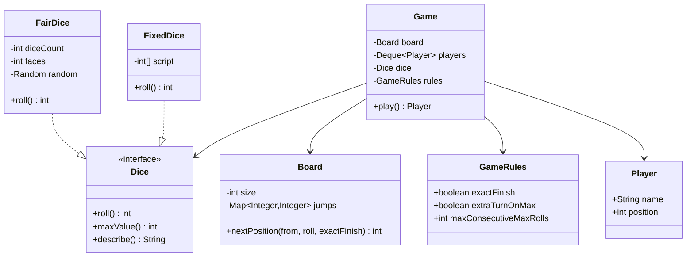
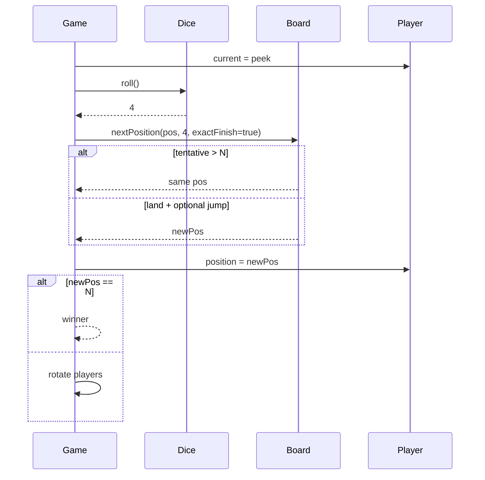

# Snake & Ladder — Low-Level Design

A complete Low-Level Design for the classic board game: dice Strategy, snake/ladder teleports, exact-finish winning, and configurable house rules (extra turn on max roll). Matches the runnable sketch in `Main.java`.

> **Core insight:** the board is a pure function `nextPosition(from, roll) → to`. Snakes and ladders are one `Map<Integer,Integer>`. The game loop only rotates players and asks the dice — nothing else.

---

## 📌 Problem Statement

Design an object-oriented Snake & Ladder engine where multiple players take turns rolling dice on a board of cells `1..N`, slide down snakes, climb ladders, and the first to reach **exactly** `N` wins.

---

## ✅ Requirements

### Functional

1. Board cells numbered `1..N` (classic `N = 100`). Players start at `0` (off-board).
2. Snakes: head → tail with `head > tail`. Ladders: start → end with `start < end`.
3. Store both in one jump map: `from → to`.
4. On a roll, tentative = `position + roll`:
   - If **exact finish** is ON and tentative `> N`, **stay put**.
   - Else land on tentative, then apply at most **one** jump if the cell is a key in the map.
5. `Dice` is a Strategy (`FairDice`, fixed/loaded dice for tests).
6. Optional house rule: rolling `maxValue` grants an extra turn; three max rolls in a row forfeits (configurable).
7. First player at exactly `N` wins; print a readable turn log.

### Non-Functional

* Board validates snake/ladder configuration at construction (no out-of-range, no snake-ladder cell conflict if you choose that invariant).
* Game must be testable with a deterministic `Dice`.
* Safety cap on turns to avoid infinite games in demos.

### Out of Scope

* GUI, online multiplayer networking, animation, betting.

---

## 🧠 Core Design Idea

| Concern | Owner |
|---------|-------|
| How numbers are produced | `Dice` Strategy |
| Where jumps go | `Board` (+ jump map) |
| Who plays | `Player` + turn `Deque` |
| House rules | `GameRules` |
| Orchestration | `Game` |

### Movement algorithm (exact finish ON)

```text
function nextPosition(pos, roll, N, jumps, exactFinish):
    tentative = pos + roll
    if exactFinish and tentative > N:
        return pos
    land = min(tentative, N)   // if exactFinish OFF, clamp
    return jumps.getOrDefault(land, land)
```

### One-jump vs chain policy

| Policy | Behavior | This design |
|--------|----------|-------------|
| **One jump** | Land on 14 → snake to 7; stop even if 7 is a ladder | ✅ default |
| **Chain** | Keep jumping until stable | optional extension |

Misconfigured boards can create cycles under chaining — another reason one-jump is safer for interviews unless asked.

---

## �� Class Diagram



---

## 📦 Class Responsibilities

### `Dice` / `FairDice` / `FixedDice`
Strategy seam. `FixedDice` is how you unit-test “player wins in 3 moves� without flaky random.

### `Board`
Owns `size` and jump map. Validates:
* All keys/values in `1..N`
* Snake heads > tails, ladder starts < ends
* Optionally: a cell is not both a snake head and ladder start

### `Player`
Name + mutable position.

### `GameRules`
Bundles boolean/int knobs so `Game` doesn't grow a telescoping constructor.

### `Game`
* Peek front player → roll → maybe extra turns → move → check win → rotate deque
* Turn safety counter

---

## 🔄 Sequence — one turn



---

## 🧮 Worked example

```text
N=20, snake 14→7, ladder 3→11
Player at 10, rolls 4 → tentative 14 → snake → 7
Player at 17, rolls 5 → tentative 22 > 20 → stay 17 (exact finish)
Player at 17, rolls 3 → 20 → WIN
```

---

## 🧩 Patterns & Principles

| Pattern / Principle | Where |
|---------------------|-------|
| **Strategy** | `Dice` |
| **SRP** | Board = geometry; Game = turns |
| **OCP** | New dice without touching Game |
| Queue for turns | Easy N-player |

---

## ⚠� Edge Cases

| Case | Handling |
|------|----------|
| Roll would pass `N` | Stay (exact finish) |
| Land on snake head | Jump once to tail |
| Two players same cell | Allowed |
| Dice always 6 | Extra-turn rule may loop — use consecutive max cap |
| Empty jump map | Fine — pure race |
| Jump to `N` | Immediate win after move |

---

## 🔌 Extensibility

| Feature | Approach |
|---------|----------|
| Team play | Groups of players |
| Power-ups | Cells with effects beyond jumps |
| Undo last move | Memento of positions |
| Tournament | Multiple `Game` instances |

---

## 🧵 Complexity & Concurrency

* Per turn: O(1) with hash jumps.
* Single-threaded game loop; no shared mutable board across threads in this LLD.
* Randomness: inject `Random` seed for demos.

---

## 💡 Interview Talking Points

1. Exact finish vs “bounce back� variants — declare yours.  
2. Dice Strategy for testability.  
3. One map for snakes and ladders.  
4. One-jump vs chain and cycle risk.  
5. Extra-turn house rule and anti-infinite cap.  
6. Start at 0 vs 1 — be consistent.  

---

## � Files

| File | Purpose |
|------|---------|
| `details.md` | This LLD |
| `Main.java` | Auto-play with fair/fixed dice demos |

---

## ?? Deep dive — invariants checklist

Before you leave the whiteboard, confirm you can answer yes to each:

1. Where does the **single source of truth** for the core rule live? (overlap, state transition, win check, vote key…)
2. What happens on the **failure path** immediately after a partial side effect? (debit without dispense, stock without order, lock without pay)
3. Which dependencies are **interfaces** so tests can fake them?
4. What is explicitly **out of scope**, spoken aloud?
5. What is the **first extension** you would add and which class changes?

---

## ??? Sample interviewer Q&A

**Q: Why not one god class?**  
A: Because the change axes differ — pricing/matching/state/inventory rarely change together. Splitting along those axes keeps diffs small and interviews clearer.

**Q: Where would you put persistence?**  
A: Outside the domain facade. Repository interfaces for aggregates (Trip, Reservation, Order). Domain methods stay pure of SQL.

**Q: How do you test this?**  
A: Deterministic inputs (fixed dice, manual clock, in-memory bank). Table-driven cases for the core rule (overlap truth table, state transitions, vote math).

**Q: What breaks at scale?**  
A: The naive loops (scan all drivers, all reservations, all tweets). Index by geo-hash, by day, by followee timeline. That is the HLD bridge — say it, don't implement it in LLD unless asked.

**Q: Concurrency?**  
A: Name the shared mutable resource (spot, seat, driver.available, stock, cassette). Propose lock grain or DB constraint / CAS. Idempotency keys for payments and bank withdraws.

---

## ?? Revision card (memorize)

| Prompt yourself | Answer shape |
|-----------------|--------------|
| Entities? | 5–8 nouns |
| Core rule? | One formula / state diagram |
| Patterns? | 1–3 max, justified |
| Failure? | One sequenced unhappy path |
| Extend? | One OCP example |

---

## 📚 Extended teaching notes — Snake-And-Ladder

This section exists so the write-up matches the depth of Parking Lot / Hotel / Splitwise in this bible: more failure modes, more whiteboard scripts, and more “what I would say next.�

### Whiteboard script (8–10 minutes)

1. **Clarify scope (1 min).** Restate functional bullets and say three out-of-scope items aloud.
2. **Entities (1 min).** List 6–8 nouns; mark which are value objects vs entities.
3. **Core rule (2 min).** Write the single formula or state diagram that makes the design correct.
4. **Class diagram (2 min).** Boxes + relationships only for classes you will defend.
5. **API walk (2 min).** One happy sequence; one failure sequence.
6. **Close (1–2 min).** Concurrency, complexity, one extension.

### Failure-mode catalog

| # | Failure | Detection | Mitigation |
|---|---------|-----------|------------|
| 1 | Partial side effect | Two-phase / plan-then-commit | Compensating action |
| 2 | Double submit | Idempotency key | Deduplicate |
| 3 | Lost update | Version / CAS | Retry |
| 4 | Stale read | TTL / re-read | Accept or refresh |
| 5 | Resource exhaustion | Explicit null/empty | Backpressure / reject |
| 6 | Illegal transition | State guard | Throw / message |
| 7 | Validation gap | Boundary checks | Reject early |
| 8 | Clock skew | Inject clock | Monotonic / server time |

### Testing matrix

| Layer | What to test | Example |
|-------|--------------|---------|
| Unit | Core rule | Overlap truth table / state table / vote math |
| Unit | Strategy swap | Alternate matching or pricing |
| Integration | Facade flow | Happy path through service |
| Adversarial | Illegal calls | Double complete, bad PIN, sold out |
| Property | Invariants | Spot free XOR occupied; balances sum to zero |

### Complexity cheat sheet

| Operation family | Typical LLD cost | Scale upgrade |
|------------------|------------------|---------------|
| Linear scan resources | O(n) | Index / partition |
| Interval conflict | O(m) per resource | Interval tree |
| Graph gather | O(F·T) | Push inbox / cache |
| Tick simulation | O(e) elevators | Event queue |

### Concurrency talking track (memorize)

Shared mutable resource → name it → pick grain of lock (object vs row vs partition) → prefer CAS/check-and-set when races are expected → mention DB unique constraints for multi-node → idempotency for network retries.

### Extension prompts interviewers love

* “Add X without rewriting the orchestrator� → OCP / Strategy / new state.
* “Two users click at once� → concurrency paragraph.
* “How do you test?� → deterministic seams (dice, clock, bank).
* “What did you leave out?� → out-of-scope list, not apology.

### Mapping back to `Main.java`

When you revise, open `Main.java` beside this doc and tick:

- [ ] Every public API in the diagram appears in code
- [ ] Every demo print maps to a requirement bullet
- [ ] At least one failure path is executed
- [ ] Magic numbers are named constants when they encode policy

### Glossary for this module

| Term | Meaning in Snake-And-Ladder |
|------|------------------|
| Facade | Entry service that preserves invariants |
| Strategy | Swappable policy object |
| Invariant | Fact that must always hold after a successful call |
| Soft cancel | Status flip instead of row delete |
| Plan-then-commit | Validate/plan fully before mutating durable state |

### Mini mock questions (answer in one breath each)

1. What is the single most important invariant?
2. Where does that invariant live in code?
3. What is the first class you would add for the next feature?
4. What breaks first at 100× traffic?
5. How do you make the demo deterministic?

If you can answer those five without scrolling, you own this design.

### Related modules in this bible

Cross-read for transfer learning: Hotel Booking (intervals), Cab Booking (matching), Vending/ATM (state), LRU/Rate Limiter (infra math), Splitwise (policy tables). Steal structures, not prose.

### Final revision ritual

Cover the class diagram → redraw from memory → compare → run `javac Main.java && java Main` → explain one failure log line as if to an interviewer.

