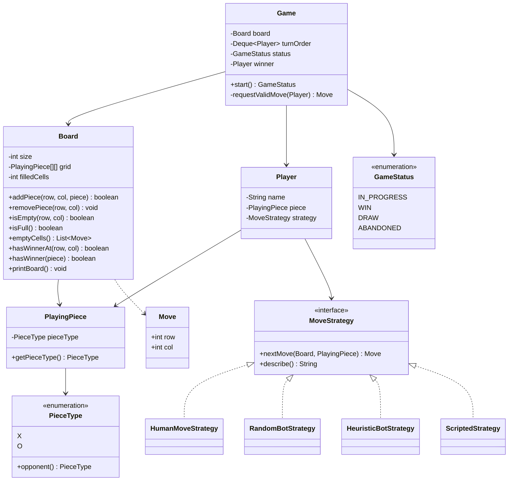
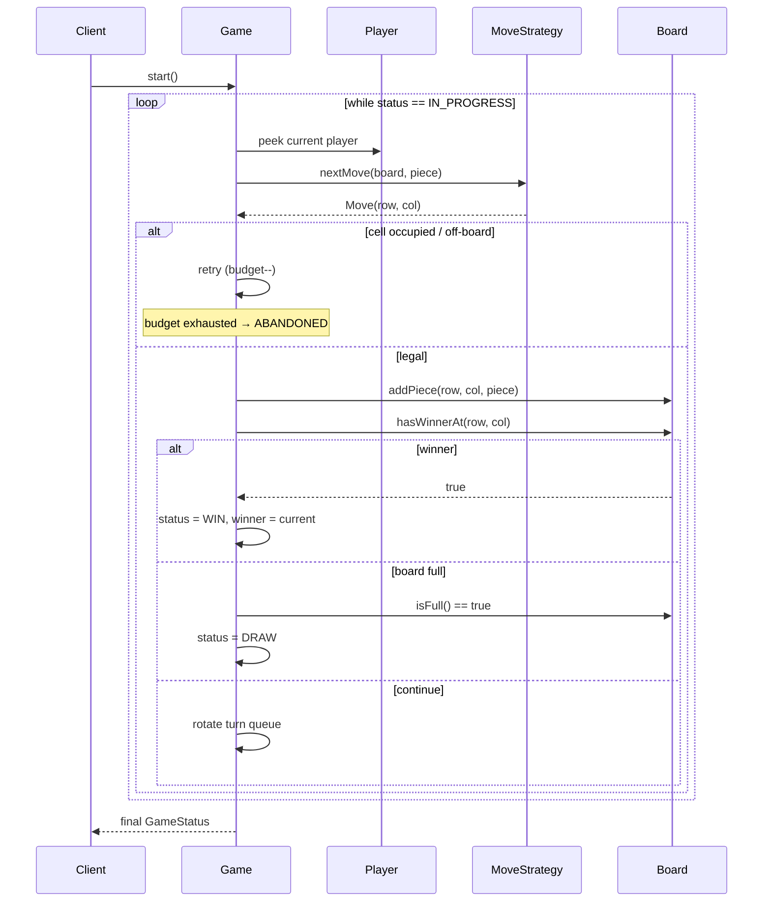

# Tic Tac Toe — Low-Level Design

A complete Low-Level Design for a classic **Tic Tac Toe** engine in Java: requirements, class model, flows, win-check complexity, bot strategies, edge cases, and the interview talk track.

> **Difficulty:** warm-up. This is the problem to use when you are learning *how to structure an LLD answer*, because the domain rules take thirty seconds to state and all the marks come from the modelling.

---

## 📌 Problem Statement

Design an object-oriented Tic Tac Toe system where two players take turns placing symbols (`X` / `O`) on an `N × N` board until one player gets `N` in a line or the board fills up (draw).

The design must be clean enough to extend later — bigger boards, more than two players, human vs bot, undo, GUI — without rewriting the core game loop.

---

## ✅ Requirements

### Functional

1. Support a square board of size **N × N** (classic default: `N = 3`).
2. Players alternate turns in a fixed order; the first player uses `X`, the second `O`.
3. A move is valid only if the target cell is **inside the board** and **empty**.
4. After each move, resolve the game state:
   - **Win** — `N` identical symbols in a row, column, main diagonal or anti-diagonal
   - **Draw** — board full with no winner
   - **In Progress** — otherwise
5. Render the board after every move.
6. Reject an illegal move without consuming the player's turn.
7. End the game cleanly and report the winner (or the draw).

### Non-Functional

* Clear separation of concerns: grid rules vs player identity vs orchestration.
* Swapping a human for a bot must not touch `Game`.
* Win detection must remain correct for **any** `N`, not just 3.
* Deterministic and testable: the engine must be drivable without a console.

### Out of Scope

* Multiplayer networking, matchmaking, lobbies
* Persistence, leaderboards, ELO
* GUI framework (console rendering is enough)
* Unbeatable AI (minimax is discussed as an extension, not built)

---

## 🧠 Core Design Idea

Five responsibilities, each with exactly one reason to change:

| Component | Responsibility |
|-----------|----------------|
| `PieceType` / `PlayingPiece` | What can occupy a cell |
| `Board` | Grid storage, bounds/emptiness validation, win & draw detection, rendering |
| `MoveStrategy` | **How** a move is chosen (human input, random, heuristic) |
| `Player` | Who is playing: name + piece + strategy |
| `Game` | Turn order, move loop, lifecycle transitions |

The key insight for interviews: **`Game` must not know whether a player is a human or a bot.** It asks a `MoveStrategy` for a cell and validates the answer. That single indirection is what turns "a Tic Tac Toe program" into "a Tic Tac Toe design".

---

## 🏗️ Class Diagram



---

## 📦 Class Responsibilities (Detailed)

### 1. `PieceType` (enum)

`X`, `O`. Type-safe, no magic strings, free `switch` support. `opponent()` is a convenience for the two-symbol game — note in an interview that it stops being meaningful the moment you allow three players, at which point the *game* must tell a bot who its opponents are.

### 2. `PlayingPiece`

A wrapper around the enum. Justify it or drop it — do not leave it unexplained. It earns its place only if you plan to attach per-piece metadata (colour, sprite, owner id). For a pure 3×3 console game the enum alone is defensible, and saying so out loud shows judgement.

### 3. `Board`

Owns the grid and every rule *about* the grid.

| Method | Notes |
|--------|-------|
| `addPiece(row, col, piece)` | Validates bounds + emptiness, then places. Returns `false` instead of throwing, because "cell taken" is an expected user error, not an exceptional condition. |
| `removePiece(row, col)` | Exists so bots can simulate and roll back a move without cloning the board. |
| `isFull()` | `O(1)` via a `filledCells` counter kept in sync by add/remove. |
| `emptyCells()` | Candidate list for bots. |
| `hasWinnerAt(row, col)` | `O(N)` incremental check — the one the game loop uses. |
| `hasWinner(piece)` | `O(N²)` full scan — kept for teaching and for validating an arbitrary position. |
| `printBoard()` | Box-drawn rendering that generalises to any `N`. |

**Why win logic lives on `Board`:** winning is a property of the grid layout, not of a player or of the loop. Putting it on `Game` is the single most common SRP violation in this problem.

### 4. `MoveStrategy` (interface)

```java
Move nextMove(Board board, PlayingPiece piece);
```

| Implementation | Behaviour |
|----------------|-----------|
| `HumanMoveStrategy` | Reads `row col` from stdin; returns `null` on malformed input so `Game` can re-prompt |
| `RandomBotStrategy` | Uniform random empty cell |
| `HeuristicBotStrategy` | Win → block → centre → corner → random |
| `ScriptedStrategy` | Replays a fixed move list, making demos and tests deterministic |

`ScriptedStrategy` is worth mentioning explicitly: it is what makes the engine unit-testable without stubbing `System.in`.

### 5. `Player`

Identity (`name`) + assignment (`piece`) + behaviour (`strategy`). Composition, not inheritance — there is no `HumanPlayer` / `BotPlayer` subclass hierarchy, because the only thing that varies is *how a move is chosen*, and that is exactly one method.

### 6. `GameStatus` (enum)

`IN_PROGRESS | WIN | DRAW | ABANDONED`.

Explicit lifecycle beats a pile of booleans (`isOver`, `isDraw`, `hasWinner`) that can contradict each other. `ABANDONED` covers a strategy that cannot produce a legal move (bad bot, EOF on stdin, player resigns).

### 7. `Game` (orchestrator)

* Holds the `Board` and a `Deque<Player>` turn queue.
* Each iteration:
  1. `peekFirst()` the current player
  2. Ask their strategy for a move, retrying up to `MAX_INVALID_ATTEMPTS_PER_TURN` on illegal answers
  3. Place the piece
  4. `hasWinnerAt(row, col)` → `WIN`
  5. else `isFull()` → `DRAW`
  6. else rotate: `addLast(removeFirst())`

**Why a queue:** rotation for `k` players is one line and needs no index arithmetic or modulo. Supporting 3+ players becomes a constructor change, nothing more.

**Why the retry budget:** without it, a buggy strategy that always returns an occupied cell spins forever. Bounding retries turns an infinite loop into a diagnosable `ABANDONED` result.

---

## 🔄 Sequence Diagram (one turn)



---

## 🧮 Win Detection: O(N²) vs O(N)

### Approach A — full scan, `hasWinner(piece)`

Check every row, every column and both diagonals.

* Work: `N` rows × `N` cells + `N` columns × `N` cells + `2N` = **`Θ(N²)` per move**
* Whole game: `O(N²)` moves × `O(N²)` = **`O(N⁴)`**
* Verdict: perfectly fine for `N = 3` (9 cells). Write this first; it is obviously correct.

### Approach B — incremental, `hasWinnerAt(row, col)`

A line can only have *just* completed if it passes through the cell you just played. So check at most four lines:

1. Row `row`
2. Column `col`
3. Main diagonal — **only if `row == col`**
4. Anti-diagonal — **only if `row + col == N - 1`**

* Work: **`Θ(N)` per move**, whole game `O(N³)`
* This is what `Main.java` actually calls.

### Approach C — counter arrays, `O(1)` per move

Keep `rowCount[N]`, `colCount[N]`, `diagCount`, `antiDiagCount`, incrementing by `+1` for `X` and `-1` for `O`. After placing at `(r, c)`, the player wins iff any touched counter has absolute value `N`.

```text
place(r, c, +1 for X / -1 for O):
    rowCount[r]  += delta
    colCount[c]  += delta
    if r == c            diag     += delta
    if r + c == N - 1    antiDiag += delta
    win = |rowCount[r]| == N || |colCount[c]| == N
       || |diag| == N || |antiDiag| == N
```

* Work: **`Θ(1)` per move**, `O(N)` extra memory
* Caveat: the `±1` trick only works for **exactly two** players. With three symbols you need `count[line][symbol]`, which is `O(N · P)` memory. Say this before the interviewer does.

### Summary

| Approach | Per move | Memory | When to use |
|----------|----------|--------|-------------|
| Full scan | `O(N²)` | `O(1)` | First draft, tiny boards, verifying an arbitrary position |
| Incremental line check | `O(N)` | `O(1)` | The sensible default — implemented here |
| Counter arrays | `O(1)` | `O(N)` | Large `N`, high move throughput, exactly 2 symbols |

**Draw detection** is `O(1)` in all three: keep a `filledCells` counter and compare against `N²`. Rescanning the grid for an empty cell on every move is a needless `O(N²)`.

---

## 🧩 Design Patterns & Principles

| Principle / Pattern | Where it shows up |
|---------------------|-------------------|
| **SRP** | `Board` = grid rules, `Game` = flow, `Player` = identity, `MoveStrategy` = decision making |
| **Strategy** | `MoveStrategy` — human, random, heuristic, scripted, all interchangeable |
| **OCP** | Add a minimax bot by adding a class; `Game` and `Board` stay untouched |
| **Encapsulation** | `grid` is private; all mutation goes through `addPiece` / `removePiece` |
| **State as enum** | `GameStatus` makes the lifecycle explicit and non-contradictory |
| **Composition over inheritance** | No `HumanPlayer`/`BotPlayer` subclasses — behaviour is injected |
| **Queue for turn order** | `Deque` rotation generalises to `k` players for free |

Patterns deliberately **not** used (and why — this is a good thing to volunteer):

* **Observer** — would be right for a GUI or move log, but with one console renderer it is ceremony.
* **Factory** — a single `new Board(n)` does not need one. Introduce it when board *variants* appear (hex, Ultimate TTT).
* **Singleton** — nothing here is genuinely global, and it would make parallel games impossible.

---

## ⚠️ Edge Cases

| # | Case | Handling |
|---|------|----------|
| 1 | Move outside `[0, N)` in either axis | `addPiece` returns `false`; turn is retried, not consumed |
| 2 | Cell already occupied | Same as above |
| 3 | Malformed console input (`"abc"`, `"1"`, EOF) | `HumanMoveStrategy` drains the bad token and returns `null`; `Game` re-prompts |
| 4 | Strategy keeps returning illegal moves | Retry budget (5) → status `ABANDONED`, no infinite loop |
| 5 | Last cell of the board completes a line | Win is checked **before** the full-board check, so it is a `WIN`, not a `DRAW` — order matters |
| 6 | `N = 1` | Single cell; first move wins immediately. The generic row/column/diagonal loops all hold |
| 7 | `N = 2` | Always a win for the first player with correct play; engine handles it, no special case |
| 8 | `N ≤ 0` | `Board` constructor throws `IllegalArgumentException` — fail fast at construction |
| 9 | Diagonal check on a non-diagonal cell | Guarded by `row == col` / `row + col == N-1`, so it is skipped, not wasted |
| 10 | Even `N` and "centre" heuristic | There is no single centre cell; the bot falls through to corners |
| 11 | Fewer than two players | Constructor throws |
| 12 | Board full at start (`N` cells all pre-filled) | Only reachable via a pre-seeded board; `isFull()` short-circuits to `DRAW` |
| 13 | Bot simulation leaking state | `HeuristicBotStrategy` always calls `removePiece` after probing, so the board is unchanged when it returns |
| 14 | Rendering for `N > 10` | Row/column labels use `index % 10`; cells are fixed-width so the grid stays aligned |

**Ordering bug to call out:** checking `isFull()` before `hasWinnerAt()` misreports a winning final move as a draw. It is the classic off-by-one-of-logic in this problem.

---

## 🤖 Human vs Bot — the Strategy extension in detail

The whole extension is one interface:

```java
interface MoveStrategy {
    Move nextMove(Board board, PlayingPiece piece);
}
```

`Game` never branches on player type. It calls `nextMove`, validates the result, and moves on.

### Level 0 — Random bot

```java
List<Move> options = board.emptyCells();
return options.get(random.nextInt(options.size()));
```

`O(N²)` per move. Useful as a baseline opponent and as a fuzz tester for the engine.

### Level 1 — Heuristic bot (implemented)

Ordered rules, first match wins:

1. **Win now** — for each empty cell, place own piece, `hasWinnerAt`, roll back
2. **Block** — same probe with the *opponent's* piece
3. **Centre** — only when `N` is odd
4. **Corner**
5. **Random**

Cost: two probe passes × `O(N²)` cells × `O(N)` per check = `O(N³)` per move. On 3×3 that is trivial.

It is strong but *not* perfect: it is one-ply, so it can walk into a double-threat fork (the classic corner–opposite-corner trap).

### Level 2 — Minimax (extension, not built)

```text
minimax(board, player):
    if terminal: return +1 win / 0 draw / -1 loss
    maximising : max over empty cells of minimax(child, other)
    minimising : min over empty cells of minimax(child, other)
```

* Game tree for 3×3: `9! = 362,880` leaf orderings — instant.
* For general `N` it explodes; add **alpha-beta pruning**, then a depth limit plus a heuristic evaluation (count open lines), then memoisation on the board hash exploiting the 8 symmetries of the square.
* Trade-off to state: minimax makes the bot unbeatable and the game boring. Real products want a *tunable* bot — e.g. play the minimax move with probability `p`, else a random legal move.

### Mixing them

Because strategy is per-`Player`, a single `Game` can host human vs bot, bot vs bot, or a three-player mix of all of them. Nothing in `Game` changes.

---

## 🔌 Extensions

| Change | How the design absorbs it |
|--------|---------------------------|
| `N × N` board | Already parameterised: `new Board(n)` |
| 3+ players | Push more `Player`s into the deque; give each a distinct `PieceType`. Only `PieceType.opponent()` and the `±1` counter trick need rework |
| Human vs Bot | Swap the `MoveStrategy` — done |
| Undo / redo | **Command + Memento**: push each `Move` onto a history stack in `Game`; undo pops and calls `board.removePiece` (already exists) and rotates the queue backwards. Reset `status` to `IN_PROGRESS` |
| Move timer | Decorate `MoveStrategy` with a timeout wrapper that returns `null` (→ forfeit) past the deadline |
| Win with `K < N` in a row (Gomoku / Connect-K) | Replace the four full-line checks with a directional scan from `(r, c)`: for each of the 4 axes, count matching cells in both directions and test `count >= K` |
| Connect Four | Same board, but `addPiece` takes only a column and gravity picks the row; win check becomes Connect-K with `K = 4` |
| GUI / web | `Game` and `Board` are pure; add an **Observer** so the view re-renders on state change instead of `printBoard()` calls inside the loop |
| Persistence / resume | Serialise `grid`, turn queue order and `status`; the board is a plain array so this is trivial |
| Networked play | `MoveStrategy` becomes a remote call. Add idempotency via a move sequence number, and a timeout policy |

---

## 🧪 Sample Walkthrough

### A. Heuristic bot beats a random bot (Demo 1, seed `7`)

```text
Players: Ada (X, heuristic bot), Bob (O, random bot). N = 3.

1. Ada -> (1,1)   centre rule fires    2. Bob -> (2,0)   random
     0   1   2                              0   1   2
   +---+---+---+                          +---+---+---+
 0 |   |   |   |                        0 |   |   |   |
   +---+---+---+                          +---+---+---+
 1 |   | X |   |                        1 |   | X |   |
   +---+---+---+                          +---+---+---+
 2 |   |   |   |                        2 | O |   |   |
   +---+---+---+                          +---+---+---+

3. Ada -> (2,2)   corner rule           4. Bob -> (1,0)   random
     0   1   2                              0   1   2
   +---+---+---+                          +---+---+---+
 0 |   |   |   |                        0 |   |   |   |
   +---+---+---+                          +---+---+---+
 1 |   | X |   |                        1 | O | X |   |
   +---+---+---+                          +---+---+---+
 2 | O |   | X |                        2 | O |   | X |
   +---+---+---+                          +---+---+---+

5. Ada -> (0,0)   "win now" rule fires  →  WIN
     0   1   2
   +---+---+---+
 0 | X |   |   |
   +---+---+---+
 1 | O | X |   |
   +---+---+---+
 2 | O |   | X |
   +---+---+---+
```

Two things worth narrating in an interview:

* **Why Ada won.** After move 3 she held `(1,1)` and `(2,2)`, a live diagonal threat. Bob's random bot took `(1,0)` instead of `(0,0)`; the heuristic bot's *block* rule would have spotted it. That is the concrete difference between the two strategies.
* **Trace of the winning check.** The final move is `(0,0)`. Row 0 is checked and fails on its second cell; column 0 fails on its second cell. Because `row == col`, the main diagonal `(0,0)(1,1)(2,2)` is examined — all three are `X`, so the game ends. Because `row + col = 0 ≠ N-1 = 2`, the anti-diagonal is never touched. Seven cell reads, against 24 for the full `O(N²)` scan of the same position.

### B. Draw (Demo 3 in `Main.java`)

```text
X O X
X O O
O X X
```

Move order: `X(0,0) O(0,1) X(0,2) O(1,1) X(1,0) O(1,2) X(2,1) O(2,0) X(2,2)`.

Verify no line is monochrome:

| Line | Contents | Winner → |
|------|----------|---------|
| Row 0 | X O X | no |
| Row 1 | X O O | no |
| Row 2 | O X X | no |
| Col 0 | X X O | no |
| Col 1 | O O X | no |
| Col 2 | X O X | no |
| Diag `(0,0)(1,1)(2,2)` | X O X | no |
| Anti `(0,2)(1,1)(2,0)` | X O O | no |

`filledCells == 9 == N²` → `DRAW`.

---

## 💬 Common Interview Follow-ups

**"Make the win check O(1)."**
Counter arrays per row/column/diagonal with `+1`/`-1`. State the two-player limitation up front.

**"How do you know the win check is correct for any N → "**
Every winning line must contain the last placed cell — otherwise it was already complete before this move, which contradicts the invariant that the game stops on the first win. So checking the four lines through `(r, c)` is both sound and complete.

**"What if two players could win simultaneously?"**
Impossible in turn-based play under the same invariant: the game halts on the first completed line, so at most one player can ever have one.

**"Where would you put the rule engine if wins were configurable → "**
Extract a `WinCondition` interface (`boolean isSatisfied(Board, Move lastMove)`) and hold a list of them on `Game`. `LineWinCondition(k)`, `CornersWinCondition`, and so on. That is Strategy again, applied to rules instead of players.

**"How do you unit test this without stdin → "**
`ScriptedStrategy`. Feed a fixed move list, assert the returned `GameStatus`. That is exactly why the demo file includes it.

**"Is `Board` thread-safe? Should it be → "**
No, and no. A single game is inherently sequential. If you host many games, give each its own `Board` and confine it to one thread — cheaper and simpler than locking. Only a shared spectator view would need synchronisation, and that is better solved with an immutable snapshot.

**"Why return `false` from `addPiece` instead of throwing → "**
An occupied cell is normal user behaviour, not a programming error. Exceptions for control flow in the hot loop are both slower and noisier. Contrast with `new Board(-1)`, which *is* a programming error and does throw.

**"Scale it to a million concurrent games."**
The engine is already tiny and stateless between games. The interesting parts move out of LLD: sticky sessions or an actor per game, an event log per game for reconnects, and a board representation compressed to two bitboards (`long` per player for `N ≤ 8`), which also makes the win check a handful of mask comparisons.

**"How would you detect a fork → "**
Count immediate winning moves available after a candidate move; if a candidate creates two or more distinct winning threats, it is a fork. This is exactly the two-ply lookahead the heuristic bot lacks.

---

## 📁 Files in this folder

| File | Purpose |
|------|---------|
| `details.md` | This LLD write-up |
| `Main.java` | Single-file runnable implementation: `Board`, `MoveStrategy` family, `Player`, `Game`, plus three demos |

Run:

```bash
javac Main.java && java Main
java Main --human      # play X against the heuristic bot
```

---

## 🎯 Interview Talk Track (5 minutes)

1. **Clarify** — board size, player count, human or bot, console or GUI. Sixty seconds, then commit.
2. **Entities** — `Board`, `Player`, `Piece`, `Game`, and (the differentiator) `MoveStrategy`.
3. **Draw the diagram** — emphasise that `Game` depends on the `MoveStrategy` interface, not on player types.
4. **Walk one turn** — validate, place, check win at the played cell, check draw, rotate.
5. **Complexity** — full scan `O(N²)` → incremental `O(N)` → counters `O(1)`, with the two-player caveat.
6. **Edge cases** — win-before-draw ordering, illegal-move retry budget, `N = 1`.
7. **Extensions** — bots, undo via Command+Memento, Connect-K, GUI via Observer. Close by proving the design is not a dead end.
