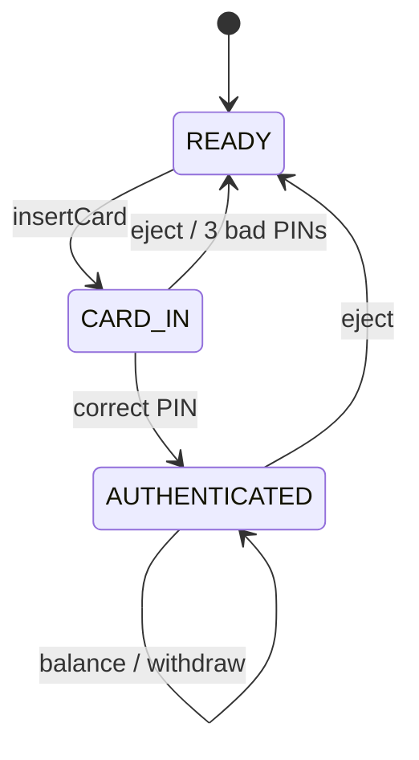
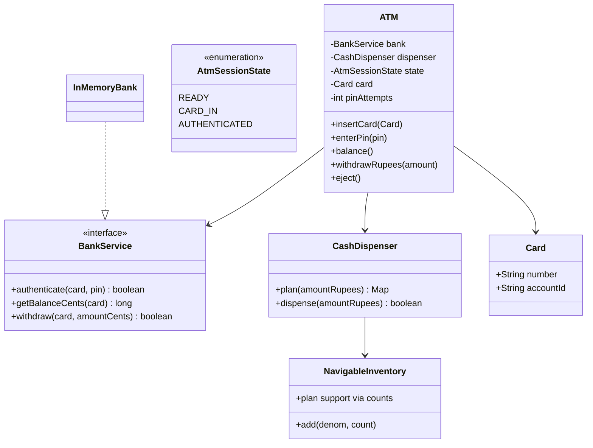
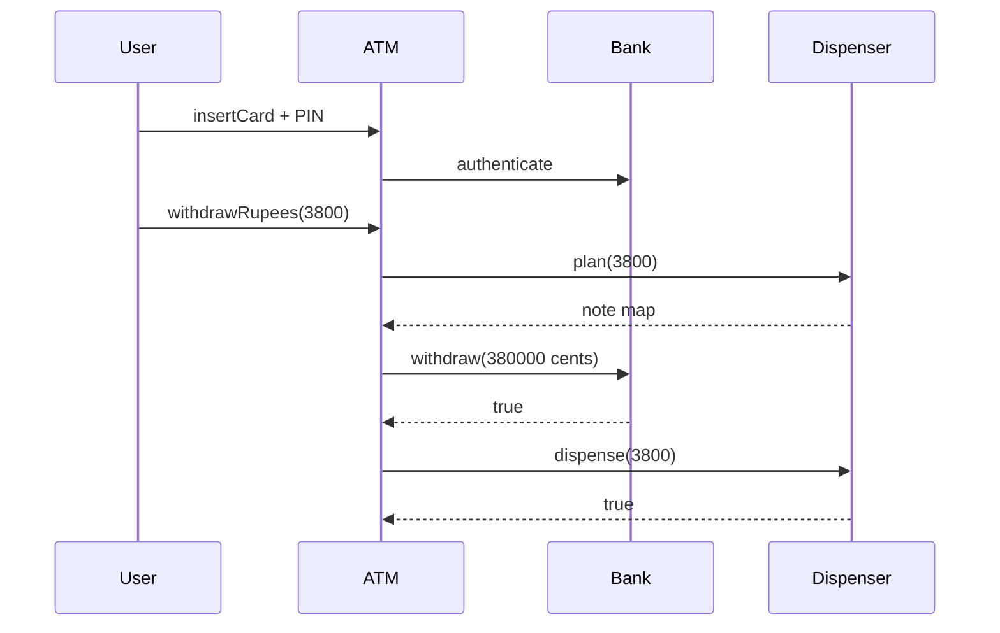

# ATM — Low-Level Design

A complete Low-Level Design for an ATM session: card → PIN → transactions → **plan-then-commit** cash dispense. The hard part is not printing “withdraw OK”; it is keeping **bank ledger** and **cassette notes** consistent when either side can fail.

> **Core insight:** build a denomination plan first. Only if the plan is exact and the bank debit succeeds do you commit note counts. Never debit then discover you cannot assemble notes without a reversal story.

---

## 📌 Problem Statement

Design an ATM that:

1. Accepts a card and authenticates PIN via `BankService`
2. Supports balance inquiry and cash withdraw
3. Dispenses notes from cassettes (2000 / 500 / 200 / 100)
4. Limits bad PIN attempts then ejects
5. Ejects card to end session

---

## ✅ Requirements

### Functional

1. Session states: `READY → CARD_IN → AUTHENTICATED` (back to READY on eject).
2. `BankService`: authenticate, getBalance, withdraw (cents).
3. `CashDispenser.plan(amount)` → note map or null; `dispense` commits.
4. Greedy denomination descending with availability caps.
5. Reject amounts the cassette cannot assemble (e.g. 30 when min note is 100).

### Non-Functional

* Money in cents at bank boundary; rupee notes at dispenser boundary — convert carefully (`* 100`).
* Plan-then-commit documented.
* PIN attempts counter per session.

### Out of Scope

* EMV crypto, hardware sensors, receipt printers, deposit modules, network retries (mention reversal).

---

## 🧠 Core Design Idea

### Session state



### Plan-then-commit withdraw

```text
1. plan = dispenser.plan(rupees)
2. if plan == null → reject (no bank call)
3. if !bank.withdraw(card, rupees*100) → reject (no dispense)
4. if !dispenser.dispense(rupees) → CRITICAL: bank already debited → needs reversal
```

Step 4 should be nearly impossible if dispense uses the same plan and inventory hasn't changed; in concurrent ATMs lock the cassette between plan and commit.

### Greedy dispense example — 3800

```text
2000 × 1 → rem 1800
500  × 3 → rem 300
200  × 1 → rem 100
100  × 1 → rem 0
OK
```

If remainder ≠ 0 after all denoms → fail entire withdraw.

---

## 🏗️ Class Diagram



---

## 📦 Responsibilities

| Class | Responsibility |
|-------|----------------|
| `BankService` | Auth + ledger (mocked) |
| `CashDispenser` | Note math + inventory commit |
| `ATM` | Session state + orchestration |
| `Card` | Identity token |

---

## 🔄 Sequence — withdraw



---

## ⚠️ Edge Cases

| Case | Handling |
|------|----------|
| Wrong PIN ×3 | Eject, reset |
| Insufficient bank funds | No dispense |
| Unmakeable amount | No bank call |
| Withdraw before auth | Reject |
| Concurrent cassette | Lock plan+commit |

---

## 🧩 Patterns & Principles

| Pattern | Where |
|---------|-------|
| **State** | Session enum / explicit states |
| **Strategy** (alt) | Dispense algorithms |
| **Chain of Responsibility** (alt) | Per-denom handlers |
| **DIP** | `BankService` interface |

Greedy inventory is enough for LLD; CoR is a nice story for denomination handlers.

---

## 🔌 Extensibility

| Feature | Approach |
|---------|----------|
| Deposit | New transaction + cassette intake |
| Mini-statement | BankService API |
| Multi-currency | Inventory keyed by currency |
| Cardless withdraw | OTP token as Card substitute |

---

## 🧵 Complexity & Concurrency

* Plan: O(D) denominations.
* Critical section: inventory between plan and commit.
* Network: idempotency keys on bank withdraw.

---

## 💡 Interview Talking Points

1. Plan-then-commit and reversal.  
2. Cents vs note units.  
3. PIN attempt lockout.  
4. Greedy vs DP for limited notes (mention).  
5. Bank as interface for testability.  
6. Compare session state to Vending states.  

---

## 📁 Files

| File | Purpose |
|------|---------|
| `details.md` | This LLD |
| `Main.java` | PIN fail/success, withdraw, impossible amount |
