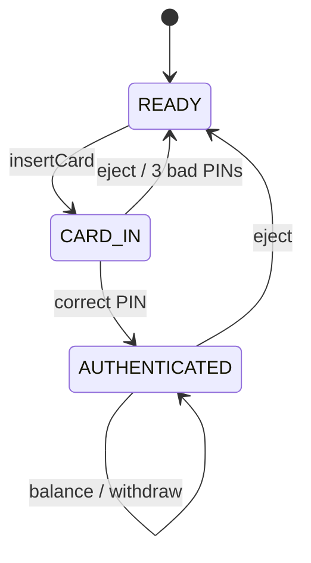
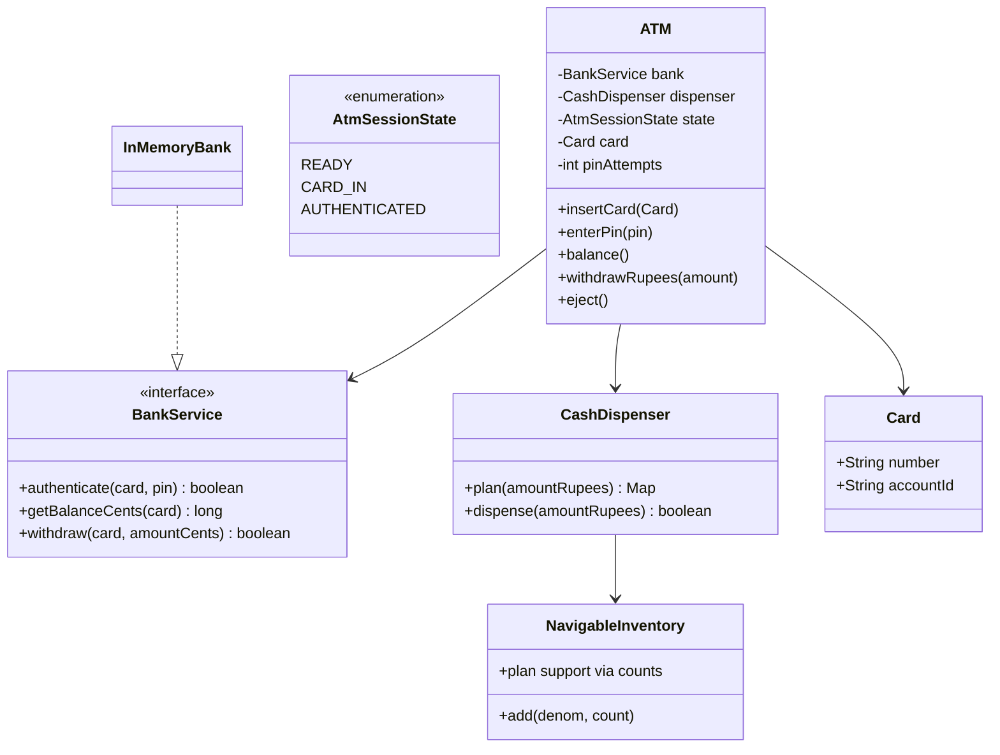
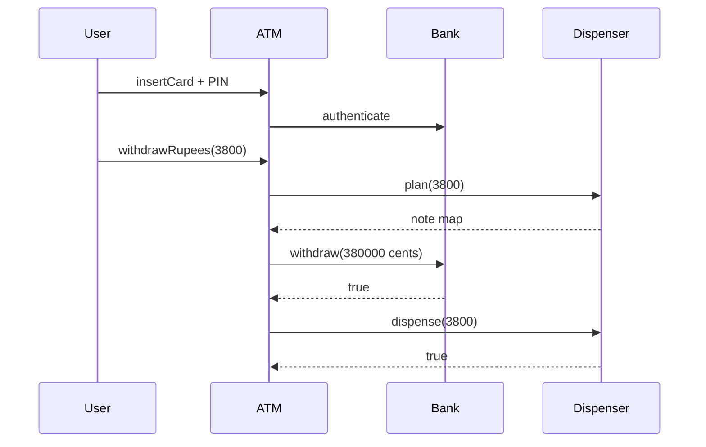

# ATM — Low-Level Design

A complete Low-Level Design for an ATM session: card → PIN → transactions → **plan-then-commit** cash dispense. The hard part is not printing “withdraw OK”; it is keeping **bank ledger** and **cassette notes** consistent when either side can fail.

> **Core insight:** build a denomination plan first. Only if the plan is exact and the bank debit succeeds do you commit note counts. Never debit then discover you cannot assemble notes without a reversal story.

---

## üìå Problem Statement

Design an ATM that:

1. Accepts a card and authenticates PIN via `BankService`
2. Supports balance inquiry and cash withdraw
3. Dispenses notes from cassettes (2000 / 500 / 200 / 100)
4. Limits bad PIN attempts then ejects
5. Ejects card to end session

---

## ‚úÖ Requirements

### Functional

1. Session states: `READY ‚Üí CARD_IN ‚Üí AUTHENTICATED` (back to READY on eject).
2. `BankService`: authenticate, getBalance, withdraw (cents).
3. `CashDispenser.plan(amount)` ‚Üí note map or null; `dispense` commits.
4. Greedy denomination descending with availability caps.
5. Reject amounts the cassette cannot assemble (e.g. 30 when min note is 100).

### Non-Functional

* Money in cents at bank boundary; rupee notes at dispenser boundary — convert carefully (`* 100`).
* Plan-then-commit documented.
* PIN attempts counter per session.

### Out of Scope

* EMV crypto, hardware sensors, receipt printers, deposit modules, network retries (mention reversal).

---

## 🧠 Core Design Idea

### Session state



### Plan-then-commit withdraw

```text
1. plan = dispenser.plan(rupees)
2. if plan == null ‚Üí reject (no bank call)
3. if !bank.withdraw(card, rupees*100) ‚Üí reject (no dispense)
4. if !dispenser.dispense(rupees) ‚Üí CRITICAL: bank already debited ‚Üí needs reversal
```

Step 4 should be nearly impossible if dispense uses the same plan and inventory hasn't changed; in concurrent ATMs lock the cassette between plan and commit.

### Greedy dispense example — 3800

```text
2000 √ó 1 ‚Üí rem 1800
500  √ó 3 ‚Üí rem 300
200  √ó 1 ‚Üí rem 100
100  √ó 1 ‚Üí rem 0
OK
```

If remainder ≠ 0 after all denoms → fail entire withdraw.

---

## 🏗️ Class Diagram



---

## 📦 Responsibilities

| Class | Responsibility |
|-------|----------------|
| `BankService` | Auth + ledger (mocked) |
| `CashDispenser` | Note math + inventory commit |
| `ATM` | Session state + orchestration |
| `Card` | Identity token |

---

## 🔄 Sequence — withdraw



---

## ⚠️ Edge Cases

| Case | Handling |
|------|----------|
| Wrong PIN √ó3 | Eject, reset |
| Insufficient bank funds | No dispense |
| Unmakeable amount | No bank call |
| Withdraw before auth | Reject |
| Concurrent cassette | Lock plan+commit |

---

## üß© Patterns & Principles

| Pattern | Where |
|---------|-------|
| **State** | Session enum / explicit states |
| **Strategy** (alt) | Dispense algorithms |
| **Chain of Responsibility** (alt) | Per-denom handlers |
| **DIP** | `BankService` interface |

Greedy inventory is enough for LLD; CoR is a nice story for denomination handlers.

---

## üîå Extensibility

| Feature | Approach |
|---------|----------|
| Deposit | New transaction + cassette intake |
| Mini-statement | BankService API |
| Multi-currency | Inventory keyed by currency |
| Cardless withdraw | OTP token as Card substitute |

---

## üßµ Complexity & Concurrency

* Plan: O(D) denominations.
* Critical section: inventory between plan and commit.
* Network: idempotency keys on bank withdraw.

---

## üí° Interview Talking Points

1. Plan-then-commit and reversal.  
2. Cents vs note units.  
3. PIN attempt lockout.  
4. Greedy vs DP for limited notes (mention).  
5. Bank as interface for testability.  
6. Compare session state to Vending states.  

---

## 📁 Files

| File | Purpose |
|------|---------|
| `details.md` | This LLD |
| `Main.java` | PIN fail/success, withdraw, impossible amount |

---

## ?? Deep dive ó invariants checklist

Before you leave the whiteboard, confirm you can answer yes to each:

1. Where does the **single source of truth** for the core rule live? (overlap, state transition, win check, vote keyÖ)
2. What happens on the **failure path** immediately after a partial side effect? (debit without dispense, stock without order, lock without pay)
3. Which dependencies are **interfaces** so tests can fake them?
4. What is explicitly **out of scope**, spoken aloud?
5. What is the **first extension** you would add and which class changes?

---

## ??? Sample interviewer Q&A

**Q: Why not one god class?**  
A: Because the change axes differ ó pricing/matching/state/inventory rarely change together. Splitting along those axes keeps diffs small and interviews clearer.

**Q: Where would you put persistence?**  
A: Outside the domain facade. Repository interfaces for aggregates (Trip, Reservation, Order). Domain methods stay pure of SQL.

**Q: How do you test this?**  
A: Deterministic inputs (fixed dice, manual clock, in-memory bank). Table-driven cases for the core rule (overlap truth table, state transitions, vote math).

**Q: What breaks at scale?**  
A: The naive loops (scan all drivers, all reservations, all tweets). Index by geo-hash, by day, by followee timeline. That is the HLD bridge ó say it, don't implement it in LLD unless asked.

**Q: Concurrency?**  
A: Name the shared mutable resource (spot, seat, driver.available, stock, cassette). Propose lock grain or DB constraint / CAS. Idempotency keys for payments and bank withdraws.

---

## ?? Revision card (memorize)

| Prompt yourself | Answer shape |
|-----------------|--------------|
| Entities? | 5ñ8 nouns |
| Core rule? | One formula / state diagram |
| Patterns? | 1ñ3 max, justified |
| Failure? | One sequenced unhappy path |
| Extend? | One OCP example |

---

## 📚 Extended teaching notes — ATM

This section exists so the write-up matches the depth of Parking Lot / Hotel / Splitwise in this bible: more failure modes, more whiteboard scripts, and more “what I would say next.”

### Whiteboard script (8–10 minutes)

1. **Clarify scope (1 min).** Restate functional bullets and say three out-of-scope items aloud.
2. **Entities (1 min).** List 6–8 nouns; mark which are value objects vs entities.
3. **Core rule (2 min).** Write the single formula or state diagram that makes the design correct.
4. **Class diagram (2 min).** Boxes + relationships only for classes you will defend.
5. **API walk (2 min).** One happy sequence; one failure sequence.
6. **Close (1–2 min).** Concurrency, complexity, one extension.

### Failure-mode catalog

| # | Failure | Detection | Mitigation |
|---|---------|-----------|------------|
| 1 | Partial side effect | Two-phase / plan-then-commit | Compensating action |
| 2 | Double submit | Idempotency key | Deduplicate |
| 3 | Lost update | Version / CAS | Retry |
| 4 | Stale read | TTL / re-read | Accept or refresh |
| 5 | Resource exhaustion | Explicit null/empty | Backpressure / reject |
| 6 | Illegal transition | State guard | Throw / message |
| 7 | Validation gap | Boundary checks | Reject early |
| 8 | Clock skew | Inject clock | Monotonic / server time |

### Testing matrix

| Layer | What to test | Example |
|-------|--------------|---------|
| Unit | Core rule | Overlap truth table / state table / vote math |
| Unit | Strategy swap | Alternate matching or pricing |
| Integration | Facade flow | Happy path through service |
| Adversarial | Illegal calls | Double complete, bad PIN, sold out |
| Property | Invariants | Spot free XOR occupied; balances sum to zero |

### Complexity cheat sheet

| Operation family | Typical LLD cost | Scale upgrade |
|------------------|------------------|---------------|
| Linear scan resources | O(n) | Index / partition |
| Interval conflict | O(m) per resource | Interval tree |
| Graph gather | O(F·T) | Push inbox / cache |
| Tick simulation | O(e) elevators | Event queue |

### Concurrency talking track (memorize)

Shared mutable resource ‚Üí name it ‚Üí pick grain of lock (object vs row vs partition) ‚Üí prefer CAS/check-and-set when races are expected ‚Üí mention DB unique constraints for multi-node ‚Üí idempotency for network retries.

### Extension prompts interviewers love

* “Add X without rewriting the orchestrator” → OCP / Strategy / new state.
* “Two users click at once” → concurrency paragraph.
* “How do you test?” → deterministic seams (dice, clock, bank).
* “What did you leave out?” → out-of-scope list, not apology.

### Mapping back to `Main.java`

When you revise, open `Main.java` beside this doc and tick:

- [ ] Every public API in the diagram appears in code
- [ ] Every demo print maps to a requirement bullet
- [ ] At least one failure path is executed
- [ ] Magic numbers are named constants when they encode policy

### Glossary for this module

| Term | Meaning in ATM |
|------|------------------|
| Facade | Entry service that preserves invariants |
| Strategy | Swappable policy object |
| Invariant | Fact that must always hold after a successful call |
| Soft cancel | Status flip instead of row delete |
| Plan-then-commit | Validate/plan fully before mutating durable state |

### Mini mock questions (answer in one breath each)

1. What is the single most important invariant?
2. Where does that invariant live in code?
3. What is the first class you would add for the next feature?
4. What breaks first at 100√ó traffic?
5. How do you make the demo deterministic?

If you can answer those five without scrolling, you own this design.

### Related modules in this bible

Cross-read for transfer learning: Hotel Booking (intervals), Cab Booking (matching), Vending/ATM (state), LRU/Rate Limiter (infra math), Splitwise (policy tables). Steal structures, not prose.

### Final revision ritual

Cover the class diagram ‚Üí redraw from memory ‚Üí compare ‚Üí run `javac Main.java && java Main` ‚Üí explain one failure log line as if to an interviewer.


---

## üßæ Annotated walkthrough checklist

Use this as a verbal checklist while tracing ``Main.java``:

1. Construction / wiring — which strategies or dependencies are injected?
2. First mutating call — what invariant is established?
3. Second call — happy path progress.
4. Forced failure — confirm rejection leaves prior state intact.
5. Terminal state — resources freed (spots, drivers, agents, locks, balances)?
6. Idempotent repeat — second complete/cancel/unpark behavior?

### Design smells to avoid naming in interviews

| Smell | Fix |
|-------|-----|
| God service does pricing + matching + persistence | Split ports |
| Anemic domain + all ifs in one method | State / Strategy |
| Magic numbers in flow | Policy constants class |
| boolean flags for lifecycle | Explicit enum + guards |
| Catching and ignoring errors | Surface domain errors |

### One-page summary you could rewrite from memory

**Problem:** (one sentence)  
**Core rule:** (one formula / diagram)  
**Key classes:** (5 names)  
**Patterns:** (≤3)  
**Hardest edge case:** (one)  
**Scale bridge:** (one sentence)

Practice rewriting that six-liner cold before interviews.

