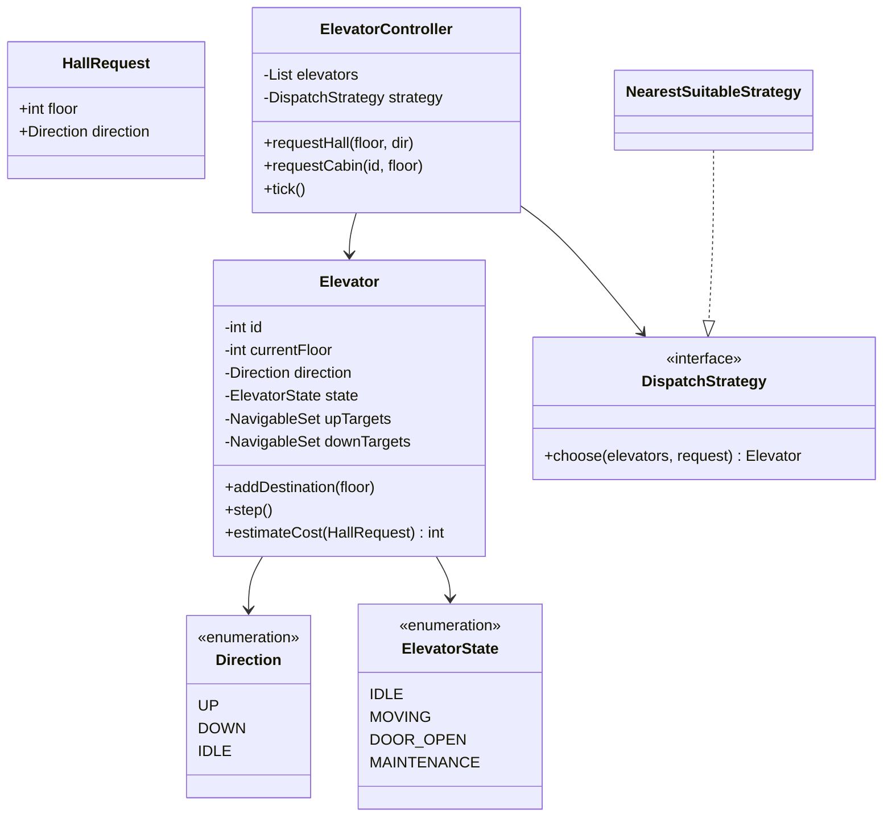
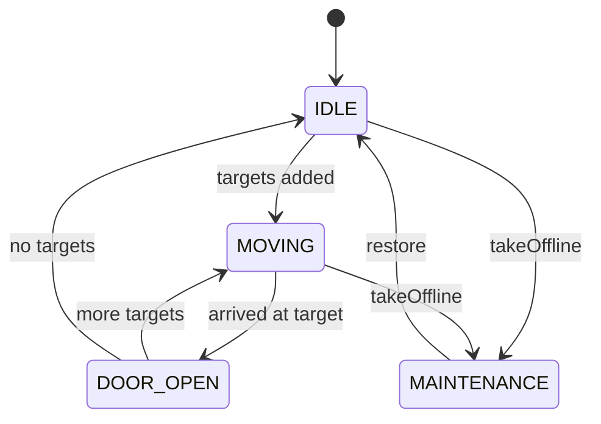
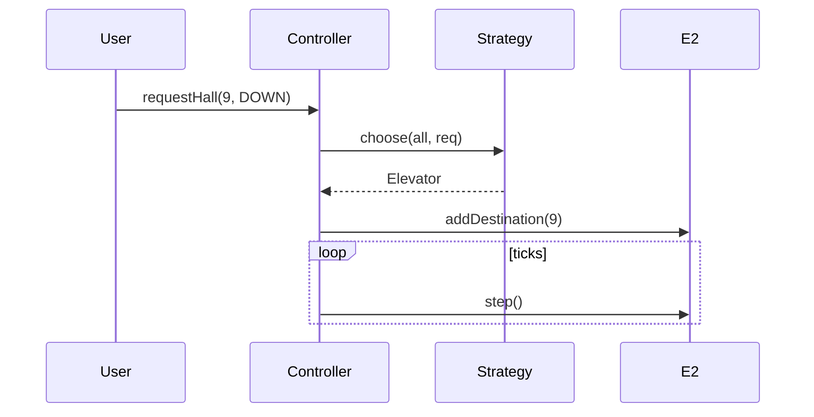

# Elevator System — Low-Level Design

A complete Low-Level Design for a **multi-elevator** controller: hall calls, cabin requests, directional **SCAN-like** target queues, and a pluggable **dispatch strategy**. The interview is about scheduling under constraints — not drawing a box labeled “ElevatorService”.

> **Core insight:** each elevator keeps two sorted sets — targets above and targets below — and continues in its current direction until that side is empty. The building controller only decides *which* elevator should take a hall call.

---

## üìå Problem Statement

Design a system with multiple elevators serving floors `min..max` where:

1. Passengers press UP/DOWN in the hallway (hall call)
2. Passengers select destinations inside a cabin (cabin request)
3. Elevators move floor-by-floor in a discrete tick simulation
4. Doors open when a target floor is reached
5. Dispatch prefers idle nearest or elevators already heading toward the caller

---

## ‚úÖ Requirements

### Functional

1. `Elevator`: id, currentFloor, direction, state, `upTargets`, `downTargets`.
2. `addDestination(floor)` classifies into up/down sets relative to current floor.
3. `step()` advances one tick: move one floor or leave `DOOR_OPEN`.
4. `ElevatorController.requestHall(floor, UP|DOWN)` uses `DispatchStrategy`.
5. `requestCabin(elevatorId, floor)` assigns directly.
6. Maintenance mode skips dispatch.

### Non-Functional

* Scheduling explainable on a whiteboard (SCAN story).
* Single-threaded tick loop OK; concurrency notes required in discussion.
* Invalid floors rejected.

### Out of Scope

* Weight sensors, fire service mode, destination-dispatch zoning, door obstruction hardware, UI panels.

---

## 🧠 Core Design Idea — SCAN queues

Instead of a FIFO list of stops (which thrashs direction), each elevator stores:

```text
upTargets   : TreeSet ascending   // floors >= current when going up
downTargets : TreeSet descending  // floors <= current when going down
```

**While UP:** serve the smallest upTarget ≥ … actually move floor++, open if current in upTargets, remove it. When upTargets empty, flip to DOWN if downTargets remain.

**While DOWN:** symmetric.

This is the classic elevator algorithm related to disk SCAN.

### Dispatch cost heuristic

```text
if MAINTENANCE: ‚àû
if IDLE: |current - hallFloor|
if moving toward hall in same direction: distance along path
else: distance + penalty (must finish current sweep)
```

Pick minimum cost elevator.

---

## 🏗️ Class Diagram



---

## 📦 Responsibilities

| Class | Responsibility |
|-------|----------------|
| `Elevator` | Local queues + motion + cost estimate |
| `DispatchStrategy` | Global hall assignment policy |
| `ElevatorController` | Building facade + tick |

Never put SCAN logic in the controller — it doesn't know cabin physics as well as the car does.

---

## 🔁 Elevator state diagram



---

## 🔄 Sequence — hall call



---

## 🧮 Worked dispatch example

```text
E1 at 0 IDLE; E2 at 5 MOVING UP with targets {8}
Hall UP@3:
  E1 cost = |0-3| = 3
  E2 cost = penalty (moving away/up past) large
‚Üí choose E1
```

---

## ⚠️ Edge Cases

| Case | Handling |
|------|----------|
| Request current floor | Open door |
| Duplicate cabin press | Set ignores dup |
| All maintenance | No assignment |
| Hall DOWN at floor 0 | Invalid or ignore |
| Burst of hall calls | Each dispatched independently |

---

## üß© Patterns & Principles

| Pattern | Where |
|---------|-------|
| **Strategy** | Dispatch |
| **State** | ElevatorState |
| **Facade** | Controller |
| Sorted Set | SCAN targets |

---

## üîå Extensibility

| Feature | Approach |
|---------|----------|
| Peak parking | Idle elevators return to lobby |
| Destination control | Assign elevator at hall kiosk |
| Grouping banks | Controller per bank |
| Metrics | Wait-time histograms |

---

## üßµ Concurrency

* One lock per elevator for target sets OR actor-per-elevator.
* Controller tick should not interleave halfway through step without sync.
* Hall button debounce at hardware layer.

---

## üí° Interview Talking Points

1. FIFO stops vs SCAN — draw both.  
2. Why two TreeSets.  
3. Dispatch vs onboard control separation.  
4. Cost heuristic honesty (not optimal, explainable).  
5. Discrete event simulation for tests.  
6. HLD bridge: service time SLAs, bank zoning.  

---

## 📁 Files

| File | Purpose |
|------|---------|
| `details.md` | This LLD |
| `Main.java` | Tick simulation with two elevators |

---

## ?? Deep dive ó invariants checklist

Before you leave the whiteboard, confirm you can answer yes to each:

1. Where does the **single source of truth** for the core rule live? (overlap, state transition, win check, vote keyÖ)
2. What happens on the **failure path** immediately after a partial side effect? (debit without dispense, stock without order, lock without pay)
3. Which dependencies are **interfaces** so tests can fake them?
4. What is explicitly **out of scope**, spoken aloud?
5. What is the **first extension** you would add and which class changes?

---

## ??? Sample interviewer Q&A

**Q: Why not one god class?**  
A: Because the change axes differ ó pricing/matching/state/inventory rarely change together. Splitting along those axes keeps diffs small and interviews clearer.

**Q: Where would you put persistence?**  
A: Outside the domain facade. Repository interfaces for aggregates (Trip, Reservation, Order). Domain methods stay pure of SQL.

**Q: How do you test this?**  
A: Deterministic inputs (fixed dice, manual clock, in-memory bank). Table-driven cases for the core rule (overlap truth table, state transitions, vote math).

**Q: What breaks at scale?**  
A: The naive loops (scan all drivers, all reservations, all tweets). Index by geo-hash, by day, by followee timeline. That is the HLD bridge ó say it, don't implement it in LLD unless asked.

**Q: Concurrency?**  
A: Name the shared mutable resource (spot, seat, driver.available, stock, cassette). Propose lock grain or DB constraint / CAS. Idempotency keys for payments and bank withdraws.

---

## ?? Revision card (memorize)

| Prompt yourself | Answer shape |
|-----------------|--------------|
| Entities? | 5ñ8 nouns |
| Core rule? | One formula / state diagram |
| Patterns? | 1ñ3 max, justified |
| Failure? | One sequenced unhappy path |
| Extend? | One OCP example |

---

## 📚 Extended teaching notes — Elevator

This section exists so the write-up matches the depth of Parking Lot / Hotel / Splitwise in this bible: more failure modes, more whiteboard scripts, and more “what I would say next.”

### Whiteboard script (8–10 minutes)

1. **Clarify scope (1 min).** Restate functional bullets and say three out-of-scope items aloud.
2. **Entities (1 min).** List 6–8 nouns; mark which are value objects vs entities.
3. **Core rule (2 min).** Write the single formula or state diagram that makes the design correct.
4. **Class diagram (2 min).** Boxes + relationships only for classes you will defend.
5. **API walk (2 min).** One happy sequence; one failure sequence.
6. **Close (1–2 min).** Concurrency, complexity, one extension.

### Failure-mode catalog

| # | Failure | Detection | Mitigation |
|---|---------|-----------|------------|
| 1 | Partial side effect | Two-phase / plan-then-commit | Compensating action |
| 2 | Double submit | Idempotency key | Deduplicate |
| 3 | Lost update | Version / CAS | Retry |
| 4 | Stale read | TTL / re-read | Accept or refresh |
| 5 | Resource exhaustion | Explicit null/empty | Backpressure / reject |
| 6 | Illegal transition | State guard | Throw / message |
| 7 | Validation gap | Boundary checks | Reject early |
| 8 | Clock skew | Inject clock | Monotonic / server time |

### Testing matrix

| Layer | What to test | Example |
|-------|--------------|---------|
| Unit | Core rule | Overlap truth table / state table / vote math |
| Unit | Strategy swap | Alternate matching or pricing |
| Integration | Facade flow | Happy path through service |
| Adversarial | Illegal calls | Double complete, bad PIN, sold out |
| Property | Invariants | Spot free XOR occupied; balances sum to zero |

### Complexity cheat sheet

| Operation family | Typical LLD cost | Scale upgrade |
|------------------|------------------|---------------|
| Linear scan resources | O(n) | Index / partition |
| Interval conflict | O(m) per resource | Interval tree |
| Graph gather | O(F·T) | Push inbox / cache |
| Tick simulation | O(e) elevators | Event queue |

### Concurrency talking track (memorize)

Shared mutable resource ‚Üí name it ‚Üí pick grain of lock (object vs row vs partition) ‚Üí prefer CAS/check-and-set when races are expected ‚Üí mention DB unique constraints for multi-node ‚Üí idempotency for network retries.

### Extension prompts interviewers love

* “Add X without rewriting the orchestrator” → OCP / Strategy / new state.
* “Two users click at once” → concurrency paragraph.
* “How do you test?” → deterministic seams (dice, clock, bank).
* “What did you leave out?” → out-of-scope list, not apology.

### Mapping back to `Main.java`

When you revise, open `Main.java` beside this doc and tick:

- [ ] Every public API in the diagram appears in code
- [ ] Every demo print maps to a requirement bullet
- [ ] At least one failure path is executed
- [ ] Magic numbers are named constants when they encode policy

### Glossary for this module

| Term | Meaning in Elevator |
|------|------------------|
| Facade | Entry service that preserves invariants |
| Strategy | Swappable policy object |
| Invariant | Fact that must always hold after a successful call |
| Soft cancel | Status flip instead of row delete |
| Plan-then-commit | Validate/plan fully before mutating durable state |

### Mini mock questions (answer in one breath each)

1. What is the single most important invariant?
2. Where does that invariant live in code?
3. What is the first class you would add for the next feature?
4. What breaks first at 100√ó traffic?
5. How do you make the demo deterministic?

If you can answer those five without scrolling, you own this design.

### Related modules in this bible

Cross-read for transfer learning: Hotel Booking (intervals), Cab Booking (matching), Vending/ATM (state), LRU/Rate Limiter (infra math), Splitwise (policy tables). Steal structures, not prose.

### Final revision ritual

Cover the class diagram ‚Üí redraw from memory ‚Üí compare ‚Üí run `javac Main.java && java Main` ‚Üí explain one failure log line as if to an interviewer.

