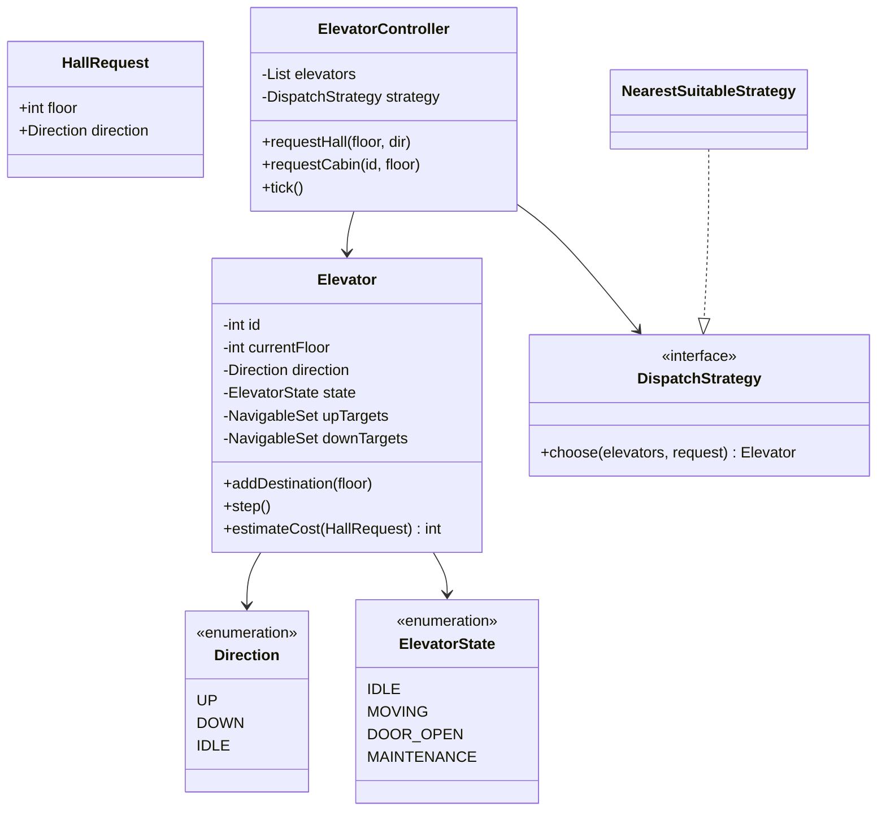
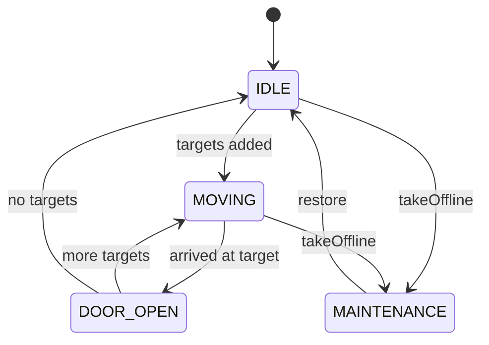
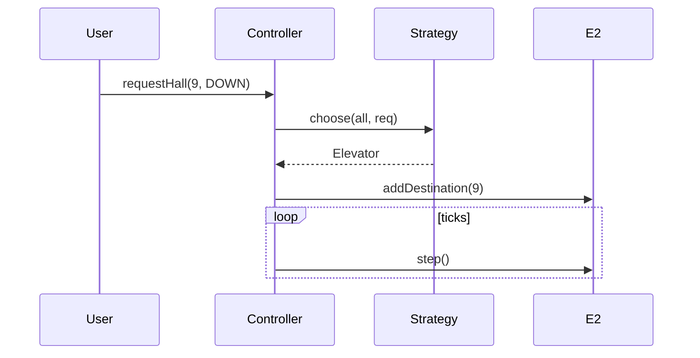

# Elevator System — Low-Level Design

A complete Low-Level Design for a **multi-elevator** controller: hall calls, cabin requests, directional **SCAN-like** target queues, and a pluggable **dispatch strategy**. The interview is about scheduling under constraints — not drawing a box labeled “ElevatorService”.

> **Core insight:** each elevator keeps two sorted sets — targets above and targets below — and continues in its current direction until that side is empty. The building controller only decides *which* elevator should take a hall call.

---

## 📌 Problem Statement

Design a system with multiple elevators serving floors `min..max` where:

1. Passengers press UP/DOWN in the hallway (hall call)
2. Passengers select destinations inside a cabin (cabin request)
3. Elevators move floor-by-floor in a discrete tick simulation
4. Doors open when a target floor is reached
5. Dispatch prefers idle nearest or elevators already heading toward the caller

---

## ✅ Requirements

### Functional

1. `Elevator`: id, currentFloor, direction, state, `upTargets`, `downTargets`.
2. `addDestination(floor)` classifies into up/down sets relative to current floor.
3. `step()` advances one tick: move one floor or leave `DOOR_OPEN`.
4. `ElevatorController.requestHall(floor, UP|DOWN)` uses `DispatchStrategy`.
5. `requestCabin(elevatorId, floor)` assigns directly.
6. Maintenance mode skips dispatch.

### Non-Functional

* Scheduling explainable on a whiteboard (SCAN story).
* Single-threaded tick loop OK; concurrency notes required in discussion.
* Invalid floors rejected.

### Out of Scope

* Weight sensors, fire service mode, destination-dispatch zoning, door obstruction hardware, UI panels.

---

## 🧠 Core Design Idea — SCAN queues

Instead of a FIFO list of stops (which thrashs direction), each elevator stores:

```text
upTargets   : TreeSet ascending   // floors >= current when going up
downTargets : TreeSet descending  // floors <= current when going down
```

**While UP:** serve the smallest upTarget ≥ … actually move floor++, open if current in upTargets, remove it. When upTargets empty, flip to DOWN if downTargets remain.

**While DOWN:** symmetric.

This is the classic elevator algorithm related to disk SCAN.

### Dispatch cost heuristic

```text
if MAINTENANCE: ∞
if IDLE: |current - hallFloor|
if moving toward hall in same direction: distance along path
else: distance + penalty (must finish current sweep)
```

Pick minimum cost elevator.

---

## 🏗️ Class Diagram



---

## 📦 Responsibilities

| Class | Responsibility |
|-------|----------------|
| `Elevator` | Local queues + motion + cost estimate |
| `DispatchStrategy` | Global hall assignment policy |
| `ElevatorController` | Building facade + tick |

Never put SCAN logic in the controller — it doesn't know cabin physics as well as the car does.

---

## 🔁 Elevator state diagram



---

## 🔄 Sequence — hall call



---

## 🧮 Worked dispatch example

```text
E1 at 0 IDLE; E2 at 5 MOVING UP with targets {8}
Hall UP@3:
  E1 cost = |0-3| = 3
  E2 cost = penalty (moving away/up past) large
→ choose E1
```

---

## ⚠️ Edge Cases

| Case | Handling |
|------|----------|
| Request current floor | Open door |
| Duplicate cabin press | Set ignores dup |
| All maintenance | No assignment |
| Hall DOWN at floor 0 | Invalid or ignore |
| Burst of hall calls | Each dispatched independently |

---

## 🧩 Patterns & Principles

| Pattern | Where |
|---------|-------|
| **Strategy** | Dispatch |
| **State** | ElevatorState |
| **Facade** | Controller |
| Sorted Set | SCAN targets |

---

## 🔌 Extensibility

| Feature | Approach |
|---------|----------|
| Peak parking | Idle elevators return to lobby |
| Destination control | Assign elevator at hall kiosk |
| Grouping banks | Controller per bank |
| Metrics | Wait-time histograms |

---

## 🧵 Concurrency

* One lock per elevator for target sets OR actor-per-elevator.
* Controller tick should not interleave halfway through step without sync.
* Hall button debounce at hardware layer.

---

## 💡 Interview Talking Points

1. FIFO stops vs SCAN — draw both.  
2. Why two TreeSets.  
3. Dispatch vs onboard control separation.  
4. Cost heuristic honesty (not optimal, explainable).  
5. Discrete event simulation for tests.  
6. HLD bridge: service time SLAs, bank zoning.  

---

## 📁 Files

| File | Purpose |
|------|---------|
| `details.md` | This LLD |
| `Main.java` | Tick simulation with two elevators |
