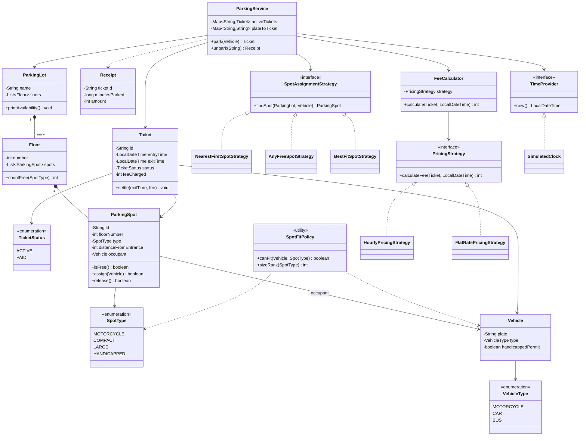
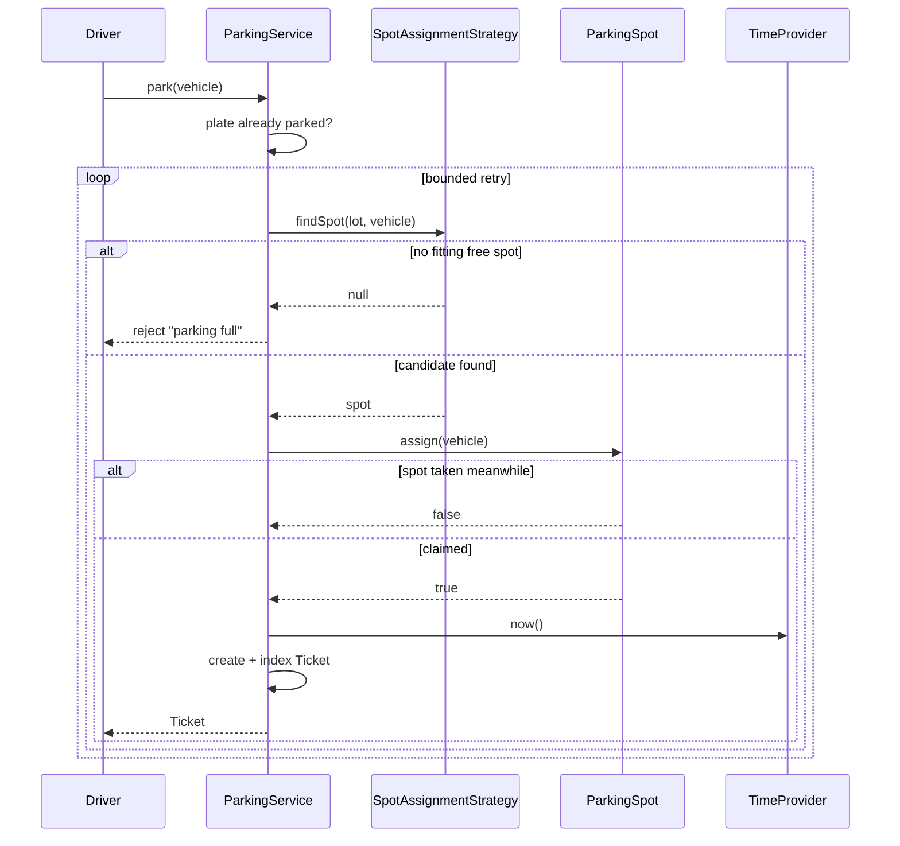
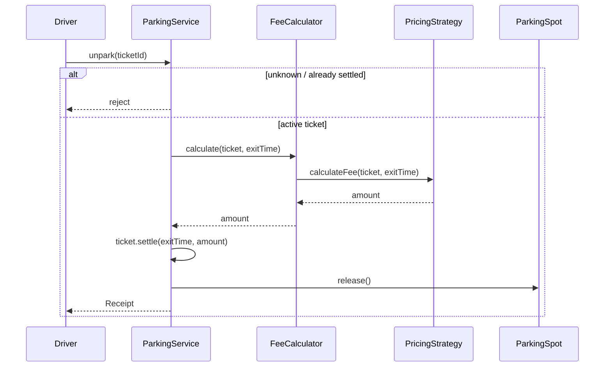

# Parking Lot — Low-Level Design

The most-asked LLD question. It looks like CRUD, but the interview is really about **resource allocation**: a finite pool of spots, a policy for picking one, an atomic claim, and a priced release.

---

## 📌 Problem Statement

Design a multi-floor parking lot that admits vehicles of different sizes, issues a ticket at entry, assigns a spot according to a pluggable policy, and charges a fee at exit based on how long the vehicle stayed.

---

## ✅ Requirements

### Functional

1. The lot has **multiple floors**; each floor has **spots** of type `MOTORCYCLE`, `COMPACT`, `LARGE`, `HANDICAPPED`.
2. Vehicles are `MOTORCYCLE`, `CAR`, `BUS`. Each vehicle type fits only certain spot types.
3. `HANDICAPPED` spots are **reserved** — only a vehicle carrying a permit may take one.
4. Entry issues a **`Ticket`** (id, vehicle, spot, entry time).
5. Spot selection uses a **pluggable strategy** (nearest-first / any-free / best-fit).
6. Exit computes a fee via a **pluggable pricing strategy** (per-started-hour, flat rate), marks the ticket paid, and **frees the spot**.
7. Reject: no spot available, a plate already parked, an unknown/settled ticket.
8. Report free-spot counts per floor per type.

### Non-Functional

* A spot can **never** hold two vehicles — the claim must be atomic.
* Adding a new spot type, vehicle type, or pricing rule must not touch the entry/exit flow.
* Deterministic time source so fees are testable (no `LocalDateTime.now()` inside domain logic).

### Out of Scope

Payments/gateways, licence-plate OCR, reservations, valet, physical gate hardware, multi-spot allocation for oversized vehicles.

---

## 🧠 Core Design Idea

Four separable concerns, so each can change alone:

| Concern | Owner |
|---------|-------|
| *What fits where* | `SpotFitPolicy` (one rule table) |
| *Which free spot to pick* | `SpotAssignmentStrategy` |
| *What it costs* | `PricingStrategy` behind `FeeCalculator` |
| *Orchestration + bookkeeping* | `ParkingService` |

`ParkingSpot` is the **only** object that mutates occupancy, and it does so through a guarded check-and-set. Everything else is search and policy.

---

## 🏗️ Class Diagram



---

## 📦 Class Responsibilities

### `SpotFitPolicy`

One static rule table instead of `if (vehicle instanceof Bus)` sprinkled everywhere:

```text
MOTORCYCLE -> MOTORCYCLE | COMPACT | LARGE
CAR        -> COMPACT | LARGE
BUS        -> LARGE
HANDICAPPED spot -> permit holders only, never a bus
```

Adding an `ELECTRIC` spot (charger required) is a one-line change here.

### `ParkingSpot`

`assign(vehicle)` is a **guarded check-and-set**:

```java
public synchronized boolean assign(Vehicle vehicle) {
    if (occupant != null) return false;                       // already taken
    if (!SpotFitPolicy.canFit(vehicle, type)) return false;   // wrong size
    occupant = vehicle;
    return true;
}
```

It returns `boolean` rather than throwing because *losing a race is normal*, not exceptional — the caller simply searches again.

### `SpotAssignmentStrategy`

| Strategy | Rule | When you'd use it |
|----------|------|-------------------|
| `NearestFirstSpotStrategy` | lowest floor, then smallest distance | customer convenience |
| `AnyFreeSpotStrategy` | first fit in scan order | fastest, no ordering guarantees |
| `BestFitSpotStrategy` | smallest spot that fits, then nearest | maximises utilisation (a bike shouldn't take a bus bay) |

### `PricingStrategy` + `FeeCalculator`

`HourlyPricingStrategy` charges **per started hour** with a grace window:

```text
minutes <= grace            -> 0
startedHours = ceil(minutes / 60)
fee = startedHours * ratePerHour[spotType]
```

`ceil` is done with integer math (`(minutes + 59) / 60`) — no floating point in money paths.

`FeeCalculator` is the context that holds the current strategy, so `ParkingService` never learns pricing rules.

### `ParkingService`

Owns `activeTickets` (id → ticket) and `plateToTicket` (plate → id, so one plate cannot hold two tickets). `park` is a bounded retry loop:

```text
repeat up to N times:
    spot = strategy.findSpot(lot, vehicle)
    if spot == null            -> throw "parking full"
    if spot.assign(vehicle)    -> issue ticket, return
    else                       -> lost the race, search again
throw "contention"
```

---

## 🔄 Sequence Flows

### Entry



### Exit



---

## 🧵 Thread Safety (discuss this — the code stays single-threaded)

Real lots have several entry gates hitting `park()` concurrently. Three layers to talk about:

1. **The race that actually matters** is *find-then-claim*: two gates can see the same free spot. Locking the search does not help unless the claim is inside the same critical section.
2. **Chosen approach — optimistic, per-spot.** `assign()` is a synchronized check-and-set on the spot itself, and `park()` retries on failure. Lock scope is one spot, so throughput scales with lot size. This is the same shape as `AtomicReference.compareAndSet(null, vehicle)`, which is the lock-free version.
3. **Rejected alternative — one global lock** on `ParkingService.park`. Correct, trivially explainable, but serialises every gate in the building.

Other concurrency notes worth raising:

* `activeTickets` / `plateToTicket` must become `ConcurrentHashMap`, and the *plate uniqueness* check needs `putIfAbsent` (check-then-put is itself a race).
* Free-spot **counters** for the entry display should be `AtomicInteger` (or an eventually-consistent projection) rather than an O(n) scan per request.
* Ticket ids from `AtomicLong` / a DB sequence, not `++`.
* Exit is naturally single-threaded per ticket; the invariant to protect is *release exactly once*, enforced by `ACTIVE → PAID` being a one-way transition.
* Multi-node deployment moves the whole argument to the database: `SELECT ... FOR UPDATE SKIP LOCKED`, or a unique constraint on `(spot_id, active)`.

---

## ⚠️ Edge Cases

| Case | Handling |
|------|----------|
| Lot full for a size class | `findSpot` returns `null` → reject with a clear message (a bus fails while compact spots stay open) |
| Same plate parked twice | `plateToTicket` index rejects the second entry |
| Spot claimed between search and assign | `assign()` returns `false`, service retries |
| Ticket reused after exit | removed from `activeTickets`; second `unpark` rejected |
| Stay shorter than the grace window | fee 0 |
| Exit in the same minute as entry | `minutes = 0` → grace (or 1 started hour if grace is 0) |
| Clock skew / negative duration | clamped to 0 |
| Handicapped spot, no permit | `SpotFitPolicy` refuses; `assign()` refuses again as a second line of defence |
| Lost ticket | needs a penalty pricing path — see extensions |

---

## 🧩 Patterns & Principles

| Pattern / Principle | Where |
|---------------------|-------|
| **Strategy** | spot assignment, pricing (both swappable at runtime in the demo) |
| **SRP** | fit rules, search policy, pricing, orchestration all live apart |
| **OCP** | new spot type = new enum + rule row; new tariff = new `PricingStrategy` |
| **Dependency Inversion** | service depends on `TimeProvider`, not on the system clock |
| **Guarded state transition** | `assign` / `release` / `ACTIVE → PAID` |
| **Factory (extension)** | a `SpotFactory` if spot subclasses gain behaviour |
| **Observer (extension)** | display boards subscribing to occupancy changes |

---

## 🔌 Extensions

| Ask | How the design absorbs it |
|-----|---------------------------|
| Monthly pass / free EV charging | new `PricingStrategy` |
| Electric spots with chargers | new `SpotType` + rule row + rate |
| Bus needs 3 contiguous LARGE spots | strategy returns a `List<ParkingSpot>`; `assign` becomes a two-phase claim with rollback |
| Reservations | `Spot` gains `RESERVED` state; the guard checks reservation ownership |
| Lost ticket | `LostTicketPricingStrategy` with a flat penalty + max-stay assumption |
| Multiple entrances | `distanceFromEntrance` becomes a map keyed by gate |
| Display boards | `Observer` on spot state changes, feeding per-floor counters |
| Persistence | repositories behind `ParkingService`; spot claim becomes a conditional UPDATE |

---

## 🧪 What the demo proves

Run `Main.java`; the output verifies, in order:

1. Three vehicle types park into type-appropriate spots (nearest-first ordering visible in the ids).
2. **Double-park is impossible** — `assign()` on an occupied spot returns `false` and the occupant is unchanged.
3. The same plate cannot hold two active tickets.
4. Handicapped spots require a permit.
5. A second bus is rejected once every `LARGE` spot is gone, *while compact spots are still free*.
6. 135 minutes → 3 started hours → INR 120, and the **spot is freed** (proved by immediately re-parking a different car into it).
7. A 10-minute stay costs 0 (grace window).
8. A settled ticket cannot be reused.
9. Swapping to `BEST_FIT` puts a bike in a motorcycle bay; swapping to `FLAT` ignores duration.

---

## 💡 Interview Talking Points

1. **Lead with the invariant**: "a spot holds at most one vehicle" — then show that `assign()` is the only place it can be violated, and that it is a guarded check-and-set.
2. Justify **two** strategy seams (placement and pricing) and refuse to add more — patterns must earn their keep.
3. Keep the fit table in one class; interviewers probe with "now add electric vehicles".
4. Money in **integers**, hours by integer ceiling, time injected — makes fees deterministic and testable.
5. Volunteer the concurrency story: per-spot CAS + retry beats a global lock, and in a distributed setting it becomes `SKIP LOCKED` or a unique constraint.
6. Mention the oversized-vehicle case (multi-spot allocation) as the honest limitation of the simple model.
