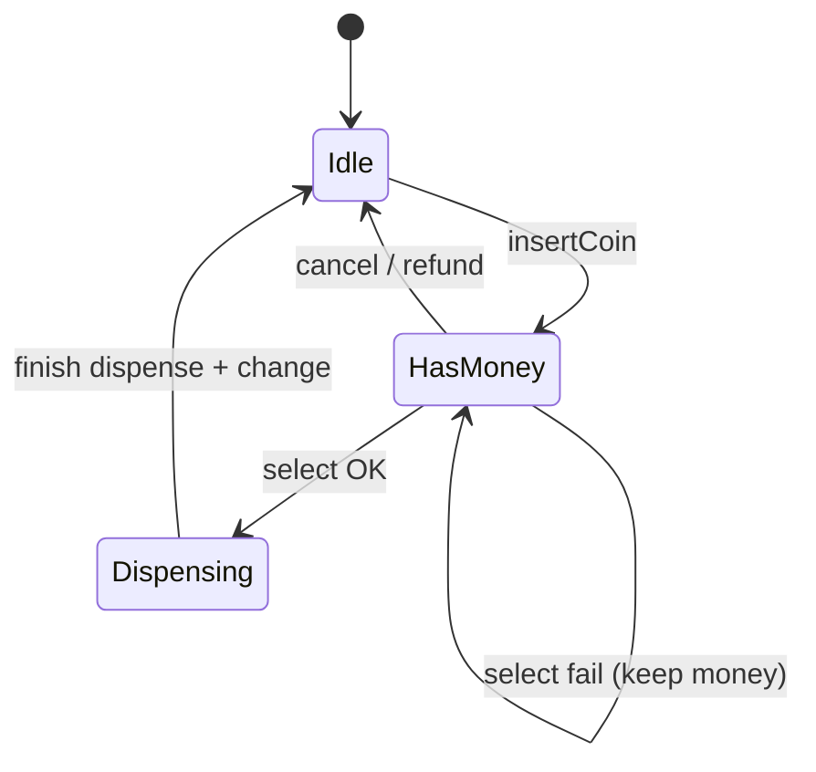
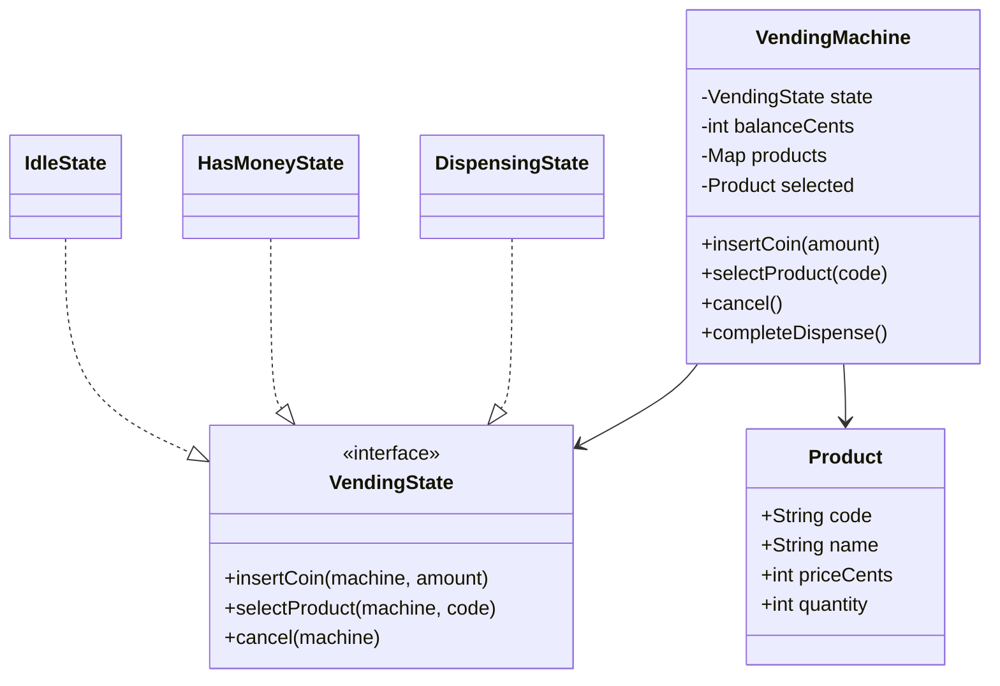
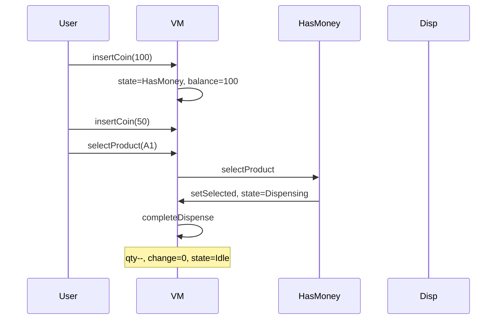

# Vending Machine — Low-Level Design

A complete Low-Level Design for a coin vending machine using the **State** pattern. The interview fails people who encode Idle/HasMoney/Dispensing as booleans; states make illegal transitions obvious and extendable.

> **Core insight:** user actions (`insertCoin`, `selectProduct`, `cancel`) are interpreted differently per state. Delegate to `currentState` instead of a growing `if (state==…)`.

---

## 📌 Problem Statement

Design a vending machine that holds an inventory of products, accepts money in **cents**, dispenses when the balance covers the price and stock remains, returns change, and refunds on cancel — with invalid actions rejected by state.

---

## ✅ Requirements

### Functional

1. Products: code, name, priceCents, quantity.
2. Insert coins/notes (positive cents only).
3. Select by code: insufficient funds / sold out / success.
4. On success: decrement stock, return change, reset balance, return to Idle.
5. Cancel in HasMoney refunds full balance.
6. Select in Idle rejected; insert during Dispensing rejected.

### Non-Functional

* Money as `int` cents — never `double`.
* State objects reusable (singletons on the machine).
* Inventory readable via menu print.

### Out of Scope

* Card payments, exact-change-only coin box limits, hardware motors, telemetry.

---

## 🧠 Core Design Idea — State pattern



### Why not booleans → 
```text
bad: if (hasMoney && selected && !dispensing && stock>0 && balance>=price) ...
```

Each new mode (Maintenance, OutOfService) multiplies conditions. States localize behavior.

### Change calculation

```text
change = balanceCents - product.priceCents
balance = 0
// sketch assumes infinite float for change
```

Interview extension: coin cassette may be unable to make change → cancel transaction.

---

## 🏗️ Class Diagram



---

## 📦 Responsibilities

| Class | Responsibility |
|-------|----------------|
| `IdleState` | Accept first coin → HasMoney; reject select |
| `HasMoneyState` | Accumulate coins; select may transition to Dispensing; cancel refunds |
| `DispensingState` | Reject inputs; machine immediately calls `completeDispense` |
| `VendingMachine` | Balance, inventory, state pointers, dispense finish |

`Dispensing` is instantaneous in the sketch (enter → complete → Idle). In hardware it would wait for motor callbacks.

---

## 🔄 Sequence — happy path



---

## ⚠️ Edge Cases

| Case | Handling |
|------|----------|
| insert ≤ 0 | Reject |
| Unknown code | Message, keep balance |
| Sold out | Message, keep balance |
| Insufficient funds | Show shortfall |
| Cancel in Idle | No-op message |
| Select in Idle | Reject |

---

## 🧩 Patterns & Principles

| Pattern | Where |
|---------|-------|
| **State** | Idle / HasMoney / Dispensing |
| **SRP** | Product vs machine vs states |
| **OCP** | Add `MaintenanceState` |

---

## 🔌 Extensibility

| Feature | Approach |
|---------|----------|
| Card payment | New state or parallel PaymentPort |
| Exact change only | CoinBox component |
| Multi-vend | Dispense loop |
| Admin restock | Maintenance state |

---

## 🧵 Complexity & Concurrency

* Operations O(1) map lookup by code.
* Real machines: synchronize on state transitions if dual control boards — mention briefly.

---

## 💡 Interview Talking Points

1. Draw the state diagram before classes.  
2. Cents not doubles.  
3. Failed select keeps money (UX).  
4. Dispensing as state even if instantaneous.  
5. Coin box / change-making extension.  
6. Compare to ATM state flow.  

---

## 📁 Files

| File | Purpose |
|------|---------|
| `details.md` | This LLD |
| `Main.java` | Happy path, insufficient funds, sold out, cancel |
