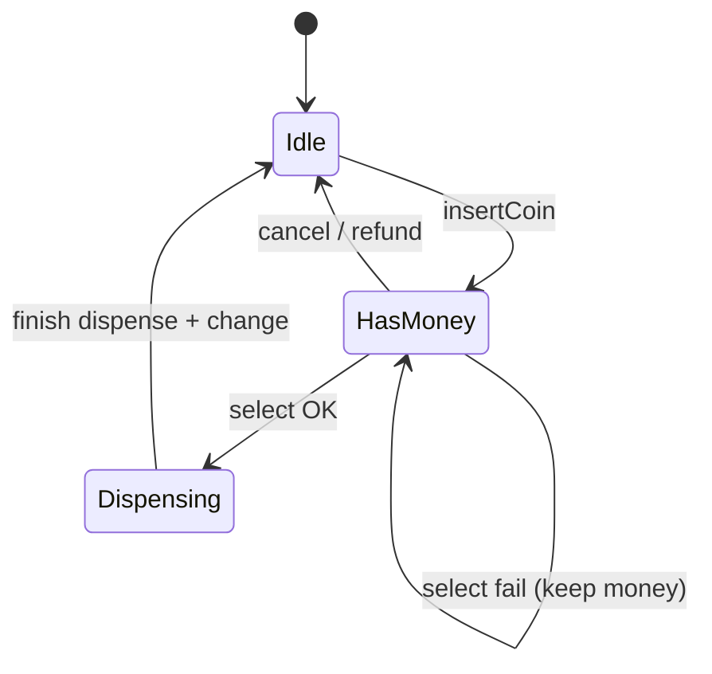
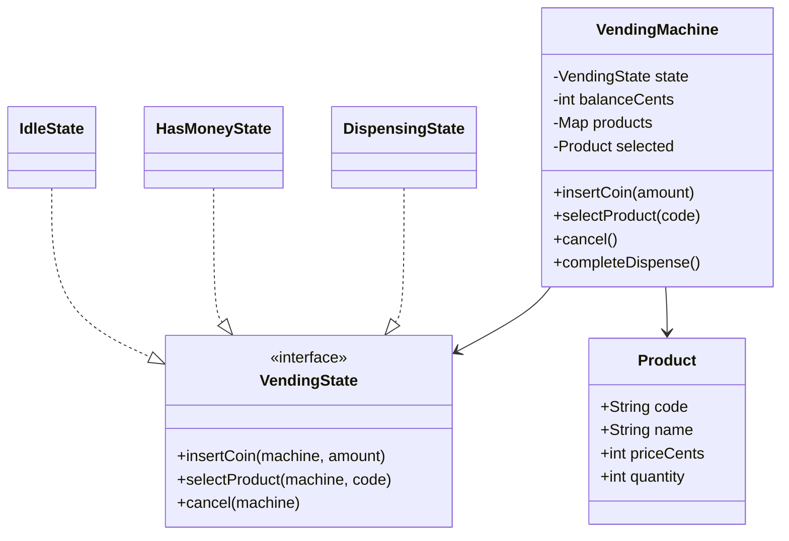
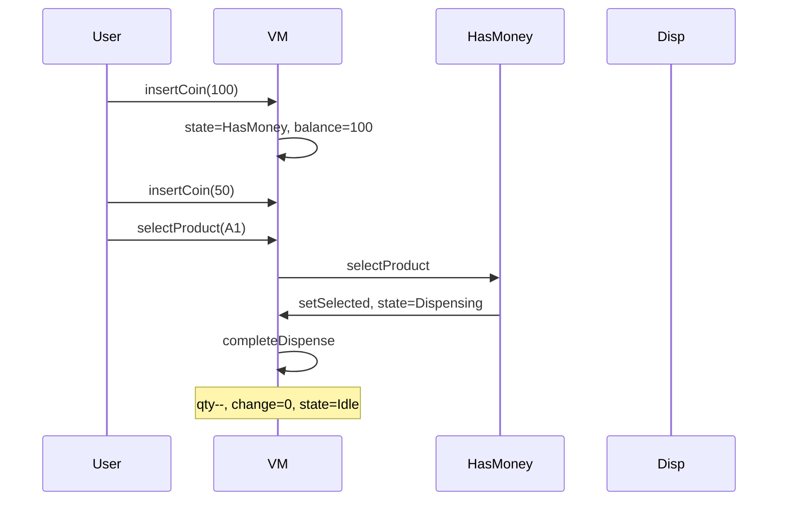

# Vending Machine — Low-Level Design

A complete Low-Level Design for a coin vending machine using the **State** pattern. The interview fails people who encode Idle/HasMoney/Dispensing as booleans; states make illegal transitions obvious and extendable.

> **Core insight:** user actions (`insertCoin`, `selectProduct`, `cancel`) are interpreted differently per state. Delegate to `currentState` instead of a growing `if (state==…)`.

---

## üìå Problem Statement

Design a vending machine that holds an inventory of products, accepts money in **cents**, dispenses when the balance covers the price and stock remains, returns change, and refunds on cancel — with invalid actions rejected by state.

---

## ‚úÖ Requirements

### Functional

1. Products: code, name, priceCents, quantity.
2. Insert coins/notes (positive cents only).
3. Select by code: insufficient funds / sold out / success.
4. On success: decrement stock, return change, reset balance, return to Idle.
5. Cancel in HasMoney refunds full balance.
6. Select in Idle rejected; insert during Dispensing rejected.

### Non-Functional

* Money as `int` cents — never `double`.
* State objects reusable (singletons on the machine).
* Inventory readable via menu print.

### Out of Scope

* Card payments, exact-change-only coin box limits, hardware motors, telemetry.

---

## 🧠 Core Design Idea — State pattern



### Why not booleans?

```text
bad: if (hasMoney && selected && !dispensing && stock>0 && balance>=price) ...
```

Each new mode (Maintenance, OutOfService) multiplies conditions. States localize behavior.

### Change calculation

```text
change = balanceCents - product.priceCents
balance = 0
// sketch assumes infinite float for change
```

Interview extension: coin cassette may be unable to make change ‚Üí cancel transaction.

---

## 🏗️ Class Diagram



---

## 📦 Responsibilities

| Class | Responsibility |
|-------|----------------|
| `IdleState` | Accept first coin ‚Üí HasMoney; reject select |
| `HasMoneyState` | Accumulate coins; select may transition to Dispensing; cancel refunds |
| `DispensingState` | Reject inputs; machine immediately calls `completeDispense` |
| `VendingMachine` | Balance, inventory, state pointers, dispense finish |

`Dispensing` is instantaneous in the sketch (enter ‚Üí complete ‚Üí Idle). In hardware it would wait for motor callbacks.

---

## 🔄 Sequence — happy path



---

## ⚠️ Edge Cases

| Case | Handling |
|------|----------|
| insert ≤ 0 | Reject |
| Unknown code | Message, keep balance |
| Sold out | Message, keep balance |
| Insufficient funds | Show shortfall |
| Cancel in Idle | No-op message |
| Select in Idle | Reject |

---

## üß© Patterns & Principles

| Pattern | Where |
|---------|-------|
| **State** | Idle / HasMoney / Dispensing |
| **SRP** | Product vs machine vs states |
| **OCP** | Add `MaintenanceState` |

---

## üîå Extensibility

| Feature | Approach |
|---------|----------|
| Card payment | New state or parallel PaymentPort |
| Exact change only | CoinBox component |
| Multi-vend | Dispense loop |
| Admin restock | Maintenance state |

---

## üßµ Complexity & Concurrency

* Operations O(1) map lookup by code.
* Real machines: synchronize on state transitions if dual control boards — mention briefly.

---

## üí° Interview Talking Points

1. Draw the state diagram before classes.  
2. Cents not doubles.  
3. Failed select keeps money (UX).  
4. Dispensing as state even if instantaneous.  
5. Coin box / change-making extension.  
6. Compare to ATM state flow.  

---

## 📁 Files

| File | Purpose |
|------|---------|
| `details.md` | This LLD |
| `Main.java` | Happy path, insufficient funds, sold out, cancel |

---

## ?? Deep dive ó invariants checklist

Before you leave the whiteboard, confirm you can answer yes to each:

1. Where does the **single source of truth** for the core rule live? (overlap, state transition, win check, vote keyÖ)
2. What happens on the **failure path** immediately after a partial side effect? (debit without dispense, stock without order, lock without pay)
3. Which dependencies are **interfaces** so tests can fake them?
4. What is explicitly **out of scope**, spoken aloud?
5. What is the **first extension** you would add and which class changes?

---

## ??? Sample interviewer Q&A

**Q: Why not one god class?**  
A: Because the change axes differ ó pricing/matching/state/inventory rarely change together. Splitting along those axes keeps diffs small and interviews clearer.

**Q: Where would you put persistence?**  
A: Outside the domain facade. Repository interfaces for aggregates (Trip, Reservation, Order). Domain methods stay pure of SQL.

**Q: How do you test this?**  
A: Deterministic inputs (fixed dice, manual clock, in-memory bank). Table-driven cases for the core rule (overlap truth table, state transitions, vote math).

**Q: What breaks at scale?**  
A: The naive loops (scan all drivers, all reservations, all tweets). Index by geo-hash, by day, by followee timeline. That is the HLD bridge ó say it, don't implement it in LLD unless asked.

**Q: Concurrency?**  
A: Name the shared mutable resource (spot, seat, driver.available, stock, cassette). Propose lock grain or DB constraint / CAS. Idempotency keys for payments and bank withdraws.

---

## ?? Revision card (memorize)

| Prompt yourself | Answer shape |
|-----------------|--------------|
| Entities? | 5ñ8 nouns |
| Core rule? | One formula / state diagram |
| Patterns? | 1ñ3 max, justified |
| Failure? | One sequenced unhappy path |
| Extend? | One OCP example |

---

## 📚 Extended teaching notes — Vending-Machine

This section exists so the write-up matches the depth of Parking Lot / Hotel / Splitwise in this bible: more failure modes, more whiteboard scripts, and more “what I would say next.”

### Whiteboard script (8–10 minutes)

1. **Clarify scope (1 min).** Restate functional bullets and say three out-of-scope items aloud.
2. **Entities (1 min).** List 6–8 nouns; mark which are value objects vs entities.
3. **Core rule (2 min).** Write the single formula or state diagram that makes the design correct.
4. **Class diagram (2 min).** Boxes + relationships only for classes you will defend.
5. **API walk (2 min).** One happy sequence; one failure sequence.
6. **Close (1–2 min).** Concurrency, complexity, one extension.

### Failure-mode catalog

| # | Failure | Detection | Mitigation |
|---|---------|-----------|------------|
| 1 | Partial side effect | Two-phase / plan-then-commit | Compensating action |
| 2 | Double submit | Idempotency key | Deduplicate |
| 3 | Lost update | Version / CAS | Retry |
| 4 | Stale read | TTL / re-read | Accept or refresh |
| 5 | Resource exhaustion | Explicit null/empty | Backpressure / reject |
| 6 | Illegal transition | State guard | Throw / message |
| 7 | Validation gap | Boundary checks | Reject early |
| 8 | Clock skew | Inject clock | Monotonic / server time |

### Testing matrix

| Layer | What to test | Example |
|-------|--------------|---------|
| Unit | Core rule | Overlap truth table / state table / vote math |
| Unit | Strategy swap | Alternate matching or pricing |
| Integration | Facade flow | Happy path through service |
| Adversarial | Illegal calls | Double complete, bad PIN, sold out |
| Property | Invariants | Spot free XOR occupied; balances sum to zero |

### Complexity cheat sheet

| Operation family | Typical LLD cost | Scale upgrade |
|------------------|------------------|---------------|
| Linear scan resources | O(n) | Index / partition |
| Interval conflict | O(m) per resource | Interval tree |
| Graph gather | O(F·T) | Push inbox / cache |
| Tick simulation | O(e) elevators | Event queue |

### Concurrency talking track (memorize)

Shared mutable resource ‚Üí name it ‚Üí pick grain of lock (object vs row vs partition) ‚Üí prefer CAS/check-and-set when races are expected ‚Üí mention DB unique constraints for multi-node ‚Üí idempotency for network retries.

### Extension prompts interviewers love

* “Add X without rewriting the orchestrator” → OCP / Strategy / new state.
* “Two users click at once” → concurrency paragraph.
* “How do you test?” → deterministic seams (dice, clock, bank).
* “What did you leave out?” → out-of-scope list, not apology.

### Mapping back to `Main.java`

When you revise, open `Main.java` beside this doc and tick:

- [ ] Every public API in the diagram appears in code
- [ ] Every demo print maps to a requirement bullet
- [ ] At least one failure path is executed
- [ ] Magic numbers are named constants when they encode policy

### Glossary for this module

| Term | Meaning in Vending-Machine |
|------|------------------|
| Facade | Entry service that preserves invariants |
| Strategy | Swappable policy object |
| Invariant | Fact that must always hold after a successful call |
| Soft cancel | Status flip instead of row delete |
| Plan-then-commit | Validate/plan fully before mutating durable state |

### Mini mock questions (answer in one breath each)

1. What is the single most important invariant?
2. Where does that invariant live in code?
3. What is the first class you would add for the next feature?
4. What breaks first at 100√ó traffic?
5. How do you make the demo deterministic?

If you can answer those five without scrolling, you own this design.

### Related modules in this bible

Cross-read for transfer learning: Hotel Booking (intervals), Cab Booking (matching), Vending/ATM (state), LRU/Rate Limiter (infra math), Splitwise (policy tables). Steal structures, not prose.

### Final revision ritual

Cover the class diagram ‚Üí redraw from memory ‚Üí compare ‚Üí run `javac Main.java && java Main` ‚Üí explain one failure log line as if to an interviewer.


---

## üßæ Annotated walkthrough checklist

Use this as a verbal checklist while tracing ``Main.java``:

1. Construction / wiring — which strategies or dependencies are injected?
2. First mutating call — what invariant is established?
3. Second call — happy path progress.
4. Forced failure — confirm rejection leaves prior state intact.
5. Terminal state — resources freed (spots, drivers, agents, locks, balances)?
6. Idempotent repeat — second complete/cancel/unpark behavior?

### Design smells to avoid naming in interviews

| Smell | Fix |
|-------|-----|
| God service does pricing + matching + persistence | Split ports |
| Anemic domain + all ifs in one method | State / Strategy |
| Magic numbers in flow | Policy constants class |
| boolean flags for lifecycle | Explicit enum + guards |
| Catching and ignoring errors | Surface domain errors |

### One-page summary you could rewrite from memory

**Problem:** (one sentence)  
**Core rule:** (one formula / diagram)  
**Key classes:** (5 names)  
**Patterns:** (≤3)  
**Hardest edge case:** (one)  
**Scale bridge:** (one sentence)

Practice rewriting that six-liner cold before interviews.

