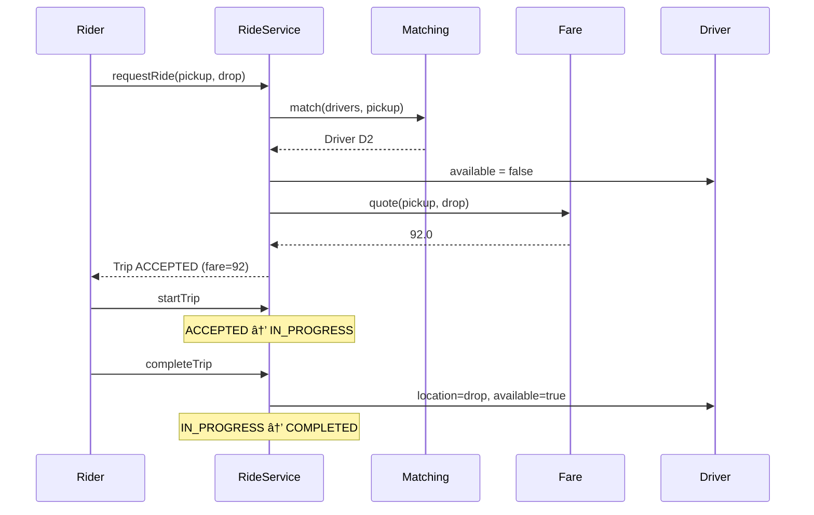
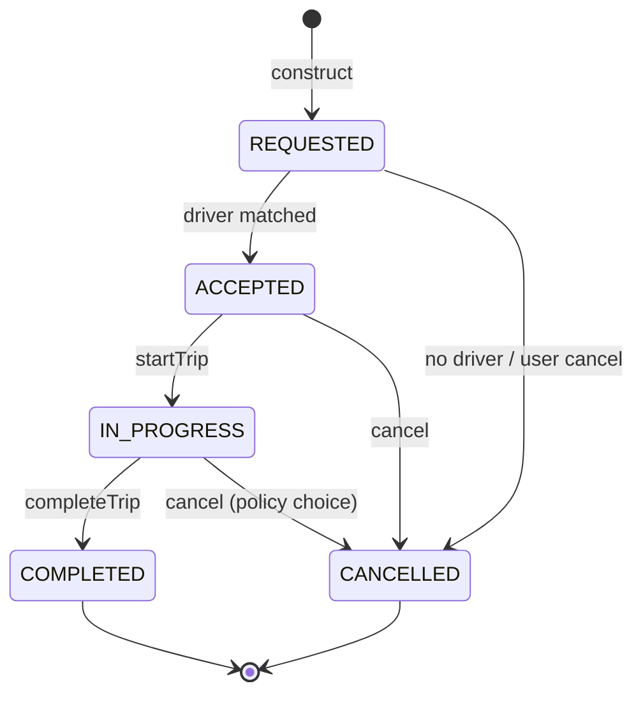

# Cab Booking (Uber-lite) — Low-Level Design

A complete Low-Level Design for a **ride-hailing** slice: request a trip, match a nearby driver, run a strict trip lifecycle, and quote a fare. The interview is really about **pluggable matching + fare** and a **state machine that rejects illegal transitions**.

> **Core insight:** `RideService` orchestrates; it never hard-codes *which* driver or *how* price is computed. Those are strategies. The trip object owns status — everyone else asks permission to move it forward.

---

## 📌 Problem Statement

Design a system where:

1. A rider requests a ride from pickup → drop location
2. The system picks an available driver (nearest by default)
3. The trip moves through `REQUESTED → ACCEPTED → IN_PROGRESS → COMPLETED` (or `CANCELLED`)
4. Fare is computed by a swappable policy (base + per-km here)
5. Drivers are marked busy while on a trip and freed on complete/cancel

---

## ✅ Requirements

### Functional

1. Model `Rider`, `Driver`, `Location`, `Trip`, `RideService`.
2. `requestRide(rider, pickup, drop)` → match driver or fail cleanly.
3. Matching via **`MatchingStrategy`** (nearest available).
4. Fare via **`FareStrategy`** (base + per-km × Euclidean distance).
5. Lifecycle APIs: `startTrip`, `completeTrip`, `cancel`.
6. On complete: move driver location to drop; mark available.
7. On cancel (before complete): free driver if assigned.

### Non-Functional

* Illegal state transitions must be rejected (no silent no-ops that look like success).
* Adding surge pricing or “highest-rated driver� must not rewrite `RideService`.
* Distance math lives on `Location` once — no duplicated sqrt calls.

### Out of Scope

* Real GPS / map matching / ETA traffic models
* Payments, ratings UI, multi-stop trips, pooling
* Geo-hash indexes, Kafka dispatch (mention as HLD bridge only)

---

## 🧠 Core Design Idea

Three separable concerns:

| Concern | Owner |
|---------|-------|
| *Who gets the trip* | `MatchingStrategy` |
| *What it costs* | `FareStrategy` |
| *What states are legal* | `TripStatus` + guarded methods on `RideService` |

```text
requestRide
   → strategy.match(available drivers, pickup)
   → if none: CANCELLED / fail
   → else: driver.available=false, status=ACCEPTED, fare=quote
startTrip   : ACCEPTED → IN_PROGRESS
completeTrip: IN_PROGRESS → COMPLETED (+ free driver, update location)
cancel      : any pre-terminal → CANCELLED (+ free driver)
```

### Why Euclidean distance is OK here

Interview LLD does not need Haversine. `Location.distanceTo` with √(dx²+dy²) proves the seam exists. Later you swap in Haversine or a routing-engine adapter behind the same method.

---

## �� Class Diagram


---

## 📦 Class Responsibilities

### `Location`
Immutable coordinate pair. Owns distance. Keep it boring and correct.

### `Driver`
Mutable `location` + `available` flag. **Only** `RideService` should flip availability (encapsulation discipline — in a larger system use methods `assign()` / `free()`).

### `Trip`
Holds the lifecycle data. Prefer not putting transition logic *only* on Trip if the service also needs side effects (freeing drivers). Either:
* Service guards transitions and mutates trip, or
* Trip exposes `toInProgress()` that throws on illegal moves, and service calls it then does side effects.

This sketch keeps transitions in `RideService` for clarity in one file.

### `MatchingStrategy` / `NearestDriverStrategy`
Scan available drivers; pick minimum distance to pickup. Return `null` if none.

**Complexity:** O(D) per request. Fine for LLD. Production uses geo-indexes / dispatch queues.

### `FareStrategy` / `BasePlusPerKmFare`
`fare = base + perKm * distance(pickup, drop)`. Quote at accept time (or at complete — say which; this design quotes at match).

### `RideService`
Facade + invariant keeper: one place that knows matching, fare, and driver busy/free rules.

---

## 🔄 Sequence — happy path



---

## � Trip state machine



**Interview note:** Some products disallow cancel after `IN_PROGRESS` or charge a fee. Say your rule out loud and stick to it.

### Legal transition table

| From \ To | ACCEPTED | IN_PROGRESS | COMPLETED | CANCELLED |
|-----------|----------|-------------|-----------|-----------|
| REQUESTED | ✅ match | � | � | ✅ |
| ACCEPTED | — | ✅ | � | ✅ |
| IN_PROGRESS | — | — | ✅ | ✅* |
| COMPLETED | — | — | — | � |
| CANCELLED | — | — | — | � |

\*optional policy

---

## 🧮 Matching algorithm (nearest)

```text
best = null, bestDist = �
for each driver in drivers:
  if !driver.available: continue
  d = driver.location.distanceTo(pickup)
  if d < bestDist: bestDist = d; best = driver
return best
```

### Fare worked example

```text
base = 50, perKm = 10
pickup = (1,1), drop = (4,5)
distance = √((4-1)²+(5-1)²) = √(9+16) = 5
fare = 50 + 10*5 = 100
```

---

## 🧩 Patterns & Principles

| Pattern / Principle | Where |
|---------------------|-------|
| **Strategy** | Matching + Fare |
| **Facade** | `RideService` |
| **State (enum)** | `TripStatus` |
| **SRP** | Distance on Location; matching not inside Driver |
| **OCP** | New `SurgeFare` / `RatedDriverMatch` without editing service flow |

---

## ⚠� Edge Cases

| Case | Behavior |
|------|----------|
| No available drivers | Trip cancelled / null; rider informed |
| `startTrip` from REQUESTED | Reject |
| `completeTrip` twice | Reject |
| Cancel after COMPLETED | Reject |
| Two riders race for last driver | Needs locking / atomic claim in real system — mention it |
| Driver location stale | Accept as LLD simplification; HLD uses live GPS stream |

---

## 🔌 Extensibility

| Change | How |
|--------|-----|
| Surge pricing | New `FareStrategy` reading demand multiplier |
| Bike vs car | Vehicle category filter inside matching |
| Pool rides | New trip type + multi-rider matching |
| ETA | RoutingPort interface; don't put HTTP in domain |

---

## 🧪 Walkthrough (matches `Main.java`)

```text
Drivers: Anya(0,0), Bala(10,10)
Rider Dev requests (1,1)→(4,5)
→ nearest = Anya (dist √2)
→ ACCEPTED, Anya busy
→ start → IN_PROGRESS
→ complete → Anya at (4,5), free

Second request while other trip mid-flight:
→ remaining free drivers matched or cancel path demonstrated
```

---

## 💡 Interview Talking Points

1. Separate matching and fare — interviewers love Strategy here.  
2. Draw the state machine before classes.  
3. Call out concurrency on `driver.available` (compare-and-set).  
4. Quote-at-accept vs quote-at-complete (fare changes mid-trip).  
5. Euclidean is a stand-in; seam matters more than formula.  
6. Bridge to HLD: geo-hash, dispatch queues, exactly-once payment capture.

---

## � Files

| File | Purpose |
|------|---------|
| `details.md` | This LLD |
| `Main.java` | Match → ride → complete (+ cancel path) |

---

## ?? Deep dive — invariants checklist

Before you leave the whiteboard, confirm you can answer yes to each:

1. Where does the **single source of truth** for the core rule live? (overlap, state transition, win check, vote key…)
2. What happens on the **failure path** immediately after a partial side effect? (debit without dispense, stock without order, lock without pay)
3. Which dependencies are **interfaces** so tests can fake them?
4. What is explicitly **out of scope**, spoken aloud?
5. What is the **first extension** you would add and which class changes?

---

## ??? Sample interviewer Q&A

**Q: Why not one god class?**  
A: Because the change axes differ — pricing/matching/state/inventory rarely change together. Splitting along those axes keeps diffs small and interviews clearer.

**Q: Where would you put persistence?**  
A: Outside the domain facade. Repository interfaces for aggregates (Trip, Reservation, Order). Domain methods stay pure of SQL.

**Q: How do you test this?**  
A: Deterministic inputs (fixed dice, manual clock, in-memory bank). Table-driven cases for the core rule (overlap truth table, state transitions, vote math).

**Q: What breaks at scale?**  
A: The naive loops (scan all drivers, all reservations, all tweets). Index by geo-hash, by day, by followee timeline. That is the HLD bridge — say it, don't implement it in LLD unless asked.

**Q: Concurrency?**  
A: Name the shared mutable resource (spot, seat, driver.available, stock, cassette). Propose lock grain or DB constraint / CAS. Idempotency keys for payments and bank withdraws.

---

## ?? Revision card (memorize)

| Prompt yourself | Answer shape |
|-----------------|--------------|
| Entities? | 5–8 nouns |
| Core rule? | One formula / state diagram |
| Patterns? | 1–3 max, justified |
| Failure? | One sequenced unhappy path |
| Extend? | One OCP example |

---

## 📚 Extended teaching notes — Cab-Booking

This section exists so the write-up matches the depth of Parking Lot / Hotel / Splitwise in this bible: more failure modes, more whiteboard scripts, and more “what I would say next.�

### Whiteboard script (8–10 minutes)

1. **Clarify scope (1 min).** Restate functional bullets and say three out-of-scope items aloud.
2. **Entities (1 min).** List 6–8 nouns; mark which are value objects vs entities.
3. **Core rule (2 min).** Write the single formula or state diagram that makes the design correct.
4. **Class diagram (2 min).** Boxes + relationships only for classes you will defend.
5. **API walk (2 min).** One happy sequence; one failure sequence.
6. **Close (1–2 min).** Concurrency, complexity, one extension.

### Failure-mode catalog

| # | Failure | Detection | Mitigation |
|---|---------|-----------|------------|
| 1 | Partial side effect | Two-phase / plan-then-commit | Compensating action |
| 2 | Double submit | Idempotency key | Deduplicate |
| 3 | Lost update | Version / CAS | Retry |
| 4 | Stale read | TTL / re-read | Accept or refresh |
| 5 | Resource exhaustion | Explicit null/empty | Backpressure / reject |
| 6 | Illegal transition | State guard | Throw / message |
| 7 | Validation gap | Boundary checks | Reject early |
| 8 | Clock skew | Inject clock | Monotonic / server time |

### Testing matrix

| Layer | What to test | Example |
|-------|--------------|---------|
| Unit | Core rule | Overlap truth table / state table / vote math |
| Unit | Strategy swap | Alternate matching or pricing |
| Integration | Facade flow | Happy path through service |
| Adversarial | Illegal calls | Double complete, bad PIN, sold out |
| Property | Invariants | Spot free XOR occupied; balances sum to zero |

### Complexity cheat sheet

| Operation family | Typical LLD cost | Scale upgrade |
|------------------|------------------|---------------|
| Linear scan resources | O(n) | Index / partition |
| Interval conflict | O(m) per resource | Interval tree |
| Graph gather | O(F·T) | Push inbox / cache |
| Tick simulation | O(e) elevators | Event queue |

### Concurrency talking track (memorize)

Shared mutable resource → name it → pick grain of lock (object vs row vs partition) → prefer CAS/check-and-set when races are expected → mention DB unique constraints for multi-node → idempotency for network retries.

### Extension prompts interviewers love

* “Add X without rewriting the orchestrator� → OCP / Strategy / new state.
* “Two users click at once� → concurrency paragraph.
* “How do you test?� → deterministic seams (dice, clock, bank).
* “What did you leave out?� → out-of-scope list, not apology.

### Mapping back to `Main.java`

When you revise, open `Main.java` beside this doc and tick:

- [ ] Every public API in the diagram appears in code
- [ ] Every demo print maps to a requirement bullet
- [ ] At least one failure path is executed
- [ ] Magic numbers are named constants when they encode policy

### Glossary for this module

| Term | Meaning in Cab-Booking |
|------|------------------|
| Facade | Entry service that preserves invariants |
| Strategy | Swappable policy object |
| Invariant | Fact that must always hold after a successful call |
| Soft cancel | Status flip instead of row delete |
| Plan-then-commit | Validate/plan fully before mutating durable state |

### Mini mock questions (answer in one breath each)

1. What is the single most important invariant?
2. Where does that invariant live in code?
3. What is the first class you would add for the next feature?
4. What breaks first at 100× traffic?
5. How do you make the demo deterministic?

If you can answer those five without scrolling, you own this design.

### Related modules in this bible

Cross-read for transfer learning: Hotel Booking (intervals), Cab Booking (matching), Vending/ATM (state), LRU/Rate Limiter (infra math), Splitwise (policy tables). Steal structures, not prose.

### Final revision ritual

Cover the class diagram → redraw from memory → compare → run `javac Main.java && java Main` → explain one failure log line as if to an interviewer.

