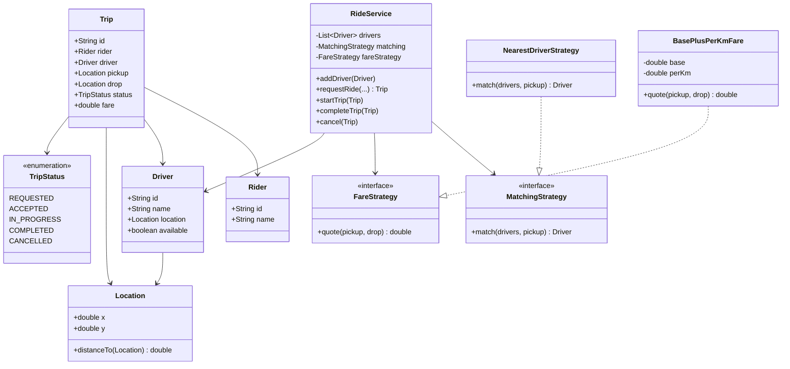
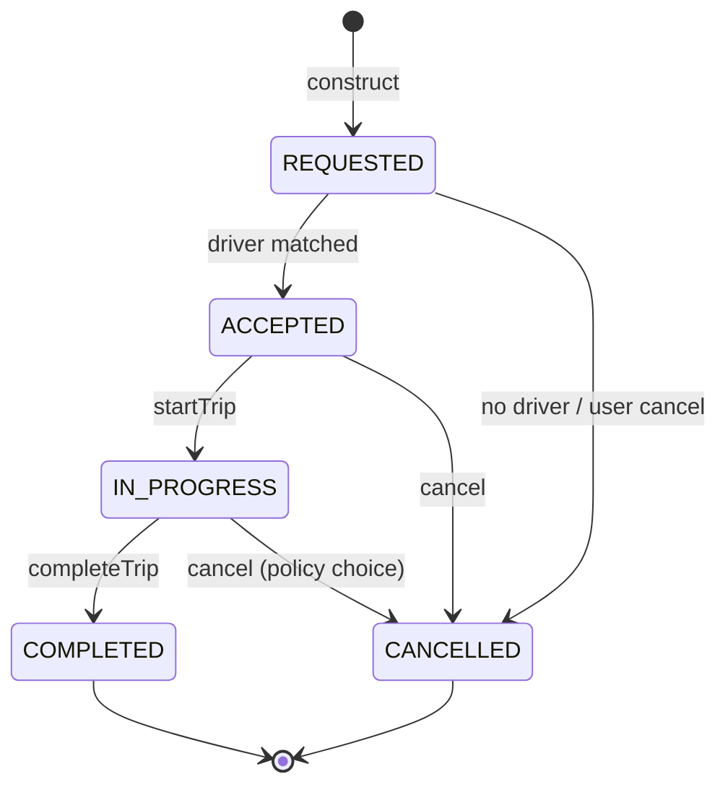

# Cab Booking (Uber-lite) — Low-Level Design

A complete Low-Level Design for a **ride-hailing** slice: request a trip, match a nearby driver, run a strict trip lifecycle, and quote a fare. The interview is really about **pluggable matching + fare** and a **state machine that rejects illegal transitions**.

> **Core insight:** `RideService` orchestrates; it never hard-codes *which* driver or *how* price is computed. Those are strategies. The trip object owns status — everyone else asks permission to move it forward.

---

## 📌 Problem Statement

Design a system where:

1. A rider requests a ride from pickup → drop location
2. The system picks an available driver (nearest by default)
3. The trip moves through `REQUESTED → ACCEPTED → IN_PROGRESS → COMPLETED` (or `CANCELLED`)
4. Fare is computed by a swappable policy (base + per-km here)
5. Drivers are marked busy while on a trip and freed on complete/cancel

---

## ✅ Requirements

### Functional

1. Model `Rider`, `Driver`, `Location`, `Trip`, `RideService`.
2. `requestRide(rider, pickup, drop)` → match driver or fail cleanly.
3. Matching via **`MatchingStrategy`** (nearest available).
4. Fare via **`FareStrategy`** (base + per-km × Euclidean distance).
5. Lifecycle APIs: `startTrip`, `completeTrip`, `cancel`.
6. On complete: move driver location to drop; mark available.
7. On cancel (before complete): free driver if assigned.

### Non-Functional

* Illegal state transitions must be rejected (no silent no-ops that look like success).
* Adding surge pricing or “highest-rated driver” must not rewrite `RideService`.
* Distance math lives on `Location` once — no duplicated sqrt calls.

### Out of Scope

* Real GPS / map matching / ETA traffic models
* Payments, ratings UI, multi-stop trips, pooling
* Geo-hash indexes, Kafka dispatch (mention as HLD bridge only)

---

## 🧠 Core Design Idea

Three separable concerns:

| Concern | Owner |
|---------|-------|
| *Who gets the trip* | `MatchingStrategy` |
| *What it costs* | `FareStrategy` |
| *What states are legal* | `TripStatus` + guarded methods on `RideService` |

```text
requestRide
   → strategy.match(available drivers, pickup)
   → if none: CANCELLED / fail
   → else: driver.available=false, status=ACCEPTED, fare=quote
startTrip   : ACCEPTED → IN_PROGRESS
completeTrip: IN_PROGRESS → COMPLETED (+ free driver, update location)
cancel      : any pre-terminal → CANCELLED (+ free driver)
```

### Why Euclidean distance is OK here

Interview LLD does not need Haversine. `Location.distanceTo` with √(dx²+dy²) proves the seam exists. Later you swap in Haversine or a routing-engine adapter behind the same method.

---

## 🏗️ Class Diagram



---

## 📦 Class Responsibilities

### `Location`
Immutable coordinate pair. Owns distance. Keep it boring and correct.

### `Driver`
Mutable `location` + `available` flag. **Only** `RideService` should flip availability (encapsulation discipline — in a larger system use methods `assign()` / `free()`).

### `Trip`
Holds the lifecycle data. Prefer not putting transition logic *only* on Trip if the service also needs side effects (freeing drivers). Either:
* Service guards transitions and mutates trip, or
* Trip exposes `toInProgress()` that throws on illegal moves, and service calls it then does side effects.

This sketch keeps transitions in `RideService` for clarity in one file.

### `MatchingStrategy` / `NearestDriverStrategy`
Scan available drivers; pick minimum distance to pickup. Return `null` if none.

**Complexity:** O(D) per request. Fine for LLD. Production uses geo-indexes / dispatch queues.

### `FareStrategy` / `BasePlusPerKmFare`
`fare = base + perKm * distance(pickup, drop)`. Quote at accept time (or at complete — say which; this design quotes at match).

### `RideService`
Facade + invariant keeper: one place that knows matching, fare, and driver busy/free rules.

---

## 🔄 Sequence — happy path


---

## 🔁 Trip state machine



**Interview note:** Some products disallow cancel after `IN_PROGRESS` or charge a fee. Say your rule out loud and stick to it.

### Legal transition table

| From \ To | ACCEPTED | IN_PROGRESS | COMPLETED | CANCELLED |
|-----------|----------|-------------|-----------|-----------|
| REQUESTED | ✅ match | ❌ | ❌ | ✅ |
| ACCEPTED | — | ✅ | ❌ | ✅ |
| IN_PROGRESS | — | — | ✅ | ✅* |
| COMPLETED | — | — | — | ❌ |
| CANCELLED | — | — | — | ❌ |

\*optional policy

---

## 🧮 Matching algorithm (nearest)

```text
best = null, bestDist = ∞
for each driver in drivers:
  if !driver.available: continue
  d = driver.location.distanceTo(pickup)
  if d < bestDist: bestDist = d; best = driver
return best
```

### Fare worked example

```text
base = 50, perKm = 10
pickup = (1,1), drop = (4,5)
distance = √((4-1)²+(5-1)²) = √(9+16) = 5
fare = 50 + 10*5 = 100
```

---

## 🧩 Patterns & Principles

| Pattern / Principle | Where |
|---------------------|-------|
| **Strategy** | Matching + Fare |
| **Facade** | `RideService` |
| **State (enum)** | `TripStatus` |
| **SRP** | Distance on Location; matching not inside Driver |
| **OCP** | New `SurgeFare` / `RatedDriverMatch` without editing service flow |

---

## ⚠️ Edge Cases

| Case | Behavior |
|------|----------|
| No available drivers | Trip cancelled / null; rider informed |
| `startTrip` from REQUESTED | Reject |
| `completeTrip` twice | Reject |
| Cancel after COMPLETED | Reject |
| Two riders race for last driver | Needs locking / atomic claim in real system — mention it |
| Driver location stale | Accept as LLD simplification; HLD uses live GPS stream |

---

## 🔌 Extensibility

| Change | How |
|--------|-----|
| Surge pricing | New `FareStrategy` reading demand multiplier |
| Bike vs car | Vehicle category filter inside matching |
| Pool rides | New trip type + multi-rider matching |
| ETA | RoutingPort interface; don't put HTTP in domain |

---

## 🧪 Walkthrough (matches `Main.java`)

```text
Drivers: Anya(0,0), Bala(10,10)
Rider Dev requests (1,1)→(4,5)
→ nearest = Anya (dist √2)
→ ACCEPTED, Anya busy
→ start → IN_PROGRESS
→ complete → Anya at (4,5), free

Second request while other trip mid-flight:
→ remaining free drivers matched or cancel path demonstrated
```

---

## 💡 Interview Talking Points

1. Separate matching and fare — interviewers love Strategy here.  
2. Draw the state machine before classes.  
3. Call out concurrency on `driver.available` (compare-and-set).  
4. Quote-at-accept vs quote-at-complete (fare changes mid-trip).  
5. Euclidean is a stand-in; seam matters more than formula.  
6. Bridge to HLD: geo-hash, dispatch queues, exactly-once payment capture.

---

## 📁 Files

| File | Purpose |
|------|---------|
| `details.md` | This LLD |
| `Main.java` | Match → ride → complete (+ cancel path) |
