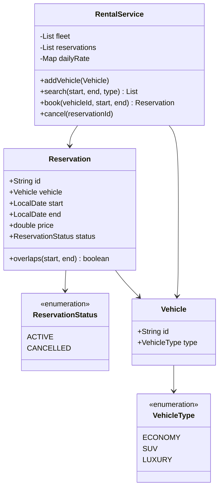
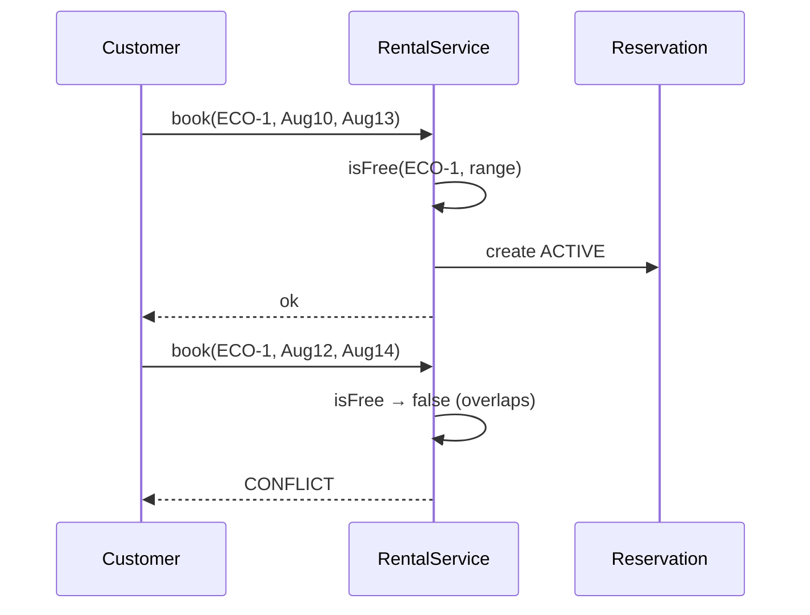

# Car Rental — Low-Level Design

A complete Low-Level Design for a **car rental** inventory: vehicles by type, date-range availability, booking, cancellation, and daily pricing.

> **Same spine as Hotel Booking:** half-open intervals `[start, end)` and the overlap rule `newStart < existingEnd && newEnd > existingStart`. If you already own Hotel, this problem is a deliberate repetition — interviews reuse this math constantly.

---

## 📌 Problem Statement

Design a fleet rental system where a customer can:

1. Search vehicles of a type free for `[start, end)`
2. Book a specific vehicle for that range at `days × dailyRate`
3. Cancel so the vehicle becomes bookable again for those dates

Never allow two **ACTIVE** reservations on the same vehicle with overlapping ranges. **Back-to-back** rentals (`…→15` and `15→…`) must both succeed.

---

## ✅ Requirements

### Functional

1. Fleet of `Vehicle`s with `VehicleType` (`ECONOMY`, `SUV`, `LUXURY`).
2. Each type has a daily rate.
3. `search(start, end, type → )` returns free vehicles.
4. `book(vehicleId, start, end)` creates an ACTIVE reservation or rejects conflicts.
5. `cancel(reservationId)` flips status to CANCELLED (does not delete history).
6. Reject `start >= end`.

### Non-Functional

* Overlap logic in **exactly one method** (`Reservation.overlaps` / `isFree`).
* Pricing swappable later (weekend premium) without rewriting book().
* Clear half-open semantics spoken in the interview.

### Out of Scope

* One-way rentals across cities, insurance SKUs, payments, damage claims, telematics.

---

## 🧠 Core Design Idea: half-open intervals

A rental from Aug 10 to Aug 13 means the customer has the car on the 10th, 11th, and 12th — **3 days** — and the car is free again on the 13th.

```text
Aug 10  11  12  13
  |----|----|----|
  ^ start         ^ end (free again)
  3 days = end - start
```

### Overlap rule (memorize)

```text
overlap ⇔ newStart < existingEnd  &&  newEnd > existingStart
```

Disjoint (including touching) ⇔ `newEnd <= existingStart || newStart >= existingEnd`.

### Truth table — existing `[Aug 10, Aug 13)`

| Candidate | Relationship | Overlap → |
|-----------|--------------|----------|
| `[Aug 08, Aug 10)` | touches start | ❌ |
| `[Aug 09, Aug 11)` | straddles start | ✅ |
| `[Aug 11, Aug 12)` | inside | ✅ |
| `[Aug 10, Aug 13)` | identical | ✅ |
| `[Aug 12, Aug 15)` | straddles end | ✅ |
| `[Aug 13, Aug 15)` | touches end | ❌ |
| `[Aug 14, Aug 16)` | after | ❌ |

`Main.java` demonstrates conflict + successful back-to-back after cancel.

---

## 🏗️ Class Diagram



---

## 📦 Responsibilities

| Class | Responsibility |
|-------|----------------|
| `Vehicle` | Identity + type (inventory unit) |
| `Reservation` | Interval + price + status; **owns overlap check** |
| `RentalService` | Search/book/cancel; rate table; filters ACTIVE only when testing freedom |

**Why cancel is a status flip:** Keeping cancelled rows preserves audit history and simplifies “who had the car when → ” questions. Search ignores non-ACTIVE.

---

## 🔄 Sequence — book with conflict



---

## 🧮 Pricing

```text
days  = ChronoUnit.DAYS.between(start, end)   // half-open
price = days × dailyRate[type]
```

| Type | Example daily rate |
|------|--------------------|
| ECONOMY | 40 |
| SUV | 70 |
| LUXURY | 120 |

---

## 🧩 Patterns & Principles

| Item | Use |
|------|-----|
| **SRP** | Overlap on Reservation; orchestration on service |
| **OCP** | Future `PricingStrategy` for seasonal rates |
| **Status enum** | ACTIVE/CANCELLED instead of deleting |
| Shared domain rule | Same overlap as Hotel / Meeting Scheduler — say that aloud |

---

## ⚠️ Edge Cases

| Case | Handling |
|------|----------|
| `start == end` | Reject (zero-length) |
| `start > end` | Reject |
| Book cancelled range again | Allowed if no other ACTIVE overlap |
| Maintenance hold | Model as internal ACTIVE reservation (extension) |
| Same vehicle booked by two threads | Needs transaction/row lock — mention |

---

## 🔌 Extensibility

| Change | Approach |
|--------|----------|
| One-way rental | Add pickup/drop branch inventory counts |
| Mileage caps | Extra fields on Reservation + fee strategy |
| Membership discounts | PricingStrategy |
| Vehicle status IN_SHOP | Filter in search |

---

## 🧪 Walkthrough

```text
Fleet: ECO-1, SUV-1
Book ECO-1 [Aug10, Aug13) → 3*40 = 120 OK
Book ECO-1 [Aug12, Aug14) → CONFLICT
Cancel first
Book ECO-1 [Aug12, Aug14) → OK
```

---

## 💡 Interview Talking Points

1. Lead with half-open intervals — shows maturity.  
2. Draw the truth table for touching dates.  
3. “Same overlap as Hotel” — pattern recognition.  
4. Soft-cancel vs hard-delete.  
5. Where you'd put optimistic locking on `book`.  

---

## 📁 Files

| File | Purpose |
|------|---------|
| `details.md` | This LLD |
| `Main.java` | Search, conflict, back-to-back, cancel |
