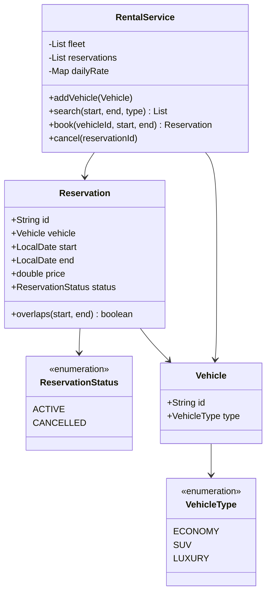

# Car Rental — Low-Level Design

A complete Low-Level Design for a **car rental** inventory: vehicles by type, date-range availability, booking, cancellation, and daily pricing.

> **Same spine as Hotel Booking:** half-open intervals `[start, end)` and the overlap rule `newStart < existingEnd && newEnd > existingStart`. If you already own Hotel, this problem is a deliberate repetition — interviews reuse this math constantly.

---

## 📌 Problem Statement

Design a fleet rental system where a customer can:

1. Search vehicles of a type free for `[start, end)`
2. Book a specific vehicle for that range at `days × dailyRate`
3. Cancel so the vehicle becomes bookable again for those dates

Never allow two **ACTIVE** reservations on the same vehicle with overlapping ranges. **Back-to-back** rentals (`…→15` and `15→…`) must both succeed.

---

## ✅ Requirements

### Functional

1. Fleet of `Vehicle`s with `VehicleType` (`ECONOMY`, `SUV`, `LUXURY`).
2. Each type has a daily rate.
3. `search(start, end, type?)` returns free vehicles.
4. `book(vehicleId, start, end)` creates an ACTIVE reservation or rejects conflicts.
5. `cancel(reservationId)` flips status to CANCELLED (does not delete history).
6. Reject `start >= end`.

### Non-Functional

* Overlap logic in **exactly one method** (`Reservation.overlaps` / `isFree`).
* Pricing swappable later (weekend premium) without rewriting book().
* Clear half-open semantics spoken in the interview.

### Out of Scope

* One-way rentals across cities, insurance SKUs, payments, damage claims, telematics.

---

## 🧠 Core Design Idea: half-open intervals

A rental from Aug 10 to Aug 13 means the customer has the car on the 10th, 11th, and 12th — **3 days** — and the car is free again on the 13th.

```text
Aug 10  11  12  13
  |----|----|----|
  ^ start         ^ end (free again)
  3 days = end - start
```

### Overlap rule (memorize)

```text
overlap ⇔ newStart < existingEnd  &&  newEnd > existingStart
```

Disjoint (including touching) ⇔ `newEnd <= existingStart || newStart >= existingEnd`.

### Truth table — existing `[Aug 10, Aug 13)`

| Candidate | Relationship | Overlap? |
|-----------|--------------|----------|
| `[Aug 08, Aug 10)` | touches start | � |
| `[Aug 09, Aug 11)` | straddles start | ✅ |
| `[Aug 11, Aug 12)` | inside | ✅ |
| `[Aug 10, Aug 13)` | identical | ✅ |
| `[Aug 12, Aug 15)` | straddles end | ✅ |
| `[Aug 13, Aug 15)` | touches end | � |
| `[Aug 14, Aug 16)` | after | � |

`Main.java` demonstrates conflict + successful back-to-back after cancel.

---

## �� Class Diagram



---

## 📦 Responsibilities

| Class | Responsibility |
|-------|----------------|
| `Vehicle` | Identity + type (inventory unit) |
| `Reservation` | Interval + price + status; **owns overlap check** |
| `RentalService` | Search/book/cancel; rate table; filters ACTIVE only when testing freedom |

**Why cancel is a status flip:** Keeping cancelled rows preserves audit history and simplifies “who had the car when?� questions. Search ignores non-ACTIVE.

---

## 🔄 Sequence — book with conflict


---

## 🧮 Pricing

```text
days  = ChronoUnit.DAYS.between(start, end)   // half-open
price = days × dailyRate[type]
```

| Type | Example daily rate |
|------|--------------------|
| ECONOMY | 40 |
| SUV | 70 |
| LUXURY | 120 |

---

## 🧩 Patterns & Principles

| Item | Use |
|------|-----|
| **SRP** | Overlap on Reservation; orchestration on service |
| **OCP** | Future `PricingStrategy` for seasonal rates |
| **Status enum** | ACTIVE/CANCELLED instead of deleting |
| Shared domain rule | Same overlap as Hotel / Meeting Scheduler — say that aloud |

---

## ⚠� Edge Cases

| Case | Handling |
|------|----------|
| `start == end` | Reject (zero-length) |
| `start > end` | Reject |
| Book cancelled range again | Allowed if no other ACTIVE overlap |
| Maintenance hold | Model as internal ACTIVE reservation (extension) |
| Same vehicle booked by two threads | Needs transaction/row lock — mention |

---

## 🔌 Extensibility

| Change | Approach |
|--------|----------|
| One-way rental | Add pickup/drop branch inventory counts |
| Mileage caps | Extra fields on Reservation + fee strategy |
| Membership discounts | PricingStrategy |
| Vehicle status IN_SHOP | Filter in search |

---

## 🧪 Walkthrough

```text
Fleet: ECO-1, SUV-1
Book ECO-1 [Aug10, Aug13) → 3*40 = 120 OK
Book ECO-1 [Aug12, Aug14) → CONFLICT
Cancel first
Book ECO-1 [Aug12, Aug14) → OK
```

---

## 💡 Interview Talking Points

1. Lead with half-open intervals — shows maturity.  
2. Draw the truth table for touching dates.  
3. “Same overlap as Hotel� — pattern recognition.  
4. Soft-cancel vs hard-delete.  
5. Where you'd put optimistic locking on `book`.  

---

## � Files

| File | Purpose |
|------|---------|
| `details.md` | This LLD |
| `Main.java` | Search, conflict, back-to-back, cancel |

---

## ?? Deep dive — invariants checklist

Before you leave the whiteboard, confirm you can answer yes to each:

1. Where does the **single source of truth** for the core rule live? (overlap, state transition, win check, vote key…)
2. What happens on the **failure path** immediately after a partial side effect? (debit without dispense, stock without order, lock without pay)
3. Which dependencies are **interfaces** so tests can fake them?
4. What is explicitly **out of scope**, spoken aloud?
5. What is the **first extension** you would add and which class changes?

---

## ??? Sample interviewer Q&A

**Q: Why not one god class?**  
A: Because the change axes differ — pricing/matching/state/inventory rarely change together. Splitting along those axes keeps diffs small and interviews clearer.

**Q: Where would you put persistence?**  
A: Outside the domain facade. Repository interfaces for aggregates (Trip, Reservation, Order). Domain methods stay pure of SQL.

**Q: How do you test this?**  
A: Deterministic inputs (fixed dice, manual clock, in-memory bank). Table-driven cases for the core rule (overlap truth table, state transitions, vote math).

**Q: What breaks at scale?**  
A: The naive loops (scan all drivers, all reservations, all tweets). Index by geo-hash, by day, by followee timeline. That is the HLD bridge — say it, don't implement it in LLD unless asked.

**Q: Concurrency?**  
A: Name the shared mutable resource (spot, seat, driver.available, stock, cassette). Propose lock grain or DB constraint / CAS. Idempotency keys for payments and bank withdraws.

---

## ?? Revision card (memorize)

| Prompt yourself | Answer shape |
|-----------------|--------------|
| Entities? | 5–8 nouns |
| Core rule? | One formula / state diagram |
| Patterns? | 1–3 max, justified |
| Failure? | One sequenced unhappy path |
| Extend? | One OCP example |

---

## 📚 Extended teaching notes — Car-Rental

This section exists so the write-up matches the depth of Parking Lot / Hotel / Splitwise in this bible: more failure modes, more whiteboard scripts, and more “what I would say next.�

### Whiteboard script (8–10 minutes)

1. **Clarify scope (1 min).** Restate functional bullets and say three out-of-scope items aloud.
2. **Entities (1 min).** List 6–8 nouns; mark which are value objects vs entities.
3. **Core rule (2 min).** Write the single formula or state diagram that makes the design correct.
4. **Class diagram (2 min).** Boxes + relationships only for classes you will defend.
5. **API walk (2 min).** One happy sequence; one failure sequence.
6. **Close (1–2 min).** Concurrency, complexity, one extension.

### Failure-mode catalog

| # | Failure | Detection | Mitigation |
|---|---------|-----------|------------|
| 1 | Partial side effect | Two-phase / plan-then-commit | Compensating action |
| 2 | Double submit | Idempotency key | Deduplicate |
| 3 | Lost update | Version / CAS | Retry |
| 4 | Stale read | TTL / re-read | Accept or refresh |
| 5 | Resource exhaustion | Explicit null/empty | Backpressure / reject |
| 6 | Illegal transition | State guard | Throw / message |
| 7 | Validation gap | Boundary checks | Reject early |
| 8 | Clock skew | Inject clock | Monotonic / server time |

### Testing matrix

| Layer | What to test | Example |
|-------|--------------|---------|
| Unit | Core rule | Overlap truth table / state table / vote math |
| Unit | Strategy swap | Alternate matching or pricing |
| Integration | Facade flow | Happy path through service |
| Adversarial | Illegal calls | Double complete, bad PIN, sold out |
| Property | Invariants | Spot free XOR occupied; balances sum to zero |

### Complexity cheat sheet

| Operation family | Typical LLD cost | Scale upgrade |
|------------------|------------------|---------------|
| Linear scan resources | O(n) | Index / partition |
| Interval conflict | O(m) per resource | Interval tree |
| Graph gather | O(F·T) | Push inbox / cache |
| Tick simulation | O(e) elevators | Event queue |

### Concurrency talking track (memorize)

Shared mutable resource → name it → pick grain of lock (object vs row vs partition) → prefer CAS/check-and-set when races are expected → mention DB unique constraints for multi-node → idempotency for network retries.

### Extension prompts interviewers love

* “Add X without rewriting the orchestrator� → OCP / Strategy / new state.
* “Two users click at once� → concurrency paragraph.
* “How do you test?� → deterministic seams (dice, clock, bank).
* “What did you leave out?� → out-of-scope list, not apology.

### Mapping back to `Main.java`

When you revise, open `Main.java` beside this doc and tick:

- [ ] Every public API in the diagram appears in code
- [ ] Every demo print maps to a requirement bullet
- [ ] At least one failure path is executed
- [ ] Magic numbers are named constants when they encode policy

### Glossary for this module

| Term | Meaning in Car-Rental |
|------|------------------|
| Facade | Entry service that preserves invariants |
| Strategy | Swappable policy object |
| Invariant | Fact that must always hold after a successful call |
| Soft cancel | Status flip instead of row delete |
| Plan-then-commit | Validate/plan fully before mutating durable state |

### Mini mock questions (answer in one breath each)

1. What is the single most important invariant?
2. Where does that invariant live in code?
3. What is the first class you would add for the next feature?
4. What breaks first at 100× traffic?
5. How do you make the demo deterministic?

If you can answer those five without scrolling, you own this design.

### Related modules in this bible

Cross-read for transfer learning: Hotel Booking (intervals), Cab Booking (matching), Vending/ATM (state), LRU/Rate Limiter (infra math), Splitwise (policy tables). Steal structures, not prose.

### Final revision ritual

Cover the class diagram → redraw from memory → compare → run `javac Main.java && java Main` → explain one failure log line as if to an interviewer.

