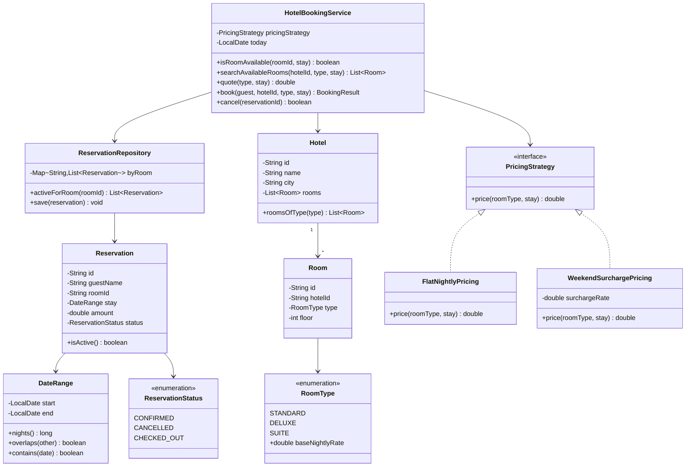
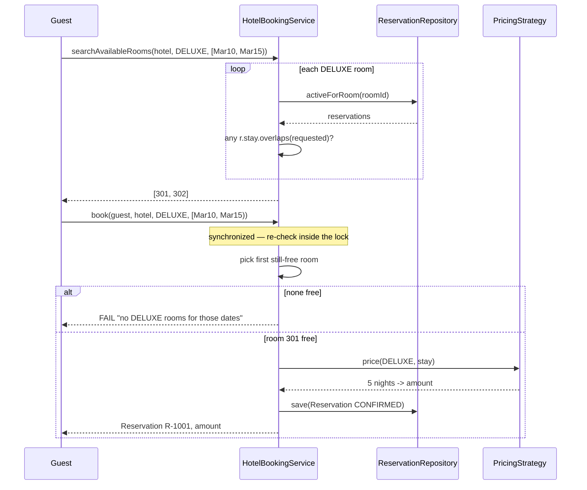

# Hotel Booking — Low-Level Design

A complete Low-Level Design for a **hotel reservation** system: hotels, room types, rooms, availability search over a date range, booking, cancellation, and per-night pricing.

> **The whole problem is one expression:** `newStart < existingEnd && newEnd > existingStart`. Get that right and half the bugs in a booking system never exist.

---

## 📌 Problem Statement

Design a system where a guest can:

1. Search a hotel for rooms of a given type that are free for `[checkIn, checkOut)`
2. Reserve one, paying `nights × nightly rate`
3. Cancel, returning that room to inventory for those dates

The design must never allow two active reservations for the same room on overlapping dates, and must correctly allow **back-to-back** stays (one guest checks out the morning another checks in).

---

## ✅ Requirements

### Functional

1. Model **Hotel → RoomType → Room → Reservation**.
2. Search availability by `(hotel, roomType, dateRange)`.
3. Book a specific room or let the system pick any free room of that type.
4. Cancel a reservation; the dates become bookable again.
5. Price a stay as `nights × nightly rate`, where `nights = checkOut − checkIn`.
6. Reject invalid ranges (`checkOut <= checkIn`) and stays starting in the past.

### Non-Functional

* Overlap logic must live in **exactly one place** and be exhaustively testable.
* Room selection must be atomic — two guests must not be assigned the last room.
* Pricing must be swappable (seasonal, weekend, length-of-stay discounts).

### Out of Scope

* Payments, refunds, channel-manager sync, overbooking policy
* Multi-hotel search / ranking, reviews, loyalty programs

---

## 🧠 Core Design Idea: half-open intervals

A hotel stay is an interval of **nights**, not of days. A guest arriving `Mar 10` and leaving `Mar 15` occupies the nights of the 10th, 11th, 12th, 13th and 14th — **five nights** — and the room is free again on the 15th.

Model it as the **half-open interval** `[checkIn, checkOut)`: start inclusive, end exclusive.

```text
Mar 10   11   12   13   14   15
  |----|----|----|----|----|
  ^ checkIn              ^ checkOut (NOT occupied)
  5 nights
```

Half-open buys three things for free:

| Property | With `[start, end)` |
|----------|--------------------|
| Night count | `nights = end − start`, no ±1 fiddling |
| Back-to-back stays | `[10,15)` and `[15,18)` simply don't overlap |
| No gaps, no double counting | Consecutive intervals tile the calendar perfectly |

Everything downstream depends on this choice, so make it explicitly and say so in an interview.

### The overlap rule

Two half-open intervals overlap **iff**:

```text
a.start < b.end  AND  b.start < a.end
```

Equivalently, for a new booking against an existing one:

```text
newStart < existingEnd  &&  newEnd > existingStart
```

**Why this and not a pile of `if`s?** The naive approach enumerates cases (new starts inside old, new ends inside old, new contains old, old contains new…) and someone always forgets one. Invert the problem instead: two intervals are **disjoint** only when one ends at-or-before the other starts:

```text
disjoint  ==  a.end <= b.start  ||  b.end <= a.start
overlap   ==  !disjoint
          ==  a.end > b.start  &&  b.end > a.start        (De Morgan)
```

Two comparisons, provably complete. Note both are **strict** (`<` / `>`), which is exactly what makes touching intervals like `[10,15)` and `[15,18)` non-overlapping.

### Overlap truth table (memorize this)

Existing reservation: **`[Mar 10, Mar 15)`**

| Candidate | Relationship | Overlaps? |
|-----------|--------------|-----------|
| `[Mar 05, Mar 08)` | entirely before | ❌ no |
| `[Mar 07, Mar 10)` | ends exactly at start — **touching** | ❌ no |
| `[Mar 09, Mar 11)` | straddles the start | ✅ yes |
| `[Mar 11, Mar 13)` | strictly inside | ✅ yes |
| `[Mar 10, Mar 15)` | identical | ✅ yes |
| `[Mar 09, Mar 20)` | strictly contains | ✅ yes |
| `[Mar 14, Mar 16)` | straddles the end | ✅ yes |
| `[Mar 15, Mar 18)` | starts exactly at end — **touching** | ❌ no |
| `[Mar 16, Mar 18)` | entirely after | ❌ no |

The two "touching" rows are the ones that break naive implementations — and they are also the most common real-world case, since hotels resell a room the same day it is vacated. `Main.java` asserts all nine.

---

## 🏗️ Class Diagram



---

## 📦 Class Responsibilities (Detailed)

### 1. `DateRange` — the value object that carries the whole design

```text
DateRange(start, end)
    invariant: end > start          (a zero-night stay is not a stay)
    nights()   = ChronoUnit.DAYS.between(start, end)
    overlaps(o) = start.isBefore(o.end) && o.start.isBefore(end)
```

Immutable, validated in the constructor, with `equals`/`hashCode`. Because *nothing else in the system compares dates*, the overlap rule can be unit-tested to death in one place. If overlap logic is scattered across a service, a repository and a UI validator, the three copies will drift — that is not a hypothetical, it is the single most common bug in booking code.

> Note the deliberate asymmetry in the code: `start.isBefore(o.end) && o.start.isBefore(end)`. Both comparisons are strict, and neither uses `!isAfter`. Writing `!start.isAfter(o.end)` would make touching intervals overlap and silently destroy back-to-back bookings.

### 2. `RoomType` (enum with rate)

`STANDARD = 2500`, `DELUXE = 4500`, `SUITE = 9000` per night. Attaching the base rate to the enum keeps the demo readable; in production this is a `RatePlan` table keyed by `(hotel, roomType, date)` because rates vary by day.

### 3. `Room` and `Hotel`

A `Room` is a physical unit with an id, a type and a floor. A `Hotel` owns rooms and can list rooms by type. **Availability is not a field on `Room`** — availability is a *question about a date range*, and a boolean flag cannot answer it. This is the second classic modelling mistake, right after inclusive end dates.

### 4. `Reservation`

`(id, guestName, roomId, DateRange, amount, status)`. Only `CONFIRMED` reservations block inventory; `CANCELLED` ones stay in the table for audit but are filtered out by `isActive()`. Soft-delete, not hard-delete — you need cancellation history for reporting and no-show policies.

### 5. `ReservationRepository`

Indexes reservations by `roomId` so an availability check scans only that room's reservations rather than the whole table. For real volumes you would push this into SQL:

```sql
SELECT 1 FROM reservations
WHERE room_id = ?
  AND status = 'CONFIRMED'
  AND start_date < :newEnd      -- the same two comparisons
  AND end_date   > :newStart
LIMIT 1;
```

with an index on `(room_id, start_date, end_date)`. A PostgreSQL `EXCLUDE USING gist (room_id WITH =, daterange(start, end) WITH &&)` constraint enforces it at the database level, which is the real production answer.

### 6. `PricingStrategy`

```text
FlatNightlyPricing:        nights × rate
WeekendSurchargePricing:   Σ over nights, ×1.2 if the night falls on Fri or Sat
```

Iterating per night (rather than multiplying) is what makes seasonal and weekend pricing possible at all — another payoff from modelling nights explicitly. Note a "Friday night" is the night *beginning* Friday, so we iterate `start` up to (but excluding) `end`, which again lines up with the half-open interval.

### 7. `HotelBookingService`

| Method | Notes |
|--------|-------|
| `isRoomAvailable(roomId, stay)` | no active reservation for that room overlaps `stay` |
| `searchAvailableRooms(hotelId, type, stay)` | filter rooms of type by availability |
| `quote(type, stay)` | price without holding anything |
| `book(guest, hotelId, type, stay)` | **synchronized**: re-check availability and write the reservation atomically |
| `cancel(reservationId)` | flip status to `CANCELLED` |

**Why `book` must be synchronized:** searching and booking are two separate calls, so between "search says room 301 is free" and "reserve room 301" another thread can slip in. The re-check *inside* the critical section is the guard — a check performed outside the lock is decoration, not protection.

---

## 🔄 Sequence Flow



---

## 🧮 Availability Algorithm

```text
isRoomAvailable(room, requested):
    for each reservation r of room:
        if r.isActive() and r.stay.overlaps(requested):
            return false
    return true
```

`O(R)` per room where `R` is that room's reservation count. Fine for a hotel; for scale:

| Technique | Idea |
|-----------|------|
| **DB range index** | `(room_id, start_date, end_date)` B-tree, or a GiST index over `daterange` |
| **Exclusion constraint** | Let PostgreSQL reject overlapping rows outright — correctness that cannot be bypassed by a buggy service |
| **Interval tree / segment tree** | `O(log n)` overlap queries when kept in memory |
| **Per-day counters** | `availableCount[roomType][date]`; a stay decrements each night. Turns search into `min(counts over nights) > 0` and is how large OTAs actually do it |

The per-day-counter model is worth naming in an interview: it trades exactness about *which* room for O(nights) availability checks and makes overbooking policies (sell 102% of inventory) trivial.

---

## 🧯 Edge Cases

| Case | Handling |
|------|----------|
| Back-to-back stays `[10,15)` + `[15,18)` | **Allowed** — strict comparisons make touching intervals disjoint |
| `checkOut == checkIn` (zero nights) | Rejected in the `DateRange` constructor |
| `checkOut < checkIn` (reversed) | Rejected in the `DateRange` constructor |
| Stay starting in the past | Rejected by the service against an injected `today` |
| Cancelled reservation blocking dates | Filtered by `isActive()` — only `CONFIRMED` blocks |
| Double-booking the last room concurrently | `synchronized book()` re-checks inside the lock |
| Identical range re-request after cancel | Succeeds — demonstrated in the demo |
| Very long stays | Nights are computed, not enumerated, for pricing count; per-night pricing iterates and is `O(nights)` |
| Time zones / DST | Use `LocalDate` (a calendar day), never `Instant`. A hotel night is a *local* concept |
| Same guest, overlapping bookings | Allowed here (families book multiple rooms); add a rule if the business wants otherwise |

---

## 🧩 Design Patterns & Principles Used

| Principle / Pattern | Where it shows up |
|---------------------|-------------------|
| **Value Object** | `DateRange` — immutable, validated, self-comparing |
| **Strategy** | `PricingStrategy` (flat vs weekend surcharge) |
| **Repository** | `ReservationRepository` hides storage & indexing |
| **SRP** | overlap math in `DateRange`, inventory questions in the service, storage in the repo |
| **Single source of truth** | Exactly one implementation of the overlap rule |
| **Fail fast** | Invalid ranges die in the constructor, not three layers later |

---

## 🔌 Extensibility Notes

| Change | How the design absorbs it |
|--------|---------------------------|
| Seasonal / dynamic rates | New `PricingStrategy`; per-night loop already exists |
| Length-of-stay discounts | `PricingStrategy` decorator reading `stay.nights()` |
| Multi-room bookings | A `BookingGroup` holding several reservations, reserved all-or-nothing |
| Overbooking (sell 102%) | Move to per-day counters with a configurable ceiling |
| Hold-before-pay | Add the TTL seat-lock idea from Movie Ticket Booking, keyed by `(room, dateRange)` |
| Room upgrades on arrival | Reservation targets a `RoomType`; bind the physical `Room` at check-in |
| Cancellation policy / refunds | `RefundPolicy` strategy driven by `today` vs `stay.start` |
| Multi-hotel search | Loop hotels; push availability into the DB query |

---

## 🧪 What `Main.java` Demonstrates

| # | Scenario | Expected |
|---|----------|----------|
| 1 | All nine rows of the overlap truth table | 9/9 match the table above |
| 2 | Invalid ranges (zero-night, reversed) | rejected at construction |
| 3 | Night counting for `[Mar10, Mar15)` | 5 nights |
| 4 | Search DELUXE for `[Mar10, Mar15)` | 2 rooms free |
| 5 | Book twice | both succeed, different rooms |
| 6 | Book a third time | ❌ no DELUXE left for those dates |
| 7 | Book `[Mar15, Mar18)` (back-to-back) | ✅ succeeds — the key test |
| 8 | Book `[Mar14, Mar16)` (straddles the end) | ❌ rejected |
| 9 | Cancel, then rebook the same range | ✅ succeeds |
| 10 | Stay in the past | ❌ rejected |
| 11 | Flat vs weekend pricing for the same stay | 22 500 vs 24 300 |
| 12 | 6 threads book the last SUITE | exactly **1** wins |

---

## 📁 Files in this folder

| File | Purpose |
|------|---------|
| `details.md` | This LLD explanation |
| `Main.java` | Runnable single-file sketch with pass/fail demos |

Run it:

```bash
javac Main.java && java Main
```

---

## 💡 Interview Talking Points

1. **State the interval convention first.** "I'll model a stay as `[checkIn, checkOut)` — half-open." It signals you have done this before and it makes every later answer simpler.
2. **Derive the overlap rule, don't recite it.** Show that *disjoint* is the easy case (`a.end <= b.start || b.end <= a.start`), then negate. Two comparisons, no missed cases.
3. **Call out the touching case explicitly** — `[10,15)` and `[15,18)` must both be bookable. It is the test that catches inclusive-end bugs.
4. **Refuse to put an `isAvailable` boolean on `Room`.** Availability is a function of a date range, not a property of a room.
5. **Point at the check-then-act race** and fix it by re-checking inside the lock; then say what the distributed version looks like (DB unique/exclusion constraint, or `SELECT FOR UPDATE`).
6. **Offer the per-day-counter model** as the scale answer, and the PostgreSQL `EXCLUDE USING gist` constraint as the belt-and-braces one.
7. **Mention `LocalDate`, not `Instant`** — a hotel night is a local calendar concept and time zones will bite you otherwise.
