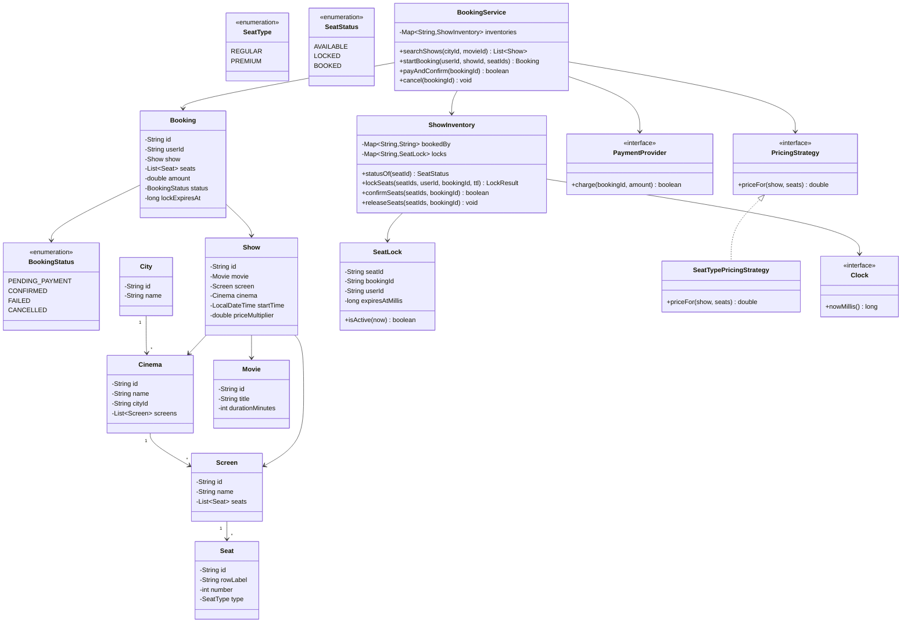
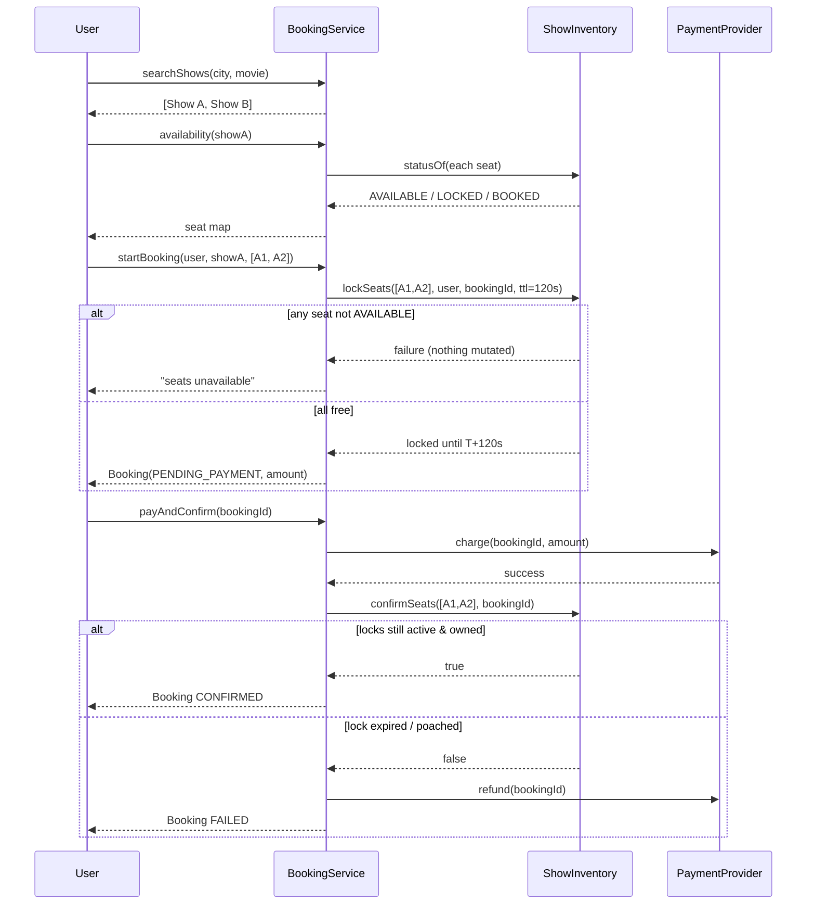

# Movie Ticket Booking (BookMyShow-lite) — Low-Level Design

A complete Low-Level Design for a **movie ticket booking** system: city → cinema → screen → show hierarchy, per-show seat inventory, temporary seat locks with TTL, payment, and confirmation.

> **The whole problem is one sentence:** *two users must never end up holding the same seat for the same show.* Everything else (search, pricing, payments) is supporting cast.

---

## 📌 Problem Statement

Design a system where a user can:

1. Search shows for a movie in a city
2. See the seat layout of a show with live availability
3. Select seats, hold them briefly while they pay
4. Pay and receive a confirmed booking

The design must make **double booking impossible**, and must not leak inventory when a user abandons checkout.

---

## ✅ Requirements

### Functional

1. Model **City → Cinema → Screen → Show**. A screen has a fixed seat layout; a show is a movie playing on a screen at a time.
2. Search shows by city + movie.
3. Expose per-show seat availability: `AVAILABLE`, `LOCKED`, `BOOKED`.
4. Booking flow: `select seats → lock (TTL) → pay → confirm`.
5. **Never allow two confirmed bookings for the same (show, seat).**
6. Seat locks **expire automatically** after a TTL so abandoned carts release inventory.
7. Price by seat type (`REGULAR`, `PREMIUM`), scaled by a per-show multiplier.
8. All-or-nothing seat selection: if one requested seat is unavailable, the whole request fails and no seats are held.

### Non-Functional

* Seat state transitions must be **atomic** per show.
* Availability reads must never report a stale `LOCKED` seat whose TTL already passed.
* Time must be injectable so lock expiry is **testable without sleeping**.
* Pricing and matching rules must be swappable without touching the booking flow.

### Out of Scope

* Real payment gateway integration (we model a `PaymentProvider` seam)
* Distributed locking across service instances (discussed, not implemented)
* Seat recommendations, coupons, refunds, notifications

---

## 🧠 Core Design Idea

Three ideas carry this design:

**1. `ShowInventory` is the single concurrency boundary.**
All seat state for one show lives in one object, and every mutation goes through `synchronized` methods on it. Two different shows never contend with each other, so the lock is fine-grained by construction.

**2. Seat status is *derived*, never stored.**
This is the subtle one. A naive design stores `SeatStatus` on the seat and flips it to `LOCKED`. Then when a lock expires you need a sweeper thread to flip it back — and until the sweeper runs, the seat is *invisibly* unbookable. Instead:

```text
statusOf(seat):
    if seat in bookedBy      -> BOOKED
    if active lock exists    -> LOCKED     (activeLock = expiresAt > now)
    otherwise                -> AVAILABLE
```

An expired lock is *automatically* `AVAILABLE` on the very next read. No sweeper required for correctness (a sweeper is only a memory optimization).

**3. Lock ownership is checked at confirm time.**
`confirmSeats(seatIds, bookingId)` succeeds only if *every* seat still carries an **active** lock owned by **that** booking. A user who pays after their lock expired and someone else grabbed the seat gets a clean failure instead of a stolen seat.

---

## 🏗️ Class Diagram



---

## 📦 Class Responsibilities (Detailed)

### 1. Catalog: `City`, `Cinema`, `Screen`, `Seat`, `Movie`, `Show`

Pure structure, no behaviour. A `Screen` owns an immutable seat layout; a `Show` binds *movie × screen × start time*. Note that **seats belong to the screen, not the show** — the show only owns *the state of those seats*. That separation is why one screen can host five shows a day without duplicating layout data.

Seat ids are stable and layout-derived (`S1-A1`), which makes them safe to use as map keys.

### 2. `SeatLock`

```text
SeatLock(seatId, bookingId, userId, expiresAtMillis)
isActive(now) => now < expiresAtMillis
```

An immutable record of *who* holds *what* until *when*. `bookingId` (not just `userId`) is the owner key, so the same user starting two carts cannot accidentally confirm seats held by their other cart.

### 3. `ShowInventory` — the heart of the design

Holds two maps for one show:

| Map | Meaning |
|-----|---------|
| `bookedBy: seatId → bookingId` | permanent, terminal state |
| `locks: seatId → SeatLock` | temporary hold, may be expired |

**Every** public method is `synchronized`, making the show the mutual-exclusion unit.

```text
lockSeats(seatIds, userId, bookingId, ttlMillis):
    validate every seatId exists on the screen        -> else reject
    reject duplicate seat ids in the request
    PASS 1 (check): for each seat, statusOf(seat) must be AVAILABLE
                    if any is not -> return failure, MUTATE NOTHING
    PASS 2 (write): for each seat, locks[seat] = new SeatLock(..., now + ttl)
    return success
```

The **two-pass check-then-write inside one synchronized block** is what gives all-or-nothing semantics. Doing it in one pass would leave partial locks behind when seat #3 of 4 turns out to be taken.

```text
confirmSeats(seatIds, bookingId):
    for each seat:
        lock = locks[seat]
        if lock == null or !lock.isActive(now) or !lock.bookingId.equals(bookingId)
            -> return false      (expired or stolen; still mutate nothing)
    for each seat:
        bookedBy[seat] = bookingId
        locks.remove(seat)
    return true
```

Again two passes. Confirm is where an expired-then-poached seat is caught.

### 4. `Clock` (injected time)

```java
interface Clock { long nowMillis(); }
```

`SystemClock` in production, `SimulatedClock` in the demo. Lock expiry is a *time* rule, and any time rule you cannot fast-forward is a rule you cannot test. The demo advances a virtual clock by 3 minutes instantly instead of `Thread.sleep`-ing.

### 5. `PricingStrategy`

```text
priceFor(show, seats) = Σ basePrice(seat.type) × show.priceMultiplier
```

Base prices: `REGULAR = 200`, `PREMIUM = 350`. The show multiplier covers prime-time/weekend pricing. Kept behind an interface so `SurgePricing`, `CouponPricing`, or `DynamicOccupancyPricing` drop in without touching `BookingService`.

### 6. `PaymentProvider`

A seam, not a feature: `charge(bookingId, amount) → boolean`. The demo uses an `AlwaysSucceedsPaymentProvider` and a `FailingPaymentProvider` to prove that a **failed payment releases the seats**.

### 7. `BookingService` (orchestrator)

| Method | What it does |
|--------|--------------|
| `searchShows(cityId, movieId)` | filter the show catalog |
| `availability(showId)` | render live seat map via `statusOf` |
| `startBooking(userId, showId, seatIds)` | price it, lock seats, create `PENDING_PAYMENT` booking |
| `payAndConfirm(bookingId)` | charge → `confirmSeats` → `CONFIRMED`, else release + `FAILED` |
| `cancel(bookingId)` | release locks, mark `CANCELLED` |

Note the ordering in `payAndConfirm`: **charge first, then confirm.** If confirm fails after a successful charge (lock expired mid-payment), we must refund. That path is called out explicitly in the code, because "we took the money and gave you nothing" is the single worst failure mode in a booking system.

---

## 🔄 Sequence Flow (Happy Path)



---

## ⏱️ Seat Lock TTL — the whole discussion

### Why a lock at all → Between "user clicks A1" and "payment succeeds" there are 30–180 seconds of human latency. Without a hold, two users both see A1 free, both pay, and one of them arrives at a cinema to find a stranger in their seat. With a *permanent* hold, one abandoned tab kills that seat for the night.

A **TTL lock** is the compromise: exclusive, but self-healing.

### Choosing the TTL

| TTL | Effect |
|-----|--------|
| Too short (< 60s) | Users lose seats mid-payment; 3-D Secure / UPI flows routinely take 60–90s |
| Too long (> 10min) | Popular shows look sold out while carts sit abandoned |
| Practical | **5–10 minutes**, extended once if the payment gateway reports "in progress" |

### Lazy expiry vs sweeper thread

We use **lazy expiry**: nothing runs in the background; a lock is simply ignored once `now >= expiresAt`.

* ✅ No scheduler, no race between sweeper and booker, correct by construction
* ✅ Read path already holds the show lock, so the check is free
* ⚠️ Expired lock objects linger in the map until overwritten — bounded by seat count per show, so it is a non-issue. A periodic compaction is a *memory* optimization, never a *correctness* one.

### Scaling beyond one JVM

The `synchronized ShowInventory` is correct for a single process only. In a real deployment:

| Approach | How it works | Trade-off |
|----------|--------------|-----------|
| **Redis lock** | `SET show:{id}:seat:{id} bookingId NX PX 300000` — atomic acquire + TTL in one command | Fast; needs care around Redis failover (use Redlock or a single authoritative instance) |
| **DB row lock** | `SELECT ... FOR UPDATE` on seat rows, ordered by seat id to avoid deadlock | Strong consistency, costs a DB round trip and holds a transaction open |
| **Optimistic locking** | Each seat row has a `version`; `UPDATE ... WHERE id= → AND version=?`; 0 rows updated ⇒ someone beat you ⇒ retry/fail | No held locks, great under low contention — but a hot show *is* high contention, so expect retry storms |
| **Partitioned single-writer** | Route all requests for a show to one owning node (consistent hashing / Kafka partition per show) | Removes locking entirely; needs failover and sticky routing |

**Optimistic vs pessimistic, said crisply:** optimistic locking detects a conflict *after the fact* and makes the loser retry; it wins when conflicts are rare. Seat booking for a blockbuster's opening night is the opposite of rare, so a short *pessimistic* hold (which is exactly what the seat lock is) plus a version column as a final backstop is the pragmatic answer. Note the seat lock is doing double duty here: it is both a concurrency primitive **and** a product feature ("your seats are held for 5:00").

### The idempotency footnote

Users double-click "Pay". Give `payAndConfirm` an idempotency key (the `bookingId` works) so a replay returns the *existing* confirmation instead of charging twice.

---

## 🧯 Edge Cases

| Case | Handling |
|------|----------|
| Two users lock the same seat simultaneously | `synchronized` per show ⇒ serialized; exactly one succeeds (demo proves this with real threads) |
| Partial availability (`A5` free, `A1` booked) | All-or-nothing: whole request rejected, `A5` stays `AVAILABLE` |
| User abandons after locking | TTL lapses; seat is `AVAILABLE` on the next read, no sweeper needed |
| User pays *after* TTL expired, seat still free | `confirmSeats` fails (lock inactive). Strictly safe. A friendlier variant re-locks before charging |
| User pays after TTL expired, seat poached | `confirmSeats` fails and refund is triggered — the poacher keeps the seat |
| Duplicate seat ids in one request (`[A1, A1]`) | Rejected up front; otherwise the "check" pass would validate `A1` twice and hide a bug |
| Unknown seat id / seat from another screen | Rejected during validation against the screen layout |
| Payment fails | Locks released immediately (don't wait for TTL) and booking marked `FAILED` |
| Cancel after confirmation | Out of scope here; would move the seat from `bookedBy` back to free plus a refund policy |
| Show already started | Reject new bookings — compare `show.startTime` against `clock` |
| Clock skew across nodes | TTL must be evaluated by *one* authority (Redis/DB server time), never by each app node's wall clock |

---

## 🧩 Design Patterns & Principles Used

| Principle / Pattern | Where it shows up |
|---------------------|-------------------|
| **Strategy** | `PricingStrategy` (seat-type, surge, coupon), `PaymentProvider` |
| **SRP** | `ShowInventory` = seat state only; `BookingService` = orchestration; catalog classes = structure |
| **Dependency Inversion** | `Clock`, `PaymentProvider`, `PricingStrategy` are interfaces injected into the service |
| **Derived state over stored state** | `SeatStatus` computed from `bookedBy` + active lock, eliminating the stale-`LOCKED` bug |
| **Value object** | `SeatLock` is immutable |
| **Lock-per-aggregate** | The show is the aggregate root for seat state — the granularity that makes `synchronized` acceptable |

---

## 🔌 Extensibility Notes

| Change | How the design absorbs it |
|--------|---------------------------|
| Surge / weekend pricing | New `PricingStrategy` implementation |
| Coupons & loyalty points | Decorate `PricingStrategy` |
| Food & beverage add-ons | New line items on `Booking`; pricing already a strategy |
| Seat-type tiers (RECLINER, SOFA) | Add to `SeatType` + price table |
| Waitlist on sold-out shows | Observer on `ShowInventory` release events |
| Refunds / partial cancel | Move seats out of `bookedBy`; add `RefundPolicy` strategy |
| Multi-region scale | Swap `ShowInventory` for a Redis/DB-backed implementation behind the same interface |
| Hold extension ("need more time → ") | `extendLock(bookingId, extraMillis)` guarded by a max-extensions counter |

---

## 🧪 What `Main.java` Demonstrates

| # | Scenario | Expected |
|---|----------|----------|
| 1 | Search shows in a city | 2 shows listed |
| 2 | Alice books `A1, A2` and pays | ✅ CONFIRMED |
| 3 | Bob tries the same `A1, A2` | ❌ rejected — already `BOOKED` |
| 4 | Bob requests `A5` (free) + `A1` (booked) | ❌ rejected, and `A5` remains `AVAILABLE` (all-or-nothing) |
| 5 | Carol locks `B1, B2`, never pays; clock advances past TTL | seats revert to `AVAILABLE` |
| 6 | Dave books `B1, B2` after expiry | ✅ CONFIRMED |
| 7 | Carol finally tries to pay | ❌ FAILED — lock expired and seats poached |
| 8 | Payment gateway declines | ❌ FAILED and seats released immediately |
| 9 | 8 threads race for the same seat | exactly **1** success, 7 clean failures |

---

## 📁 Files in this folder

| File | Purpose |
|------|---------|
| `details.md` | This LLD explanation |
| `Main.java` | Runnable single-file sketch with pass/fail demos |

Run it:

```bash
javac Main.java && java Main
```

---

## 💡 Interview Talking Points

1. **Lead with the invariant.** "One seat, one confirmed booking" — then show the two-pass check-then-write inside a per-show lock that guarantees it.
2. **Explain why the lock granularity is the show.** Not global (kills throughput), not per-seat (can't do all-or-nothing atomically without ordered multi-lock and deadlock risk).
3. **Volunteer the stale-`LOCKED` bug** and how deriving status from an expiry timestamp kills it. This is the detail that separates a memorized answer from a designed one.
4. **Discuss optimistic vs pessimistic honestly** — optimistic is elegant but loses on hot shows; the TTL hold is pessimistic *and* a UX feature.
5. **Name the money failure mode**: charged but not confirmed ⇒ refund path. Interviewers listen for whether you noticed.
6. **Mention idempotency** for double-clicked payments.
7. **Close with distribution**: `synchronized` → Redis `SET NX PX` or `SELECT FOR UPDATE`, and beware per-node clock skew for TTLs.
