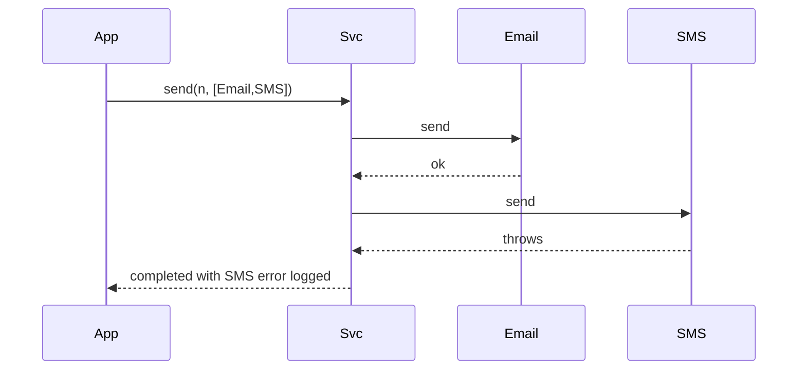

# Notification System ? Low-Level Design

A complete Low-Level Design for multi-channel notifications (Email, SMS, Push) with **Strategy** transports, failure isolation, and an optional **Observer/outbox** bridge from domain events.

> **Core insight:** ?notify the user? is stable; SMTP/SMS/FCM details churn. Channels implement one interface. One channel dying must not block the others unless you explicitly chose all-or-nothing.

---

## ?? Problem Statement

Design a notifier that accepts a logical `Notification` and delivers it through one or more channels, supports adding channels without editing callers, and documents reliability options (sync best-effort vs async outbox).

---

## ? Requirements

### Functional

1. Payload: recipient, title/subject, body.
2. Channels: Email, SMS, Push (mocked).
3. `NotificationService.send(notification, channels)`.
4. Per-channel try/catch (best-effort policy).
5. Optional factory: `ChannelType ? NotificationChannel`.

### Non-Functional

* Testable via interface fakes.
* No doubles for money (N/A) but validate non-blank recipient.
* Sync OK for LLD; async as extension.

### Out of Scope

* Full template CMS, i18n pipelines, provider multi-region failover code, preference center UI.

---

## ?? Core Design Idea

```text
Domain service                    NotificationService
     ?                                    ?
     ? domain event / direct call         ??? EmailChannel
     ???????????????????????????????????? ??? SmsChannel
                                          ??? PushChannel
```

### Wiring options

| Wiring | When |
|--------|------|
| Direct Strategy list | Caller knows channels (sketch) |
| User preferences port | Load channels per user |
| Observer | Domain emits event; notifier listens |
| Transactional outbox | Persist intent; worker sends |

### Failure policies

| Policy | Behavior |
|--------|----------|
| Best effort (sketch) | Log fail; continue |
| Fail-fast | Abort remaining |
| Retry + DLQ | Async workers |

---

## ??? Class Diagram


---

## ?? Responsibilities

| Class | Responsibility |
|-------|----------------|
| `Notification` | Immutable payload |
| `NotificationChannel` | Transport |
| Concrete channels | Provider IO (mocked) |
| `NotificationService` | Fan-out + isolation |
| `ChannelFactory` | OCP construction |

---

## ?? Sequences

### Best-effort fan-out



### Outbox (extension talk)

```text
DB txn: write business row + outbox row
commit
poller reads outbox ? channel.send ? mark sent
```

---

## ?? Edge Cases

| Case | Handling |
|------|----------|
| Empty channels | Reject or no-op (declare) |
| Blank recipient | Validate |
| Provider timeout | Catch; retry policy |
| OTP vs marketing | Separate pipelines / quiet hours |
| Duplicate send | Idempotency key |

---

## ?? Patterns & Principles

| Pattern | Where |
|---------|-------|
| **Strategy** | Channels |
| **Factory** | ChannelFactory |
| **Observer** | Domain events |
| **Decorator** | Logging/metrics wrapper |
| **OCP** | WhatsApp channel add |

---

## ?? Extensibility

| Feature | Approach |
|---------|----------|
| Templates | Render before send |
| Preferences | `PreferencePort.enabled(user, channel)` |
| Priority queues | OTP high / promo low |
| Batch digest | Scheduler aggregates |

---

## ?? Concurrency & reliability

* Sync send blocks request threads ? prefer queue in production.
* At-least-once delivery ? consumers idempotent.
* Provider rate limits ? token bucket per channel (see Rate Limiter LLD).

---

## ?? Demo proves

1. One notification hits Email+SMS+Push.  
2. Service API stable when channel list changes.  

---

## ?? Interview Talking Points

1. Strategy for channels.  
2. Failure isolation policy stated aloud.  
3. Observer vs direct call.  
4. Outbox for reliability.  
5. OTP vs promo compliance.  
6. Idempotency.  
7. Decorator for metrics.  
8. Tie-in to Pub-Sub LLD for async fan-out.  

---

## ?? Implementation notes (`Main.java`)

* Channels print instead of IO.
* Service catches `RuntimeException` per channel.

---

## ?? Files

| File | Purpose |
|------|---------|
| `details.md` | This LLD |
| `Main.java` | Multi-channel send |

---

## 📚 Extended teaching notes — Notification-System

This section exists so the write-up matches the depth of Parking Lot / Hotel / Splitwise in this bible: more failure modes, more whiteboard scripts, and more “what I would say next.”

### Whiteboard script (8–10 minutes)

1. **Clarify scope (1 min).** Restate functional bullets and say three out-of-scope items aloud.
2. **Entities (1 min).** List 6–8 nouns; mark which are value objects vs entities.
3. **Core rule (2 min).** Write the single formula or state diagram that makes the design correct.
4. **Class diagram (2 min).** Boxes + relationships only for classes you will defend.
5. **API walk (2 min).** One happy sequence; one failure sequence.
6. **Close (1–2 min).** Concurrency, complexity, one extension.

### Failure-mode catalog

| # | Failure | Detection | Mitigation |
|---|---------|-----------|------------|
| 1 | Partial side effect | Two-phase / plan-then-commit | Compensating action |
| 2 | Double submit | Idempotency key | Deduplicate |
| 3 | Lost update | Version / CAS | Retry |
| 4 | Stale read | TTL / re-read | Accept or refresh |
| 5 | Resource exhaustion | Explicit null/empty | Backpressure / reject |
| 6 | Illegal transition | State guard | Throw / message |
| 7 | Validation gap | Boundary checks | Reject early |
| 8 | Clock skew | Inject clock | Monotonic / server time |

### Testing matrix

| Layer | What to test | Example |
|-------|--------------|---------|
| Unit | Core rule | Overlap truth table / state table / vote math |
| Unit | Strategy swap | Alternate matching or pricing |
| Integration | Facade flow | Happy path through service |
| Adversarial | Illegal calls | Double complete, bad PIN, sold out |
| Property | Invariants | Spot free XOR occupied; balances sum to zero |

### Complexity cheat sheet

| Operation family | Typical LLD cost | Scale upgrade |
|------------------|------------------|---------------|
| Linear scan resources | O(n) | Index / partition |
| Interval conflict | O(m) per resource | Interval tree |
| Graph gather | O(F·T) | Push inbox / cache |
| Tick simulation | O(e) elevators | Event queue |

### Concurrency talking track (memorize)

Shared mutable resource → name it → pick grain of lock (object vs row vs partition) → prefer CAS/check-and-set when races are expected → mention DB unique constraints for multi-node → idempotency for network retries.

### Extension prompts interviewers love

* “Add X without rewriting the orchestrator” → OCP / Strategy / new state.
* “Two users click at once” → concurrency paragraph.
* “How do you test?” → deterministic seams (dice, clock, bank).
* “What did you leave out?” → out-of-scope list, not apology.

### Mapping back to `Main.java`

When you revise, open `Main.java` beside this doc and tick:

- [ ] Every public API in the diagram appears in code
- [ ] Every demo print maps to a requirement bullet
- [ ] At least one failure path is executed
- [ ] Magic numbers are named constants when they encode policy

### Glossary for this module

| Term | Meaning in Notification-System |
|------|------------------|
| Facade | Entry service that preserves invariants |
| Strategy | Swappable policy object |
| Invariant | Fact that must always hold after a successful call |
| Soft cancel | Status flip instead of row delete |
| Plan-then-commit | Validate/plan fully before mutating durable state |

### Mini mock questions (answer in one breath each)

1. What is the single most important invariant?
2. Where does that invariant live in code?
3. What is the first class you would add for the next feature?
4. What breaks first at 100× traffic?
5. How do you make the demo deterministic?

If you can answer those five without scrolling, you own this design.

### Related modules in this bible

Cross-read for transfer learning: Hotel Booking (intervals), Cab Booking (matching), Vending/ATM (state), LRU/Rate Limiter (infra math), Splitwise (policy tables). Steal structures, not prose.

### Final revision ritual

Cover the class diagram → redraw from memory → compare → run `javac Main.java && java Main` → explain one failure log line as if to an interviewer.


---

## 🧾 Annotated walkthrough checklist

Use this as a verbal checklist while tracing ``Main.java``:

1. Construction / wiring — which strategies or dependencies are injected?
2. First mutating call — what invariant is established?
3. Second call — happy path progress.
4. Forced failure — confirm rejection leaves prior state intact.
5. Terminal state — resources freed (spots, drivers, agents, locks, balances)?
6. Idempotent repeat — second complete/cancel/unpark behavior?

### Design smells to avoid naming in interviews

| Smell | Fix |
|-------|-----|
| God service does pricing + matching + persistence | Split ports |
| Anemic domain + all ifs in one method | State / Strategy |
| Magic numbers in flow | Policy constants class |
| boolean flags for lifecycle | Explicit enum + guards |
| Catching and ignoring errors | Surface domain errors |

### One-page summary you could rewrite from memory

**Problem:** (one sentence)  
**Core rule:** (one formula / diagram)  
**Key classes:** (5 names)  
**Patterns:** (≤3)  
**Hardest edge case:** (one)  
**Scale bridge:** (one sentence)

Practice rewriting that six-liner cold before interviews.


---

## 🎯 Mastery bar for this module

You are “done” with this design when you can do all of the following **without opening the file**:

1. Redraw the class diagram with relationships.
2. Recite the core rule / state machine.
3. Narrate the happy-path sequence end-to-end.
4. Narrate one failure path and the leftover-state cleanup.
5. Name the concurrency hotspot and your locking story.
6. Propose one extension that only adds a class (OCP).
7. Contrast this module with its nearest sibling in the bible (e.g. Cab vs Food agent matching; Hotel vs Meeting overlap).

### Common interviewer follow-ups (prepare answers)

* “Where do you put validation — API layer or domain?”
* “How would you persist this?”
* “What metrics would you emit?”
* “How do you version the API when the state machine gains a state?”
* “What would you delete if you had to simplify for MVP?”

Write a sticky note answer for each; keep them short.

### Code reading order

1. Enums / value objects  
2. Strategy interfaces  
3. Entity mutators with guards  
4. Facade/service orchestration  
5. ``main`` demo scenarios  

That order matches how strong candidates explain designs: meaning → policy → mutation → orchestration → proof.

