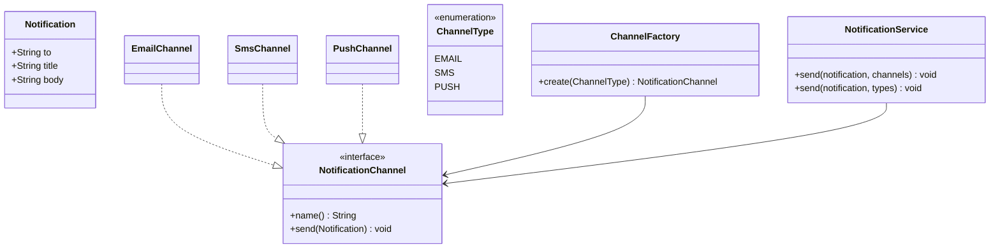
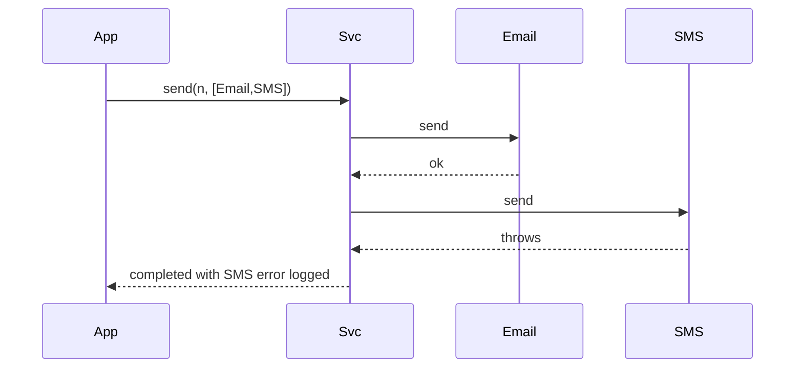

# Notification System — Low-Level Design

A complete Low-Level Design for multi-channel notifications (Email, SMS, Push) with **Strategy** transports, failure isolation, and an optional **Observer/outbox** bridge from domain events.

> **Core insight:** "notify the user" is stable; SMTP/SMS/FCM details churn. Channels implement one interface. One channel dying must not block the others unless you explicitly chose all-or-nothing.

---

## 📌 Problem Statement

Design a notifier that accepts a logical `Notification` and delivers it through one or more channels, supports adding channels without editing callers, and documents reliability options (sync best-effort vs async outbox).

---

## ✅ Requirements

### Functional

1. Payload: recipient, title/subject, body.
2. Channels: Email, SMS, Push (mocked).
3. `NotificationService.send(notification, channels)`.
4. Per-channel try/catch (best-effort policy).
5. Optional factory: `ChannelType  → NotificationChannel`.

### Non-Functional

* Testable via interface fakes.
* No doubles for money (N/A) but validate non-blank recipient.
* Sync OK for LLD; async as extension.

### Out of Scope

* Full template CMS, i18n pipelines, provider multi-region failover code, preference center UI.

---

## 🧠 Core Design Idea

```text
Domain service                    NotificationService
     |                                    |
     | domain event / direct call         ├── EmailChannel
     └------------------------------------├── SmsChannel
                                          └── PushChannel
```

### Wiring options

| Wiring | When |
|--------|------|
| Direct Strategy list | Caller knows channels (sketch) |
| User preferences port | Load channels per user |
| Observer | Domain emits event; notifier listens |
| Transactional outbox | Persist intent; worker sends |

### Failure policies

| Policy | Behavior |
|--------|----------|
| Best effort (sketch) | Log fail; continue |
| Fail-fast | Abort remaining |
| Retry + DLQ | Async workers |

---

## 🏗️ Class Diagram



---

## 🔑 Responsibilities

| Class | Responsibility |
|-------|----------------|
| `Notification` | Immutable payload |
| `NotificationChannel` | Transport |
| Concrete channels | Provider IO (mocked) |
| `NotificationService` | Fan-out + isolation |
| `ChannelFactory` | OCP construction |

---

## 🔄 Sequences

### Best-effort fan-out



### Outbox (extension talk)

```text
DB txn: write business row + outbox row
commit
poller reads outbox — channel.send  → mark sent
```

---

## 🧯 Edge Cases

| Case | Handling |
|------|----------|
| Empty channels | Reject or no-op (declare) |
| Blank recipient | Validate |
| Provider timeout | Catch; retry policy |
| OTP vs marketing | Separate pipelines / quiet hours |
| Duplicate send | Idempotency key |

---

## 🧩 Design Patterns & Principles Used

| Pattern | Where |
|---------|-------|
| **Strategy** | Channels |
| **Factory** | ChannelFactory |
| **Observer** | Domain events |
| **Decorator** | Logging/metrics wrapper |
| **OCP** | WhatsApp channel add |

---

## 🔌 Extensibility

| Feature | Approach |
|---------|----------|
| Templates | Render before send |
| Preferences | `PreferencePort.enabled(user, channel)` |
| Priority queues | OTP high / promo low |
| Batch digest | Scheduler aggregates |

---

## 🧵 Concurrency & reliability

* Sync send blocks request threads — prefer queue in production.
* At-least-once delivery — consumers idempotent.
* Provider rate limits  → token bucket per channel (see Rate Limiter LLD).

---

## 🧪 What the Demo Proves

1. One notification hits Email+SMS+Push.  
2. Service API stable when channel list changes.  

---

## 💡 Interview Talking Points

1. Strategy for channels.  
2. Failure isolation policy stated aloud.  
3. Observer vs direct call.  
4. Outbox for reliability.  
5. OTP vs promo compliance.  
6. Idempotency.  
7. Decorator for metrics.  
8. Tie-in to Pub-Sub LLD for async fan-out.  

---

## 📝 Implementation notes (`Main.java`)

* Channels print instead of IO.
* Service catches `RuntimeException` per channel.

---

## 📁 Files

| File | Purpose |
|------|---------|
| `details.md` | This LLD |
| `Main.java` | Multi-channel send |
