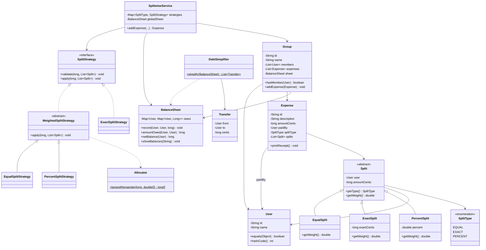
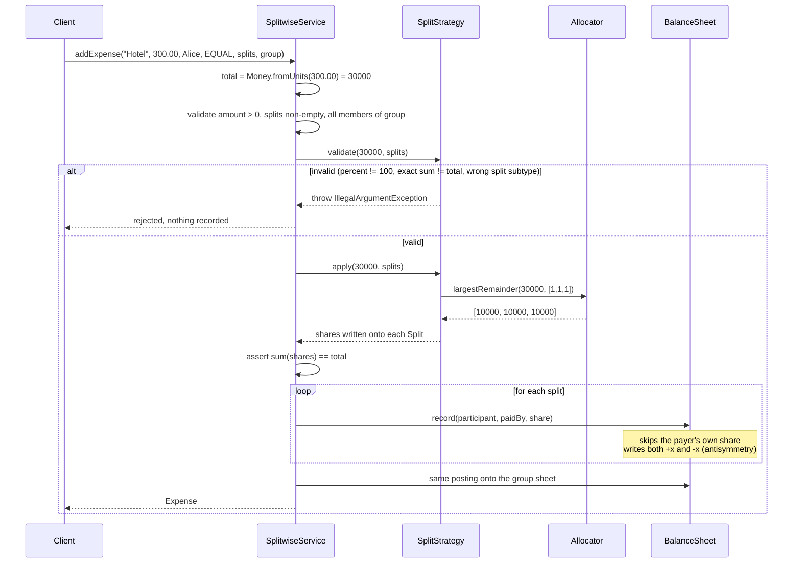

# Splitwise — Low-Level Design

A shared-expense tracker: people pay for things on behalf of a group, and the system keeps a running answer to one question — **who owes whom, and how much?**

This is the highest-value problem in the Social & Money section because it is the one where interviewers actually check your arithmetic. A beautiful class diagram with an off-by-one-cent balance sheet fails the round.

---

## 📌 Problem Statement

Design a system where users record expenses paid by one person on behalf of several, split by different rules (equal / exact / percentage), and query their net balances. Optionally, collapse the tangle of pairwise debts into the fewest possible payments.

---

## ✅ Requirements

### Functional

1. Register users; optionally organise them into **groups**.
2. Add an **expense**: description, total amount, who paid, and how it splits.
3. Support three split types:
   - **EQUAL** — divide evenly across participants
   - **EXACT** — caller supplies each participant's exact amount; must sum to the total
   - **PERCENT** — caller supplies percentages; **must sum to exactly 100**
4. Maintain a **balance sheet**: for every ordered pair `(X, Y)`, the net cents X owes Y.
5. `showBalances()` — list all outstanding debts; `netBalance(user)` — one user's net position.
6. Expenses may be group-scoped (updating both the group sheet and the global sheet) or ad-hoc (global only).
7. **Simplify debts** — reduce the debt graph to a minimal-ish set of transfers.

### Non-Functional

* **Exact money arithmetic.** No cent may be created or destroyed by rounding.
* Adding a fourth split type must not touch existing split code (OCP).
* Balance lookups should be O(1) per pair; `showBalances` O(E) over non-zero edges.
* Validation failures must be loud and specific, never silently coerced.

### Out of Scope

* Multi-currency and FX conversion
* Actual payment rails / settlement confirmation
* Auth, persistence, concurrency, notifications
* Expense comments, receipts, attachments

---

## 💰 The Money Rule (read this before anything else)

**Never store money in `double`.** Binary floating point cannot represent `0.1`, so:

```text
0.1 + 0.2          == 0.30000000000000004
100.0 / 3          == 33.333333333333336
33.33 * 3          == 99.99000000000001
```

Accumulate a few hundred of those into a balance sheet and users see debts like `$49.999999999`. Worse, `a.owes(b) + b.owes(a)` stops being exactly zero, so "settled up" never triggers.

**The rule used here:** convert to `long` cents at the boundary (`Money.fromUnits`), do all arithmetic in `long`, format back to a string only for display. Doubles appear in exactly one place — split *weights* — and are immediately turned back into integer cents by the allocator.

---

## 🧮 The Balance Sheet Convention

Pick a convention and write it on the whiteboard before you write a line of code, because half of all Splitwise interview bugs are sign errors.

```text
owes[X][Y] = the number of cents that X owes Y
```

The map is kept **antisymmetric**: every write does two updates.

```java
record(debtor, creditor, cents):
    owes[debtor][creditor] += cents
    owes[creditor][debtor] -= cents
```

Consequences worth stating out loud:

| Property | Meaning |
|----------|---------|
| `owes[X][Y] == -owes[Y][X]` | A pair's debt is one number; the sign says who owes |
| `owes[X][Y] > 0` | X owes Y — print this direction only, so each pair prints once |
| `owes[X][Y] == 0` | Netted out — the pair is settled |
| `net(X) = -Σ_Y owes[X][Y]` | Positive means the world owes X (X is a creditor) |
| `Σ_X net(X) == 0` | **Invariant.** Money is conserved. Assert this in tests. |

### Posting an expense

When `P` pays `total` and the resolved shares are `share[u]` for each participant `u`:

```text
for each participant u:
    if u == P: skip          // paying for your own share moves no money
    record(u, P, share[u])   // u owes P their share
```

**Sanity check on the canonical case.** A pays 100, split equal with B:

```text
shares    : A = 50, B = 50
u = A      -> skipped (A is the payer)
u = B      -> record(B, A, 50)
result    : owes[B][A] = +50, owes[A][B] = -50
read as   : "B owes A $50"        <-- matches the requirement
net(A)    = -(-50) = +50   (A gets back $50)
net(B)    = -(+50) = -50   (B owes $50)
net sum   = 0                                          OK
```

---

## 🧾 Rounding: the largest-remainder method

`$100.00` across 3 people is `10000 / 3 = 3333.33…` cents. Naive `Math.round` on each share gives `3333 × 3 = 9999` — **one cent vanishes**, and the sheet no longer balances.

The allocator does this instead:

1. Compute each exact share `total × wᵢ / Σw`.
2. Take the **floor** of each. Each floor loses strictly less than one cent, so the leftover `L = total − Σfloor` satisfies `0 ≤ L < n`.
3. Sort participants by fractional part, descending (tie-break on index for determinism).
4. Give one extra cent to each of the first `L` participants.

**Guarantee:** `Σ shares == total`, exactly, for any weights.

```text
$100.00 equal across Frank, Grace, Heidi
exact   : 3333.33  3333.33  3333.33
floor   : 3333     3333     3333      (sum 9999, leftover 1)
fraction: .333     .333     .333      (tie -> lowest index wins)
final   : 3334     3333     3333      (sum 10000)            OK
```

The same routine serves EQUAL (all weights `1`) and PERCENT (weights are the percentages). EXACT needs no allocation at all — the caller already gave integer cents, and validation rejects the input if they do not sum to the total.

---

## 🏗️ Class Diagram



---

## 🔄 Sequence Flow — adding an expense



---

## ✔️ Worked Example (verified against `Main.java` output)

Four users: **Alice, Bob, Charlie, Dave**. Group **Goa Trip** = {Alice, Bob, Charlie}.

### Expense 1 — Alice pays $300.00, EQUAL across Alice/Bob/Charlie

```text
shares : Alice 100.00, Bob 100.00, Charlie 100.00   (30000/3 = 10000 each)
posting: Alice skipped (payer)
         Bob     owes Alice 100.00
         Charlie owes Alice 100.00
```

### Expense 2 — Bob pays $150.00, EXACT: Alice 50, Bob 40, Charlie 60

Validation: `5000 + 4000 + 6000 = 15000` ✓ equals the total.

```text
posting: Alice   owes Bob  50.00
         Bob     skipped (payer)
         Charlie owes Bob  60.00
```

### Expense 3 — Charlie pays $200.00, PERCENT: Alice 50%, Bob 25%, Charlie 25%

Validation: `50 + 25 + 25 = 100` ✓.

```text
shares : Alice 100.00, Bob 50.00, Charlie 50.00
posting: Alice owes Charlie 100.00
         Bob   owes Charlie  50.00
```

### Pairwise netting inside the group

| Pair | From e1 | From e2 | From e3 | Net |
|------|---------|---------|---------|-----|
| Alice ↔ Bob | Bob owes Alice 100.00 | Alice owes Bob 50.00 | — | **Bob owes Alice $50.00** |
| Alice ↔ Charlie | Charlie owes Alice 100.00 | — | Alice owes Charlie 100.00 | **$0.00 — fully cancels** |
| Bob ↔ Charlie | — | Charlie owes Bob 60.00 | Bob owes Charlie 50.00 | **Charlie owes Bob $10.00** |

Group net positions: `Alice +50.00`, `Bob −50.00 + 10.00 = −40.00`, `Charlie −10.00`. Sum = 0 ✓.

### Expense 4 — Dave pays $90.00, EQUAL across all four (no group)

`9000 / 4 = 2250` exactly, so each of Alice, Bob and Charlie owes Dave `$22.50`.

### Final global balance sheet

Raw pairwise debts — **5 edges**:

```text
Bob     owes Alice  $50.00
Bob     owes Dave   $22.50
Alice   owes Dave   $22.50
Charlie owes Bob    $10.00
Charlie owes Dave   $22.50
```

Net positions:

| User | Calculation | Net |
|------|-------------|-----|
| Alice | `+50.00 − 22.50` | **+$27.50** (gets back) |
| Bob | `−50.00 + 10.00 − 22.50` | **−$62.50** (owes) |
| Charlie | `−10.00 − 22.50` | **−$32.50** (owes) |
| Dave | `+22.50 × 3` | **+$67.50** (gets back) |

Conservation check: `27.50 − 62.50 − 32.50 + 67.50 = 0` ✓

### Simplified settlement

Greedy matching of the largest debtor against the largest creditor:

```text
creditors: Dave 67.50, Alice 27.50
debtors  : Bob  62.50, Charlie 32.50

round 1: Bob(62.50)     vs Dave(67.50)  -> Bob pays Dave 62.50    (Dave left 5.00)
round 2: Charlie(32.50) vs Alice(27.50) -> Charlie pays Alice 27.50 (Charlie left 5.00)
round 3: Charlie(5.00)  vs Dave(5.00)   -> Charlie pays Dave 5.00
```

**5 debts → 3 transfers.** Verify by conservation: Bob pays 62.50 (owed 62.50 ✓), Charlie pays 27.50 + 5.00 = 32.50 ✓, Alice receives 27.50 ✓, Dave receives 62.50 + 5.00 = 67.50 ✓.

### Rounding case

`$100.00` equal across Frank/Grace/Heidi → `33.34 / 33.33 / 33.33`, summing to exactly `$100.00`. Grace and Heidi each owe Frank `$33.33`, so Frank is up `$66.66` — precisely the `$100.00` he paid minus his own `$33.34` share ✓.

---

## 🎯 Design Decisions

| Decision | Why | Alternative rejected |
|----------|-----|----------------------|
| `long` cents, not `double` / `BigDecimal` | Exact, fast, trivially comparable; two decimal places is all money needs | `BigDecimal` is exact too but verbose and easy to misuse (`equals` vs `compareTo`, scale surprises). Say this out loud — it earns credit. |
| `Split` hierarchy **and** `SplitStrategy` | `Split` is polymorphic *input data* (what the user typed); `SplitStrategy` is the *algorithm* (validate + resolve). Separating them keeps each tiny. | Putting `calculate()` on `Split` forces each split to know the total and its siblings — that is not a per-participant concern. |
| One shared `Allocator` | Rounding is the single riskiest piece of logic; it lives in one place with one guarantee, and both weighted strategies reuse it. | Rounding inline in each strategy = three places to get wrong. |
| Antisymmetric balance map | A pair's debt is one number, direction is the sign, "settled" is exactly zero | Storing both directions independently invites them to disagree. |
| Strategy registry `Map<SplitType, SplitStrategy>` in the service | Adding a type = register one entry; no `switch` to hunt down | A `switch` on `SplitType` violates OCP and spreads across the codebase. |
| Post-condition assert `Σ shares == total` | Catches any future rounding bug at write time, not three months later in a user's balance | Trusting the strategy. |
| Group sheet **and** global sheet | Mirrors real Splitwise: "your balance in this group" vs "your total balance" | A single sheet cannot answer the group-scoped question. |
| Payer's own share is skipped, not recorded | `record()` guards `debtor.equals(creditor)`; self-debt is meaningless | Recording it then filtering later leaks noise into the map. |

---

## ⚠️ Edge Cases

| Case | Handling |
|------|----------|
| Percentages sum to 99.99 or 100.01 | Rejected with the actual sum in the message (epsilon `1e-6` for float slop) |
| Exact shares do not sum to the total | Rejected, both figures shown |
| Mixed split subtypes in one expense | Rejected by `requireType` — an EQUAL expense may only hold `EqualSplit`s |
| Non-divisible amount (`$100 / 3`) | Largest-remainder allocator; no cent lost |
| Payer is also a participant | Their share is skipped — they already paid it |
| Payer is *not* a participant | Fine; they simply get the whole amount back |
| Zero or negative expense amount | Rejected |
| Negative percentage or exact share | Rejected |
| Empty split list | Rejected |
| Participant not in the group | Rejected before anything is posted |
| Debts fully cancel (Alice ↔ Charlie above) | Stored as `0`; `showBalances` prints only positive entries, so it disappears |
| Everyone settled | `showBalances` prints "(everyone is settled up)" |
| Duplicate user in the split list | **Known gap.** Would double-count. Fix: reject duplicates, or merge weights per user. Mention this — interviewers probe it. |

---

## 🚀 Extensions

| Extension | How the design absorbs it |
|-----------|---------------------------|
| **Split by shares** (2 shares Alice, 1 Bob) | New `ShareSplit(weight)` + `ShareSplitStrategy extends WeightedSplitStrategy`; the allocator already handles arbitrary weights. Register it. Nothing else changes. |
| **Split by adjustment** (+$5 for Alice, rest equal) | New strategy: subtract adjustments, allocate the remainder equally, add back. |
| **Settle-up payment** | Model as an expense with a single split: `record(payer, payee, amount)` in reverse. Balance sheet needs no change. |
| **Multi-currency** | Money becomes `(cents, Currency)`; keep one balance sheet *per currency*, or store a rate snapshot on the expense. Never net across currencies silently. |
| **Optimal min cash flow** | The greedy here gives ≤ n−1 transfers. The true minimum is `n − (max number of zero-sum subsets)`, and finding those subsets is NP-hard (subset-sum). Exact solvers use DP over bitmasks for small n. **This is the single best scaling answer in this problem.** |
| **Expense edit / delete** | Store the posted deltas on the `Expense`, then reverse them. Do not recompute the whole sheet. |
| **Audit trail** | Every `record()` writes an immutable ledger entry; the map becomes a cached projection. |
| **Concurrency** | Per-group lock, or make the sheet an append-only event log with a materialised view. |
| **Persistence** | The `owes` map is a derived view — persist expenses as the source of truth and rebuild or incrementally update the sheet. |

---

## 📁 Files in this folder

| File | Purpose |
|------|---------|
| `details.md` | This LLD explanation |
| `Main.java` | Runnable single-file implementation, self-verifying with `expect(...)` assertions |

Run it:

```bash
javac Main.java && java Main
```

Every printed number is asserted against the hand-computed values in the worked example above; the program throws `AssertionError` if the arithmetic ever drifts.

---

## 💡 Interview Talking Points

1. **State the money rule in the first 60 seconds.** "I'll store cents as `long`, never `double`." This single sentence separates candidates.
2. **Write the balance convention on the board** before coding: `owes[X][Y] = X owes Y`, kept antisymmetric. Then trace the canonical case — A pays 100 split with B → B owes A 50 — out loud.
3. **Volunteer the rounding problem.** `$100 / 3` is the classic trap. Explain the largest-remainder method and the `Σ shares == total` guarantee.
4. **Justify two abstractions, not one.** `Split` = input data per participant, `SplitStrategy` = algorithm over the whole expense. Show that adding "split by shares" is one new class.
5. **Name the invariant:** net positions always sum to zero. Say you would assert it in tests. It is the cheapest correctness proof in the problem.
6. **Close with min cash flow.** Greedy gives ≤ n−1 transfers; the true optimum is NP-hard via subset partitioning. Knowing *why* it's hard beats knowing an algorithm.
7. **Admit the duplicate-participant gap** before they find it. Naming your own edge case reads as rigour.

---

[⬅ Back to Social & Money](../README.md) · [⬅ LLD index](../../README.md)
