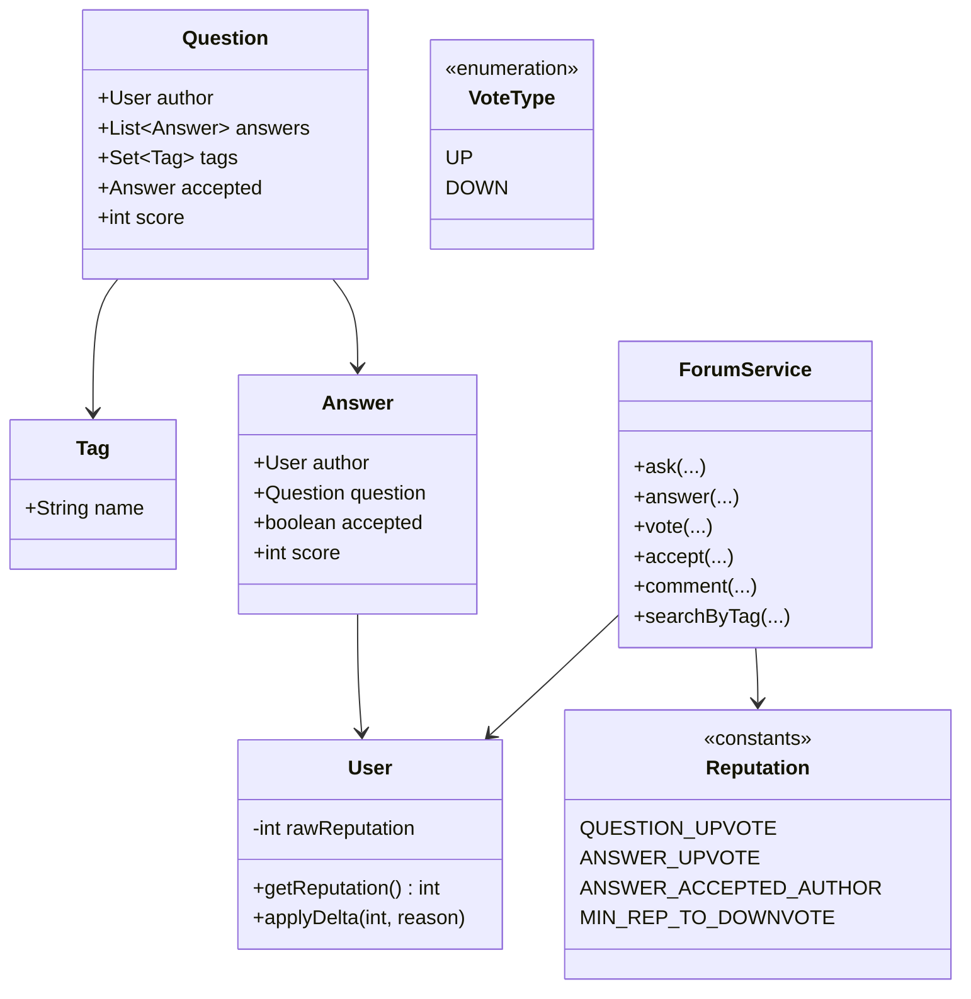
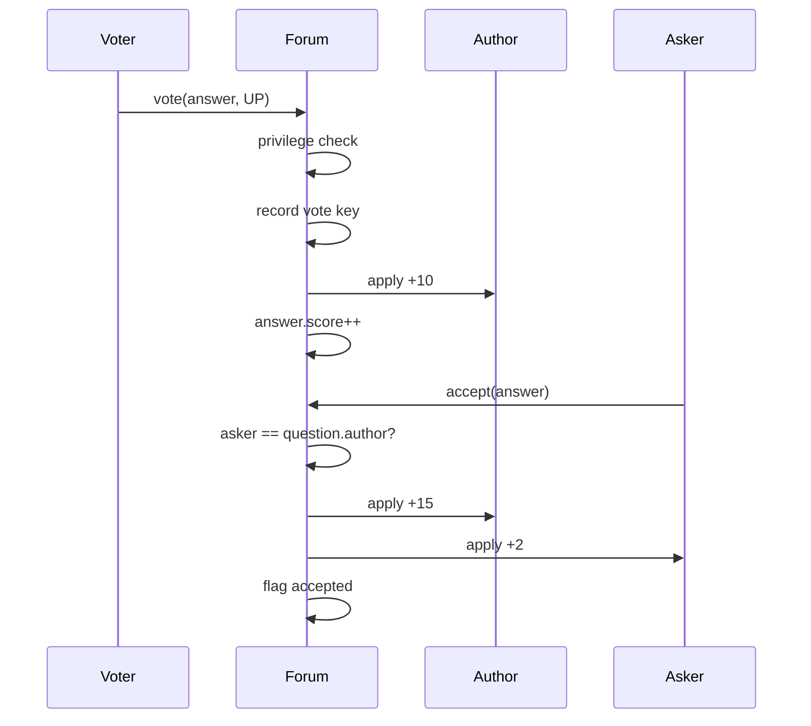

# Stack Overflow (Simplified) — Low-Level Design

A complete Low-Level Design for a **Q&A forum**: questions, answers, tags, votes, accept-answer, and reputation. Matches the rich rule table in `Main.java` (upvote/downvote deltas, voter costs, privilege gates, reversible reputation).

> **Core insight:** a vote is not `score++`. It is a constrained state change on key `(voterId, targetId)` with **reversible** side effects on author (and sometimes voter) reputation. If reputation is clamped before revert, undo invents or destroys rep — store raw totals, clamp on read.

---

## 📌 Problem Statement

Design a system where users:

1. Ask questions (title, body, tags)
2. Answer questions
3. Upvote/downvote questions and answers
4. Earn/lose reputation from a documented rules table
5. Accept exactly one answer per question (asker only)
6. Comment with a minimum reputation gate
7. Search questions by tag

---

## ✅ Requirements

### Functional

1. Entities: `User`, `Question`, `Answer`, `Tag`, vote records, `ForumService` / `Reputation` constants.
2. Vote uniqueness: one active vote per `(voter, target)`; changing vote reverses old delta then applies new.
3. Reputation table (see below) applied centrally.
4. Accept: only asker; switching accept moves the bonus.
5. Privilege: e.g. downvote requires min rep; comment requires min rep.
6. Tag filter returns matching questions.

### Non-Functional

* All magic numbers live in one `Reputation` class.
* Reputation floor (e.g. display min 1) must not break reversibility — clamp on **read**.
* Deterministic clock for ordering demos.

### Out of Scope

* Elasticsearch, moderation queues, bounties UI, real anti-fraud, full privilege ladder, notifications (see Notification LLD).

---

## 🧠 Core Design Idea

### Reputation table (write this on the board)

| Event | Author Δ | Voter Δ |
|-------|----------|---------|
| Question upvote | +5 | 0 |
| Question downvote | -2 | 0 (or configured) |
| Answer upvote | +10 | 0 |
| Answer downvote | -2 | -1 (cost to downvote answers) |
| Answer accepted | +15 author | — |
| Asker accepts | +2 asker | — |

Privilege examples:

| Action | Min rep |
|--------|---------|
| Downvote | 125 |
| Comment | 50 |

### Vote key invariant

```text
votes[(voterId, targetType, targetId)] = UP | DOWN | absent
```

Switch UP → DOWN:

```text
revert UP deltas; apply DOWN deltas; store DOWN
```

### Accept invariant

```text
question.acceptedAnswer is null or one Answer belonging to this question
only question.author may accept
on switch: remove old accept bonuses; apply new
```

### Why raw reputation?
```text
raw=1, apply -2 → raw=-1, display=max(raw,1)=1
revert +2 → raw=1  ✓
if you clamped on write to 1 when applying -2:
  raw stays 1, revert +2 → raw=3  → invented reputation
```

---

## 🏗️ Class Diagram



---

## 🔑 Responsibilities

| Class | Responsibility |
|-------|----------------|
| `Reputation` | Sole numeric policy |
| `User` | Raw rep + log; clamped getter |
| `Question`/`Answer` | Content + score + links |
| `ForumService` | Invariants: vote/accept/privileges |

Never sprinkle `+10` in controllers — interviewers change the table to see if you chase magic numbers.

---

## 🔄 Sequence — vote + accept



---

## 🧮 Algorithms

### vote(target, type)

```text
if voter == author: reject (self-vote policy)
if type==DOWN and voter.rep < MIN_DOWNVOTE: reject
old = votes.get(key)
if old == type: no-op
if old != null: revert(old)
apply(type)
votes[key] = type
```

### accept(answer)

```text
if caller != question.author: reject
if answer.question != question: reject
if oldAccepted != null and oldAccepted != answer:
    unapply accept bonuses on old
    old.accepted=false
apply accept bonuses on answer
answer.accepted=true
question.accepted=answer
```

---

## 🧯 Edge Cases

| Case | Handling |
|------|----------|
| Double upvote | No-op |
| Flip vote | Revert then apply |
| Self-vote | Reject |
| Accept by non-asker | Reject |
| Accept then accept other | Move flag + rep |
| Rep display floor | Clamp on read only |
| Empty tag search | Empty list |

---

## 🧩 Design Patterns & Principles Used

| Item | Where |
|------|-------|
| **SRP** | Policy in `Reputation` |
| **Facade** | ForumService |
| Reversible commands | Vote/accept deltas |
| Privilege gates | ISP-ish: not everyone can downvote |

---

## 🔌 Extensibility

| Feature | Approach |
|---------|----------|
| Comments | Entity + min rep gate |
| Bounties | Escrow rep transfer |
| Close votes | Question status enum |
| Full-text search | Index outside domain |
| Audit | reputationLog already sketches this |

---

## 🧵 Concurrency

* Vote key insert needs uniqueness constraint / `putIfAbsent`.
* Score increments under synchronized target or DB atomic update.
* Accept switch should be single-threaded per question.

---

## 🧪 What the Demo Proves

1. Ask → answer → upvote changes author rep by +10.  
2. Accept adds +15/+2 per table.  
3. Downvote privilege gate works.  
4. Tag search returns the question.  
5. Flip vote does not double-apply.  

---

## 💡 Interview Talking Points

1. Write the rep table first.  
2. Vote uniqueness key.  
3. Raw vs clamped reputation.  
4. Reversibility of deltas.  
5. Accept permission.  
6. Self-vote policy.  
7. Why search isn't `stream.filter` at scale.  
8. Voter cost on answer downvote (anti-abuse).  

---

## 📝 Implementation notes (`Main.java`)

* `Reputation` constants match the table above.
* `Clock.tick()` monotonic ids/timestamps for stable output.
* `User.reputationLog` helps debug demos.
* Privilege checks before mutating scores.

---

## 📁 Files

| File | Purpose |
|------|---------|
| `details.md` | This LLD |
| `Main.java` | Full ask/answer/vote/accept/privilege demo |
