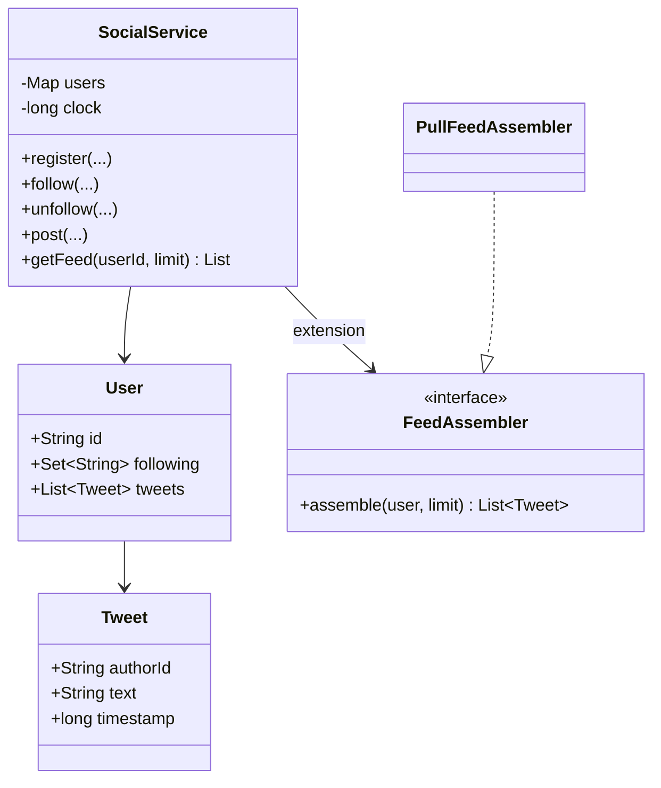
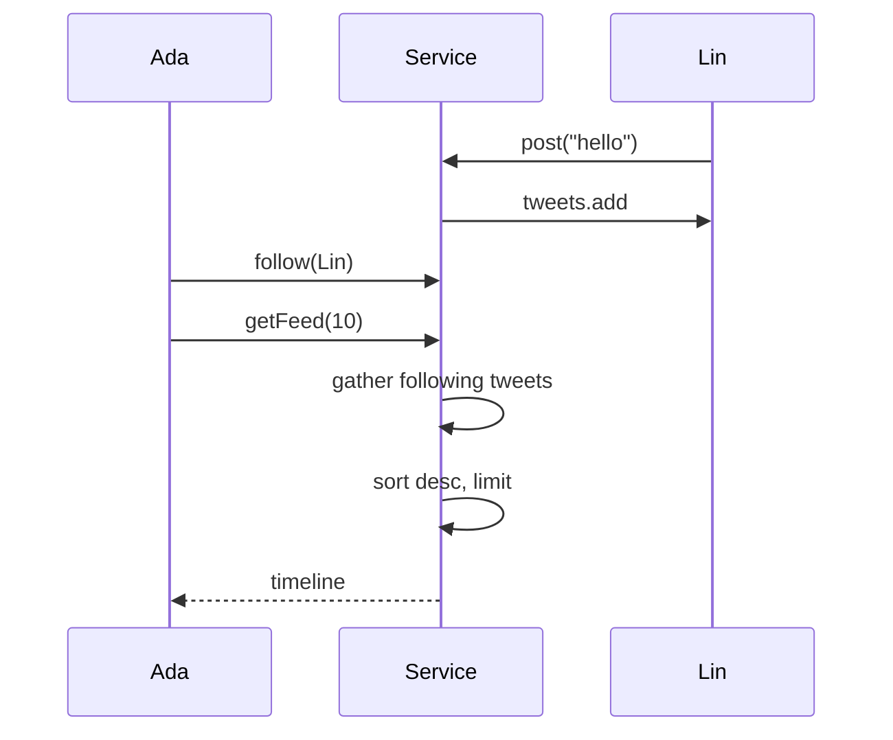

# Twitter Feed (Simplified) — Low-Level Design

A complete Low-Level Design for follow-graph social posts and a home timeline. The sketch implements **pull (fan-out-on-read)**; the document teaches pull, push, and the **hybrid celebrity** approach used in real systems.

> **Core insight:** writing a tweet is easy (append to author). The product question is *when* followers see it — gathered at read time, or pushed into millions of inboxes at write time.

---

## 📌 Problem Statement

Design a system where users can register, follow/unfollow, post tweets, and read a home feed = recent tweets from followees (and self), newest first, limited to K.

---

## ✅ Requirements

### Functional

1. `register`, `follow`, `unfollow`, `post`, `getFeed(userId, limit)`.
2. Directed follow edges.
3. Feed sorted by descending timestamp.
4. Own tweets visible (auto-follow self **or** union self in query — sketch uses auto-follow self).
5. Deterministic clock for demos.

### Non-Functional

* Explicit pull vs push tradeoff discussion.
* Naive pull complexity stated honestly.
* No hidden global "all tweets" scan if avoidable.

### Out of Scope

* Media CDN, likes/retweets graph, ML ranking, ads, search, live streaming.

---

## 🧠 Core Design Idea — three delivery models

### 1) Pull (fan-out on read)  → this sketch

```text
getFeed(U):
  bag = []
  for f in U.following:
      bag += f.tweets
  sort bag by time desc
  return top K
```

| Pros | Cons |
|------|------|
| Writes O(1) append | Reads O(F  T_f) before sort |
| Simple operationally | Heavy followers-of-many |

### 2) Push (fan-out on write)

```text
post(U, tweet):
  for each follower F of U:
      F.inbox.appendleft(tweet)
getFeed(U):
  return U.inbox top K
```

| Pros | Cons |
|------|------|
| Reads cheap | Celebrity write touches huge fan-out |
| | Storage amplification |

### 3) Hybrid (production lore)

* Push for normal users.
* **Do not** fan-out celebrities; pull their tweets at read and merge.
* Merge = k-way merge of inbox + celebrity timelines.

**Say hybrid even if you code pull.**

---

## 🏗️ Class Diagram



---

## 🔑 Responsibilities

| Class | Responsibility |
|-------|----------------|
| `Tweet` | Immutable content + time |
| `User` | Graph + own tweet list |
| `SocialService` | Use cases + clock |
| `FeedAssembler` (ext) | Swap pull/push/hybrid |

---

## 🔄 Sequence  → pull feed



---

## 🧮 Complexity & indexing talk track

| Approach | getFeed cost |
|----------|--------------|
| Naive gather+sort | O(N log N) on gathered size |
| Per-user tweet list already time-ordered | k-way merge O(F log F + K) |
| Cached timeline | O(K) with invalidation on follow/post |

---

## 🧯 Edge Cases

| Case | Handling |
|------|----------|
| Follow unknown | Reject |
| Unfollow self | No-op if self required |
| Double follow | Set |
| Empty following | Empty/own-only feed |
| Deleted tweet | Soft delete filter |
| Block relationship | Extension filter |

---

## 🧩 Design Patterns & Principles Used

| Item | Notes |
|------|-------|
| Strategy | FeedAssembler |
| SRP | Graph vs assembly |
| OCP | Hybrid without rewriting post() much |

---

## 🔌 Extensibility

| Feature | Approach |
|---------|----------|
| Cursor pagination | `(ts, id)` cursor |
| Ranked feed | Score after candidates |
| Fan-out workers | Async queue on post |
| Mute/block | Filter set in assembler |

---

## 🧵 Concurrency

* `post` append must be thread-safe per user list.
* Follow edge updates concurrent with feed reads — accept briefly stale or copy-on-read the following set.

---

## 🧪 What the Demo Proves

1. Ada follows Lin & Grace — sees their tweets.  
2. Newest first order.  
3. Own tweet appears when self-followed.  
4. Unfollow removes future posts from feed.  

---

## 💡 Interview Talking Points

1. Draw pull vs push first.  
2. Celebrity problem.  
3. Hybrid merge.  
4. Why auto-follow self.  
5. k-way merge optimization.  
6. Cache invalidation.  
7. Pagination cursors.  
8. Separate Notification system for ?push alerts → vs feed.  

---

## 📝 Implementation notes (`Main.java`)

* Monotonic `clock++` timestamps.
* `following` includes self at register.
* Feed uses stream sort + limit.

---

## 📁 Files

| File | Purpose |
|------|---------|
| `details.md` | This LLD |
| `Main.java` | Follow + pull feed demo |
