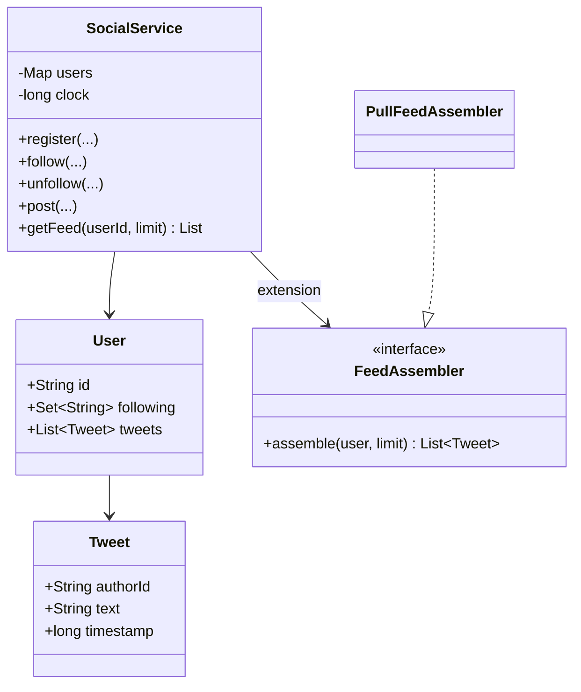
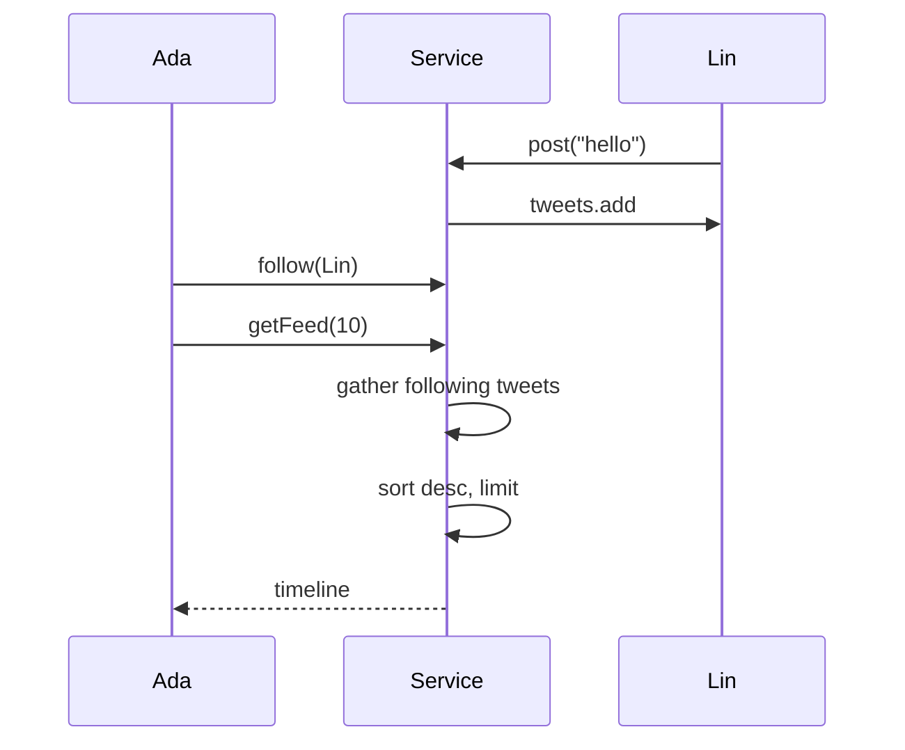

# Twitter Feed (Simplified) ? Low-Level Design

A complete Low-Level Design for follow-graph social posts and a home timeline. The sketch implements **pull (fan-out-on-read)**; the document teaches pull, push, and the **hybrid celebrity** approach used in real systems.

> **Core insight:** writing a tweet is easy (append to author). The product question is *when* followers see it ? gathered at read time, or pushed into millions of inboxes at write time.

---

## ?? Problem Statement

Design a system where users can register, follow/unfollow, post tweets, and read a home feed = recent tweets from followees (and self), newest first, limited to K.

---

## ? Requirements

### Functional

1. `register`, `follow`, `unfollow`, `post`, `getFeed(userId, limit)`.
2. Directed follow edges.
3. Feed sorted by descending timestamp.
4. Own tweets visible (auto-follow self **or** union self in query ? sketch uses auto-follow self).
5. Deterministic clock for demos.

### Non-Functional

* Explicit pull vs push tradeoff discussion.
* Naive pull complexity stated honestly.
* No hidden global ?all tweets? scan if avoidable.

### Out of Scope

* Media CDN, likes/retweets graph, ML ranking, ads, search, live streaming.

---

## ?? Core Design Idea ? three delivery models

### 1) Pull (fan-out on read) ? this sketch

```text
getFeed(U):
  bag = []
  for f in U.following:
      bag += f.tweets
  sort bag by time desc
  return top K
```

| Pros | Cons |
|------|------|
| Writes O(1) append | Reads O(F ◊ T_f) before sort |
| Simple operationally | Heavy followers-of-many |

### 2) Push (fan-out on write)

```text
post(U, tweet):
  for each follower F of U:
      F.inbox.appendleft(tweet)
getFeed(U):
  return U.inbox top K
```

| Pros | Cons |
|------|------|
| Reads cheap | Celebrity write touches huge fan-out |
| | Storage amplification |

### 3) Hybrid (production lore)

* Push for normal users.
* **Do not** fan-out celebrities; pull their tweets at read and merge.
* Merge = k-way merge of inbox + celebrity timelines.

**Say hybrid even if you code pull.**

---

## ??? Class Diagram



---

## ?? Responsibilities

| Class | Responsibility |
|-------|----------------|
| `Tweet` | Immutable content + time |
| `User` | Graph + own tweet list |
| `SocialService` | Use cases + clock |
| `FeedAssembler` (ext) | Swap pull/push/hybrid |

---

## ?? Sequence ? pull feed



---

## ?? Complexity & indexing talk track

| Approach | getFeed cost |
|----------|--------------|
| Naive gather+sort | O(N log N) on gathered size |
| Per-user tweet list already time-ordered | k-way merge O(F log F + K) |
| Cached timeline | O(K) with invalidation on follow/post |

---

## ?? Edge Cases

| Case | Handling |
|------|----------|
| Follow unknown | Reject |
| Unfollow self | No-op if self required |
| Double follow | Set |
| Empty following | Empty/own-only feed |
| Deleted tweet | Soft delete filter |
| Block relationship | Extension filter |

---

## ?? Patterns & Principles

| Item | Notes |
|------|-------|
| Strategy | FeedAssembler |
| SRP | Graph vs assembly |
| OCP | Hybrid without rewriting post() much |

---

## ?? Extensibility

| Feature | Approach |
|---------|----------|
| Cursor pagination | `(ts, id)` cursor |
| Ranked feed | Score after candidates |
| Fan-out workers | Async queue on post |
| Mute/block | Filter set in assembler |

---

## ?? Concurrency

* `post` append must be thread-safe per user list.
* Follow edge updates concurrent with feed reads ? accept briefly stale or copy-on-read the following set.

---

## ?? Demo proves

1. Ada follows Lin & Grace ? sees their tweets.  
2. Newest first order.  
3. Own tweet appears when self-followed.  
4. Unfollow removes future posts from feed.  

---

## ?? Interview Talking Points

1. Draw pull vs push first.  
2. Celebrity problem.  
3. Hybrid merge.  
4. Why auto-follow self.  
5. k-way merge optimization.  
6. Cache invalidation.  
7. Pagination cursors.  
8. Separate Notification system for ?push alerts? vs feed.  

---

## ?? Implementation notes (`Main.java`)

* Monotonic `clock++` timestamps.
* `following` includes self at register.
* Feed uses stream sort + limit.

---

## ?? Files

| File | Purpose |
|------|---------|
| `details.md` | This LLD |
| `Main.java` | Follow + pull feed demo |

---

## 📚 Extended teaching notes — Twitter-Feed

This section exists so the write-up matches the depth of Parking Lot / Hotel / Splitwise in this bible: more failure modes, more whiteboard scripts, and more “what I would say next.”

### Whiteboard script (8–10 minutes)

1. **Clarify scope (1 min).** Restate functional bullets and say three out-of-scope items aloud.
2. **Entities (1 min).** List 6–8 nouns; mark which are value objects vs entities.
3. **Core rule (2 min).** Write the single formula or state diagram that makes the design correct.
4. **Class diagram (2 min).** Boxes + relationships only for classes you will defend.
5. **API walk (2 min).** One happy sequence; one failure sequence.
6. **Close (1–2 min).** Concurrency, complexity, one extension.

### Failure-mode catalog

| # | Failure | Detection | Mitigation |
|---|---------|-----------|------------|
| 1 | Partial side effect | Two-phase / plan-then-commit | Compensating action |
| 2 | Double submit | Idempotency key | Deduplicate |
| 3 | Lost update | Version / CAS | Retry |
| 4 | Stale read | TTL / re-read | Accept or refresh |
| 5 | Resource exhaustion | Explicit null/empty | Backpressure / reject |
| 6 | Illegal transition | State guard | Throw / message |
| 7 | Validation gap | Boundary checks | Reject early |
| 8 | Clock skew | Inject clock | Monotonic / server time |

### Testing matrix

| Layer | What to test | Example |
|-------|--------------|---------|
| Unit | Core rule | Overlap truth table / state table / vote math |
| Unit | Strategy swap | Alternate matching or pricing |
| Integration | Facade flow | Happy path through service |
| Adversarial | Illegal calls | Double complete, bad PIN, sold out |
| Property | Invariants | Spot free XOR occupied; balances sum to zero |

### Complexity cheat sheet

| Operation family | Typical LLD cost | Scale upgrade |
|------------------|------------------|---------------|
| Linear scan resources | O(n) | Index / partition |
| Interval conflict | O(m) per resource | Interval tree |
| Graph gather | O(F·T) | Push inbox / cache |
| Tick simulation | O(e) elevators | Event queue |

### Concurrency talking track (memorize)

Shared mutable resource ‚Üí name it ‚Üí pick grain of lock (object vs row vs partition) ‚Üí prefer CAS/check-and-set when races are expected ‚Üí mention DB unique constraints for multi-node ‚Üí idempotency for network retries.

### Extension prompts interviewers love

* “Add X without rewriting the orchestrator” → OCP / Strategy / new state.
* “Two users click at once” → concurrency paragraph.
* “How do you test?” → deterministic seams (dice, clock, bank).
* “What did you leave out?” → out-of-scope list, not apology.

### Mapping back to `Main.java`

When you revise, open `Main.java` beside this doc and tick:

- [ ] Every public API in the diagram appears in code
- [ ] Every demo print maps to a requirement bullet
- [ ] At least one failure path is executed
- [ ] Magic numbers are named constants when they encode policy

### Glossary for this module

| Term | Meaning in Twitter-Feed |
|------|------------------|
| Facade | Entry service that preserves invariants |
| Strategy | Swappable policy object |
| Invariant | Fact that must always hold after a successful call |
| Soft cancel | Status flip instead of row delete |
| Plan-then-commit | Validate/plan fully before mutating durable state |

### Mini mock questions (answer in one breath each)

1. What is the single most important invariant?
2. Where does that invariant live in code?
3. What is the first class you would add for the next feature?
4. What breaks first at 100√ó traffic?
5. How do you make the demo deterministic?

If you can answer those five without scrolling, you own this design.

### Related modules in this bible

Cross-read for transfer learning: Hotel Booking (intervals), Cab Booking (matching), Vending/ATM (state), LRU/Rate Limiter (infra math), Splitwise (policy tables). Steal structures, not prose.

### Final revision ritual

Cover the class diagram ‚Üí redraw from memory ‚Üí compare ‚Üí run `javac Main.java && java Main` ‚Üí explain one failure log line as if to an interviewer.


---

## üßæ Annotated walkthrough checklist

Use this as a verbal checklist while tracing ``Main.java``:

1. Construction / wiring — which strategies or dependencies are injected?
2. First mutating call — what invariant is established?
3. Second call — happy path progress.
4. Forced failure — confirm rejection leaves prior state intact.
5. Terminal state — resources freed (spots, drivers, agents, locks, balances)?
6. Idempotent repeat — second complete/cancel/unpark behavior?

### Design smells to avoid naming in interviews

| Smell | Fix |
|-------|-----|
| God service does pricing + matching + persistence | Split ports |
| Anemic domain + all ifs in one method | State / Strategy |
| Magic numbers in flow | Policy constants class |
| boolean flags for lifecycle | Explicit enum + guards |
| Catching and ignoring errors | Surface domain errors |

### One-page summary you could rewrite from memory

**Problem:** (one sentence)  
**Core rule:** (one formula / diagram)  
**Key classes:** (5 names)  
**Patterns:** (≤3)  
**Hardest edge case:** (one)  
**Scale bridge:** (one sentence)

Practice rewriting that six-liner cold before interviews.


---

## 🎯 Mastery bar for this module

You are “done” with this design when you can do all of the following **without opening the file**:

1. Redraw the class diagram with relationships.
2. Recite the core rule / state machine.
3. Narrate the happy-path sequence end-to-end.
4. Narrate one failure path and the leftover-state cleanup.
5. Name the concurrency hotspot and your locking story.
6. Propose one extension that only adds a class (OCP).
7. Contrast this module with its nearest sibling in the bible (e.g. Cab vs Food agent matching; Hotel vs Meeting overlap).

### Common interviewer follow-ups (prepare answers)

* “Where do you put validation — API layer or domain?”
* “How would you persist this?”
* “What metrics would you emit?”
* “How do you version the API when the state machine gains a state?”
* “What would you delete if you had to simplify for MVP?”

Write a sticky note answer for each; keep them short.

### Code reading order

1. Enums / value objects  
2. Strategy interfaces  
3. Entity mutators with guards  
4. Facade/service orchestration  
5. ``main`` demo scenarios  

That order matches how strong candidates explain designs: meaning ‚Üí policy ‚Üí mutation ‚Üí orchestration ‚Üí proof.

