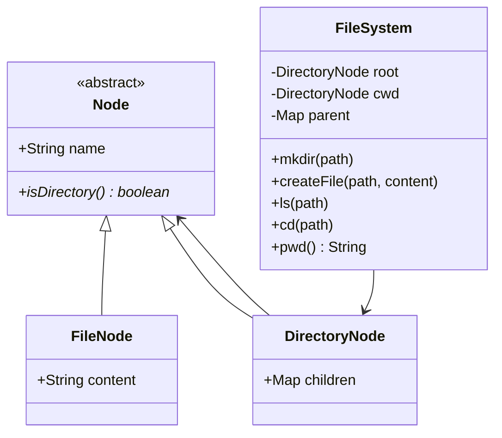
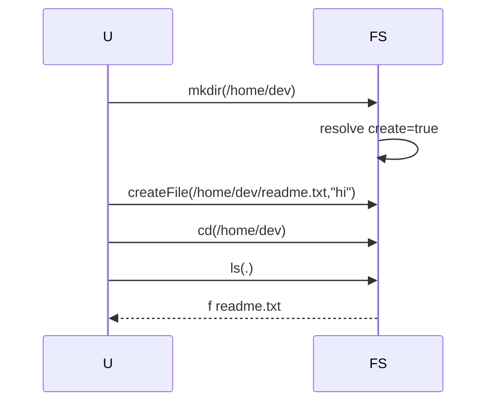

# File System — Low-Level Design

A complete Low-Level Design for an in-memory hierarchical file system using the **Composite** pattern: `FileNode` and `DirectoryNode` share `Node`; directories recursively contain nodes; `FileSystem` owns path resolution (`.`, `..`, absolute/relative).

> **Core insight:** Composite gives you a uniform `Node` for names/types. Path semantics (`/a/../b`) must **not** be copy-pasted into every node  → centralize resolution in `FileSystem`.

---

## 📌 Problem Statement

Design a simplified FS API with root `/`, `mkdir`, `createFile`, `ls`, `cd`, `pwd`, supporting absolute paths and `.` / `..` segments.

---

## ✅ Requirements

### Functional

1. `FileNode` holds content; `DirectoryNode` holds `Map<String,Node>` children.
2. `mkdir` creates intermediate directories (`mkdir -p` style in sketch).
3. `createFile(path, content)` places a file in its parent dir.
4. `cd` updates cwd; `pwd` reconstructs absolute path via parent links.
5. `ls` lists children with `d`/`f` markers.
6. Reject `cd` into a file; `..` at root stays root.

### Non-Functional

* Parent pointers (or parent map) for `..` and `pwd`.
* Stable iteration (`LinkedHashMap`).
* Clear errors for missing paths.

### Out of Scope

* chmod ACL, symlinks, hard links, real block allocation, `rm -rf`, concurrent writers locking.

---

## 🧠 Core Design Idea  → Composite

```text
        Node <<abstract>>
        /              \
  FileNode          DirectoryNode
  (leaf)            children: name  → Node
```

**Uniformity:** callers can ask `isDirectory()` without knowing concrete type.  
**Non-uniformity:** only directories have children — classic ?transparent vs safe → Composite debate; we choose safe (no children API on File).

### Path resolution

```text
cur = absolute  → root : cwd
for segment in split(path):
  if segment in {"", "."}: continue
  if segment == "..":
      cur = parent(cur) or root
      continue
  next = cur.children[segment]
  if next == null:
      if createMissing: make DirectoryNode; link parent; cur = new
      else error
  else if need to descend and next is file: error
  else cur = (DirectoryNode) next
return cur
```

---

## 🏗️ Class Diagram



---

## 🔑 Responsibilities

| Class | Responsibility |
|-------|----------------|
| `Node` | Name + type |
| `FileNode` | Leaf bytes/text |
| `DirectoryNode` | Child map |
| `FileSystem` | CWD, parse, parent map, API |

---

## 🔄 Sequence  → mkdir + file + ls



---

## 🧯 Edge Cases

| Case | Handling |
|------|----------|
| `cd` file | Error |
| `..` at root | Stay |
| `//` empty segments | Skip |
| Name collision | Prefer reject file vs dir clash |
| `mkdir /` | No-op |
| Relative create | Resolve vs cwd |

---

## 🧩 Design Patterns & Principles Used

| Pattern | Where |
|---------|-------|
| **Composite** | Node tree |
| Interpreter-lite | Path walk |
| SRP | Parse  → storage |

---

## 🔌 Extensibility

| Feature | Approach |
|---------|----------|
| `rm`/`rmdir` | Unlink + cycle checks |
| Symlink | `LinkNode` |
| Permissions | User on Node |
| Persist | Serialize tree |
| Watchers | Observer on dir |

---

## 🧵 Concurrency

* Lock per directory for mutations.
* `pwd`/`parent` map must stay consistent with children links (single mutating method).

---

## 🧪 What the Demo Proves

1. Nested mkdir.  
2. File create + ls.  
3. cd / pwd.  
4. `..` navigation.  

---

## 💡 Interview Talking Points

1. Name Composite + draw tree.  
2. Path resolution including `..`.  
3. mkdir -p scope.  
4. Safe vs transparent Composite.  
5. Symlinks as extension.  
6. Parent map vs parent field.  
7. Concurrent edits.  
8. Contrast with real inode model (HLD/OS).  

---

## 📝 Implementation notes (`Main.java`)

* `parent` map enables `pwd` without storing parent on Node.
* `resolveDir(path, createMissing)` shared by mkdir/cd/ls.

---

## 📁 Files

| File | Purpose |
|------|---------|
| `details.md` | This LLD |
| `Main.java` | Tree build + navigation demo |
