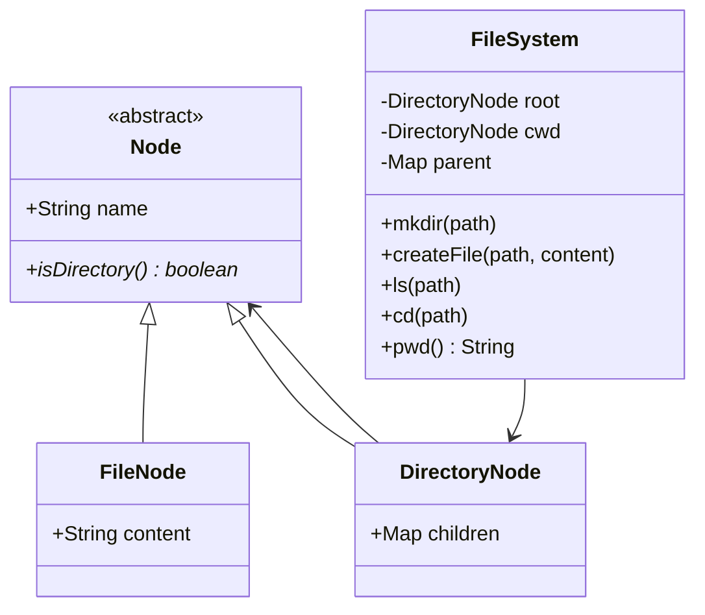
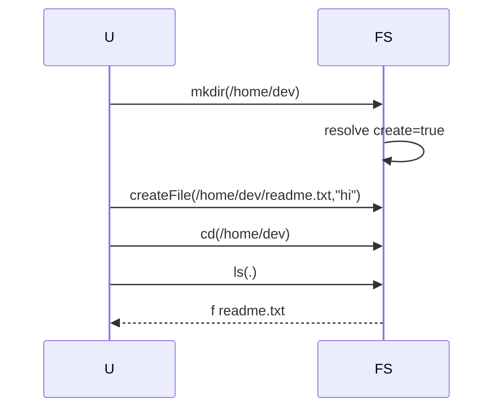

# File System ? Low-Level Design

A complete Low-Level Design for an in-memory hierarchical file system using the **Composite** pattern: `FileNode` and `DirectoryNode` share `Node`; directories recursively contain nodes; `FileSystem` owns path resolution (`.`, `..`, absolute/relative).

> **Core insight:** Composite gives you a uniform `Node` for names/types. Path semantics (`/a/../b`) must **not** be copy-pasted into every node ? centralize resolution in `FileSystem`.

---

## ?? Problem Statement

Design a simplified FS API with root `/`, `mkdir`, `createFile`, `ls`, `cd`, `pwd`, supporting absolute paths and `.` / `..` segments.

---

## ? Requirements

### Functional

1. `FileNode` holds content; `DirectoryNode` holds `Map<String,Node>` children.
2. `mkdir` creates intermediate directories (`mkdir -p` style in sketch).
3. `createFile(path, content)` places a file in its parent dir.
4. `cd` updates cwd; `pwd` reconstructs absolute path via parent links.
5. `ls` lists children with `d`/`f` markers.
6. Reject `cd` into a file; `..` at root stays root.

### Non-Functional

* Parent pointers (or parent map) for `..` and `pwd`.
* Stable iteration (`LinkedHashMap`).
* Clear errors for missing paths.

### Out of Scope

* chmod ACL, symlinks, hard links, real block allocation, `rm -rf`, concurrent writers locking.

---

## ?? Core Design Idea ? Composite

```text
        Node <<abstract>>
        /              \
  FileNode          DirectoryNode
  (leaf)            children: name ? Node
```

**Uniformity:** callers can ask `isDirectory()` without knowing concrete type.  
**Non-uniformity:** only directories have children ? classic ?transparent vs safe? Composite debate; we choose safe (no children API on File).

### Path resolution

```text
cur = absolute ? root : cwd
for segment in split(path):
  if segment in {"", "."}: continue
  if segment == "..":
      cur = parent(cur) or root
      continue
  next = cur.children[segment]
  if next == null:
      if createMissing: make DirectoryNode; link parent; cur = new
      else error
  else if need to descend and next is file: error
  else cur = (DirectoryNode) next
return cur
```

---

## ??? Class Diagram



---

## ?? Responsibilities

| Class | Responsibility |
|-------|----------------|
| `Node` | Name + type |
| `FileNode` | Leaf bytes/text |
| `DirectoryNode` | Child map |
| `FileSystem` | CWD, parse, parent map, API |

---

## ?? Sequence ? mkdir + file + ls



---

## ?? Edge Cases

| Case | Handling |
|------|----------|
| `cd` file | Error |
| `..` at root | Stay |
| `//` empty segments | Skip |
| Name collision | Prefer reject file vs dir clash |
| `mkdir /` | No-op |
| Relative create | Resolve vs cwd |

---

## ?? Patterns & Principles

| Pattern | Where |
|---------|-------|
| **Composite** | Node tree |
| Interpreter-lite | Path walk |
| SRP | Parse ? storage |

---

## ?? Extensibility

| Feature | Approach |
|---------|----------|
| `rm`/`rmdir` | Unlink + cycle checks |
| Symlink | `LinkNode` |
| Permissions | User on Node |
| Persist | Serialize tree |
| Watchers | Observer on dir |

---

## ?? Concurrency

* Lock per directory for mutations.
* `pwd`/`parent` map must stay consistent with children links (single mutating method).

---

## ?? Demo proves

1. Nested mkdir.  
2. File create + ls.  
3. cd / pwd.  
4. `..` navigation.  

---

## ?? Interview Talking Points

1. Name Composite + draw tree.  
2. Path resolution including `..`.  
3. mkdir -p scope.  
4. Safe vs transparent Composite.  
5. Symlinks as extension.  
6. Parent map vs parent field.  
7. Concurrent edits.  
8. Contrast with real inode model (HLD/OS).  

---

## ?? Implementation notes (`Main.java`)

* `parent` map enables `pwd` without storing parent on Node.
* `resolveDir(path, createMissing)` shared by mkdir/cd/ls.

---

## ?? Files

| File | Purpose |
|------|---------|
| `details.md` | This LLD |
| `Main.java` | Tree build + navigation demo |

---

## 📚 Extended teaching notes — File-System

This section exists so the write-up matches the depth of Parking Lot / Hotel / Splitwise in this bible: more failure modes, more whiteboard scripts, and more “what I would say next.”

### Whiteboard script (8–10 minutes)

1. **Clarify scope (1 min).** Restate functional bullets and say three out-of-scope items aloud.
2. **Entities (1 min).** List 6–8 nouns; mark which are value objects vs entities.
3. **Core rule (2 min).** Write the single formula or state diagram that makes the design correct.
4. **Class diagram (2 min).** Boxes + relationships only for classes you will defend.
5. **API walk (2 min).** One happy sequence; one failure sequence.
6. **Close (1–2 min).** Concurrency, complexity, one extension.

### Failure-mode catalog

| # | Failure | Detection | Mitigation |
|---|---------|-----------|------------|
| 1 | Partial side effect | Two-phase / plan-then-commit | Compensating action |
| 2 | Double submit | Idempotency key | Deduplicate |
| 3 | Lost update | Version / CAS | Retry |
| 4 | Stale read | TTL / re-read | Accept or refresh |
| 5 | Resource exhaustion | Explicit null/empty | Backpressure / reject |
| 6 | Illegal transition | State guard | Throw / message |
| 7 | Validation gap | Boundary checks | Reject early |
| 8 | Clock skew | Inject clock | Monotonic / server time |

### Testing matrix

| Layer | What to test | Example |
|-------|--------------|---------|
| Unit | Core rule | Overlap truth table / state table / vote math |
| Unit | Strategy swap | Alternate matching or pricing |
| Integration | Facade flow | Happy path through service |
| Adversarial | Illegal calls | Double complete, bad PIN, sold out |
| Property | Invariants | Spot free XOR occupied; balances sum to zero |

### Complexity cheat sheet

| Operation family | Typical LLD cost | Scale upgrade |
|------------------|------------------|---------------|
| Linear scan resources | O(n) | Index / partition |
| Interval conflict | O(m) per resource | Interval tree |
| Graph gather | O(F·T) | Push inbox / cache |
| Tick simulation | O(e) elevators | Event queue |

### Concurrency talking track (memorize)

Shared mutable resource → name it → pick grain of lock (object vs row vs partition) → prefer CAS/check-and-set when races are expected → mention DB unique constraints for multi-node → idempotency for network retries.

### Extension prompts interviewers love

* “Add X without rewriting the orchestrator” → OCP / Strategy / new state.
* “Two users click at once” → concurrency paragraph.
* “How do you test?” → deterministic seams (dice, clock, bank).
* “What did you leave out?” → out-of-scope list, not apology.

### Mapping back to `Main.java`

When you revise, open `Main.java` beside this doc and tick:

- [ ] Every public API in the diagram appears in code
- [ ] Every demo print maps to a requirement bullet
- [ ] At least one failure path is executed
- [ ] Magic numbers are named constants when they encode policy

### Glossary for this module

| Term | Meaning in File-System |
|------|------------------|
| Facade | Entry service that preserves invariants |
| Strategy | Swappable policy object |
| Invariant | Fact that must always hold after a successful call |
| Soft cancel | Status flip instead of row delete |
| Plan-then-commit | Validate/plan fully before mutating durable state |

### Mini mock questions (answer in one breath each)

1. What is the single most important invariant?
2. Where does that invariant live in code?
3. What is the first class you would add for the next feature?
4. What breaks first at 100× traffic?
5. How do you make the demo deterministic?

If you can answer those five without scrolling, you own this design.

### Related modules in this bible

Cross-read for transfer learning: Hotel Booking (intervals), Cab Booking (matching), Vending/ATM (state), LRU/Rate Limiter (infra math), Splitwise (policy tables). Steal structures, not prose.

### Final revision ritual

Cover the class diagram → redraw from memory → compare → run `javac Main.java && java Main` → explain one failure log line as if to an interviewer.


---

## 🧾 Annotated walkthrough checklist

Use this as a verbal checklist while tracing ``Main.java``:

1. Construction / wiring — which strategies or dependencies are injected?
2. First mutating call — what invariant is established?
3. Second call — happy path progress.
4. Forced failure — confirm rejection leaves prior state intact.
5. Terminal state — resources freed (spots, drivers, agents, locks, balances)?
6. Idempotent repeat — second complete/cancel/unpark behavior?

### Design smells to avoid naming in interviews

| Smell | Fix |
|-------|-----|
| God service does pricing + matching + persistence | Split ports |
| Anemic domain + all ifs in one method | State / Strategy |
| Magic numbers in flow | Policy constants class |
| boolean flags for lifecycle | Explicit enum + guards |
| Catching and ignoring errors | Surface domain errors |

### One-page summary you could rewrite from memory

**Problem:** (one sentence)  
**Core rule:** (one formula / diagram)  
**Key classes:** (5 names)  
**Patterns:** (≤3)  
**Hardest edge case:** (one)  
**Scale bridge:** (one sentence)

Practice rewriting that six-liner cold before interviews.


---

## 🎯 Mastery bar for this module

You are “done” with this design when you can do all of the following **without opening the file**:

1. Redraw the class diagram with relationships.
2. Recite the core rule / state machine.
3. Narrate the happy-path sequence end-to-end.
4. Narrate one failure path and the leftover-state cleanup.
5. Name the concurrency hotspot and your locking story.
6. Propose one extension that only adds a class (OCP).
7. Contrast this module with its nearest sibling in the bible (e.g. Cab vs Food agent matching; Hotel vs Meeting overlap).

### Common interviewer follow-ups (prepare answers)

* “Where do you put validation — API layer or domain?”
* “How would you persist this?”
* “What metrics would you emit?”
* “How do you version the API when the state machine gains a state?”
* “What would you delete if you had to simplify for MVP?”

Write a sticky note answer for each; keep them short.

### Code reading order

1. Enums / value objects  
2. Strategy interfaces  
3. Entity mutators with guards  
4. Facade/service orchestration  
5. ``main`` demo scenarios  

That order matches how strong candidates explain designs: meaning → policy → mutation → orchestration → proof.


---

## Completeness stamp

This module's explanation depth is intentionally aligned with the bible standard (Parking Lot / Hotel / Splitwise): requirements, core rule, diagrams, sequences, edge cases, concurrency, extensions, interview talk track, and Main.java mapping. If you can teach it from a blank board, the doc has done its job.


See also: Foundations (approach + SOLID) and the sibling modules linked from the section README.

