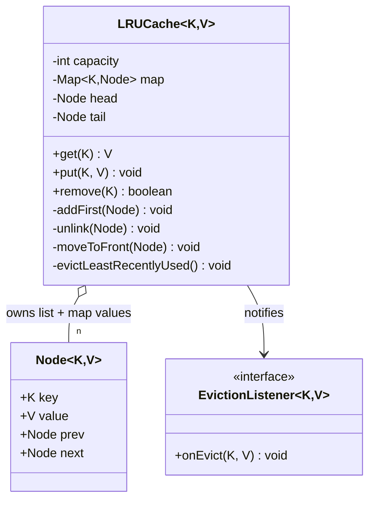
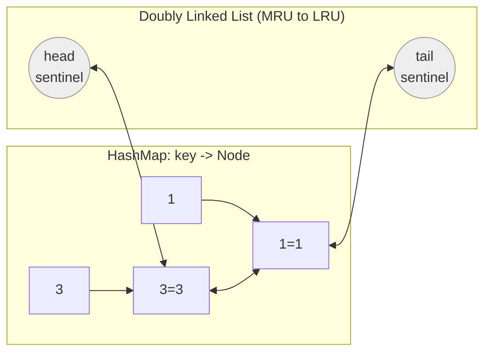
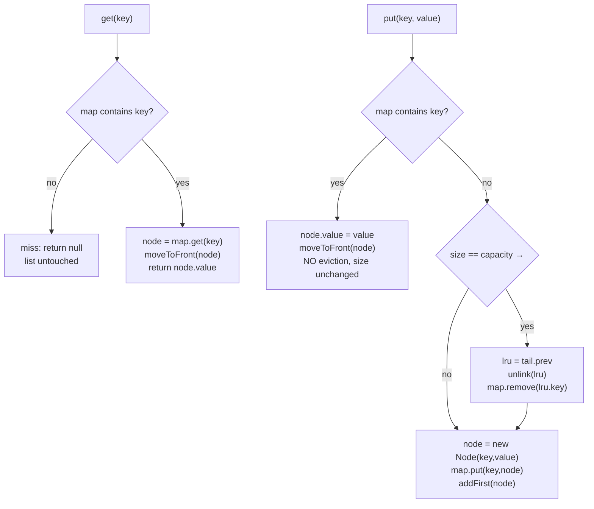

# LRU Cache — Low-Level Design

A complete Low-Level Design for a **Least Recently Used cache** with **O(1) `get` and `put`**, built from a `HashMap` + a doubly linked list — including a full pointer-level trace of the classic interview example.

---

## 📌 Problem Statement

Design a fixed-capacity key–value cache such that:

* `get(key)` returns the value or "not found",
* `put(key, value)` inserts or updates,
* when the cache is full, the **least recently used** entry is evicted to make room,
* **both operations run in O(1) worst-case time.**

"Used" means **either** a `get` **or** a `put` of that key.

---

## ✅ Requirements

### Functional

1. `LRUCache(capacity)` with `capacity > 0`.
2. `get(key)` → value on hit (and it becomes most recently used), `null` on miss.
3. `put(key, value)`:
   * key exists → overwrite value, refresh recency, **no eviction**;
   * key absent and cache full → evict the LRU entry, then insert;
   * key absent and room available → insert.
4. `remove(key)` for explicit invalidation.
5. Never hold more than `capacity` entries.

### Non-Functional

* **O(1)** for `get`, `put`, `remove` — no scanning, no sorting, no timestamps.
* **O(capacity)** memory, with a small constant per entry.
* Generic in `K, V`.
* Structure must be **provably consistent**: the map and the list always describe the same set.

### Out of Scope

* TTL expiry, persistence, distribution/sharding (see *Extensibility*)

---

## 🧠 Core Design Idea — why two data structures

The problem asks for two different things at once, and no single structure gives both:

| Requirement | Structure that solves it | Structure that fails |
|-------------|--------------------------|----------------------|
| "Find the value for key K in O(1)" | Hash map | List/array → O(n) scan |
| "Know which entry is least recently used, and reorder in O(1)" | Doubly linked list | Hash map has no order; array shifting is O(n) |

So you **combine** them, and the bridge is this: the map stores **the node itself**, not the value.

```text
map: key -> Node                     (O(1) random access)
list: MRU  <-> ... <-> LRU           (O(1) reorder + O(1) eviction from the tail)
```

Because the map hands you the *node*, you can unlink it from the middle of the list in O(1) without walking anything. That single decision is the whole trick.

Two more choices make the code correct-by-construction:

1. **Sentinel `head` and `tail` nodes.** The list is never empty (`head <-> tail` at minimum), so `node.prev` and `node.next` are never `null` and every rewiring is four unconditional assignments. No special cases for "first element", "last element", or "single element" — which is where hand-written LRUs usually break.
2. **The node stores its own key.** Eviction starts from the list side (`tail.prev`) and must delete the corresponding map entry. Without the key inside the node, that lookup is impossible in O(1).

> **Convention used here:** `head.next` = **most** recently used, `tail.prev` = **least** recently used. Evict from the tail.

---

## 🏗️ Class Diagram



---

## 🧱 The Structure, Visually



`head.next` is the newest, `tail.prev` is the eviction candidate.

---

## 🔧 The Pointer Rewiring (read this twice)

### `addFirst(node)` — insert just after `head`

```java
private void addFirst(Node<K, V> node) {
    node.prev = head;
    node.next = head.next;   // 1. READ the old first BEFORE overwriting head.next
    head.next.prev = node;   // 2. old first now points back at node
    head.next = node;        // 3. only now may head.next be reassigned
}
```

**The classic bug:** writing `head.next = node;` before line 2. You have overwritten your only reference to the old first node, so `head.next.prev = node` then sets `node.prev = node` — a self-loop, and the rest of the list is orphaned. Always **read then write**.

Note it works even when the list is empty: `head.next == tail`, so `tail.prev = node` and `head.next = node`, giving `head <-> node <-> tail`. No branch needed — that is what the sentinels bought.

### `unlink(node)` — remove from anywhere

```java
private void unlink(Node<K, V> node) {
    node.prev.next = node.next;  // neighbours shake hands over the node
    node.next.prev = node.prev;
    node.prev = null;            // clear stale refs: helps GC, turns silent
    node.next = null;            // corruption into a loud NullPointerException
}
```

Both `node.prev` and `node.next` are guaranteed non-null for any real node, because a real node always sits strictly between the two sentinels.

### `moveToFront(node)` = `unlink` + `addFirst`

Deliberately not "optimized" into a special case. It is already O(1), it is correct even when the node is *already* first (unlink then re-insert is a no-op in effect), and the naive version is far easier to write correctly under pressure.

---

## 🔄 Operation Flows



Three rules that decide most correctness questions:

1. **A `get` miss must not modify the list.** Only hits touch recency.
2. **An update of an existing key never evicts.** The size does not change, so checking capacity there is a bug (it would evict a live entry for no reason — and if the LRU *is* the key being updated, you would evict the very node you are about to touch).
3. **Evict *before* inserting**, not after. Evicting after insert can pick the just-inserted node as LRU in a capacity-1 cache, and it also transiently exceeds capacity.

---

## 🧪 Traced Example — the classic (capacity = 2)

`put(1,1)`, `put(2,2)`, `get(1)`, `put(3,3)` → **key 2 is evicted**.

Notation: `H` and `T` are the sentinels; the list is written head → tail (MRU → LRU).

| # | Operation | Map | List after the operation | What happened to the pointers |
|---|-----------|-----|--------------------------|-------------------------------|
| 0 | *(init)* | `{}` | `H <-> T` | `head.next = tail; tail.prev = head` |
| 1 | `put(1,1)` | `{1}` | `H <-> 1 <-> T` | miss; size 0 < 2, no evict. `addFirst(n1)`: `n1.prev=H`, `n1.next=T`, `T.prev=n1`, `H.next=n1` |
| 2 | `put(2,2)` | `{1,2}` | `H <-> 2 <-> 1 <-> T` | miss; size 1 < 2, no evict. `addFirst(n2)`: `n2.prev=H`, `n2.next=n1`, `n1.prev=n2`, `H.next=n2` |
| 3 | `get(1)` → **1** | `{1,2}` | `H <-> 1 <-> 2 <-> T` | hit. `unlink(n1)`: `n2.next=T`, `T.prev=n2`. `addFirst(n1)`: `n1.prev=H`, `n1.next=n2`, `n2.prev=n1`, `H.next=n1` |
| 4 | `put(3,3)` | `{1,3}` | `H <-> 3 <-> 1 <-> T` | miss; **size 2 == capacity → evict** `tail.prev = n2` (**key 2**). `unlink(n2)`: `n1.next=T`, `T.prev=n1`; `map.remove(2)`. Then `addFirst(n3)` |
| 5 | `get(2)` → **null** | `{1,3}` | `H <-> 3 <-> 1 <-> T` | miss; list untouched |

**Why key 2 and not key 1:** step 3 promoted key 1 to the front, so key 2 sank to the tail. Without the `moveToFront` inside `get`, key 1 would have been evicted — that is exactly the bug the classic example is designed to catch.

Continuing in `Main.java`:

| # | Operation | List | Note |
|---|-----------|------|------|
| 6 | `get(3)` → 3 | `H <-> 3 <-> 1 <-> T` | already MRU; `moveToFront` is a safe no-op |
| 7 | `put(4,4)` | `H <-> 4 <-> 3 <-> T` | evicts `tail.prev` = **key 1** |
| 8 | `get(1)` → null | unchanged | confirms the eviction |

`Main.java` prints exactly this sequence and calls `assertConsistent()` after **every** operation, which re-walks the list forwards and backwards and cross-checks it against the map — so a broken pointer fails loudly instead of silently.

---

## 🧮 Complexity

| Operation | Time | Why |
|-----------|------|-----|
| `get` | **O(1)** | one hash lookup + a fixed number of pointer writes |
| `put` (update) | **O(1)** | hash lookup + `moveToFront` |
| `put` (insert, full) | **O(1)** | `tail.prev` gives the victim directly — **no search** |
| `remove` | **O(1)** | map removal hands over the node; `unlink` is O(1) |
| Space | **O(capacity)** | per entry: key, value, 2 pointers, plus one hash-map entry |

*Worst-case* O(1) assumes well-distributed hashing; with adversarial hash collisions a `HashMap` bucket degrades (Java mitigates this by treeifying buckets to O(log n)). Say "O(1) average, O(log n) worst case under collisions" if pushed — it shows you know `HashMap` internals.

**Rejected alternatives and their cost:**

| Approach | `get` | Evict | Verdict |
|----------|-------|-------|---------|
| Map + timestamp per entry | O(1) | **O(n)** scan for the minimum | Fails the O(1) requirement |
| Map + `PriorityQueue` on last-used time | O(1) | O(log n), plus stale entries to purge | Slower and messier |
| Map + `ArrayList` order | O(1) | O(n) shifting on every access | Worst |
| Map + **singly** linked list | O(1) | O(n) to find the previous node when unlinking | The reason the list must be **doubly** linked |
| `LinkedHashMap(accessOrder=true)` | O(1) | O(1) | Correct — it *is* this structure, just already written |

---

## ⚠️ Edge Cases

| Case | Correct behaviour |
|------|-------------------|
| `capacity <= 0` | Throw `IllegalArgumentException` in the constructor — otherwise `put` evicts what it just inserted |
| `capacity == 1` | Every insert of a new key evicts the previous one (tested in `Main`) |
| `get` on a missing key | Return `null`, **do not** modify the list |
| `put` on an existing key | Update + refresh, **never** evict |
| `moveToFront` on the current MRU | No-op in effect; must not corrupt links |
| Evicting from an empty list | Guarded by `lru == head`; unreachable when `capacity > 0` |
| `null` value stored | `get` returning `null` becomes ambiguous — either forbid `null` values or expose `containsKey` / return an `Optional` |
| `containsKey` | Deliberately does **not** refresh recency — a peek is not a use |
| Mutable keys | A key whose `hashCode` changes after insertion is lost forever (general `HashMap` hazard) |

---

## 🔒 Thread Safety

The class above is **not** thread-safe: `get` mutates the list, so even reads race. Options, in the order you should present them:

| Approach | Notes |
|----------|-------|
| `synchronized` on every method | Simplest and correct; the single lock becomes the bottleneck since *reads write too* |
| `ReentrantReadWriteLock` | Barely helps — LRU has no true read-only path |
| **Sharding / striping** | Split into N independent `LRUCache` shards keyed by `hash(key) % N`. Concurrency ×N; eviction becomes per-shard (approximate global LRU) — this is what real caches do |
| **Approximate LRU** (clock / second-chance, or Caffeine's TinyLFU) | Drop strict ordering: keep a reference bit or batch the access records in ring buffers and replay them under a `tryLock`. Removes the write on the read path entirely |

> **Interview line:** "Strict LRU forces a write on every read, so it's inherently contended. Production caches (Caffeine, Redis) therefore use *approximate* LRU/LFU — Redis samples a handful of random keys and evicts the oldest of the sample."

---

## 🧩 Design Patterns & Principles Used

| Pattern / Principle | Where |
|---------------------|-------|
| **Composition of data structures** | Hash map for lookup + linked list for order — each does what it is good at |
| **Sentinel / Null Object** | `head` and `tail` dummies erase every null branch |
| **Encapsulation** | `Node` and all rewiring are private; callers see only `get`/`put`/`remove` |
| **Observer** | `EvictionListener` hook for write-back or metrics |
| **SRP** | List primitives (`addFirst`, `unlink`) are separate from policy (`put`, `evict`) |
| **Strategy (extension)** | Swap the eviction policy (LRU → LFU → FIFO) behind one interface |
| **Design by contract** | `assertConsistent()` states the invariant explicitly |

---

## 🔌 Extensibility Notes

| Change | How the design absorbs it |
|--------|---------------------------|
| **TTL expiry** | Add `expiresAt` to `Node`; treat an expired hit as a miss and unlink it lazily. Add a background sweeper only if lazy purging leaves too much garbage |
| **LFU instead of LRU** | Replace the single list with a map from frequency → list of nodes, plus a `minFreq` pointer (still O(1)) |
| **Pluggable policy** | `EvictionPolicy` interface with `recordAccess(node)` / `selectVictim()`; LRU, LFU, FIFO become implementations |
| **Write-through / write-behind** | Use `EvictionListener` to flush dirty entries to the backing store |
| **Metrics** | Already there: `hits`, `misses`, `evictions` → hit ratio is the number that justifies the cache's existence |
| **Loading cache** | `get(key, Function<K,V> loader)` computes and inserts on a miss (with per-key locking to avoid a cache stampede) |
| **Bound by memory, not count** | Track a `weigher(key, value)`; evict until total weight fits |
| **Distributed** | Consistent hashing across nodes; each node runs this cache locally |

---

## 📁 Files in this folder

| File | Purpose |
|------|---------|
| `details.md` | This LLD explanation |
| `Main.java` | Runnable implementation + traced demo + 20k-op consistency stress test |

Run it:

```bash
javac Main.java && java Main
```

---

## 💡 Interview Talking Points

1. **State the conflict first**: O(1) lookup *and* O(1) recency ordering — one structure can't do both, so combine a hash map with a doubly linked list.
2. **Say why the map stores the node**, not the value: that is what makes middle-of-list removal O(1).
3. **Say why the list is doubly linked**: a singly linked list cannot find the predecessor to unlink in O(1).
4. **Use sentinels** and point out that they eliminate every null/empty/single-element special case.
5. **Write `addFirst` carefully** and call out the read-before-write ordering bug out loud — interviewers watch for exactly this.
6. **Three behavioural rules**: a miss doesn't reorder; an update never evicts; evict before insert.
7. **Walk the capacity-2 trace** (`put(1,1) put(2,2) get(1) put(3,3)` → 2 evicted) and explain *why* it isn't key 1.
8. **Close with scale**: `LinkedHashMap(accessOrder=true)` in one line, then sharding and approximate LRU (Redis sampling, Caffeine TinyLFU) for the concurrency follow-up.
