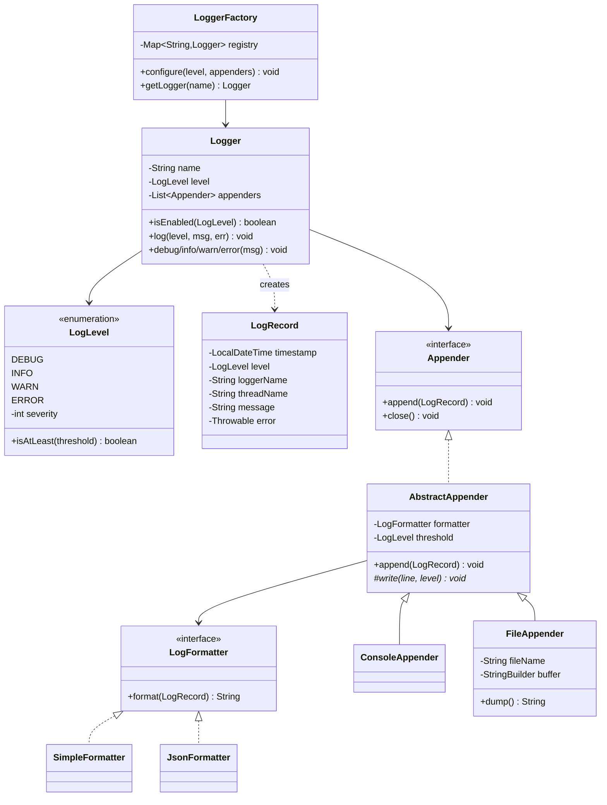
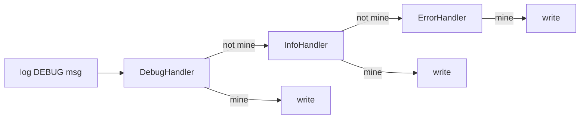
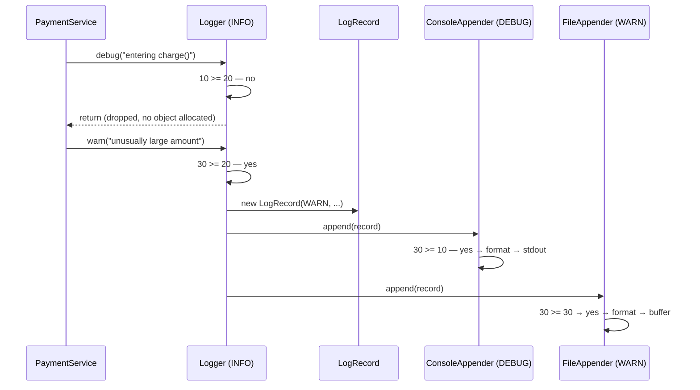

# Logging Framework — Low-Level Design

A complete Low-Level Design for a **Log4j-style logging framework** in Java: levels, loggers, formatters, appenders, filtering, and the classic Chain-of-Responsibility alternative.

---

## 📌 Problem Statement

Design a logging framework that lets any class emit messages at different **severities**, where an operator can decide **at runtime**:

* which severities are recorded (`DEBUG` in dev, `WARN` in prod),
* where they go (console, file, network, database),
* how they look (plain text, JSON).

Application code must call one simple API (`logger.info("...")`) and must never know how many sinks exist.

---

## ✅ Requirements

### Functional

1. Support levels **DEBUG < INFO < WARN < ERROR** with a configurable threshold.
2. A message is emitted only if `message.severity >= logger.threshold`.
3. Support **multiple destinations (appenders)** per logger — console and file at minimum.
4. Each appender may apply its **own additional threshold** (console = DEBUG, file = WARN).
5. Support **pluggable formatting** (plain text vs JSON) independent of the destination.
6. Threshold must be changeable at runtime without restarting or recompiling.
7. Loggers are looked up **by name** (usually the class name); the same name returns the same instance.

### Non-Functional

* **Cheap when disabled** — a suppressed `DEBUG` call must cost ~one integer comparison.
* **Thread-safe** — many threads log concurrently into shared sinks.
* **Testable** — a class under test should be able to receive a fake in-memory logger.
* **Open for extension** — a new sink (Kafka, syslog) must not modify `Logger`.

### Out of Scope

* Real file rotation / compression, async ring buffers (discussed under *Extensibility*)
* Log shipping, indexing, alerting

---

## 🧠 Core Design Idea

The log event flows through a **pipeline** with three cleanly separated jobs:

```text
caller → Logger (severity filter) → LogRecord → Appender (sink filter) → Formatter → destination
```

| Component | Single responsibility |
|-----------|-----------------------|
| `LogLevel` | Severity identity + comparison |
| `LogRecord` | Immutable event data (ts, level, logger, thread, message, throwable) |
| `Logger` | Decide *whether* to log, then fan out to appenders |
| `Appender` | Decide *where* it lands (console / file / network) |
| `LogFormatter` | Decide *how it looks* (text / JSON) |
| `LoggerFactory` | Named registry + default configuration |

Two axes stay orthogonal: **destination** (Appender) and **rendering** (Formatter). That is why a JSON-audit-file and a plain-text console can coexist without a combinatorial explosion of classes.

---

## 🏗️ Class Diagram



---

## 📦 Class Responsibilities (Detailed)

### 1. `LogLevel` — why an **explicit severity**, not `ordinal()`

```java
enum LogLevel {
    DEBUG(10), INFO(20), WARN(30), ERROR(40);
    private final int severity;
    public boolean isAtLeast(LogLevel t) { return this.severity >= t.severity; }
}
```

Comparison by ordinal *works* only while the declaration order is exactly the severity order. The moment someone inserts `TRACE` or `FATAL` in the wrong place, every filter silently breaks. Numeric gaps of 10 also leave room to slot `TRACE(5)` or `FATAL(50)` in later.

> **Interview line:** "`ordinal()` is an accident of declaration order, so I never let business logic depend on it. I give the enum an explicit severity field."

### 2. `LogRecord` — the event object

Immutable, and captures the context **at the call site**: timestamp, thread name, logger name, message, optional `Throwable`. Building it once and passing it to N appenders avoids re-capturing time/thread per sink and guarantees all sinks agree on the same timestamp.

### 3. `Logger` — the filter + fan-out

```java
public void log(LogLevel candidate, String message, Throwable error) {
    if (!isEnabled(candidate)) return;              // guard clause: one int compare
    LogRecord record = new LogRecord(candidate, name, message, error);
    for (Appender appender : appenders) appender.append(record);
}
```

`isEnabled(level)` is also public so callers can skip expensive message building:

```java
if (logger.isEnabled(LogLevel.DEBUG)) {
    logger.debug("payload=" + expensiveSerialize(obj)); // string concat avoided when off
}
```

`level` is `volatile` so a runtime change on an admin thread is visible to logging threads immediately.

### 4. `Appender` + `AbstractAppender` — Template Method

`AbstractAppender.append()` is `final` and fixes the algorithm — *filter, then format, then write* — while subclasses implement only `write(line, level)`. That is the **Template Method** pattern, and it guarantees no sink can accidentally skip its threshold check.

Two thresholds is deliberate and is a common follow-up question:

| Threshold | Meaning |
|-----------|---------|
| Logger level | "Should this event exist at all?" — global cost control |
| Appender level | "Does *this sink* care → " — console shows everything, file keeps only WARN+ |

The logger threshold is checked first because it is the cheapest way to drop an event.

### 5. `FileAppender` — simulated I/O

The sketch buffers into a `StringBuilder` (synchronized) so the file is inspectable via `dump()` and the program runs anywhere. Production swaps the body of `write()` for a `BufferedWriter`, plus a rotation policy — nothing else changes, which is the point of the abstraction.

### 6. `LoggerFactory` — registry, not a god object

```java
private static final Map<String, Logger> REGISTRY = new ConcurrentHashMap<>();
public static Logger getLogger(String name) {
    return REGISTRY.computeIfAbsent(name, key -> { ... });
}
```

`computeIfAbsent` on a `ConcurrentHashMap` gives atomic get-or-create — no double-checked locking needed, and no risk of two threads creating two `Logger` objects for the same name.

---

## 🔒 The Singleton Discussion (asked almost every time)

**Why people reach for it:** a logger holds a file handle; you do not want 500 objects each opening `app.log`.

**Why a naive `Logger.getInstance()` is a bad answer:**

| Problem | Consequence |
|---------|-------------|
| Global mutable state | Test A sets level to `DEBUG`, test B now fails — order-dependent tests |
| Hidden dependency | `PaymentService` looks dependency-free but secretly binds to a static |
| Not substitutable | Can't inject an in-memory fake to assert "an ERROR was logged" |
| One logger for the whole app | Can't set `com.acme.db=DEBUG` while the rest stays `INFO` |
| Lazy init races | Broken double-checked locking without `volatile` is a classic bug |

**What the design actually does — and what real frameworks do:**

* The **registry is static** (one `Logger` per *name*, so one file handle per sink).
* The **logger is injected** into `PaymentService` through its constructor.

```java
class PaymentService {
    private final Logger logger;
    PaymentService(Logger logger) { this.logger = logger; } // injected => swappable in tests
}
```

So `LoggerFactory.getLogger(X.class)` is a *multiton/registry*, not a singleton: per-name instances, per-name levels, and a constructor seam for testing. If you must use the static call inside classes (as SLF4J does), keep it to `private static final Logger LOG = LoggerFactory.getLogger(Foo.class);` and make the **appenders** the injectable part.

> **Interview line:** "Singleton the *registry*, inject the *logger*. That keeps one file handle without making my services untestable."

---

## 🔗 Alternative Design: Chain of Responsibility

The textbook answer chains one handler per level:



```java
public void handle(LogLevel level, String message) {
    if (level == handledLevel) { write(message); return; }
    if (next != null) next.handle(level, message);
}
```

| | Chain of Responsibility | Logger → List\<Appender\> (chosen) |
|---|---|---|
| Routing | One handler *owns* a level | Every appender sees every passing record |
| Add a new sink | Insert a node, re-wire the chain | `logger.addAppender(x)` |
| Two sinks for the same level | Awkward — handler must forward after handling | Natural |
| Unhandled level | Silently dropped (see `WARN` in `Main`) | Impossible |
| Runtime threshold change | Rebuild the chain | Set one field |
| Matches real frameworks | No | Yes (Log4j/Logback) |

The `Main` sketch runs the CoR variant at the end **specifically to show its failure mode**: `WARN` has no handler and vanishes without a trace.

> **Interview line:** "CoR is the pattern people expect here, but it models *routing by level*, and real logging needs *fan-out by destination*. I'd mention CoR, then explain why Log4j uses appenders."

---

## 🔄 Sequence Flow



---

## 🧮 Complexity & Cost

| Operation | Cost |
|-----------|------|
| Suppressed call (`debug` at INFO) | **O(1)** — one int compare, **zero allocations** |
| Emitted call | **O(A)** where A = number of appenders (small, fixed) |
| `getLogger(name)` | **O(1)** amortized hash lookup |
| Memory | O(#logger names + #appenders); a `FileAppender` buffer is bounded by flush policy |

The expensive part of logging is never the dispatch — it is **string construction and I/O**. Hence the two optimizations that matter:

1. **Guard expensive messages** with `isEnabled(...)` (or use parameterized messages `log("id={}", id)` so formatting happens only after the filter passes).
2. **Never do I/O on the caller's thread** in production — see async below.

---

## ⚠️ Edge Cases & Correctness Notes

| Case | Handling |
|------|----------|
| Level comparison via `ordinal()` | Avoided — explicit `severity` field |
| Runtime level change from another thread | `level` is `volatile` |
| Two threads writing the same file | `write()` is `synchronized` on the appender |
| Expensive message built then discarded | `isEnabled()` guard / parameterized messages |
| Logging inside a logging appender | Would recurse — appenders must never use the framework |
| An appender throws (disk full) | Should be caught per-appender so one bad sink can't kill the app or block other sinks |
| `null` message / throwable | Formatter must tolerate nulls |
| Shutdown with buffered data | `close()` flushes; production registers a JVM shutdown hook |

---

## 🧩 Design Patterns & Principles Used

| Pattern / Principle | Where |
|---------------------|-------|
| **Template Method** | `AbstractAppender.append()` fixes filter→format→write; subclasses supply `write` |
| **Strategy** | `LogFormatter` (plain vs JSON) swapped into any appender |
| **Composite-ish fan-out** | `Logger` holds `List<Appender>` and treats them uniformly |
| **Chain of Responsibility** | Alternative design, implemented for contrast |
| **Registry / Multiton** | `LoggerFactory` — one logger per name |
| **Dependency Injection** | `PaymentService(Logger)` — testability |
| **OCP** | New sink or format = new class, zero edits to `Logger` |
| **SRP** | Filtering, rendering, and destination are three different classes |
| **DIP** | `Logger` depends on the `Appender` interface, never on `ConsoleAppender` |

---

## 🔌 Extensibility Notes

| Change | How the design absorbs it |
|--------|---------------------------|
| Async logging | Wrap sinks in an `AsyncAppender` holding a `BlockingQueue` + consumer thread; `append()` just enqueues. Discuss queue-full policy: **block** (back-pressure) vs **drop** (never stall the app) |
| Kafka / syslog / DB sink | New `AbstractAppender` subclass |
| Log rotation | Policy object inside `FileAppender` (`SizeBasedTrigger`, `TimeBasedTrigger`) |
| Hierarchical loggers | Name by package (`com.acme.db`); a logger inherits the nearest configured ancestor's level, and records bubble up unless `additivity=false` |
| Sampling / rate limiting | A `Filter` interface in front of appenders — "log at most 1 of every 100 identical errors" |
| Structured/contextual logging | Add an MDC (`Map<String,String>` in a `ThreadLocal`) merged into every `LogRecord` — carries `requestId`, `userId` |
| Real timestamps in tests | Inject a `Clock` into `LogRecord` creation |

---

## 🧪 Example Walkthrough

Configuration used by `Main.java`:

```text
Logger "PaymentService"  threshold = INFO
  ├── ConsoleAppender  threshold = DEBUG  formatter = Simple
  ├── FileAppender     threshold = WARN   formatter = Simple  → app.log
  └── FileAppender     threshold = ERROR  formatter = Json    → audit.json
```

| Call | Logger check (≥ INFO) | Console (≥ DEBUG) | app.log (≥ WARN) | audit.json (≥ ERROR) |
|------|----------------------|-------------------|------------------|----------------------|
| `debug("entering charge()")` | ❌ dropped | – | – | – |
| `info("charging ORD-1")` | ✅ | ✅ | ❌ | ❌ |
| `warn("unusually large amount")` | ✅ | ✅ | ✅ | ❌ |
| `error("negative amount")` | ✅ | ✅ | ✅ | ✅ |

After `logger.setLevel(DEBUG)`, the same `debug(...)` call now passes the logger filter and reaches the console only — the file appenders still reject it on their own thresholds. That single observation proves both filters are independent.

---

## 📁 Files in this folder

| File | Purpose |
|------|---------|
| `details.md` | This LLD explanation |
| `Main.java` | Runnable Java implementation (appender design + CoR contrast) |

Run it:

```bash
javac Main.java && java Main
```

---

## 💡 Interview Talking Points

1. **Lead with the pipeline**: level filter → record → appenders → formatter → sink. It shows you know the shape before writing a class.
2. **Explicit severity, never `ordinal()`** — a one-line detail that signals experience.
3. **Two thresholds** (logger + appender) and why the logger's is checked first.
4. **Singleton**: singleton the registry, inject the logger; list the testability and per-package-level problems with a naive `getInstance()`.
5. **Chain of Responsibility**: name it, implement it if asked, then justify choosing fan-out appenders — and point at the dropped `WARN` as the concrete failure.
6. **Performance**: cost of a suppressed call, guard clauses / parameterized messages, and async appenders with a bounded queue plus a drop-vs-block policy.
7. **Close with extensions**: MDC for `requestId`, rotation policy, sampling filter.
