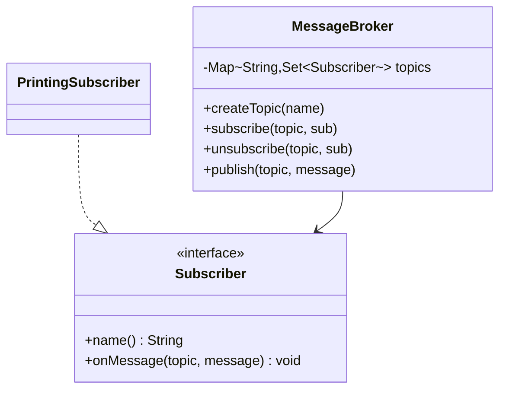
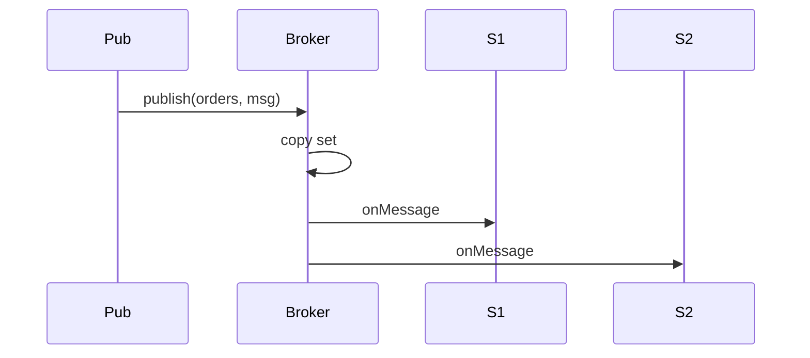

# Pub-Sub Message Broker — Low-Level Design

A complete Low-Level Design for an in-memory **publish/subscribe** broker. Publishers do not know subscribers; the broker fans messages out by topic. This is the teaching core behind Kafka/Rabbit abstractions — without partitions or durability.

> **Core insight:** iterate a **copy** of the subscriber set. If a handler unsubscribes during `onMessage`, a live `HashSet` iterator throws `ConcurrentModificationException`. Snapshot iteration is the LLD-sized fix.

---

## 📌 Problem Statement

Design a broker supporting create-topic, subscribe/unsubscribe, and publish with synchronous fan-out to all current subscribers on that topic. Unknown topics fail closed (no auto-create on publish).

---

## ✅ Requirements

### Functional

1. `createTopic`, `subscribe`, `unsubscribe`, `publish`, `listTopics`.
2. Many subscribers per topic; one subscriber on many topics.
3. `Subscriber.onMessage(topic, message)`.
4. Publish to unknown topic — error.
5. Double subscribe  → set semantics (one entry).

### Non-Functional

* Sync delivery documented with head-of-line risk.
* Iteration safety under re-entrant unsubscribe.
* Clear extension path to async queues.

### Out of Scope

* Persistence, consumer groups, ACK/NACK, exactly-once, wildcard topics (discuss only).

---

## 🧠 Core Design Idea

```text
Publisher → MessageBroker → Topic "orders"
                              ├── EmailWorker
                              ├── Audit
                              └── ...
```

### Sync vs async

| Mode | Pros | Cons |
|------|------|------|
| Sync (sketch) | Simple ordering | Slow sub blocks others |
| Async queue/sub | Isolation | Ordering & backpressure complexity |

### Related: Observer vs Mediator

* **Observer:** subject holds observers directly.
* **Mediator/Broker:** publishers never see subscribers  → better decoupling for messaging platforms.

---

## 🏗️ Class Diagram



---

## 🔑 Responsibilities

| Class | Responsibility |
|-------|----------------|
| `Subscriber` | Callback contract |
| `MessageBroker` | Registry + fan-out policy |
| Topic set | Membership |

---

## 🔄 Sequence



---

## 🧮 Fan-out algorithm

```text
set = topics.get(topic) or throw
for s in ArrayList<>(set):   // snapshot
    try s.onMessage(topic, message)
    catch: log / policy
```

---

## 🧯 Edge Cases

| Case | Handling |
|------|----------|
| Subscribe missing topic | Throw |
| Unsubscribe missing | No-op |
| Handler throws | Isolate per policy |
| Re-entrant unsubscribe | Safe with copy |
| Empty topic publish | OK  → no-op fan-out |

---

## 🧩 Design Patterns & Principles Used

| Pattern | Where |
|---------|-------|
| Observer (multicast) | Topic notifies many |
| Mediator | Broker |
| OCP | New subscribers |

---

## 🔌 Extensibility

| Feature | Approach |
|---------|----------|
| Async | Per-sub queue + worker |
| Durable log | Offset consumer |
| Filters | Predicate subscription |
| Wildcards | Topic trie |
| Retry/DLQ | Wrapper subscriber |

---

## 🧵 Concurrency

* Guard `topics` map with concurrent structures.
* Snapshot still needed if set mutates during callbacks.
* Slow consumer  → bounded queues + drop/block policy.

---

## 🧪 What the Demo Proves

1. Two subs receive orders publish.  
2. Unsubscribe stops further delivery.  
3. Alerts topic isolated from orders.  

---

## 💡 Interview Talking Points

1. Why copy before iterate.  
2. Sync HOL blocking.  
3. Observer vs broker.  
4. At-most-once vs at-least-once.  
5. Ordering in single-thread sync.  
6. Backpressure.  
7. Link to Notification channels as subscribers.  
8. Kafka partitions as HLD scale story.  

---

## 📝 Implementation notes (`Main.java`)

* `LinkedHashSet` preserves subscribe order in demos.
* `new LinkedHashSet<>(set)` snapshot on publish.

---

## 📁 Files

| File | Purpose |
|------|---------|
| `details.md` | This LLD |
| `Main.java` | Multi-subscriber demo |
