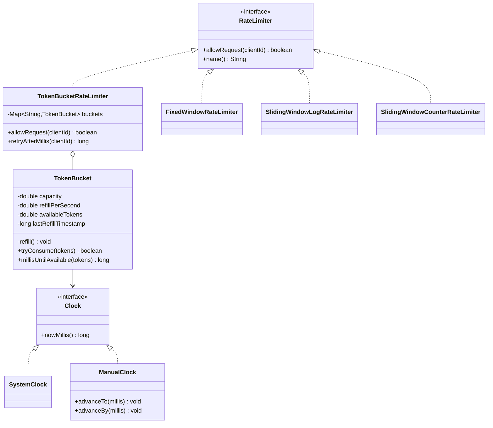
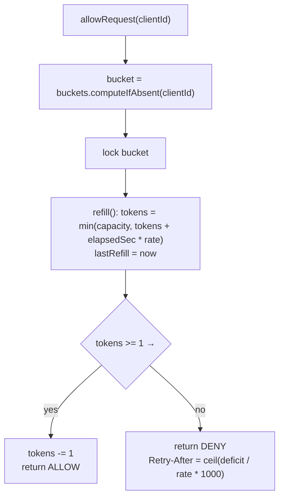

# Rate Limiter — Low-Level Design

A complete Low-Level Design for an API **rate limiter**: Token Bucket implemented in full (with the refill math worked out), plus Fixed Window, Sliding Window Log, and Sliding Window Counter compared on accuracy, memory, and the boundary-burst problem.

---

## 📌 Problem Statement

Design a component that decides, for every incoming request, whether it is **allowed** or **rejected (HTTP 429)**, enforcing a rule such as *"at most 100 requests per minute per API key"*.

It protects the service from abuse, buggy clients, and thundering herds, and it enforces per-tier quotas.

---

## ✅ Requirements

### Functional

1. `allowRequest(clientId)` → `true` (proceed) / `false` (reject).
2. Limits are enforced **per client** (API key, user id, or IP) — one client exhausting its quota must not affect another.
3. Configurable limit and window (`100 per minute`, `5 per second`, …).
4. Support **bursts** up to a configured ceiling while keeping the long-run average at the configured rate.
5. Expose **`Retry-After`** so a rejected client knows when to come back.

### Non-Functional

* **O(1) time** per decision — the limiter sits on the hot path of every request.
* **Small, bounded memory** per client (ideally a couple of numbers, not a request log).
* **Thread-safe**: many worker threads hit the same client's state.
* **Testable**: decisions depend on time, so time must be injectable — never call `System.currentTimeMillis()` inside the algorithm.
* Fail **open** or **closed** deliberately if the backing store is down (a conscious decision, not an accident).

### Out of Scope

* Distributed coordination internals (discussed under *Extensibility*)
* Billing / quota accounting, WAF-style abuse detection

---

## 🧠 Core Design Idea

Three responsibilities, kept separate:

| Component | Responsibility |
|-----------|----------------|
| `Clock` | Supplies "now" — injected, so tests can jump 3 seconds forward instantly |
| `TokenBucket` (algorithm) | Holds the counters for **one** client and decides allow/deny |
| `RateLimiter` (registry) | Maps `clientId → algorithm state`, exposes a uniform interface |

Because every algorithm implements the same `RateLimiter` interface, swapping Token Bucket for Sliding Window is a one-line configuration change — that is **Strategy**.

> **The `Clock` seam is the single most important design decision here.** Without it, "does the bucket refill correctly after 1.8 seconds → " can only be tested with `Thread.sleep`, which is slow and flaky. With it, the test is deterministic and instant. `Main.java` uses a `ManualClock` for exactly this reason.

---

## 🏗️ Class Diagram



---

## 🪣 Token Bucket — the algorithm

**Mental model:** a bucket holds at most `capacity` tokens and is topped up continuously at `refillPerSecond`. Each request removes one token. No token → reject.

* `capacity` controls the **burst** size.
* `refillPerSecond` controls the **sustained** rate.

Separating those two knobs is exactly why Token Bucket is preferred: a client that has been quiet may spend its savings in one burst (good for latency), but it can never exceed `refillPerSecond` on average (good for the server).

### Lazy refill — no timer thread

A naive implementation starts a scheduled task per bucket to add tokens. With a million API keys that is a million timers. Instead, compute the refill **on demand** from elapsed time:

```java
private void refill() {
    long now = clock.nowMillis();
    if (now <= lastRefillTimestamp) return;              // clock didn't move / went backwards
    double elapsedSeconds = (now - lastRefillTimestamp) / 1000.0;
    availableTokens = Math.min(capacity, availableTokens + elapsedSeconds * refillPerSecond);
    lastRefillTimestamp = now;                           // consume the elapsed time
}

public synchronized boolean tryConsume(double tokens) {
    refill();
    if (availableTokens + EPSILON >= tokens) {
        availableTokens = Math.max(0.0, availableTokens - tokens);
        return true;
    }
    return false;
}
```

An idle bucket costs **zero CPU**, and `Math.min(capacity, ...)` is what makes idleness stop earning tokens after `capacity / refillPerSecond` seconds.

### ⚠️ The refill math — two bugs that break it

**Bug 1 — integer truncation starves the bucket.**

```java
int refilled = (int) ((now - lastRefillTimestamp) / 1000) * refillPerSecond; // WRONG
lastRefillTimestamp = now;
```

If requests arrive every 100 ms, `(now - last) / 1000 == 0`, so `refilled == 0` — **but the timestamp still advances**, so the elapsed 100 ms is thrown away. It never accumulates and the bucket refills *never*, no matter how long the client waits.

`Main.java` runs both versions side by side over 2 simulated seconds at 10 polls/second with `capacity = 1, refill = 2/s`:

```text
double math  -> 4 allowed   (1 initial + 2/s x 2s)   ✅
integer math -> 1 allowed   <-- starved                ❌
```

**Fixes, in order of preference:** (a) keep tokens as a `double`; (b) keep tokens as a scaled integer (micro-tokens) so the fraction survives; (c) if you insist on whole tokens, advance `lastRefillTimestamp` **only by the time you actually converted**, carrying the remainder forward.

**Bug 2 — floating-point boundaries.** Tokens accumulate by repeated addition, so a value that "should" be exactly `1.0` can be `0.9999999999999998` and a plain `availableTokens >= 1` wrongly rejects. Hence the `EPSILON` comparison. Mentioning this unprompted is a strong signal.

**Other correctness details:**

| Detail | Why |
|--------|-----|
| Start the bucket **full** | A brand-new client should not be throttled on its first request |
| `Math.min(capacity, ...)` | Idle clients must not bank unlimited credit |
| `if (now <= lastRefill) return;` | NTP adjustments can move the wall clock backwards; a negative elapsed would *drain* the bucket. Production uses a monotonic clock (`System.nanoTime`) |
| Refill **before** the check, in the same critical section | Otherwise two threads can both see the pre-refill count |
| Reject must not consume | Only successful requests spend tokens |

### Retry-After

```java
double deficit = tokens - availableTokens;
return (long) Math.ceil(deficit / refillPerSecond * 1000.0);
```

With `refill = 2/s` and an empty bucket, one token takes `1 / 2 * 1000 = 500 ms` — which is what the demo prints on the first denial.

---

## 🧪 Traced Example — capacity 5, refill 2 tokens/sec

Exactly what `Main.java` prints, with the arithmetic spelled out.

| Time | Event | Refill computation | Tokens before → after | Result |
|------|-------|--------------------|-----------------------|--------|
| 0 ms | req 1 | elapsed 0 → +0 | 5.0 → 4.0 | ALLOW |
| 0 ms | req 2–5 | +0 | 4.0 → 0.0 | ALLOW ×4 |
| 0 ms | req 6 | +0 | 0.0 | **DENY**, retry after 500 ms |
| 500 ms | req 7 | 0.5 s × 2 = **+1.0** | 0.0 → 1.0 → 0.0 | ALLOW |
| 500 ms | req 8 | +0 | 0.0 | **DENY**, retry after 500 ms |
| 1200 ms | req 9 | 0.7 s × 2 = **+1.4** | 0.0 → 1.4 → 0.4 | ALLOW |
| 1200 ms | req 10 | +0 | 0.4 | **DENY**, retry after 300 ms |
| 3000 ms | req 11 | 1.8 s × 2 = **+3.6** | 0.4 → **4.0** → 3.0 | ALLOW |
| 3000 ms | req 12–14 | +0 | 3.0 → 0.0 | ALLOW ×3 |
| 3000 ms | req 15 | +0 | 0.0 | **DENY** |
| 10000 ms | req 16 | 7.0 s × 2 = +14.0, **capped at 5** | 0.0 → 5.0 → 4.0 | ALLOW |
| 10000 ms | req 17–20 | +0 | 4.0 → 0.0 | ALLOW ×4 |
| 10000 ms | req 21 | +0 | 0.0 | **DENY** |

Two rows carry the whole lesson:

* **t = 3000 ms** — the leftover **0.4** from t = 1200 ms is still there and combines with the newly earned 3.6 to give exactly 4 usable tokens. Integer math would have discarded that 0.4 and allowed only 3. This is the fractional-token requirement, made visible.
* **t = 10000 ms** — 7 idle seconds *earn* 14 tokens but the bucket **caps at 5**. Burst is bounded by capacity, never by idle time.

**Sanity check on the long-run rate:** between t = 0 and t = 10000 ms, 15 requests were allowed. The theoretical ceiling is `capacity + rate × elapsed = 5 + 2 × 10 = 25`; we allowed fewer only because the demo stopped asking. The limiter never exceeds that bound — that is the invariant to state in an interview.

---

## 🔄 Decision Flow



---

## ⚖️ Algorithm Comparison

### The boundary-burst test (from `Main.java`)

Limit: **5 requests per 1000 ms**. Traffic: 5 requests at t = 900 ms, then 5 more at t = 1000 ms — i.e. **10 requests inside a 100 ms span**.

| Algorithm | Trace (`A`=allowed, `.`=denied) | Allowed | Verdict |
|-----------|-------------------------------|---------|---------|
| Fixed Window | `AAAAAAAAAA` | **10** | ❌ 2× the limit — the counter reset at the window seam |
| Sliding Window Log | `AAAAA.....` | 5 | ✅ exact |
| Sliding Window Counter | `AAAAA.....` | 5 | ✅ correct here, approximate in general |

### Full comparison

| Algorithm | Memory per client | Time | Accuracy | Bursts | When to use |
|-----------|-------------------|------|----------|--------|-------------|
| **Token Bucket** | 2 numbers (tokens, lastRefill) | O(1) | Exact w.r.t. its own model | **Allowed, bounded by capacity** | Default choice: smooth, burst-friendly, tiny state |
| **Leaky Bucket (queue)** | Queue of pending requests | O(1) | Exact | Smoothed away — output is perfectly constant | Traffic *shaping* (you want a steady outflow), e.g. downstream that hates spikes |
| **Fixed Window Counter** | 1 counter + window id | O(1) | **Up to 2× the limit at the seam** | Accidental | Only when approximation is acceptable and simplicity wins |
| **Sliding Window Log** | **O(limit)** timestamps | O(1) amortized (evict from head) | **Exact** | None | Small limits where precision is mandatory (e.g. 5 login attempts / hour) |
| **Sliding Window Counter** | 2 counters + window id | O(1) | ~Exact; assumes uniform spread in the previous window | Mild | The production compromise (Cloudflare uses this) |

### Memory at scale — the question that separates candidates

For **1 million** active clients:

| Algorithm | Rough footprint |
|-----------|-----------------|
| Token Bucket | 1M × (8 B tokens + 8 B timestamp + object/map overhead) ≈ **tens of MB** |
| Sliding Window Counter | Similar, ~2 ints + a long |
| Sliding Window Log @ 100 req/min limit | 1M × 100 × 8 B = **800 MB just for timestamps**, plus deque overhead — usually **several GB** |

That is the real argument against the log: it is the only algorithm whose memory scales with the **limit**, not just with the number of clients. Bound it (cap the deque at the limit — which the implementation does naturally), and expire idle clients.

### Sliding Window Counter math

```java
long elapsedInWindow = now % windowMillis;
double previousWeight = (windowMillis - elapsedInWindow) / (double) windowMillis;
double estimated = previousCount * previousWeight + currentCount;
if (estimated < maxRequests) { currentCount++; return true; }
```

At 30% into the current window, 70% of the previous window still overlaps, so 70% of its count is charged. It assumes the previous window's requests were spread evenly — if they were all clustered at its very end, the estimate is slightly low. Cheap, bounded, and wrong by only a few percent in practice.

---

## ⚠️ Edge Cases

| Case | Handling |
|------|----------|
| First request from an unknown client | `computeIfAbsent` creates a **full** bucket → allowed |
| Clock moves backwards (NTP) | Guarded by `if (now <= lastRefillTimestamp) return;`; prefer a monotonic clock |
| Very long idle period | `Math.min(capacity, …)` caps the credit; no overflow |
| Fractional tokens | Kept as `double` (or scaled integers) — never truncated |
| Float boundary at exactly 1.0 | `EPSILON` tolerance in the comparison |
| Request costing more than 1 token | `tryConsume(n)` — heavier endpoints cost more; if `n > capacity` it can **never** succeed, so validate at configuration time |
| Unbounded client map | Memory leak — evict idle buckets (LRU/TTL); note a bucket that has been idle long enough to be full is safe to drop and recreate |
| Rejected requests | Must not consume tokens, or an attacker's flood would permanently starve the client |
| Two threads, same client | Bucket methods are `synchronized`; `computeIfAbsent` on a `ConcurrentHashMap` guarantees one bucket per key |

---

## 🧵 Concurrency

* State per client is mutated on every request, so the critical section must cover **refill + check + decrement** atomically. Splitting them lets two threads both see the same pre-decrement token count.
* Locking is **per bucket**, not global — different clients never contend.
* A lock-free variant uses an `AtomicReference` to an immutable `(tokens, lastRefill)` snapshot with a CAS retry loop; worth mentioning, rarely worth writing.
* `ConcurrentHashMap.computeIfAbsent` is the atomic get-or-create; a plain `if (!map.containsKey) map.put(...)` is a race that hands two threads two different buckets and doubles the effective limit.

---

## 🧩 Design Patterns & Principles Used

| Pattern / Principle | Where |
|---------------------|-------|
| **Strategy** | `RateLimiter` interface with four interchangeable algorithms |
| **Dependency Injection** | `Clock` injected → `ManualClock` makes time-dependent logic deterministic |
| **Registry / Flyweight-ish** | One algorithm instance per client key, created on demand |
| **SRP** | Clock ≠ algorithm ≠ per-client registry |
| **OCP** | A new algorithm implements the interface; nothing else changes |
| **Lazy evaluation** | On-demand refill instead of a scheduler per bucket |

---

## 🔌 Extensibility Notes

| Change | How the design absorbs it |
|--------|---------------------------|
| **Distributed limiting** | Move state to Redis. Do the check-and-decrement in a **Lua script** so it is atomic (`GET`+`SET` from the app is a race). Redis's `INCR` + `EXPIRE` gives fixed window; token bucket needs a small script or `CL.THROTTLE` from redis-cell |
| Cost of the network hop | Two-tier: a permissive local limiter absorbs the bulk, the shared limiter enforces the global cap. Or shard the quota across N nodes (`limit / N` each) and accept some inaccuracy |
| Redis unavailable | Decide **fail-open** (availability first — the usual API-gateway choice) or **fail-closed** (protection first), and make it configurable |
| Tiered plans | `RateLimitPolicy` per plan (free = 10/min, pro = 1000/min) resolved from the client id |
| Per-endpoint limits | Key becomes `clientId + ":" + endpoint`; weight expensive endpoints via `tryConsume(cost)` |
| Response headers | `X-RateLimit-Limit`, `X-RateLimit-Remaining` (= `floor(tokens)`), `X-RateLimit-Reset`, `Retry-After` |
| Concurrency limiting | A different problem — bound *in-flight* requests with a semaphore/bulkhead, not a rate limiter |
| Overload protection | Combine with a circuit breaker and load shedding by priority |

---

## 📁 Files in this folder

| File | Purpose |
|------|---------|
| `details.md` | This LLD explanation |
| `Main.java` | Token Bucket (primary) + Fixed Window + Sliding Window Log + Sliding Window Counter, with a `ManualClock` walkthrough |

Run it:

```bash
javac Main.java && java Main
```

---

## 💡 Interview Talking Points

1. **Clarify first**: per user or per IP? Burst allowed? Single node or distributed? Fail open or closed → These change the answer completely.
2. **Pick Token Bucket and justify it**: two independent knobs — capacity for burst, refill rate for sustained throughput — in constant memory.
3. **Show the lazy refill formula** and say why there is no timer thread: a million clients would mean a million timers.
4. **Call out the integer-truncation bug** before being asked; it is the single most common error in this problem.
5. **Inject the clock** and explain that it is what makes the limiter unit-testable without `Thread.sleep`.
6. **Walk the boundary-burst example**: Fixed Window admits 10 requests inside 100 ms; Sliding Window Log and Counter admit 5.
7. **Do the memory math** for 1M clients — it is the argument that kills the log approach at scale.
8. **Finish distributed**: Redis + Lua for atomicity, the two-tier local/global optimization, and a deliberate fail-open policy.
