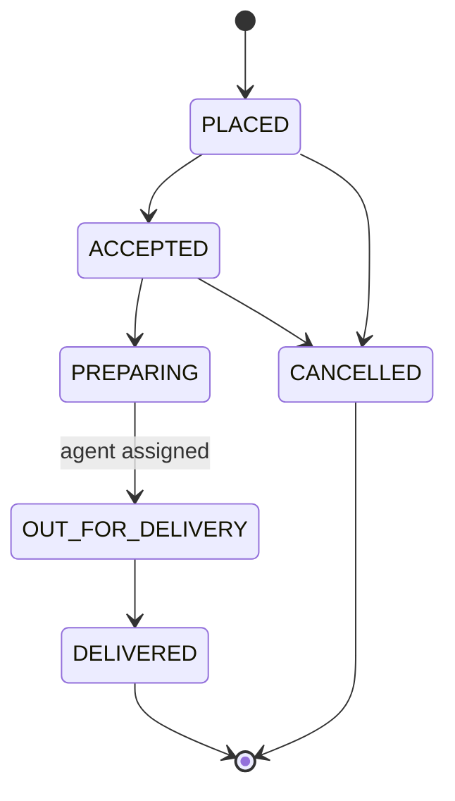
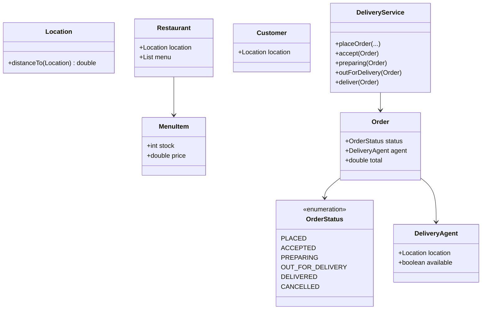

# Food Delivery — Low-Level Design

A complete Low-Level Design for restaurant ordering: menu stock, order placement, a strict **order state machine**, and **nearest agent** assignment when food is ready for delivery.

> **Core insight:** draw the state diagram before classes. Decide *when* stock decrements (place vs accept). Agent assignment is a Strategy-shaped scan — same family as Cab matching.

---

## 📌 Problem Statement

Design a system where customers place restaurant orders, restaurants advance preparation states, and a delivery agent is assigned for dropoff, ending in `DELIVERED` (or `CANCELLED`).

---

## ✅ Requirements

### Functional

1. `Restaurant` + `MenuItem(price, stock)`, `Customer`, `DeliveryAgent`, `Order`, `DeliveryService`.
2. `placeOrder` validates stock; sketch decrements immediately.
3. Transitions: `PLACED → ACCEPTED ? PREPARING → OUT_FOR_DELIVERY  → DELIVERED`.
4. `OUT_FOR_DELIVERY` requires assigning nearest free agent to restaurant location.
5. `DELIVERED` frees agent and moves agent location to customer.
6. Illegal transitions rejected.

### Non-Functional

* No boolean soup for order progress.
* Matching swappable.
* Honest concurrency note on stock/agents.

### Out of Scope

* Payments, live map UI, multi-restaurant carts, batching, surge pricing engines.

---

## 🧠 Core Design Idea

### State machine



### Inventory timing

| Policy | Pros | Cons |
|--------|------|------|
| Decrement on place (sketch) | Early oversell prevention | Cancel must restock |
| Decrement on accept | Fewer phantom holds | Race until accept |
| Soft hold + TTL | Best UX | Complexity |

### Agent assignment

```text
pick min distance among available agents to restaurant.location
if none: cannot transition to OUT_FOR_DELIVERY
```

---

## 🏗️ Class Diagram



---

## 🔑 Responsibilities

| Class | Responsibility |
|-------|----------------|
| `MenuItem` | Stock & price |
| `Order` | Lines, status, agent |
| `DeliveryService` | Transitions + assign + inventory |

---

## 🔄 Sequence  → happy path


---

## 🧯 Edge Cases

| Case | Handling |
|------|----------|
| Insufficient stock | Reject place |
| No agents | Stay PREPARING |
| Bad transition | Reject |
| Cancel after assign | Free agent; restock policy |
| Double deliver | Reject |

---

## 🧩 Design Patterns & Principles Used

| Pattern | Where |
|---------|-------|
| State enum | OrderStatus |
| Strategy | Agent match / fees |
| SRP | Distance on Location |

---

## 🔌 Extensibility

| Feature | Approach |
|---------|----------|
| Multi-line cart | List OrderLine |
| Batching | Agent capacity N |
| SLA timers | Scheduler alerts |
| Ratings | Post-delivery entity |

---

## 🧵 Concurrency

* `stock` decrement with CAS / synchronized item.
* `agent.available` CAS like Cab drivers.
* Transition status with compare-and-set enum.

---

## 🧪 What the Demo Proves

1. Stock decreases on place.  
2. Nearer agent selected.  
3. Illegal accept after deliver rejected.  
4. Agent freed on deliver.  

---

## 💡 Interview Talking Points

1. State diagram first.  
2. Inventory timing.  
3. Agent Strategy (= Cab matching).  
4. Restock on cancel.  
5. Concurrency on stock/agent.  
6. Why not booleans.  
7. Multi-item extension.  
8. HLD: geo dispatch + ETA.  

---

## 📝 Implementation notes (`Main.java`)

* Euclidean `Location.distanceTo`.
* `transition` helper guards from → to.
* Agents marked busy on assign.

---

## 📁 Files

| File | Purpose |
|------|---------|
| `details.md` | This LLD |
| `Main.java` | Place → deliver + bad transition |
