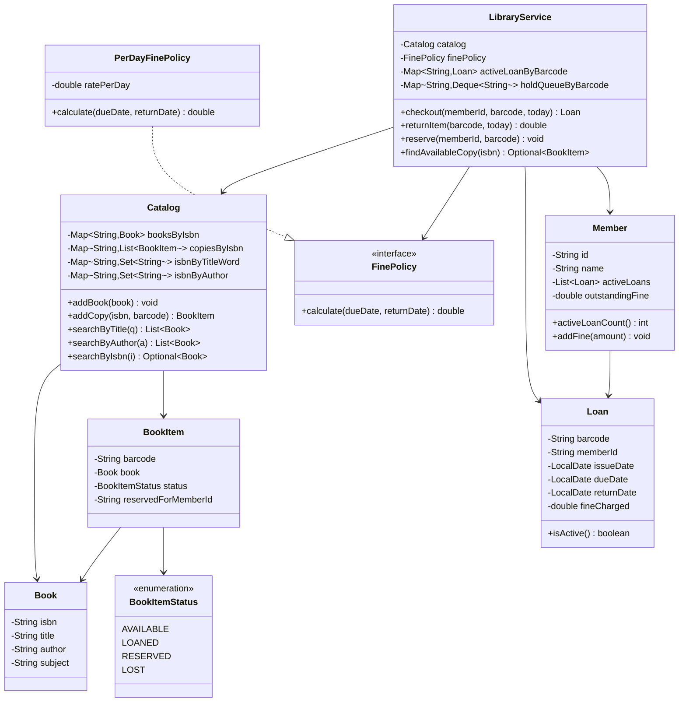
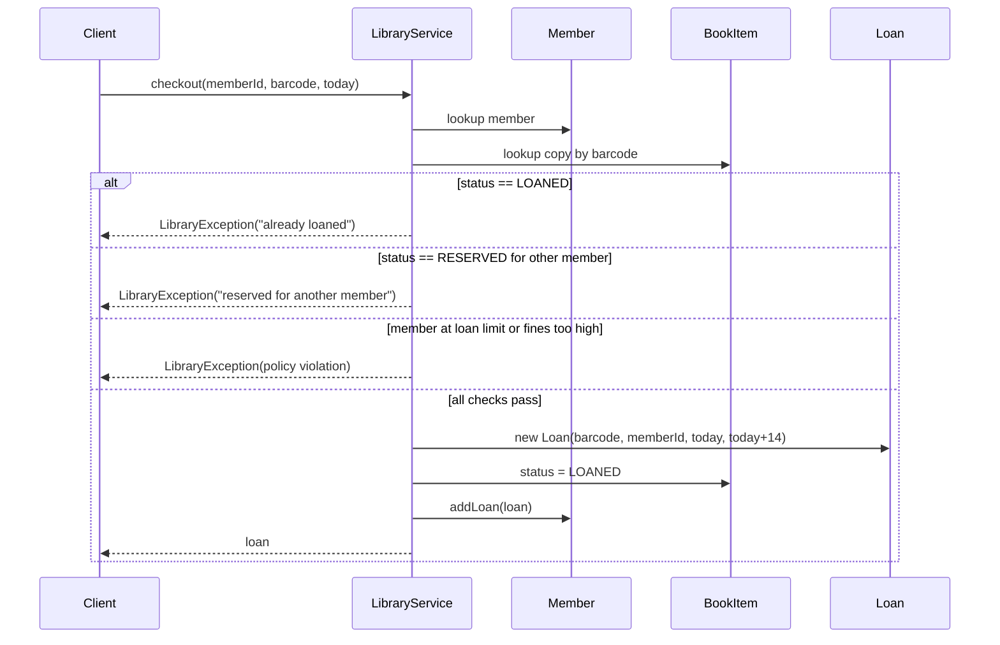
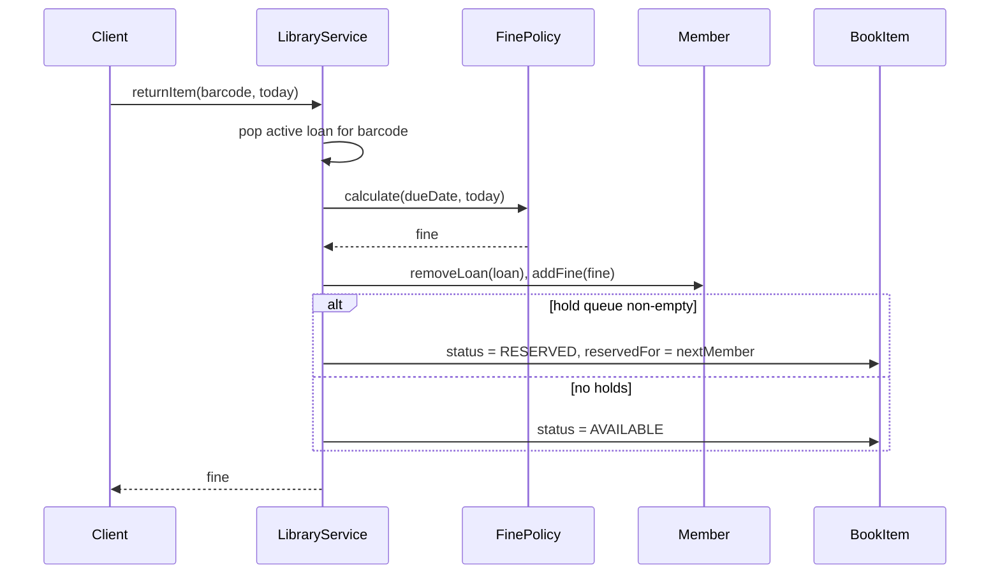

# Library Management System — Low-Level Design

A complete LLD for a **library**: catalog search, physical copies, checkout / return, due dates, per-day fines, and reservations (holds).

---

## 📌 Problem Statement

Design a library system where members search a catalog, borrow physical copies of books, return them by a due date, and pay a fine when they are late. The library owns **multiple copies** of the same title, and a copy that is already loaned out must never be handed to a second member.

---

## ✅ Requirements

### Functional

1. Maintain a catalog of books; search by **title**, **author**, or **ISBN**.
2. Track **each physical copy** independently (a title can have N copies).
3. Members can **checkout** an available copy; the system records issue date and computes a **due date**.
4. Members can **return** a copy; if late, a **fine** is computed per day overdue.
5. **Reject** checkout of a copy that is already loaned out.
6. Enforce a per-member borrowing limit and block members with excessive unpaid fines.
7. *(Extension)* Members can **reserve / hold** a copy; on return, the copy goes to the first member in the hold queue.

### Non-Functional

* Search should not be a full table scan — keep simple in-memory indexes.
* Fine rules must be swappable (flat rate today, tiered/grace-period tomorrow) without touching checkout logic.
* Every state change of a copy must go through the service so invariants hold.

### Out of Scope

* Authentication, payments gateway, notifications transport (email/SMS)
* Persistence and multi-branch libraries
* Real concurrency control (mentioned in edge cases)

---

## 🧠 Core Design Idea

The single most important modelling decision:

> **`Book` is a bibliographic record. `BookItem` is a physical copy.**

You search for a `Book`. You borrow a `BookItem`. Collapsing the two into one class is the classic mistake — it makes "3 copies of Effective Java, one of which is overdue" impossible to express.

| Component | Responsibility |
|-----------|----------------|
| `Book` | Title / author / ISBN / subject — the *what* |
| `BookItem` | One barcode-tagged copy + its status — the *thing on the shelf* |
| `Member` | Identity, active loans, outstanding fine |
| `Loan` | The association record: which copy, which member, issued, due, returned |
| `Catalog` | Storage + search indexes over books and copies |
| `FinePolicy` | Strategy for converting lateness into money |
| `LibraryService` | Orchestration: checkout, return, reserve, invariants |

---

## 🏗️ Class Diagram



---

## 📦 Class Responsibilities (Detailed)

### 1. `Book`

Immutable bibliographic record keyed by ISBN. No mutable state, so it is safe to share across indexes.

### 2. `BookItem` + `BookItemStatus`

A copy carries a `barcode` (unique physical id) and a lifecycle status:

```text
AVAILABLE ──checkout──> LOANED ──return──> AVAILABLE
    │                       │
    └──reserve──> RESERVED  └──return (queue non-empty)──> RESERVED ──checkout by holder──> LOANED
                                                            
any state ──staff action──> LOST
```

`reservedForMemberId` is what makes a hold enforceable: a `RESERVED` copy can only be checked out by that member.

### 3. `Member`

Holds identity, `activeLoans`, and `outstandingFine`. `activeLoanCount()` powers the borrow-limit rule; `outstandingFine` powers the "pay up before borrowing more" rule.

### 4. `Loan`

The **association object** between a copy and a member over time. It is *not* a field on `BookItem`, because a copy has many loans across its life — that history is the audit trail (`loanHistory`).

```text
Loan(barcode, memberId, issueDate, dueDate) → setReturnDate() → setFineCharged()
```

### 5. `Catalog`

Owns storage plus three indexes:

| Index | Purpose |
|-------|---------|
| `booksByIsbn` | O(1) exact ISBN lookup |
| `isbnByTitleWord` | inverted index: each normalized title word → ISBNs |
| `isbnByAuthor` | normalized author name → ISBNs |

Search by title is therefore a token lookup, not a scan of every book. Normalization (`trim` + `toLowerCase`) makes lookups case-insensitive.

### 6. `FinePolicy` (Strategy)

```java
interface FinePolicy { double calculate(LocalDate dueDate, LocalDate returnDate); }
```

`PerDayFinePolicy(rate)` charges `daysLate * rate`, and returns `0` when `daysLate <= 0`. Swapping in a grace period, a cap, or a tiered policy touches **one class**.

### 7. `LibraryService`

The only place where invariants live:

**`checkout(memberId, barcode, today)`** rejects when:

* copy is `LOANED` → *"already loaned out"* (the core rule)
* copy is `LOST`
* copy is `RESERVED` for a **different** member
* member is at `MAX_LOANS_PER_MEMBER`
* member's `outstandingFine > MAX_ALLOWED_FINE`

Otherwise it creates the `Loan` with `dueDate = today + LOAN_PERIOD_DAYS`, flips the copy to `LOANED`, and registers it in `activeLoanByBarcode`.

**`returnItem(barcode, today)`**: finds the active loan, asks the `FinePolicy` for the fine, stamps `returnDate`, charges the member, then routes the copy — to the next member in the hold queue if one exists, else back to `AVAILABLE`.

**`reserve(memberId, barcode)`**: if the copy is on the shelf, reserve it immediately; otherwise append the member to a FIFO `Deque` hold queue.

---

## 🔄 Sequence Flow — Checkout



## 🔄 Sequence Flow — Return with Fine and Hold



---

## 🧮 Fine Calculation

```text
daysLate = ChronoUnit.DAYS.between(dueDate, returnDate)
fine     = daysLate > 0  → daysLate * ratePerDay : 0
```

`ChronoUnit.DAYS.between` returns a **negative** number for early returns, so the `> 0` guard is not optional — without it early returns would produce a negative fine (a credit).

Example: due `2024-05-15`, returned `2024-05-19`, rate `2.0` → `4 * 2.0 = 8.0`.

---

## 🧩 Design Patterns & Principles Used

| Principle / Pattern | Where it shows up |
|---------------------|-------------------|
| **Strategy** | `FinePolicy` — swap flat / tiered / grace-period fines |
| **SRP** | `Catalog` = search, `LibraryService` = rules, `Loan` = record |
| **OCP** | New fine rules and new search indexes need no change to checkout |
| **Association object** | `Loan` models a *relationship over time*, not a field |
| **Encapsulation** | Copy status only mutates through `LibraryService` |
| **Inverted index** | Title-word → ISBN map instead of linear scan |
| **Guard clauses** | All checkout rules are explicit, ordered, and independently testable |

---

## ⚠️ Edge Cases

| Case | Handling |
|------|----------|
| Checkout a copy already `LOANED` | Rejected with `LibraryException` — the headline rule |
| Two members want the same title | Different copies are handed out; the second finds `EJ-COPY-2` |
| Reserve a copy that is on the shelf | Immediately `RESERVED` for that member, no queue needed |
| Reserve an already-loaned copy | Member appended to FIFO hold queue |
| Non-holder tries to take a `RESERVED` copy | Rejected |
| Return before due date | Fine is `0`, never negative |
| Return a copy that is not on loan | Rejected — no silent no-op |
| Duplicate reservation by same member | Rejected |
| Member at borrow limit | Rejected before any state mutation |
| Unpaid fines over threshold | Rejected |
| Lost copy | Status `LOST` — permanently un-checkoutable until staff intervene |
| Unknown barcode / member / ISBN | Rejected with a specific message |

---

## 🔌 Extensibility Notes

| Change | How the design absorbs it |
|--------|---------------------------|
| Renewals | `renew(barcode)` extends `dueDate` if no hold queue exists |
| Grace period / fine cap | New `FinePolicy` implementation only |
| Notifications ("your hold is ready") | Observer on `LibraryService` return event |
| Multiple branches | Add `branchId` to `BookItem`; index copies per branch |
| Different loan periods per member tier | `LoanPolicy` strategy alongside `FinePolicy` |
| Reservation expiry | Timestamp the hold; a sweeper releases stale `RESERVED` copies |
| Persistence | `Catalog` and the loan maps become repository interfaces |
| Concurrency | Lock per barcode, or a DB row-level `UPDATE ... WHERE status='AVAILABLE'` |

---

## 🧪 Example Walkthrough

```text
Catalog: Effective Java (2 copies), Clean Code (1), Design Patterns (1)
Members: Alice (M1), Bob (M2)     Fine rate: 2.0/day     Loan period: 14 days

Day 0   Alice checks out EJ-COPY-1        -> due day 14
Day 0   Bob tries EJ-COPY-1               -> REJECTED (already loaned)
Day 0   Bob checks out EJ-COPY-2          -> due day 14
Day 0   Bob reserves EJ-COPY-1            -> queued behind Alice
Day 10  Bob returns EJ-COPY-2             -> fine 0.0
Day 18  Alice returns EJ-COPY-1 (4 late)  -> fine 8.0, copy becomes RESERVED for Bob
Day 18  Alice tries EJ-COPY-1 again       -> REJECTED (reserved for another member)
Day 18  Bob checks out EJ-COPY-1          -> allowed, due day 32
```

---

## 📁 Files in this folder

| File | Purpose |
|------|---------|
| `details.md` | This LLD explanation |
| `Main.java` | Runnable Java sketch matching the design |

---

## 💡 Interview Talking Points

1. **Lead with `Book` vs `BookItem`.** State it in the first minute — interviewers are explicitly listening for it.
2. **`Loan` is an association object.** Explain that putting `memberId` on `BookItem` destroys history and makes fines unauditable.
3. **Show the checkout guard list out loud.** Ordered guard clauses are how you demonstrate you thought about invalid states.
4. **Justify Strategy for fines.** One sentence: "fine rules change per branch and per season; the checkout flow shouldn't know."
5. **Mention the search index.** Saying "inverted index on title tokens" instead of "loop over all books" is cheap and lands well.
6. **Bring up concurrency yourself.** Two members hitting checkout on the same barcode is the natural race; answer with a per-barcode lock or a conditional DB update.
7. **Close with extensions** — renewals, reservation expiry, notifications — to show the design isn't a dead end.
