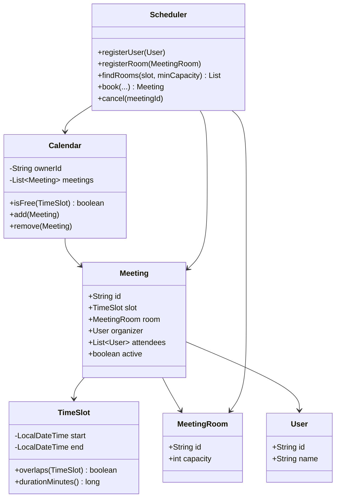
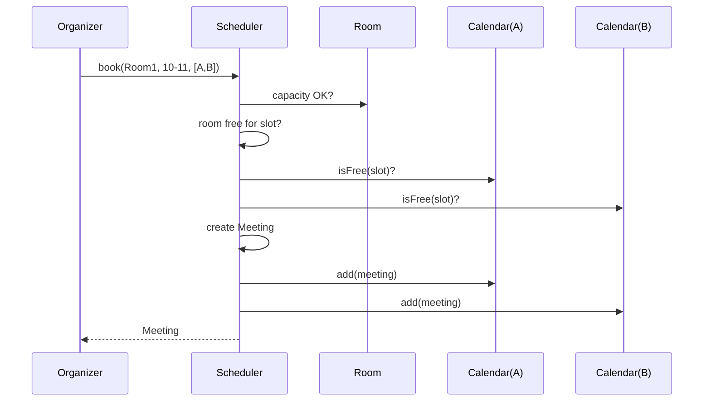
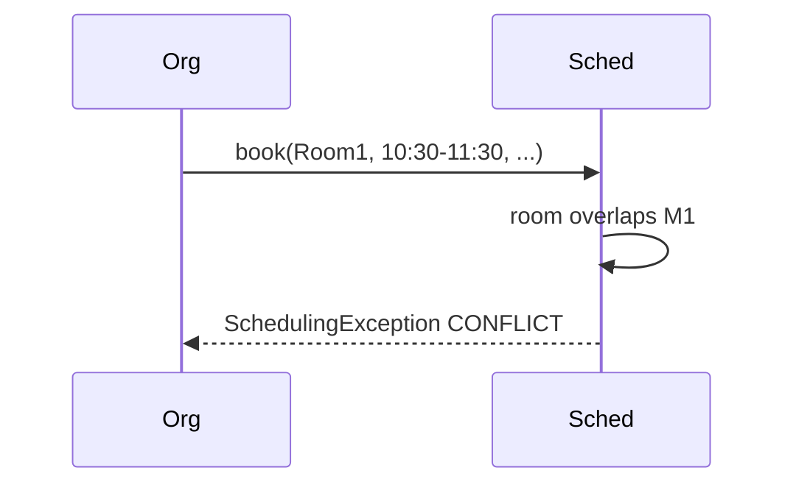

# Meeting Scheduler ? Low-Level Design

A complete Low-Level Design for booking **meeting rooms** against user calendars. This is the calendar twin of Hotel Booking: same half-open interval math, different resource (room + people).

> **The whole problem is one expression:** `start.isBefore(other.end) && end.isAfter(other.start)`. Get that right for rooms *and* attendees and the rest is orchestration.

---

## ?? Problem Statement

Design a scheduler where an organizer can:

1. Register users and meeting rooms (with capacity)
2. Find rooms free for `[start, end)` with capacity ? N
3. Book a meeting that claims a room **and** blocks attendees' calendars
4. Reject bookings that conflict on room **or** any attendee
5. Cancel a meeting so room and calendars free again
6. Allow **back-to-back** meetings (10:00?11:00 and 11:00?12:00)

---

## ? Requirements

### Functional

1. Model `User`, `Calendar`, `MeetingRoom`, `TimeSlot`, `Meeting`, `Scheduler`.
2. `TimeSlot` is half-open `[start, end)` and owns `overlaps`.
3. Each user has a calendar of committed meetings.
4. `findRooms(start, end, minCapacity)` returns rooms that are free and big enough.
5. `book(room, slot, organizer, attendees)` checks room + every attendee (and organizer).
6. `cancel(meetingId)` deactivates and unlinks from calendars/room index.
7. Reject `start >= end`, over-capacity attendee lists, unknown ids.

### Non-Functional

* Overlap logic in **exactly one place** (`TimeSlot.overlaps`).
* Clear `SchedulingException` messages.
* Deterministic demo without wall-clock flakiness.

### Out of Scope

* Recurring meetings (RRULE), time-zone conversion engines, video-conference links, external Google/Outlook sync, UI.

---

## ?? Core Design Idea: half-open intervals

A meeting `10:00?11:00` occupies `[10:00, 11:00)`. The room is free again at `11:00`, so another meeting starting at `11:00` does **not** overlap.

```text
10:00        11:00        12:00
  |------------|------------|
  ^ start      ^ end = next start allowed
```

### The overlap rule

```text
a.overlaps(b)  ?  a.start < b.end  AND  a.end > b.start
```

### Truth table ? existing `[10:00, 11:00)`

| Candidate | Relationship | Overlaps? |
|-----------|--------------|-----------|
| `[09:00, 10:00)` | touches start | ? |
| `[09:30, 10:30)` | straddles start | ? |
| `[10:00, 11:00)` | identical | ? |
| `[10:15, 10:45)` | strictly inside | ? |
| `[10:30, 11:30)` | straddles end | ? |
| `[09:00, 12:00)` | contains | ? |
| `[11:00, 12:00)` | touches end | ? |
| `[12:00, 13:00)` | entirely after | ? |

`Main.java` should assert the touching cases ? they are the ones naive code gets wrong.

### Two resources, one rule

| Resource | Conflict means |
|----------|----------------|
| Room | Another ACTIVE meeting on same room overlaps slot |
| User calendar | User already committed to an overlapping ACTIVE meeting |

Booking succeeds only if **both** pass.

---

## ??? Class Diagram



---

## ?? Class Responsibilities (Detailed)

### `TimeSlot`

Construction rejects non-positive duration. `overlaps` is the **only** comparison used by calendars and room indexes. If you ever see overlap `if`s copied into `Scheduler`, you have already lost SRP.

### `Calendar`

Per-user list of meetings. `isFree(slot)` returns false if any **active** meeting overlaps. Cancelled meetings must not block.

### `MeetingRoom`

Capacity is checked at book time: `attendees.size() (+ organizer policy) <= capacity`. Rooms do not store geometry beyond id/capacity in the sketch; a room?meetings index may live on the scheduler.

### `Meeting`

Aggregate: slot, room, people, active flag. Soft-cancel preferred over delete for audit.

### `Scheduler`

Facade:

```text
book:
  validate slot
  validate capacity
  validate room free
  validate each attendee calendar free
  create Meeting(active=true)
  link into room index + each calendar
```

---

## ?? Sequence ? successful book



### Conflict path



---

## ?? Algorithms

### Room search

```text
result = []
for room in rooms:
  if room.capacity < minCapacity: continue
  if roomHasOverlap(room, slot): continue
  result.add(room)
return result
```

### Complexity

* Naive: O(R ◊ M_r) for search, O(A ◊ M_u) for attendee checks.
* Scale-up: index meetings by day or use an interval tree / sorted start list with binary search ? mention, don't implement unless asked.

---

## ?? Concurrency

Two organizers booking the last free slot on Room1:

1. **Optimistic:** both read free ? both write ? last write wins (bug) unless version check.
2. **Pessimistic:** lock room row / synchronized book on room id.
3. **DB:** unique exclusion constraint using range types (`tstzrange`) + `EXCLUDE USING gist`.

Say #3 in strong interviews; implement #2 mentally for single JVM.

---

## ?? Edge Cases

| Case | Handling |
|------|----------|
| `start == end` | Reject at TimeSlot ctor |
| Touching intervals | Allow |
| Attendee over capacity | Reject |
| Organizer not in attendees list | Decide policy ? auto-include organizer |
| Cancel twice | Idempotent no-op or reject |
| Book in the past | Optional validation |
| Duplicate attendee ids | Dedupe with Set |

---

## ?? Patterns & Principles

| Item | Where |
|------|-------|
| **SRP** | Overlap on TimeSlot only |
| Shared domain rule | Same as Hotel / Car Rental |
| **Facade** | Scheduler |
| Soft delete | `active` flag |
| Value object | TimeSlot immutability |

---

## ?? Extensibility

| Ask | Absorption |
|-----|------------|
| Recurring weekly | Store rule; expand instances; exceptions list |
| Tentative holds | Status TENTATIVE/CONFIRMED; holds expire |
| Multi-room | Meeting has `List<Room>` |
| Working hours | Room availability template 9?18 |
| Buffer time | Expand slot by ±N minutes before overlap check |
| External sync | `CalendarPort` interface |

---

## ?? What the demo should prove

Aligned with a solid `Main.java`:

1. Back-to-back on same room succeeds.
2. Overlapping on same room throws.
3. Room free but attendee busy ? reject.
4. Capacity violation ? reject.
5. Cancel frees room for the same slot.
6. `findRooms` filters by capacity and availability.

---

## ?? Interview Talking Points

1. Lead with half-open + truth table (shows transfer from Hotel).  
2. Room **and** attendee conflicts ? many candidates forget people.  
3. Single `overlaps` method.  
4. Soft cancel vs delete.  
5. Concurrency on last slot.  
6. Recurring meetings as the honest ?hard extension?.  
7. Interval indexing for scale.  
8. Time zones: store UTC, display local.  

---

## ?? Implementation notes (`Main.java`)

* `TimeSlot.overlaps` uses `isBefore` / `isAfter` (strict), matching half-open semantics.
* `SchedulingException` for domain errors instead of silent booleans ? good for demos.
* Per-user `Calendar` objects keep attendee checks readable.
* Prefer `LinkedHashSet` for attendees to preserve order and dedupe.

---

## ?? Files

| File | Purpose |
|------|---------|
| `details.md` | This LLD |
| `Main.java` | Book, conflict, capacity, cancel demos |

---

## 📚 Extended teaching notes — Meeting-Scheduler

This section exists so the write-up matches the depth of Parking Lot / Hotel / Splitwise in this bible: more failure modes, more whiteboard scripts, and more “what I would say next.”

### Whiteboard script (8–10 minutes)

1. **Clarify scope (1 min).** Restate functional bullets and say three out-of-scope items aloud.
2. **Entities (1 min).** List 6–8 nouns; mark which are value objects vs entities.
3. **Core rule (2 min).** Write the single formula or state diagram that makes the design correct.
4. **Class diagram (2 min).** Boxes + relationships only for classes you will defend.
5. **API walk (2 min).** One happy sequence; one failure sequence.
6. **Close (1–2 min).** Concurrency, complexity, one extension.

### Failure-mode catalog

| # | Failure | Detection | Mitigation |
|---|---------|-----------|------------|
| 1 | Partial side effect | Two-phase / plan-then-commit | Compensating action |
| 2 | Double submit | Idempotency key | Deduplicate |
| 3 | Lost update | Version / CAS | Retry |
| 4 | Stale read | TTL / re-read | Accept or refresh |
| 5 | Resource exhaustion | Explicit null/empty | Backpressure / reject |
| 6 | Illegal transition | State guard | Throw / message |
| 7 | Validation gap | Boundary checks | Reject early |
| 8 | Clock skew | Inject clock | Monotonic / server time |

### Testing matrix

| Layer | What to test | Example |
|-------|--------------|---------|
| Unit | Core rule | Overlap truth table / state table / vote math |
| Unit | Strategy swap | Alternate matching or pricing |
| Integration | Facade flow | Happy path through service |
| Adversarial | Illegal calls | Double complete, bad PIN, sold out |
| Property | Invariants | Spot free XOR occupied; balances sum to zero |

### Complexity cheat sheet

| Operation family | Typical LLD cost | Scale upgrade |
|------------------|------------------|---------------|
| Linear scan resources | O(n) | Index / partition |
| Interval conflict | O(m) per resource | Interval tree |
| Graph gather | O(F·T) | Push inbox / cache |
| Tick simulation | O(e) elevators | Event queue |

### Concurrency talking track (memorize)

Shared mutable resource ‚Üí name it ‚Üí pick grain of lock (object vs row vs partition) ‚Üí prefer CAS/check-and-set when races are expected ‚Üí mention DB unique constraints for multi-node ‚Üí idempotency for network retries.

### Extension prompts interviewers love

* “Add X without rewriting the orchestrator” → OCP / Strategy / new state.
* “Two users click at once” → concurrency paragraph.
* “How do you test?” → deterministic seams (dice, clock, bank).
* “What did you leave out?” → out-of-scope list, not apology.

### Mapping back to `Main.java`

When you revise, open `Main.java` beside this doc and tick:

- [ ] Every public API in the diagram appears in code
- [ ] Every demo print maps to a requirement bullet
- [ ] At least one failure path is executed
- [ ] Magic numbers are named constants when they encode policy

### Glossary for this module

| Term | Meaning in Meeting-Scheduler |
|------|------------------|
| Facade | Entry service that preserves invariants |
| Strategy | Swappable policy object |
| Invariant | Fact that must always hold after a successful call |
| Soft cancel | Status flip instead of row delete |
| Plan-then-commit | Validate/plan fully before mutating durable state |

### Mini mock questions (answer in one breath each)

1. What is the single most important invariant?
2. Where does that invariant live in code?
3. What is the first class you would add for the next feature?
4. What breaks first at 100√ó traffic?
5. How do you make the demo deterministic?

If you can answer those five without scrolling, you own this design.

### Related modules in this bible

Cross-read for transfer learning: Hotel Booking (intervals), Cab Booking (matching), Vending/ATM (state), LRU/Rate Limiter (infra math), Splitwise (policy tables). Steal structures, not prose.

### Final revision ritual

Cover the class diagram ‚Üí redraw from memory ‚Üí compare ‚Üí run `javac Main.java && java Main` ‚Üí explain one failure log line as if to an interviewer.

