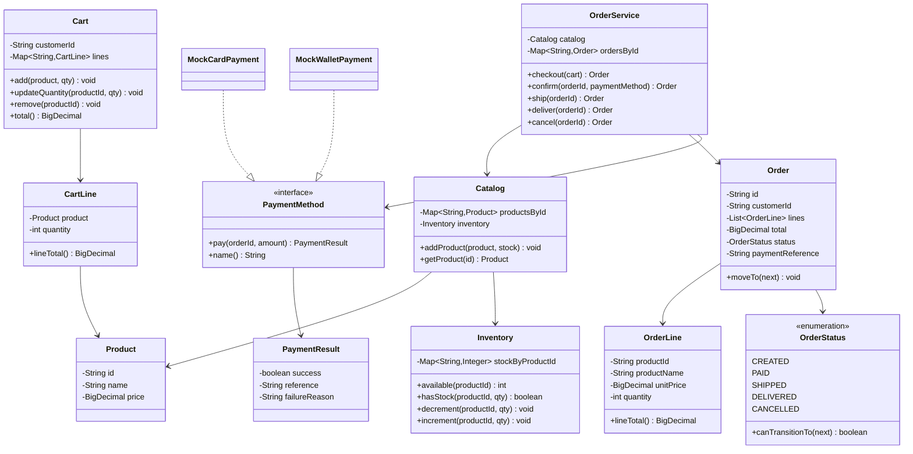
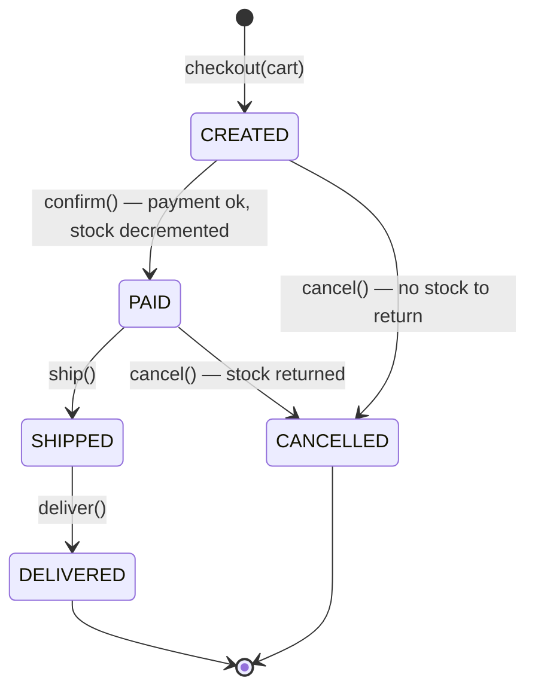
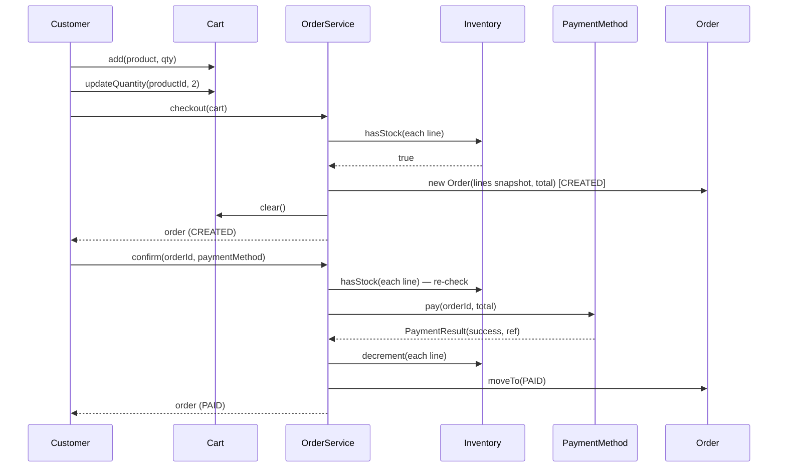
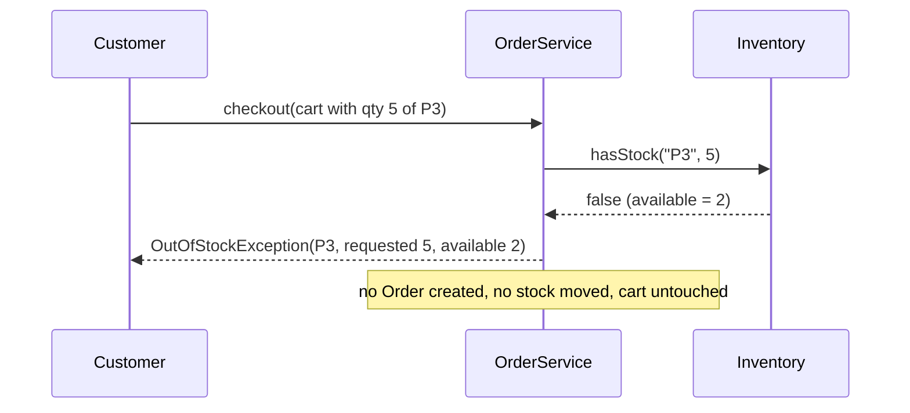

# Online Shopping System — Low-Level Design

A complete LLD for an **e-commerce checkout flow**: catalog, cart, inventory, order state machine, and a pluggable payment gateway.

---

## 📌 Problem Statement

Design the core of an online store. A customer browses a catalog, adds products to a cart, changes quantities, and checks out. The order moves through a strict lifecycle, payment is taken through a swappable gateway, and inventory must decrement exactly once — on order confirmation — never twice, and never for an order that failed to pay.

---

## ✅ Requirements

### Functional

1. `Catalog` of products with price and stock level.
2. `Cart`: add item, remove item, update quantity, view total.
3. Checkout turns a cart into an `Order` in state `CREATED`.
4. Payment goes through a `PaymentMethod` abstraction (mocked gateway).
5. **Inventory decrements on order confirmation** (successful payment), not when items enter the cart.
6. Order states: `CREATED → PAID → SHIPPED → DELIVERED`, with `CANCELLED` reachable from `CREATED` and `PAID`.
7. Checkout must **fail cleanly** when requested quantity exceeds available stock.
8. Cancelling a paid order returns stock to the shelf.

### Non-Functional

* Money must never be a `double` — use `BigDecimal` with an explicit scale.
* Illegal state transitions must be impossible, not merely discouraged.
* Adding a new payment method must not touch `OrderService`.

### Out of Scope

* Real payment gateway integration, refunds, taxes, shipping cost engines
* Search / recommendations / reviews
* Distributed inventory across warehouses

---

## 🧠 Core Design Idea

Three ideas carry this design:

1. **Stock is a warehouse fact, not a product attribute.** `Inventory` is its own class keyed by product id, so `Product` stays an immutable description.
2. **`OrderLine` is a price snapshot.** Copying `unitPrice` at checkout means a later price change never rewrites what the customer agreed to pay.
3. **The order lifecycle is a table, not a pile of `if`s.** `OrderStatus.canTransitionTo` owns the whole state machine, and `Order.moveTo` is the single mutator.

| Component | Responsibility |
|-----------|----------------|
| `Product` | Immutable description + price |
| `Inventory` | Stock levels, increment / decrement |
| `Catalog` | Product lookup + owns the inventory |
| `Cart` / `CartLine` | Mutable pre-purchase selection, live prices |
| `Order` / `OrderLine` | Immutable purchase record + status |
| `OrderStatus` | Legal transitions |
| `PaymentMethod` / `PaymentResult` | Strategy over a payment gateway |
| `OrderService` | Checkout, confirm, ship, deliver, cancel |

---

## 🏗️ Class Diagram



---

## 🔁 Order State Machine



Encoded as data:

```java
ALLOWED.put(CREATED,   EnumSet.of(PAID, CANCELLED));
ALLOWED.put(PAID,      EnumSet.of(SHIPPED, CANCELLED));
ALLOWED.put(SHIPPED,   EnumSet.of(DELIVERED));
ALLOWED.put(DELIVERED, EnumSet.noneOf(OrderStatus.class));
ALLOWED.put(CANCELLED, EnumSet.noneOf(OrderStatus.class));
```

`DELIVERED` and `CANCELLED` are terminal. Shipping a cancelled order throws instead of silently corrupting the order book.

---

## 📦 Class Responsibilities (Detailed)

### `Product`

Immutable: `id`, `name`, `price` (normalized to scale 2 with `HALF_UP`). Notably **no stock field** — that would make every price read a warehouse read.

### `Inventory`

`Map<productId, quantity>` with `available`, `hasStock`, `decrement`, `increment`. `decrement` refuses to go below zero, so even a bug upstream cannot produce negative stock.

### `Cart` / `CartLine`

Keyed by product id in a `LinkedHashMap` so display order is stable. Adding an existing product **accumulates** quantity rather than creating a duplicate line.

`updateQuantity(productId, 0)` removes the line — the same API covers "set to 2" and "set to none", which is what a real quantity stepper needs.

Cart totals read **live** prices; order totals read the snapshot. That difference is intentional and worth saying out loud in an interview.

### `Order` / `OrderLine`

`OrderLine` stores `productId`, `productName`, `unitPrice`, `quantity` — everything needed to render an invoice years later without joining back to a mutable catalog.

`Order.moveTo(next)` is the only status mutator and always consults `canTransitionTo`.

### `PaymentMethod` (Strategy)

```java
interface PaymentMethod {
    PaymentResult pay(String orderId, BigDecimal amount);
    String name();
}
```

`PaymentResult` is a small result object (`success`, `reference`, `failureReason`) rather than a boolean, so a decline carries a reason and a success carries a gateway reference to store on the order.

Two mocks ship with the sketch: `MockCardPayment` (declines above a credit limit) and `MockWalletPayment` (declines on insufficient balance).

### `OrderService`

| Method | What it guarantees |
|--------|--------------------|
| `checkout(cart)` | Cart non-empty, every line in stock, prices snapshotted, cart cleared |
| `confirm(orderId, pm)` | Order is `CREATED`, stock **re-checked**, payment taken, then stock decremented, then `PAID` |
| `ship` / `deliver` | Delegate to the state machine |
| `cancel` | Terminal transition; restocks only if the order had reached `PAID` |

**Ordering inside `confirm` matters:** validate → charge → decrement → transition. Decrementing before charging would leak stock on every declined card.

---

## 🔄 Sequence Flow — Happy Path Checkout



## 🔄 Sequence Flow — Inventory Failure Path



---

## 🧩 Design Patterns & Principles Used

| Principle / Pattern | Where it shows up |
|---------------------|-------------------|
| **Strategy** | `PaymentMethod` — card / wallet / UPI / COD interchangeably |
| **State machine as data** | `OrderStatus.ALLOWED` map + `Order.moveTo` |
| **Snapshot / value object** | `OrderLine` freezes price at purchase time |
| **SRP** | `Inventory` (stock) vs `Catalog` (lookup) vs `OrderService` (flow) |
| **OCP** | New payment methods and new statuses extend, they don't modify |
| **Result object over boolean** | `PaymentResult` carries reference and failure reason |
| **Fail fast** | Checkout validates the whole cart before creating anything |

---

## ⚠️ Edge Cases

| Case | Handling |
|------|----------|
| Checkout an empty cart | `ShopException` |
| Requested qty > stock | `OutOfStockException` with requested vs available; nothing mutated |
| Add same product twice | Quantities accumulate on one line |
| `updateQuantity(..., 0)` | Line removed |
| Negative or zero quantity on add | Rejected |
| Payment declined | Order stays `CREATED`, **stock untouched** — retry with another method |
| Stock sold out between checkout and pay | Re-checked in `confirm`, throws before charging |
| Cancel a `CREATED` order | Allowed, nothing to restock |
| Cancel a `PAID` order | Allowed, stock incremented back |
| Cancel a `SHIPPED`/`DELIVERED` order | Rejected — that's a returns flow, not a cancellation |
| Ship a `CANCELLED` order | Rejected by the transition table |
| Deliver twice | Rejected (`DELIVERED` is terminal) |
| Price changes after checkout | Order total unaffected — snapshot |
| Rounding on money | `BigDecimal` with scale 2, `HALF_UP` |

---

## 🔌 Extensibility Notes

| Change | How the design absorbs it |
|--------|---------------------------|
| Coupons / discounts | `PricingRule` chain applied to cart total before `Order` creation |
| Taxes & shipping | Extra `BigDecimal` components on `Order`, computed by a `ChargeCalculator` |
| Stock reservation | Add a `reserved` counter to `Inventory`; hold at checkout with a TTL |
| Refunds | Add `REFUNDED` to the table with `DELIVERED → REFUNDED` |
| Partial shipment | Split `Order` into `Shipment` objects, each with its own status |
| Order events (email, analytics) | Observer on `Order.moveTo` |
| Multiple warehouses | `Inventory` keyed by `(warehouseId, productId)` + a fulfilment strategy |
| Concurrency | Optimistic locking on stock rows: `UPDATE stock SET qty=qty- → WHERE qty>=?` |

---

## 🧪 Example Walkthrough

```text
Catalog: P1 Keyboard $120 (5)   P2 Cable $9.50 (20)   P3 Monitor $310 (2)

add P1 x1, P2 x3, P3 x1        -> total $458.50
updateQuantity P2 -> 2, remove P3, add P2 x1
cart = P1 x1 + P2 x3           -> total $148.50

checkout                       -> ORD-1001 CREATED, cart cleared
confirm (card limit 500)       -> PAID, stock P1 5->4, P2 20->17
ship / deliver                 -> SHIPPED -> DELIVERED

FAILURE: cart with P3 x5, only 2 in stock
checkout                       -> OutOfStockException, no order created

FAILURE: P3 x2 = $620, wallet holds $100
confirm                        -> payment declined, order stays CREATED, stock still 2

confirm with funded wallet     -> PAID, P3 2->0
cancel                         -> CANCELLED, P3 restored to 2
ship                           -> rejected: illegal transition CANCELLED -> SHIPPED
```

---

## 📁 Files in this folder

| File | Purpose |
|------|---------|
| `details.md` | This LLD explanation |
| `Main.java` | Runnable Java sketch matching the design |

---

## 💡 Interview Talking Points

1. **"When does stock actually move → "** Answer decisively: not on add-to-cart, on confirm — and explain the reservation variant for high-contention items (flash sales).
2. **Order of operations in `confirm`.** Validate → charge → decrement → transition. Say why decrementing first leaks inventory on declines.
3. **Cart vs Order.** Cart is mutable with live prices; Order is an immutable snapshot. This is the question behind "what happens if the price changes at checkout → "
4. **State machine as data.** Show the `EnumMap<OrderStatus, EnumSet<OrderStatus>>` — it beats a nest of `if`s and is trivially testable.
5. **`BigDecimal`, never `double`.** One line, but interviewers notice.
6. **Idempotency.** Real gateways can double-callback; mention an idempotency key on `confirm` so a retried payment doesn't decrement stock twice.
7. **Concurrency.** Two customers, one last monitor: answer with a conditional decrement or row lock, not with `synchronized` on the whole service.
