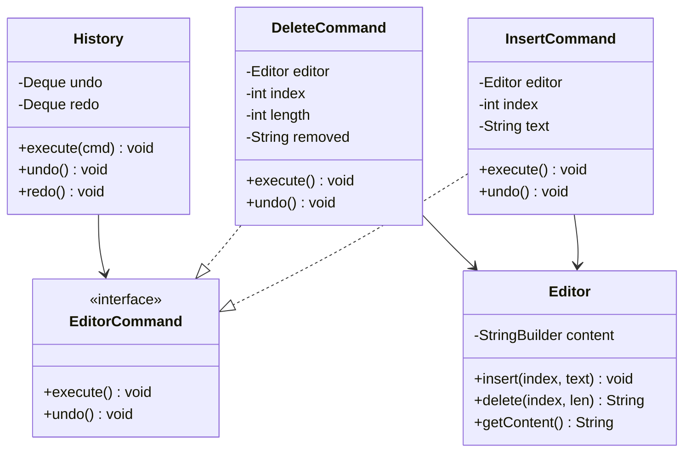
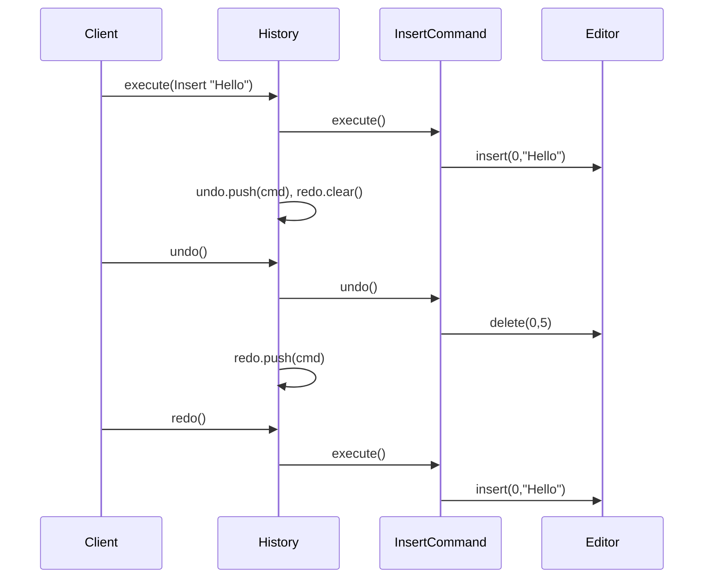
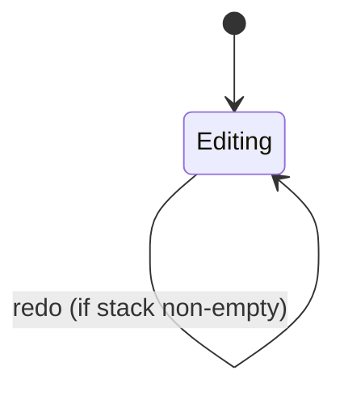

# Text Editor Undo — Low-Level Design

A complete Low-Level Design for an editor buffer with **undo/redo** via the **Command** pattern. The interview tests whether you store *deltas* (commands) versus *snapshots* (mementos) and whether redo is cleared correctly on new edits.

> **Core insight:** every mutating action is an object with `execute()` and `undo()`. History is two stacks. A new execute always clears redo — that single rule prevents paradoxical timelines.

---

## 📌 Problem Statement

Design a minimal text editor that:

1. Holds a document string
2. Supports insert and delete at an index
3. Can undo the last mutation(s)
4. Can redo undone mutations
5. Clears the redo stack whenever a **new** command is executed after undos

---

## ✅ Requirements

### Functional

1. `Editor` exposes `insert(index, text)`, `delete(index, length)`, `getContent()`.
2. `InsertCommand` / `DeleteCommand` implement `EditorCommand`.
3. `History.execute(cmd)` runs cmd, pushes undo, **clears redo**.
4. `History.undo()` pops undo, calls `undo()`, pushes redo.
5. `History.redo()` pops redo, calls `execute()`, pushes undo.
6. Empty undo/redo is a no-op with a message (not an exception) in the sketch.

### Non-Functional

* Commands must reverse **exactly** (insert↔delete of same span).
* Editor must not know about history (Dependency direction: History → Command → Editor).
* Efficient enough for interview demo (StringBuilder is fine).

### Out of Scope

* Cursor/selection model, rich text, collaborative OT/CRDT, disk persistence, macros UI.

---

## 🧠 Core Design Idea

```text
┌─────────�     execute/undo      ┌──────────�
│ History │ ───────────────────► │ Command  │
│ undo[]  │                       │ Insert / │
│ redo[]  │                       │ Delete   │
└─────────┘                       └────┬─────┘
                                       │ mutates
                                       â–¼
                                  ┌─────────�
                                  │ Editor  │
                                  │ buffer  │
                                  └─────────┘
```

### Command vs Memento

| | Command (this design) | Memento |
|--|----------------------|---------|
| Stores | Delta (what changed) | Full snapshot |
| Memory | Usually smaller | Grows with doc × history |
| Undo | Inverse operation | Restore snapshot |
| Best when | Ops are reversible | State is hard to invert |

Say both in the interview; implement Command for editors.

### The redo-clear rule

```text
Type "Hello"
Undo → ""
Type "X"     � this MUST clear redo
Redo         � must do nothing (old "Hello" timeline is dead)
```

Without clearing redo, redo would resurrect an alternate universe that no longer branches from current state.

---

## �� Class Diagram



---

## 📦 Responsibilities

### `Editor`
Dumb buffer. No undo knowledge. Returns deleted substring so `DeleteCommand` can remember it.

### `InsertCommand`
* `execute`: `editor.insert(index, text)`
* `undo`: `editor.delete(index, text.length())`

### `DeleteCommand`
* `execute`: `removed = editor.delete(...)` (capture for undo)
* `undo`: `editor.insert(index, removed)`

### `History`
Owns stacks. Only place that knows undo/redo policy.

---

## 🔄 Sequence — undo/redo



---

## � Stack mechanics

```text
After Insert("Hello"), Insert(" World"):
  undo: [Ins Hello, Ins World]   redo: []
  content: "Hello World"

undo:
  undo: [Ins Hello]   redo: [Ins World]
  content: "Hello"

undo:
  undo: []   redo: [Ins World, Ins Hello]
  content: ""

execute Insert("X"):          // clears redo!
  undo: [Ins X]   redo: []
  content: "X"
```



---

## 🧩 Patterns & Principles

| Pattern | Role |
|---------|------|
| **Command** | Encapsulate mutations |
| **Memento** (alt) | Snapshot-based undo |
| **Composite Command** (ext) | Macro record/replay |
| **DIP** | History depends on `EditorCommand` abstraction |

---

## ⚠� Edge Cases

| Case | Handling |
|------|----------|
| Undo on empty stack | Message / no-op |
| Delete past end | Editor should throw — validate in command ctor |
| Insert at invalid index | Same |
| Unicode / surrogate pairs | Mention; interview usually ASCII |
| History memory bound | Cap stack size; drop oldest |

---

## 🔌 Extensibility

| Feature | How |
|---------|-----|
| Replace | `ReplaceCommand` = delete + insert, or composite |
| Macros | Composite command of many child commands |
| Coalesce typing | Merge consecutive inserts while timer hot |
| Persist history | Serialize command log |

---

## 🧪 Walkthrough (`Main.java`)

```text
Insert "Hello" → "Hello"
Insert " World" → "Hello World"
Delete 5..11 → "Hello"
undo → "Hello World"
undo → "Hello"
redo → "Hello World"
```

---

## 💡 Interview Talking Points

1. Draw two stacks before classes.  
2. Explain why execute clears redo.  
3. Command vs Memento tradeoff table.  
4. Inverse of delete needs stored payload.  
5. Editor must not reference History (avoid cycle).  

---

## � Files

| File | Purpose |
|------|---------|
| `details.md` | This LLD |
| `Main.java` | Insert/delete/undo/redo demo |

---

## ?? Deep dive — invariants checklist

Before you leave the whiteboard, confirm you can answer yes to each:

1. Where does the **single source of truth** for the core rule live? (overlap, state transition, win check, vote key…)
2. What happens on the **failure path** immediately after a partial side effect? (debit without dispense, stock without order, lock without pay)
3. Which dependencies are **interfaces** so tests can fake them?
4. What is explicitly **out of scope**, spoken aloud?
5. What is the **first extension** you would add and which class changes?

---

## ??? Sample interviewer Q&A

**Q: Why not one god class?**  
A: Because the change axes differ — pricing/matching/state/inventory rarely change together. Splitting along those axes keeps diffs small and interviews clearer.

**Q: Where would you put persistence?**  
A: Outside the domain facade. Repository interfaces for aggregates (Trip, Reservation, Order). Domain methods stay pure of SQL.

**Q: How do you test this?**  
A: Deterministic inputs (fixed dice, manual clock, in-memory bank). Table-driven cases for the core rule (overlap truth table, state transitions, vote math).

**Q: What breaks at scale?**  
A: The naive loops (scan all drivers, all reservations, all tweets). Index by geo-hash, by day, by followee timeline. That is the HLD bridge — say it, don't implement it in LLD unless asked.

**Q: Concurrency?**  
A: Name the shared mutable resource (spot, seat, driver.available, stock, cassette). Propose lock grain or DB constraint / CAS. Idempotency keys for payments and bank withdraws.

---

## ?? Revision card (memorize)

| Prompt yourself | Answer shape |
|-----------------|--------------|
| Entities? | 5–8 nouns |
| Core rule? | One formula / state diagram |
| Patterns? | 1–3 max, justified |
| Failure? | One sequenced unhappy path |
| Extend? | One OCP example |

---

## 📚 Extended teaching notes — Text-Editor-Undo

This section exists so the write-up matches the depth of Parking Lot / Hotel / Splitwise in this bible: more failure modes, more whiteboard scripts, and more “what I would say next.�

### Whiteboard script (8–10 minutes)

1. **Clarify scope (1 min).** Restate functional bullets and say three out-of-scope items aloud.
2. **Entities (1 min).** List 6–8 nouns; mark which are value objects vs entities.
3. **Core rule (2 min).** Write the single formula or state diagram that makes the design correct.
4. **Class diagram (2 min).** Boxes + relationships only for classes you will defend.
5. **API walk (2 min).** One happy sequence; one failure sequence.
6. **Close (1–2 min).** Concurrency, complexity, one extension.

### Failure-mode catalog

| # | Failure | Detection | Mitigation |
|---|---------|-----------|------------|
| 1 | Partial side effect | Two-phase / plan-then-commit | Compensating action |
| 2 | Double submit | Idempotency key | Deduplicate |
| 3 | Lost update | Version / CAS | Retry |
| 4 | Stale read | TTL / re-read | Accept or refresh |
| 5 | Resource exhaustion | Explicit null/empty | Backpressure / reject |
| 6 | Illegal transition | State guard | Throw / message |
| 7 | Validation gap | Boundary checks | Reject early |
| 8 | Clock skew | Inject clock | Monotonic / server time |

### Testing matrix

| Layer | What to test | Example |
|-------|--------------|---------|
| Unit | Core rule | Overlap truth table / state table / vote math |
| Unit | Strategy swap | Alternate matching or pricing |
| Integration | Facade flow | Happy path through service |
| Adversarial | Illegal calls | Double complete, bad PIN, sold out |
| Property | Invariants | Spot free XOR occupied; balances sum to zero |

### Complexity cheat sheet

| Operation family | Typical LLD cost | Scale upgrade |
|------------------|------------------|---------------|
| Linear scan resources | O(n) | Index / partition |
| Interval conflict | O(m) per resource | Interval tree |
| Graph gather | O(F·T) | Push inbox / cache |
| Tick simulation | O(e) elevators | Event queue |

### Concurrency talking track (memorize)

Shared mutable resource → name it → pick grain of lock (object vs row vs partition) → prefer CAS/check-and-set when races are expected → mention DB unique constraints for multi-node → idempotency for network retries.

### Extension prompts interviewers love

* “Add X without rewriting the orchestrator� → OCP / Strategy / new state.
* “Two users click at once� → concurrency paragraph.
* “How do you test?� → deterministic seams (dice, clock, bank).
* “What did you leave out?� → out-of-scope list, not apology.

### Mapping back to `Main.java`

When you revise, open `Main.java` beside this doc and tick:

- [ ] Every public API in the diagram appears in code
- [ ] Every demo print maps to a requirement bullet
- [ ] At least one failure path is executed
- [ ] Magic numbers are named constants when they encode policy

### Glossary for this module

| Term | Meaning in Text-Editor-Undo |
|------|------------------|
| Facade | Entry service that preserves invariants |
| Strategy | Swappable policy object |
| Invariant | Fact that must always hold after a successful call |
| Soft cancel | Status flip instead of row delete |
| Plan-then-commit | Validate/plan fully before mutating durable state |

### Mini mock questions (answer in one breath each)

1. What is the single most important invariant?
2. Where does that invariant live in code?
3. What is the first class you would add for the next feature?
4. What breaks first at 100× traffic?
5. How do you make the demo deterministic?

If you can answer those five without scrolling, you own this design.

### Related modules in this bible

Cross-read for transfer learning: Hotel Booking (intervals), Cab Booking (matching), Vending/ATM (state), LRU/Rate Limiter (infra math), Splitwise (policy tables). Steal structures, not prose.

### Final revision ritual

Cover the class diagram → redraw from memory → compare → run `javac Main.java && java Main` → explain one failure log line as if to an interviewer.

