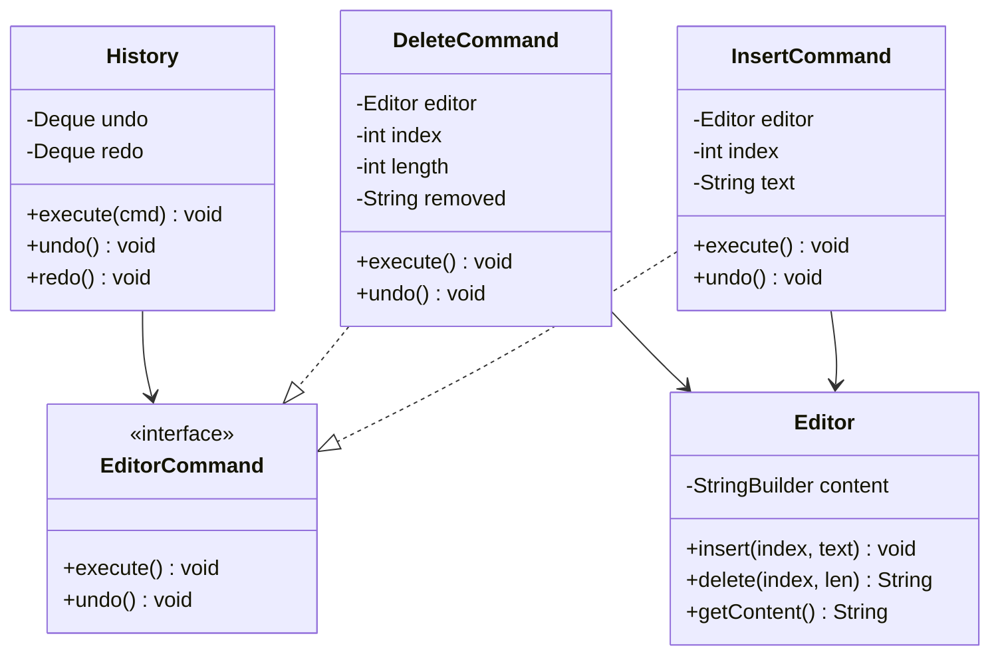
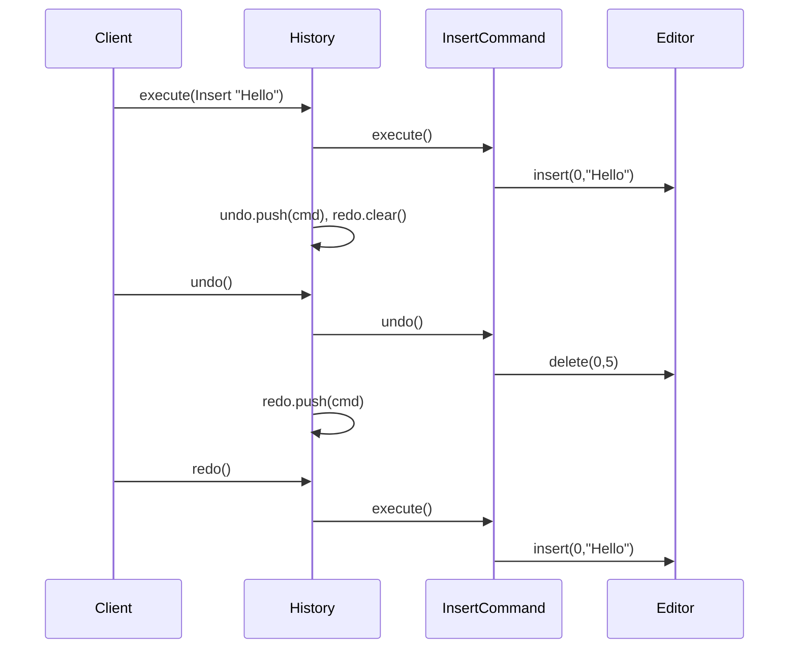
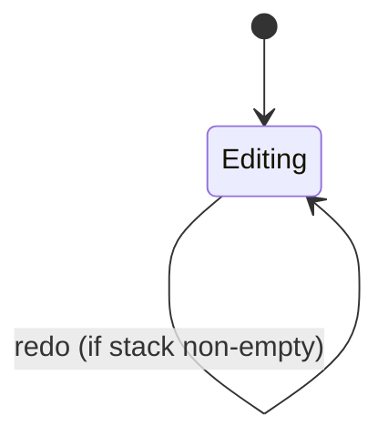

# Text Editor Undo — Low-Level Design

A complete Low-Level Design for an editor buffer with **undo/redo** via the **Command** pattern. The interview tests whether you store *deltas* (commands) versus *snapshots* (mementos) and whether redo is cleared correctly on new edits.

> **Core insight:** every mutating action is an object with `execute()` and `undo()`. History is two stacks. A new execute always clears redo — that single rule prevents paradoxical timelines.

---

## 📌 Problem Statement

Design a minimal text editor that:

1. Holds a document string
2. Supports insert and delete at an index
3. Can undo the last mutation(s)
4. Can redo undone mutations
5. Clears the redo stack whenever a **new** command is executed after undos

---

## ✅ Requirements

### Functional

1. `Editor` exposes `insert(index, text)`, `delete(index, length)`, `getContent()`.
2. `InsertCommand` / `DeleteCommand` implement `EditorCommand`.
3. `History.execute(cmd)` runs cmd, pushes undo, **clears redo**.
4. `History.undo()` pops undo, calls `undo()`, pushes redo.
5. `History.redo()` pops redo, calls `execute()`, pushes undo.
6. Empty undo/redo is a no-op with a message (not an exception) in the sketch.

### Non-Functional

* Commands must reverse **exactly** (insert↔delete of same span).
* Editor must not know about history (Dependency direction: History → Command → Editor).
* Efficient enough for interview demo (StringBuilder is fine).

### Out of Scope

* Cursor/selection model, rich text, collaborative OT/CRDT, disk persistence, macros UI.

---

## 🧠 Core Design Idea

```text
┌─────────┐     execute/undo      ┌──────────┐
│ History │ ───────────────────► │ Command  │
│ undo[]  │                       │ Insert / │
│ redo[]  │                       │ Delete   │
└─────────┘                       └────┬─────┘
                                       │ mutates
                                       ▼
                                  ┌─────────┐
                                  │ Editor  │
                                  │ buffer  │
                                  └─────────┘
```

### Command vs Memento

| | Command (this design) | Memento |
|--|----------------------|---------|
| Stores | Delta (what changed) | Full snapshot |
| Memory | Usually smaller | Grows with doc × history |
| Undo | Inverse operation | Restore snapshot |
| Best when | Ops are reversible | State is hard to invert |

Say both in the interview; implement Command for editors.

### The redo-clear rule

```text
Type "Hello"
Undo → ""
Type "X"     ← this MUST clear redo
Redo         ← must do nothing (old "Hello" timeline is dead)
```

Without clearing redo, redo would resurrect an alternate universe that no longer branches from current state.

---

## 🏗️ Class Diagram



---

## 📦 Responsibilities

### `Editor`
Dumb buffer. No undo knowledge. Returns deleted substring so `DeleteCommand` can remember it.

### `InsertCommand`
* `execute`: `editor.insert(index, text)`
* `undo`: `editor.delete(index, text.length())`

### `DeleteCommand`
* `execute`: `removed = editor.delete(...)` (capture for undo)
* `undo`: `editor.insert(index, removed)`

### `History`
Owns stacks. Only place that knows undo/redo policy.

---

## 🔄 Sequence — undo/redo



---

## 🔁 Stack mechanics

```text
After Insert("Hello"), Insert(" World"):
  undo: [Ins Hello, Ins World]   redo: []
  content: "Hello World"

undo:
  undo: [Ins Hello]   redo: [Ins World]
  content: "Hello"

undo:
  undo: []   redo: [Ins World, Ins Hello]
  content: ""

execute Insert("X"):          // clears redo!
  undo: [Ins X]   redo: []
  content: "X"
```



---

## 🧩 Patterns & Principles

| Pattern | Role |
|---------|------|
| **Command** | Encapsulate mutations |
| **Memento** (alt) | Snapshot-based undo |
| **Composite Command** (ext) | Macro record/replay |
| **DIP** | History depends on `EditorCommand` abstraction |

---

## ⚠️ Edge Cases

| Case | Handling |
|------|----------|
| Undo on empty stack | Message / no-op |
| Delete past end | Editor should throw — validate in command ctor |
| Insert at invalid index | Same |
| Unicode / surrogate pairs | Mention; interview usually ASCII |
| History memory bound | Cap stack size; drop oldest |

---

## 🔌 Extensibility

| Feature | How |
|---------|-----|
| Replace | `ReplaceCommand` = delete + insert, or composite |
| Macros | Composite command of many child commands |
| Coalesce typing | Merge consecutive inserts while timer hot |
| Persist history | Serialize command log |

---

## 🧪 Walkthrough (`Main.java`)

```text
Insert "Hello" → "Hello"
Insert " World" → "Hello World"
Delete 5..11 → "Hello"
undo → "Hello World"
undo → "Hello"
redo → "Hello World"
```

---

## 💡 Interview Talking Points

1. Draw two stacks before classes.  
2. Explain why execute clears redo.  
3. Command vs Memento tradeoff table.  
4. Inverse of delete needs stored payload.  
5. Editor must not reference History (avoid cycle).  

---

## 📁 Files

| File | Purpose |
|------|---------|
| `details.md` | This LLD |
| `Main.java` | Insert/delete/undo/redo demo |
