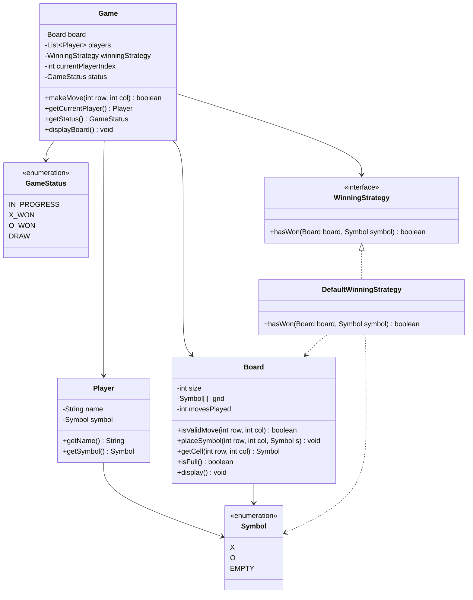
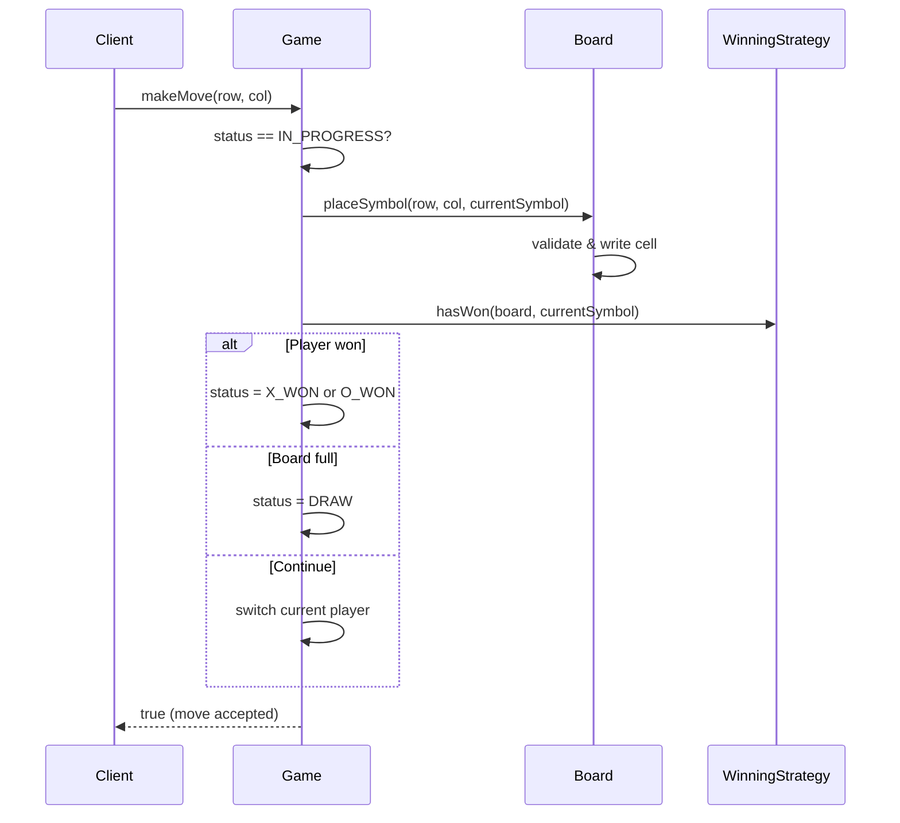

# Tic-Tac-Toe — Low Level Design

A clean, interview-ready **Low Level Design (LLD)** of classic Tic-Tac-Toe in Java.  
This module shows how to turn a simple game into a maintainable OOP system using **SOLID**, the **Strategy Pattern**, and clear class boundaries.

---

## Problem Statement

Design a Tic-Tac-Toe game where:

* Two players take turns placing `X` and `O` on a square board (default `3 x 3`).
* A player wins by filling an entire row, column, or diagonal.
* If the board fills with no winner, the game is a draw.
* Invalid moves (out of bounds / occupied cell) are rejected.
* Win logic should be easy to extend later (e.g. larger boards, different win rules).

---

## Requirements

### Functional

| ID | Requirement |
|----|-------------|
| F1 | Create a game with two players and distinct symbols |
| F2 | Alternate turns between players |
| F3 | Place a symbol only on an empty, in-bounds cell |
| F4 | Detect win (row / column / diagonal) after each move |
| F5 | Detect draw when the board is full and no one has won |
| F6 | Expose current player and game status |
| F7 | Print the board after moves |

### Non-Functional

| ID | Requirement |
|----|-------------|
| NF1 | Single Responsibility per class |
| NF2 | Open for extension (new win rules) without editing core game flow |
| NF3 | Clear validation and fail-fast errors for illegal moves |
| NF4 | Board size configurable (`N x N`, `N >= 3`) |

---

## Core Entities

| Class / Enum | Responsibility |
|--------------|----------------|
| `Symbol` | Marks on the board: `X`, `O`, `EMPTY` |
| `GameStatus` | Lifecycle: `IN_PROGRESS`, `X_WON`, `O_WON`, `DRAW` |
| `Player` | Holds a name and a non-empty symbol |
| `Board` | Owns the grid, validates/places moves, tracks fullness |
| `WinningStrategy` | Abstraction for “has this symbol won?” |
| `DefaultWinningStrategy` | Classic row / column / diagonal check |
| `Game` | Orchestrates turns, applies strategy, updates status |
| `Main` | Demo runner with a scripted Alice-vs-Bob game |

---

## Class Diagram



---

## Design Decisions Explained

### 1. Why separate `Board` from `Game`?

* **`Board`** only knows cells, placement, and capacity. It does **not** know about players or winners.
* **`Game`** owns turn order, status transitions, and when to ask “did someone win?”

This follows **SRP**: changing print format or grid storage does not touch turn logic, and changing win rules does not touch cell placement.

### 2. Why a `WinningStrategy` interface?

Win detection is the piece most likely to change:

* Classic 3x3 full-line wins
* Larger boards needing `K`-in-a-row
* Variants (only diagonals, gravity boards, etc.)

By depending on `WinningStrategy`, `Game` stays closed for modification (**OCP**). You add a new strategy class instead of editing `Game.makeMove()`.

This is the same **Strategy Pattern** idea used in the Behavioral Patterns section of this repo.

### 3. Why enums for `Symbol` and `GameStatus`?

Enums give a closed, type-safe set of values. You avoid magic strings like `"X"` / `"DRAW"` and get compile-time safety for switches and comparisons.

### 4. Validation ownership

| Check | Owner |
|-------|--------|
| Player cannot use `EMPTY` | `Player` constructor |
| Both players different symbols | `Game` constructor |
| Board size `>= 3` | `Board` constructor |
| Cell empty & in bounds | `Board.isValidMove` / `placeSymbol` |
| Moves only while in progress | `Game.makeMove` |

Each rule lives next to the data it protects (**encapsulation**).

---

## Move Flow (Sequence)



---

## SOLID Mapping

| Principle | How this design applies it |
|-----------|----------------------------|
| **S** — Single Responsibility | `Board` = grid; `Game` = flow; strategy = win rules; `Player` = identity |
| **O** — Open/Closed | New win rules via new `WinningStrategy` implementations |
| **L** — Liskov Substitution | Any `WinningStrategy` can replace `DefaultWinningStrategy` in `Game` |
| **I** — Interface Segregation | `WinningStrategy` is a one-method focused contract |
| **D** — Dependency Inversion | `Game` depends on `WinningStrategy`, not a concrete checker |

---

## Patterns Used

| Pattern | Where | Why |
|---------|--------|-----|
| **Strategy** | `WinningStrategy` / `DefaultWinningStrategy` | Swap win algorithms without changing `Game` |
| **Encapsulation** | Private board grid + controlled mutators | Prevent illegal board mutation from outside |
| **Composition** | `Game` has-a `Board`, players, strategy | Prefer composition over a god class |

---

## Extensibility Ideas

Without rewriting the core, you can later add:

1. **`KInARowWinningStrategy`** — win with `K` consecutive marks on an `N x N` board  
2. **`HumanPlayer` / `BotPlayer`** — different move sources behind a `Player` or `MoveProvider` abstraction  
3. **Undo** — Memento pattern over board snapshots  
4. **UI layer** — console / GUI / web all call the same `Game.makeMove()` API  

---

## Project Layout

```text
Low-Level-Design/
└── Tic-Tac-Toe/
    ├── Main.java      # Full working implementation + demo
    └── README.md      # This LLD explanation
```

---

## How to Run

```bash
cd Low-Level-Design/Tic-Tac-Toe
javac Main.java
java Main
```

### Expected demo output (summary)

* Alice (`X`) and Bob (`O`) play a scripted game.
* Alice places on `(0,0)`, `(1,1)`, `(2,2)` and wins on the main diagonal.
* Final status: `X_WON`.

---

## Interview Talking Points

If you explain this LLD in an interview, walk through:

1. **Clarify requirements** — 2 players, win conditions, draw, board size.  
2. **Identify entities** — Board, Player, Game, Symbol, Status.  
3. **Assign responsibilities** — keep win logic out of Board.  
4. **Call out Strategy** — for future `K`-in-a-row / variants.  
5. **Show a happy-path sequence** — place → check win → check draw → next turn.  
6. **Mention edge cases** — occupied cell, out of bounds, move after game over.

That narrative is often more important than the code itself.
