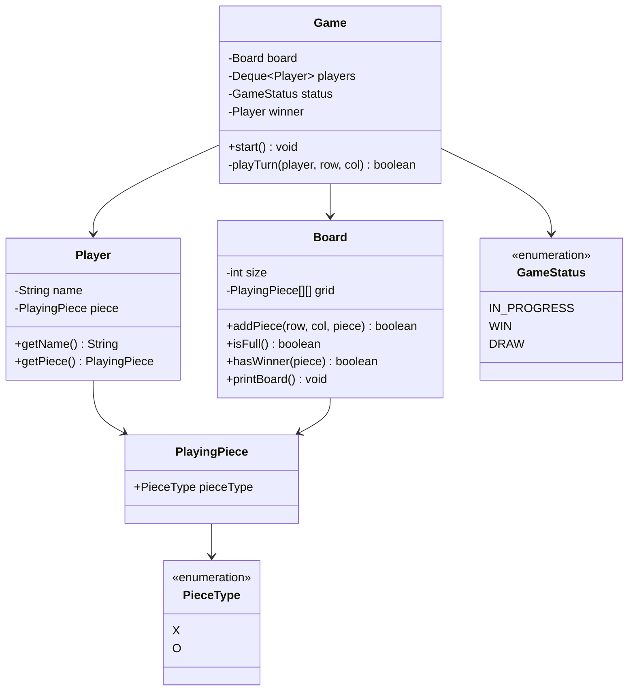
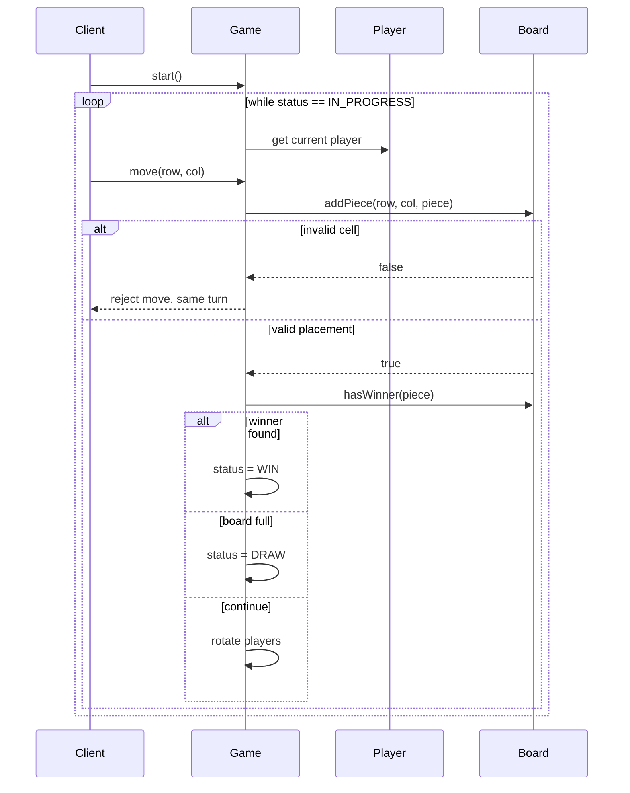

# Tic Tac Toe — Low-Level Design

A complete Low-Level Design for a classic **Tic Tac Toe** game engine in Java: requirements, class model, flows, design decisions, and how the pieces fit together.

---

## 📌 Problem Statement

Design an object-oriented Tic Tac Toe system where two players take turns placing symbols (`X` / `O`) on a board until one wins or the board is full (draw).

The design should be clean enough to extend later (e.g. N×N board, more than 2 players, human vs AI) without rewriting the core game loop.

---

## ✅ Requirements

### Functional

1. Support a square board of size **N × N** (classic default: `N = 3`).
2. Two players alternate turns; Player 1 starts with `X`, Player 2 with `O`.
3. A move is valid only if the cell is empty and inside board bounds.
4. After each move, detect:
   - **Win** — N same symbols in a row, column, or diagonal
   - **Draw** — board full with no winner
   - **In Progress** — game continues
5. Print / expose the board state after every move.
6. End the game cleanly when a terminal state is reached.

### Non-Functional

* Clear separation of concerns (board vs players vs game orchestration).
* Easy to swap player types (Human / Bot) without changing `Game`.
* Win-check should stay readable and correct for general `N`.

### Out of Scope (for this LLD)

* Multiplayer networking / matchmaking
* Persistence / leaderboards
* UI framework (console is enough for the sketch)

---

## 🧠 Core Design Idea

Split the system into four clear responsibilities:

| Component | Responsibility |
|-----------|----------------|
| `PieceType` / `PlayingPiece` | What can be placed on a cell |
| `Board` | Grid storage, validation, printing, win/draw checks |
| `Player` | Who is playing (name + piece) |
| `Game` | Turn order, move loop, game status lifecycle |

`Game` owns the **orchestration**. `Board` owns **grid rules**. Players are simple data + strategy hooks so Human/Bot can plug in later.

---

## 🏗️ Class Diagram



---

## 📦 Class Responsibilities (Detailed)

### 1. `PieceType` (enum)

Represents the symbol identity.

```text
X, O
```

Using an enum avoids magic strings and keeps comparisons type-safe.

### 2. `PlayingPiece`

Thin wrapper around `PieceType`. Keeping a class (instead of only the enum) leaves room to attach metadata later (color, icon, score weight) without touching `Board` or `Player`.

### 3. `Board`

Owns the 2D grid.

**Key methods:**

* `addPiece(row, col, piece)` — validates bounds + emptiness, then places the piece
* `isFull()` — true when no empty cells remain
* `hasWinner(piece)` — checks rows, columns, both diagonals for N consecutive matching pieces
* `printBoard()` — console rendering

**Why win logic lives on `Board`:**  
Winning is a property of the grid layout, not of a player or the game loop. Keeping it here preserves SRP.

### 4. `Player`

Holds identity + assigned piece.

```text
Player(name, playingPiece)
```

For extensibility, a future `BotPlayer` can override / implement a `makeMove(Board)` strategy without changing `Game`.

### 5. `GameStatus` (enum)

```text
IN_PROGRESS | WIN | DRAW
```

Makes the lifecycle explicit instead of boolean flags like `isOver` + `isDraw`.

### 6. `Game` (orchestrator)

* Holds the board and a turn queue (`Deque<Player>`)
* Starts in `IN_PROGRESS`
* Each turn:
  1. Peek current player
  2. Accept a move (row, col)
  3. Ask board to place piece
  4. Check win → set `WIN` + winner
  5. Else check full board → set `DRAW`
  6. Else rotate player to the back of the queue and continue

Using a **queue for turns** makes it trivial to support more than 2 players later.

---

## 🔄 Sequence Flow (One Successful Turn)



---

## 🧮 Win Detection Approach

For board size `N`, after placing a piece at `(r, c)` you can either:

1. **Full scan (used in this sketch)** — check all rows, columns, diagonals: `O(N²)` per check, simple and clear for interviews.
2. **Incremental (optimization)** — only check the row `r`, column `c`, and diagonals if `(r, c)` lies on them: `O(N)` per move.

For classic 3×3 and interview LLD, full scan is perfectly fine. Mention the O(N) optimization if the interviewer asks about scale.

**Win conditions:**

* Any row has N identical non-null pieces
* Any column has N identical non-null pieces
* Main diagonal (`i, i`) matches
* Anti-diagonal (`i, N-1-i`) matches

---

## 🧩 Design Patterns & Principles Used

| Principle / Pattern | Where it shows up |
|---------------------|-------------------|
| **SRP** | `Board` = grid rules, `Game` = flow, `Player` = identity |
| **OCP** | New player types (Bot) can be added without rewriting `Game` |
| **Encapsulation** | Grid is private; mutations go through `addPiece` |
| **State as enum** | `GameStatus` models lifecycle explicitly |
| **Queue for turns** | Easy multi-player extension |

Optional upgrades (not required for base LLD):

* **Strategy** — `MoveStrategy` for Human input vs AI
* **Observer** — notify UI when board/status changes
* **Factory** — create boards of different sizes / game modes

---

## 🔌 Extensibility Notes

| Change | How the design absorbs it |
|--------|---------------------------|
| N×N board | `Board(size)` already parameterized |
| 3+ players | Push more `Player`s into the turn deque |
| Human vs Bot | Add `MoveStrategy`; `Game` asks strategy for `(row, col)` |
| Undo move | Keep a move history stack on `Game` |
| GUI | Keep `Game`/`Board` pure; UI only calls `Game` APIs |

---

## 🧪 Example Walkthrough

```text
Players: Alice (X), Bob (O)
Board: 3×3

Alice -> (0,0)   X . .
                 . . .
                 . . .

Bob   -> (1,1)   X . .
                 . O .
                 . . .

Alice -> (0,1)   X X .
                 . O .
                 . . .

Bob   -> (2,2)   X X .
                 . O .
                 . . O

Alice -> (0,2)   X X X   → Alice wins (row 0)
                 . O .
                 . . O
```

---

## 📁 Files in this folder

| File | Purpose |
|------|---------|
| `details.md` | This LLD explanation |
| `Main.java` | Runnable Java implementation matching the design |

---

## 💡 Interview Talking Points

1. Start from **requirements**, then list entities (`Board`, `Player`, `Game`, `Piece`).
2. Explain why `Game` should not own grid cells directly.
3. Show turn rotation with a **queue**.
4. Discuss win-check complexity and the O(N) optimization.
5. Close with extensions: N×N, bots, undo — prove the design is not a dead end.
